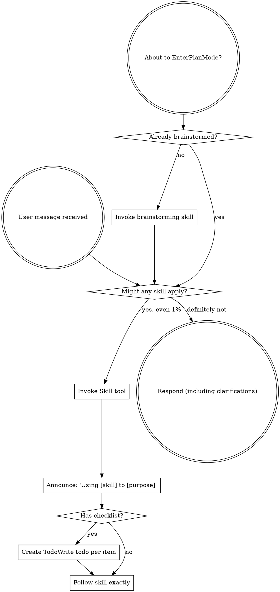

Reading additional input from stdin...
OpenAI Codex v0.144.1
--------
workdir: /Users/dimetron/p6s/pi-dev/pi-go
model: gpt-5.5
provider: openai
approval: never
sandbox: workspace-write [workdir, /tmp, $TMPDIR]
reasoning effort: high
reasoning summaries: none
session id: 019f584d-f379-74c1-b8d2-98006675899a
--------
user
You are doing a code review on the uncommitted changes in this repository (branch `feature/gemini-adk-grounding`).

IMPORTANT — read the spec first, then the diff.

The spec is at `specs/features/TOO/012-gemini-adk-search-grounding/`. Read:

- `requirements.md`
- `design.md`
- `plan.md`
- `outline.md`
- `PROMPT.md`

The spec describes:

- A new file `internal/agent/grounding.go` with `groundingEnvVar`, `groundingDisabled()`, and
  `GeminiGroundingTool(providerName) (tool.Tool, bool)`.
- A new file `internal/agent/grounding_test.go` with table-driven tests.
- An edit to `internal/cli/cli.go` (line 655) appending `geminitool.GoogleSearch{}` to `coreTools` when
  `info.Provider == "gemini"` and `PI_NO_GROUNDING` is not truthy.
- An edit to `internal/cli/interactive.go` (line 354) with the same conditional.
- No `go.mod` change.

Your review must:

PART 1 — SPEC COMPLIANCE

- Confirm whether the spec was implemented. List which of the 4 expected files were created/modified and which are
  missing.
- For each acceptance criterion in `PROMPT.md` and `design.md` (provider gating, env-var opt-out, TUI parity, subagent
  propagation), report PASS/FAIL/N/A with evidence from the diff.
- If the spec was NOT implemented, state that prominently at the top of the review.

PART 2 — CODE QUALITY OF THE ACTUAL DIFF
The actual uncommitted diff covers 11 files in `internal/subagent/`, `internal/tools/`, and `internal/tui/`:

- `internal/subagent/spawner.go`, `types.go`, `spawner_test.go` — add `ToolArgs any` field to `subagent.Event` and
  forward it
- `internal/tools/grep.go` — treat `rg` exit 1 as "no matches"
- `internal/tools/sandbox.go` — memoize `.gitignore` patterns for 5s; prune walk
- `internal/tui/run.go`, `run_test.go` — populate `toolIn` from `subagent.Event.ToolArgs`
- `internal/tui/tool_display.go`, `tool_display_test.go` — add bash output highlighting, recognize "ripgrep" alias,
  cache hostname
- `internal/tui/status.go` — drop spec name from run cycle indicator
- `internal/tui/tui.go` — use cached hostname
  Plus 3 untracked test files: `internal/tools/gitignore_bench_test.go`, `internal/tools/grep_rg_test.go`,
  `internal/tui/tool_name_alias_test.go`.

For the actual changes, evaluate:

- Correctness (race conditions, error handling, edge cases)
- Backward compatibility (does the new `ToolArgs any` field break existing JSON consumers?)
- Test coverage (is the gitignore memoization tested? is the bash highlight tested for both the chroma-tokenized and
  fallback paths?)
- Naming and style consistency with the rest of the codebase
- Whether the changes look like they belong on `feature/gemini-adk-grounding` or should be on a different branch

Use `git status`, `git diff`, and read the affected files. Run `go build ./...`, `go vet ./...`, and
`go test ./internal/subagent/... ./internal/tools/... ./internal/tui/...` to verify everything compiles and tests pass.

Return a single structured Markdown report. Be direct, do not hedge. If the spec was not implemented, that is the
headline finding — do not bury it.
warning: Skill descriptions were shortened to fit the 2% skills context budget. Codex can still see every skill, but
some descriptions are shorter. Disable unused skills or plugins to leave more room for the rest.
hook: SessionStart
hook: SessionStart Completed
hook: UserPromptSubmit
hook: UserPromptSubmit Completed
codex
I’ll use the Go review skills for this: first the general superpowers entrypoint, then the repository Go
review/code-guideline instructions, and then I’ll read the spec before inspecting the diff.
hook: PreToolUse
hook: PreToolUse
hook: PreToolUse
hook: PreToolUse
hook: PreToolUse
hook: PreToolUse
hook: PreToolUse Completed
hook: PreToolUse Completed
hook: PreToolUse Completed
hook: PreToolUse Completed
hook: PreToolUse Completed
hook: PreToolUse Completed
exec
/bin/zsh -lc "sed -n '1,240p' /Users/dimetron/.codex/superpowers/skills/using-superpowers/SKILL.md" in
/Users/dimetron/p6s/pi-dev/pi-go
exec
/bin/zsh -lc "sed -n '1,260p' /Users/dimetron/p6s/pi-dev/pi-go/.agents/skills/go-code-review/SKILL.md" in
/Users/dimetron/p6s/pi-dev/pi-go
succeeded in 0ms:
---
name: using-superpowers
description: Use when starting any conversation - establishes how to find and use skills, requiring Skill tool
invocation before ANY response including clarifying questions
---

<SUBAGENT-STOP>
If you were dispatched as a subagent to execute a specific task, skip this skill.
</SUBAGENT-STOP>

<EXTREMELY-IMPORTANT>
If you think there is even a 1% chance a skill might apply to what you are doing, you ABSOLUTELY MUST invoke the skill.

IF A SKILL APPLIES TO YOUR TASK, YOU DO NOT HAVE A CHOICE. YOU MUST USE IT.

This is not negotiable. This is not optional. You cannot rationalize your way out of this.
</EXTREMELY-IMPORTANT>

## Instruction Priority

Superpowers skills override default system prompt behavior, but **user instructions always take precedence**:

1. **User's explicit instructions** (CLAUDE.md, GEMINI.md, AGENTS.md, direct requests) — highest priority
2. **Superpowers skills** — override default system behavior where they conflict
3. **Default system prompt** — lowest priority

If CLAUDE.md, GEMINI.md, or AGENTS.md says "don't use TDD" and a skill says "always use TDD," follow the user's
instructions. The user is in control.

## How to Access Skills

**In Claude Code:** Use the `Skill` tool. When you invoke a skill, its content is loaded and presented to you—follow it
directly. Never use the Read tool on skill files.

**In Copilot CLI:** Use the `skill` tool. Skills are auto-discovered from installed plugins. The `skill` tool works the
same as Claude Code's `Skill` tool.

**In Gemini CLI:** Skills activate via the `activate_skill` tool. Gemini loads skill metadata at session start and
activates the full content on demand.

**In other environments:** Check your platform's documentation for how skills are loaded.

## Platform Adaptation

Skills use Claude Code tool names. Non-CC platforms: see `references/copilot-tools.md` (Copilot CLI),
`references/codex-tools.md` (Codex) for tool equivalents. Gemini CLI users get the tool mapping loaded automatically via
GEMINI.md.

# Using Skills

## The Rule

**Invoke relevant or requested skills BEFORE any response or action.** Even a 1% chance a skill might apply means that
you should invoke the skill to check. If an invoked skill turns out to be wrong for the situation, you don't need to use
it.



## Red Flags

These thoughts mean STOP—you're rationalizing:

| Thought                             | Reality                                                |
|-------------------------------------|--------------------------------------------------------|
| "This is just a simple question"    | Questions are tasks. Check for skills.                 |
| "I need more context first"         | Skill check comes BEFORE clarifying questions.         |
| "Let me explore the codebase first" | Skills tell you HOW to explore. Check first.           |
| "I can check git/files quickly"     | Files lack conversation context. Check for skills.     |
| "Let me gather information first"   | Skills tell you HOW to gather information.             |
| "This doesn't need a formal skill"  | If a skill exists, use it.                             |
| "I remember this skill"             | Skills evolve. Read current version.                   |
| "This doesn't count as a task"      | Action = task. Check for skills.                       |
| "The skill is overkill"             | Simple things become complex. Use it.                  |
| "I'll just do this one thing first" | Check BEFORE doing anything.                           |
| "This feels productive"             | Undisciplined action wastes time. Skills prevent this. |
| "I know what that means"            | Knowing the concept ≠ using the skill. Invoke it.      |

## Skill Priority

When multiple skills could apply, use this order:

1. **Process skills first** (brainstorming, debugging) - these determine HOW to approach the task
2. **Implementation skills second** (frontend-design, mcp-builder) - these guide execution

"Let's build X" → brainstorming first, then implementation skills.
"Fix this bug" → debugging first, then domain-specific skills.

## Skill Types

**Rigid** (TDD, debugging): Follow exactly. Don't adapt away discipline.

**Flexible** (patterns): Adapt principles to context.

The skill itself tells you which.

## User Instructions

Instructions say WHAT, not HOW. "Add X" or "Fix Y" doesn't mean skip workflows.

succeeded in 0ms:
---
name: go-code-review
description: >
Go code review with best practices enforcement. Reviews changed Go files for
idiomatic patterns, error handling, concurrency safety, performance, and API design.
Runs linters, checks coverage, and fixes issues. Trigger: reviewing Go code,
pre-commit quality check, or auditing Go packages.
license: Apache-2.0
metadata:
author: gentleman-programming
version: "1.0"
---

## When to use

Use this skill when:

- Reviewing Go code before committing
- Auditing a Go package for quality and best practices
- Checking idiomatic Go patterns after a refactor
- Running `/go-code-review` or `/go-review`

## When NOT to use — delegate instead

This skill reviews code **as written**: correctness, error handling, concurrency,
idiom. It does not decide whether the code should exist or where it belongs.

**Architecture review is the `architect` subagent**
(`internal/subagent/bundled/architect.md`). Hand off the moment a review turns
into one of these:

- A package boundary is being crossed, added, or moved
- Dependency direction is in question (e.g. `internal/tools` importing `internal/tui`)
- A new surface reimplements something the agent loop already owns
- A tool, MCP, or A2A contract is being designed
- The answer would be an ADR, not a diff comment

Answering those inline produces a confident review of the wrong design. Report
what you found, then defer the boundary question to `architect` rather than
settling it yourself.

---

## Steps

### 1. Identify scope

```bash
git diff --name-only        # uncommitted changes
git diff --cached --name-only  # staged changes
```

If changes exist, review only modified `.go` files and their packages. Otherwise review all packages.

### 2. Run static analysis

Run in order, fix issues between each:

```bash
gofmt -l ./...                                    # formatting
go vet ./...                                      # compiler-level checks
golangci-lint run --new-from-rev=HEAD~1 ./...     # extended lints (if available)
```

### 3. Run tests with race detector

```bash
go test -race -count=1 -coverprofile=coverage.out ./...
go tool cover -func=coverage.out
```

Identify: failing tests, 0% coverage functions, packages below 80%.

### 4. Review for Go best practices

Read each changed file and check against the checklist below. Flag violations with `file:line` references.

### 5. Fix issues

Fix directly or spawn subagents per package. Never delete existing tests.

### 6. Verify gates

All must pass before reporting success:

| Gate     | Command                | Requirement                |
|----------|------------------------|----------------------------|
| Format   | `gofmt -l ./...`       | No unformatted files       |
| Build    | `go build ./...`       | Zero errors                |
| Vet      | `go vet ./...`         | Zero warnings              |
| Test     | `go test -race ./...`  | All pass                   |
| Coverage | `go test -cover ./...` | >= 80% per changed package |

### 7. Report

```
## Go Code Review Report

### Gates
| Gate     | Result |
|----------|--------|
| Format   | PASS / FAIL |
| Build    | PASS / FAIL |
| Vet      | PASS / FAIL |
| Test     | PASS / FAIL |
| Coverage | PASS / FAIL (per-package %) |

### Best Practices
| Category | Issues Found | Fixed |
|----------|-------------|-------|
| Error handling | N | N |
| Concurrency | N | N |
| API design | N | N |
| Performance | N | N |
| Naming | N | N |

### Issues Fixed
- file:line - description

### Remaining Items
- file:line - description (if any need manual attention)
```

---

## Go Best Practices Checklist

### Error handling

- [ ] Every error is checked — no `_` for error returns unless justified with comment
- [ ] Errors are wrapped with context: `fmt.Errorf("doing X: %w", err)` — not bare returns
- [ ] Error messages are lowercase, no punctuation, no "failed to" prefix (Go convention)
- [ ] Sentinel errors use `errors.New` at package level with `Err` prefix: `var ErrNotFound = errors.New("not found")`
- [ ] Error comparison uses `errors.Is()` / `errors.As()` — never `==` or type assertion
- [ ] Custom error types implement `Error() string` and `Unwrap() error` when wrapping
- [ ] No `log.Fatal` / `os.Exit` outside of `main` — return errors up the stack
- [ ] `defer` cleanup runs before error returns when resources are acquired

### Concurrency

- [ ] Goroutines have clear ownership and shutdown path — no fire-and-forget
- [ ] Channels are created with appropriate buffer size; unbuffered only when synchronization is intended
- [ ] `sync.Mutex` / `sync.RWMutex` — field is unexported, placed directly above the fields it guards
- [ ] No mutex held across channel operations, I/O, or network calls
- [ ] `context.Context` is first parameter, named `ctx` — never stored in structs
- [ ] Long-running goroutines select on `ctx.Done()` or a quit channel
- [ ] `sync.WaitGroup` used for goroutine fan-out; `Add` called before `go` — not inside
- [ ] No goroutine leaks: every `go func()` has a termination condition
- [ ] `sync.Once` for lazy init — not `if thing == nil` with a mutex

### Naming and style

- [ ] Package names are short, lowercase, singular — no `utils`, `common`, `helpers`, `models`
- [ ] Exported names don't stutter: `http.Client` not `http.HTTPClient`
- [ ] Interfaces are named with `-er` suffix when single-method: `Reader`, `Writer`, `Closer`
- [ ] Interfaces are defined where they're consumed, not where they're implemented
- [ ] Acronyms are all caps: `ID`, `HTTP`, `URL`, `API` — not `Id`, `Http`
- [ ] Receiver names are 1-2 letter abbreviation of type — not `this` or `self`
- [ ] Receiver type is consistent across all methods (all pointer or all value)
- [ ] Unexported fields/functions unless API surface requires export
- [ ] Constants use `camelCase` for unexported, `CamelCase` for exported — no `ALL_CAPS`
- [ ] MixedCaps: `marshalJSON` not `marshal_json`

### API design

- [ ] Accept interfaces, return structs — callers decide abstraction level
- [ ] Functional options pattern for constructors with many params: `func WithTimeout(d time.Duration) Option`
- [ ] Constructor returns `(*T, error)` when initialization can fail — named `NewX`
- [ ] Zero value is useful — design structs so `var t T` works sensibly
- [ ] Exported functions validate inputs at boundaries; internal code trusts callers
- [ ] Avoid `init()` — prefer explicit initialization
- [ ] Avoid package-level mutable state — inject dependencies

### Performance

- [ ] Pre-allocate slices with `make([]T, 0, n)` when length is known or estimable
- [ ] Use `strings.Builder` for string concatenation in loops — not `+`
- [ ] `sync.Pool` for frequently allocated/freed objects in hot paths
- [ ] Avoid unnecessary allocations: pointer receivers for large structs, value receivers for small
- [ ] `range` loop variable capture is safe in Go 1.22+ — but verify module version
- [ ] No `reflect` in hot paths — use type switches or generics
- [ ] `io.Copy` / `io.CopyBuffer` instead of reading entire streams into memory
- [ ] `bytes.Buffer` reuse over repeated allocation

### Resource management

- [ ] `defer f.Close()` immediately after opening — or use helper that returns cleanup func
- [ ] HTTP response bodies are always closed: `defer resp.Body.Close()`
- [ ] Database rows closed: `defer rows.Close()`
- [ ] `context.WithCancel` / `WithTimeout` — `defer cancel()` always called
- [ ] File handles, network connections, and timers are cleaned up on all paths
- [ ] `t.Cleanup()` in tests instead of `defer` when cleanup must run after test helpers

### Testing

- [ ] Table-driven tests with `t.Run` subtests
- [ ] Test function name: `TestFunctionName_Scenario`
- [ ] Parallel tests use `t.Parallel()` when no shared mutable state
- [ ] Test helpers call `t.Helper()` on first line
- [ ] Golden files for complex output; use `-update` flag pattern
- [ ] Mocks/fakes implement the interface being tested — no mega-mock structs
- [ ] `t.TempDir()` for filesystem tests — auto-cleaned
- [ ] No `time.Sleep` in tests — use channels, conditions, or `testing.Short()`
- [ ] Build tags for slow/integration tests: `//go:build e2e`

### Struct design

- [ ] Fields ordered by alignment (largest first) to minimize padding
- [ ] Embed interfaces only when promoting methods — not for data reuse
- [ ] JSON tags on all exported struct fields used in serialization
- [ ] Use `omitempty` appropriately — know the zero-value implications
- [ ] Pointer fields only when nil is a meaningful distinct state

### Dependencies and imports

- [ ] Standard library first, blank line, then third-party — `goimports` style
- [ ] No unused imports (compiler enforces, but check generated code)
- [ ] Minimize external dependencies — prefer stdlib solutions
- [ ] Pin dependency versions in `go.mod`; run `go mod tidy`
- [ ] Internal packages for implementation details: `internal/` prevents external use

---

## Common Go anti-patterns to flag

| Anti-pattern                                | Better alternative                                  |
|---------------------------------------------|-----------------------------------------------------|
| `interface{}` / `any` as function parameter | Concrete types or constrained generics              |
| Returning `(T, bool)` for errors            | Return `(T, error)` with descriptive error          |
| `panic()` in library code                   | Return error                                        |
| Naked `return` in named-return functions    | Explicit return values                              |
| `map` without mutex for concurrent access   | `sync.Map` or mutex-guarded map                     |
| Global `var db *sql.DB`                     | Inject via constructor or struct field              |
| `time.Now()` in business logic              | Accept `time.Time` param or `Clock` interface       |
| `select {}` to block forever                | Use `context.Done()` or signal channel              |
| Giant interfaces (>5 methods)               | Split into focused interfaces                       |
| `if err != nil { return err }` everywhere   | Wrap with context: `fmt.Errorf("doing X: %w", err)` |

---

## Examples

- `/go-code-review` — Full Go review: format, lint, test, best practices, fix, verify gates
- `/go-code-review internal/tui` — Review only the TUI package

hook: PostToolUse
hook: PostToolUse
exec
/bin/zsh -lc "sed -n '1,260p' /Users/dimetron/p6s/pi-dev/pi-go/.agents/skills/code-guidelines-go/SKILL.md" in
/Users/dimetron/p6s/pi-dev/pi-go
succeeded in 0ms:
---
name: code-guidelines-go
description: >
Go 1.24–1.26 coding guidelines for the dimetron/pi-go AI agent runtime.
Use this skill whenever writing, reviewing, or refactoring ANY Go code in pi-go.
This covers idiomatic style, error handling, concurrency, project layout, testing
(table-driven, fuzz, benchmarks, synctest), new stdlib usage, golangci-lint v2
configuration, slog logging, and manual dependency injection with functional
options. Always consult this skill before generating Go code for pi-go, even for
small snippets, to ensure every output is idiomatic and modern.
---

# Go 1.24–1.26 Coding Guidelines — pi-go

**Project**: `github.com/dimetron/pi-go` — Go-native AI coding agent runtime  
**Layout**: `cmd/pi/` · `internal/` · `.pi-go/` · `.vibe/compiled/` · `scripts/`  
**Min version**: Go 1.24 (tool directive support) | Target: Go 1.26

---

## 1. Style & Naming

### Packages

- Short, lowercase, singular, no underscores: `config` ✓ `agentUtils` ✗
- No stutter: package `agent` → `type Runner` (not `AgentRunner`)
- Never `util`, `common`, `types`, `helpers`

### Identifiers

- Receivers: 1–2 chars from type name, consistent across all methods, never `self`/`this`
- Acronyms full caps: `ID`, `URL`, `HTTP`, `LLM` — enforced by staticcheck
- Short names in small scopes (`i`, `ctx`, `err`), descriptive in large scopes

```go
// ✓ Correct
func (r *Runner) Execute(ctx context.Context) error { ... }
func (r *Runner) Stop()                             { ... }

// ✗ Wrong
func (self *Runner) Execute(ctx context.Context) error { ... }
func (runner *Runner) Stop()                           { ... }
```

### Interfaces

- Define at the **consumer**, not producer
- 1–3 methods; single-method uses `-er` suffix (`Reader`, `Handler`, `Closer`)
- Accept interfaces, return concrete structs

```go
// consumer defines what it needs (internal/agent/)
type LLMClient interface {
    Complete(ctx context.Context, prompt string) (string, error)
}

// producer returns concrete struct (internal/llm/)
func NewOpenAIClient(apiKey string) *OpenAIClient { ... }
```

### Godoc

Every exported name starts its comment with the name itself:

```go
// Package agent provides the core AI agent runtime for pi-go.
package agent

// Runner orchestrates tool calls and LLM interactions.
type Runner struct { ... }

// Execute runs the agent loop until completion or context cancellation.
func (r *Runner) Execute(ctx context.Context, task string) error { ... }
```

---

## 2. Idiomatic & Functional Style

### Guard clauses — early return, flat code

Avoid deep nesting. Return errors early, keep the happy path at the left edge:

```go
// ✓ Guard clauses
func (r *Runner) Start(ctx context.Context) error {
    if r.running {
        return ErrAlreadyRunning
    }
    if r.client == nil {
        return errors.New("nil client")
    }
    return r.loop(ctx)
}

// ✗ Nested conditionals
func (r *Runner) Start(ctx context.Context) error {
    if !r.running {
        if r.client != nil {
            return r.loop(ctx)
        }
        return errors.New("nil client")
    }
    return ErrAlreadyRunning
}
```

### Pure functions — isolate logic from I/O

Extract testable logic into pure functions that take inputs and return outputs.
Keep side effects (network, disk, logging) at the edges:

```go
// ✓ Pure — easy to test, no mocks needed
func buildPrompt(system string, history []Message, tools []Tool) string { ... }
func mergeToolResults(existing, incoming []ToolResult) []ToolResult { ... }
func selectModel(budget Budget, task Task) string { ... }

// Wire I/O at the caller
func (r *Runner) Execute(ctx context.Context, task string) error {
    prompt := buildPrompt(r.system, r.history, r.tools)  // pure
    resp, err := r.client.Complete(ctx, prompt)           // side effect
    ...
}
```

### Avoid init() — explicit initialization

`init()` hides execution order and makes testing harder. Wire everything in `main` or constructors:

```go
// ✗ Hidden global state
func init() { registry.Register("search", searchTool) }

// ✓ Explicit wiring
func NewRegistry(tools ...Tool) *Registry { ... }
```

### Value semantics — return values, don't mutate pointers

Prefer returning new values over mutating inputs. Makes data flow visible:

```go
// ✓ Value in, value out
func withDefaults(cfg Config) Config {
    if cfg.Timeout == 0 { cfg.Timeout = 30 * time.Second }
    if cfg.Model == "" { cfg.Model = "claude-sonnet-4-5-20250514" }
    return cfg
}

// ✗ Mutate in place — caller can't see what changed
func applyDefaults(cfg *Config) { ... }
```

### Function types as first-class values

Use named function types to simplify callback and middleware patterns:

```go
// Named function type — implements Handler implicitly
type ToolFunc func(ctx context.Context, input json.RawMessage) (string, error)

// Higher-order function — returns a decorated version
func WithTimeout(d time.Duration, fn ToolFunc) ToolFunc {
    return func(ctx context.Context, input json.RawMessage) (string, error) {
        ctx, cancel := context.WithTimeout(ctx, d)
        defer cancel()
        return fn(ctx, input)
    }
}
```

### Composition over flags — small composable pieces

Prefer combining simple functions over adding boolean parameters:

```go
// ✗ Boolean flags multiply code paths
func Send(msg Message, retry bool, validate bool) error { ... }

// ✓ Compose behaviors
func Send(msg Message) error { ... }
func WithRetry(n int, fn func(Message) error) func(Message) error { ... }
func WithValidation(fn func(Message) error) func(Message) error { ... }

// Usage: send := WithRetry(3, WithValidation(Send))
```

### No naked returns — always name what you return

```go
// ✗ Naked return — unclear what's being returned
func parse(s string) (result int, err error) {
    result, err = strconv.Atoi(s)
    return
}

// ✓ Explicit return values
func parse(s string) (int, error) {
    return strconv.Atoi(s)
}
```

---

## 3. Error Handling

**Rule**: Add context at every boundary. Return OR log an error — never both.

```go
func LoadConfig(path string) (*Config, error) {
    data, err := os.ReadFile(path)
    if err != nil {
        return nil, fmt.Errorf("read config %s: %w", path, err)
    }
    var cfg Config
    if err := json.Unmarshal(data, &cfg); err != nil {
        return nil, fmt.Errorf("parse config %s: %w", path, err)
    }
    return &cfg, nil
}
```

### errors.Is / errors.As / errors.AsType (Go 1.26)

```go
var ErrNotFound = errors.New("not found")   // sentinel — package-level var

// errors.Is — value matching through chain
if errors.Is(err, ErrNotFound) { ... }

// errors.AsType — generic, no pre-declaration needed (Go 1.26)
if pathErr, ok := errors.AsType[*os.PathError](err); ok {
    slog.Error("path error", "path", pathErr.Path)
}
```

### Concurrent errors

Use `errgroup` for first-error semantics; use `errors.Join` to collect all:

```go
g, ctx := errgroup.WithContext(ctx)
g.SetLimit(10)
for _, r := range records {
    g.Go(func() error { return process(ctx, r) })
}
return g.Wait()
```

---

## 4. Concurrency

### context.Context — always first parameter, never stored in struct

```go
// ✓ Correct
func (s *Service) Process(ctx context.Context, req Request) error {
    ctx, cancel := context.WithTimeout(ctx, 5*time.Second)
    defer cancel()
    return s.client.Call(ctx, req)
}
```

### Top-level context (main.go)

```go
ctx, cancel := signal.NotifyContext(context.Background(), os.Interrupt, syscall.SIGTERM)
defer cancel()
if err := run(ctx); err != nil && !errors.Is(err, context.Canceled) {
    slog.Error("fatal", "error", err)
    os.Exit(1)
}
```

### WaitGroup.Go replaces Add/Done (Go 1.25)

```go
var wg sync.WaitGroup
for _, item := range items {
    wg.Go(func() { processItem(item) }) // loop var capture safe since 1.22
}
wg.Wait()

hook: PostToolUse
hook: PostToolUse Completed
hook: PostToolUse Completed
hook: PostToolUse Completed
codex
The review instructions are loaded. I’m moving through the requested order now: spec files first, then status/diff and affected code, then the requested build/vet/test commands.
hook: PreToolUse
hook: PreToolUse
hook: PreToolUse
hook: PreToolUse
hook: PreToolUse
hook: PreToolUse
hook: PreToolUse
hook: PreToolUse
hook: PreToolUse
hook: PreToolUse
hook: PreToolUse
hook: PreToolUse
hook: PreToolUse Completed
hook: PreToolUse Completed
hook: PreToolUse Completed
hook: PreToolUse Completed
hook: PreToolUse Completed
hook: PreToolUse Completed
hook: PreToolUse Completed
hook: PreToolUse Completed
hook: PreToolUse Completed
hook: PreToolUse Completed
hook: PreToolUse Completed
hook: PreToolUse Completed
exec
/bin/zsh -lc "sed -n '1,220p' specs/features/TOO/012-gemini-adk-search-grounding/requirements.md" in /Users/dimetron/p6s/pi-dev/pi-go
 succeeded in 0ms:
# Requirements

## Context

pi-go is a Go coding agent built on `google.golang.org/adk/v2` with multi-provider LLM support.
Google ADK Go v2 ships a built-in `geminitool.GoogleSearch` server-side tool that, when added to a
Gemini request, lets Gemini 2+ automatically invoke Google Search to ground answers with citations.

Today (HEAD of `feature/gemini-adk-grounding`) pi-go does **not** use `geminitool` at all. The
Gemini provider (`internal/provider/gemini.go`) only constructs a `gemini.NewModel` and exposes
no way to enable search grounding. This spec adds that capability.

## Questions & Answers

### Q1. When should Gemini search grounding be enabled?

This is the core scope decision. The grounded tool is provided by Gemini (Google's backend), so
it is essentially free per-call (no per-search fee on Gemini side) but increases latency and
sometimes changes model behavior. There are four reasonable opt-in shapes:

- **A. Always on for Gemini** (recommended) — Whenever the active model is a Gemini model, the
  `google_search` tool is registered automatically. No flag, no config. Simple, predictable,
  matches Gemini's "grounded generation" default story.
- **B. CLI flag only** — Add a `--google-search` / `--grounding` boolean flag (and a config
  counterpart) that is `false` by default. User opts in per-invocation.
- **C. Config-only default** — Add a config key like `providers.gemini.grounding: true|false`
  in `.pi-go/config.json`, defaulting to off. CLI flag overrides config.
- **D. Hybrid** — Config default + CLI flag override. Most flexible but most surface area.

**A. Always on for Gemini** — simplest, smallest diff, matches the way `geminitool.GoogleSearch`
is documented ("automatically invoked by Gemini 2 models to retrieve search results").
Users who want to disable it can switch provider.

**B. CLI flag only** — gives users explicit control but adds two flags and forces every user
to discover and pass them; first-time UX is worse.

**C. Config-only** — discoverable for power users, invisible to others, no per-command friction.

**D. Hybrid** — overkill for a tool with no usage cost beyond latency.

**Chosen: A** — always on for Gemini. No flag, no config. If the active model is a
Gemini model (detected via `provider.Info.Provider == "gemini"`), the
`geminitool.GoogleSearch` tool is added to the agent's `Tools` slice.

### Q2. Should the tool be available to subagents too, or only the top-level agent?

The Gemini provider is shared by the main agent and the spawned subagent processes. The grounding
tool is a model-side feature, so it can be enabled per-LLM-call. Two options:

- **A. Main agent only** — Grounding only registered for the top-level `agent.New(agent.Config)`
  call. Subagents stay lean.
- **B. Both** — Every LLM call in the process gets the grounding tool. More consistent, but
  increases per-subagent latency.

**Chosen: B (revised)** — both main agent and subagents. Every `agent.New(agent.Config{...})`
call in the process receives the grounding tool when the LLM is Gemini-backed, so the
top-level loop **and** every spawned subagent loop can use grounded answers.

### Q3. Should there be a config/CLI escape hatch to disable it for Gemini?

If Q1 = A, this is essentially asking "do we need the negative opt-out?". Two options:

- **A. No escape hatch** — Simplest. If you want no grounding, pick a different provider.
- **B. Provide a disable** — `providers.gemini.grounding: false` config key or `--no-grounding`
  flag. Safer for users on metered/flaky networks.

**Chosen: B (revised), narrowed to env var only.** No config key, no CLI flag. A single
environment variable disables the entire feature. The exact semantics of that env var are
decided in Q4 below.

### Q4. What is the env var and its semantics?

- **A. `PI_NO_GROUNDING=1` disables for all agents (recommended)** — one var, off-on switch.
  Empty/unset = enabled (current default). `=1` / `=true` = disabled. Applied to **every**
  Gemini-backed `agent.New` call (main + subagents).
- **B. `PI_NO_GROUNDING=1` disables for subagents only** — main loop keeps grounding on, only
  subagents skip it. Saves per-subagent latency, slightly inconsistent.
- **C. `PI_GROUNDING=off` opt-out with explicit on/off** — three-state (`on`/`off`/unset).
  More expressive but `unset=on` is surprising for an "off" var.
- **D. `PI_GEMINI_GROUNDING=0` zero/one style** — alternative naming convention.

**Chosen: A** — `PI_NO_GROUNDING=1` disables for all agents (main + subagents). Unset / empty
= enabled. This is the conventional "PI_*" env-var pattern used elsewhere in the project
(e.g. `PI_*` for pi-go control vars; the same pattern as `GOOGLE_API_KEY` / `GEMINI_API_KEY`
for credentials but inverted naming for an opt-out).

## Summary

- When the active LLM is a Gemini model **and** `PI_NO_GROUNDING` is not set to a truthy value
  (`1`, `true`, `yes`, `on` — case-insensitive), the `geminitool.GoogleSearch` tool is appended
  to the `Tools` slice of every `agent.New(agent.Config{...})` call in the process — the main
  agent and every spawned subagent.
- The check is `info.Provider == "gemini"` (or equivalent model-name prefix detection for
  subagents that resolve their own model). Non-Gemini LLMs are unaffected.
- The `PI_NO_GROUNDING` env var is a process-wide kill switch. Empty / unset = enabled.
  Set to a truthy value to disable for all Gemini-backed agents in the process.
- No new CLI flag, no new config key, no new `agent.Config` field.


hook: PostToolUse
exec
/bin/zsh -lc "sed -n '1,260p' specs/features/TOO/012-gemini-adk-search-grounding/PROMPT.md" in /Users/dimetron/p6s/pi-dev/pi-go
 succeeded in 0ms:
# Gemini ADK Search Grounding

## Objective

Enable Gemini's built-in Google Search grounding (citations) for pi-go's
Gemini-backed agent loops, with an env-var kill switch. Touches the main
agent loop, the interactive TUI loop, and every `pi` subagent process
(via env-var inheritance). Adds zero new CLI flags or config keys.

## Key Requirements

1. **Always on for Gemini** — whenever the active LLM is a Gemini model
   (detected via `info.Provider == "gemini"`), the
   `geminitool.GoogleSearch` server-side tool is appended to the agent's
   `Tools` slice at agent-construction time. Non-Gemini providers are
   unaffected.
2. **Env-var kill switch** — `PI_NO_GROUNDING=1` (also `true` / `yes` / `on`,
   case-insensitive) disables grounding process-wide. Empty / unset / any
   non-truthy value = enabled (default). The var is inherited by subagent
   `pi` subprocesses automatically because the `"PI_"` prefix is already
   on the subagent env allowlist in `internal/subagent/environ.go`.
3. **No new CLI flag, no config key, no `agent.Config` field.** The
   feature is on by default for Gemini; the only switch is the env var.
4. **No `go.mod` change.** `geminitool` is a subpackage of the
   already-direct `google.golang.org/adk/v2 v2.0.0` require.

## Acceptance Criteria

### Provider gating
- Given `pi --model gemini-3.5-flash` (or any `gemini-*` model), when the
  agent loop starts, then `coreTools` passed to `agent.New` contains a
  tool named `google_search`.
- Given `pi --model claude-sonnet-5` (or any non-Gemini model), when the
  agent loop starts, then `coreTools` does NOT contain `google_search`.

### Env-var opt-out
- Given `PI_NO_GROUNDING=1` set and model is Gemini, when the agent loop
  starts, then `coreTools` does NOT contain `google_search`.
- Given `PI_NO_GROUNDING=0` (or any non-truthy value, or unset) and model
  is Gemini, when the agent loop starts, then `coreTools` contains
  `google_search`.
- Given `PI_NO_GROUNDING=garbage`, when `groundingDisabled()` is called,
  then it returns `false` (garbage is not truthy).

### TUI and non-TUI parity
- Given the TUI starts with `--model gemini-3.5-flash`, when the TUI
  builds the agent, then `coreTools` contains `google_search`. Same as
  the non-interactive path.

### Subagent propagation
- Given the main `pi` has `PI_NO_GROUNDING=1` and spawns a subagent with
  `--model gemini-3.1-flash-lite`, when the subagent's `pi` process
  starts, then the subagent's `coreTools` does NOT contain
  `google_search` (env var inherited via `FilterEnv` allowlist).

## Implementation Slices

1. **Helper + unit tests (load-bearing)** — Create
   `internal/agent/grounding.go` (constant `groundingEnvVar`,
   `groundingDisabled()`, `GeminiGroundingTool(providerName) (tool.Tool, bool)`,
   compile-time `var _ tool.Tool = geminitool.GoogleSearch{}`).
   Create `internal/agent/grounding_test.go` with table-driven tests for
   `groundingDisabled` (truthy and non-truthy tokens) and
   `GeminiGroundingTool` (gemini-on, gemini-off, non-gemini providers,
   empty string). **Verify:** `go test ./internal/agent/... -run Grounding -v`
   passes, `go vet ./internal/agent/...` clean, no regression in existing
   `internal/agent` tests.
2. **Wire into non-interactive CLI** — Edit `internal/cli/cli.go` to insert
   a 4-line conditional immediately before the `agent.New(agent.Config{...})`
   call at line 655. The conditional calls
   `agent.GeminiGroundingTool(info.Provider)` and appends to `coreTools`
   on `ok == true`. **Verify:** `go build ./cmd/pi` succeeds,
   `go test ./internal/cli/...` passes, `git diff --stat` shows one
   ~5-line addition in `cli.go`.
3. **Wire into interactive TUI** — Edit `internal/cli/interactive.go` with
   the same 4-line conditional before the `agent.New(agent.Config{...})`
   call at line 354. **Verify:** `go build ./cmd/pi` succeeds,
   `go test ./internal/cli/... ./internal/tui/...` passes,
   `git diff --stat` shows one ~4-line addition in `interactive.go`.
4. **End-to-end smoke** — `go mod tidy` (should be a no-op), `go build ./cmd/pi`,
   `go vet ./...`, `go test ./...`, `golangci-lint run ./...` (if
   available). Confirm `git status` shows exactly the four expected files
   (2 new, 2 modified).

## Gates

- **build:** `go build ./cmd/pi` (per `Makefile` `build` target; we do not
  touch `pi-sandbox`)
- **test (unit):** `go test ./...` (per `Makefile` `test-unit` target)
- **test (targeted during dev):** `go test ./internal/agent/... -run Grounding -v`
  and `go test ./internal/cli/... ./internal/tui/...`
- **vet:** `go vet ./...` (per `Makefile` `vet` target)
- **lint:** `golangci-lint run ./...` (per `Makefile` `lint` target; only
  if installed)
- **tidy:** `go mod tidy` (should be a no-op; confirms no module change)

## Reference

- Design: `specs/features/TOO/012-gemini-adk-search-grounding/design.md`
- Outline: `specs/features/TOO/012-gemini-adk-search-grounding/outline.md`
- Plan: `specs/features/TOO/012-gemini-adk-search-grounding/plan.md`
- Requirements: `specs/features/TOO/012-gemini-adk-search-grounding/requirements.md`
- Research: `specs/features/TOO/012-gemini-adk-search-grounding/research/grounding-integration-points.md`

## Constraints

- **Branch:** `feature/gemini-adk-grounding` (already created; the
  working tree has uncommitted changes to `internal/tools/grep.go` and
  `internal/tools/sandbox.go` from a prior session — leave them alone,
  the new code does not touch the `internal/tools/` package).
- **No `go.mod` change** — `geminitool` is reachable as a subpackage of
  the existing direct require.
- **No CLI flag, no config key, no `agent.Config` field.** Env var only.
- **Helper lives in `internal/agent/grounding.go`** — not in `internal/cli`
  or `internal/provider`. `internal/agent` is the only package that
  imports `geminitool`.
- **Subagent propagation is automatic** — the `"PI_"` prefix is already
  on the `DefaultEnvAllowlist` in `internal/subagent/environ.go:60`. No
  spawner or env-filter change.
- **No e2e test added** — the feature is provider-gated; e2e tests use
  mock LLMs. Real-API verification is out of scope for this slice.
- **Match existing code style** — Go 1.26, `gofmt`, standard
  `errors.Join` / `fmt.Errorf("...: %w", err)`, package-level doc
  comments (see `internal/agent/agent.go` and
  `internal/tools/registry.go` for the established patterns).
- **Compile-time interface check** is included in slice 1 (one extra
  line, no runtime cost) to catch a hypothetical upstream rename of
  `geminitool.GoogleSearch`.

exec
/bin/zsh -lc "sed -n '1,260p' specs/features/TOO/012-gemini-adk-search-grounding/design.md" in /Users/dimetron/p6s/pi-dev/pi-go
 succeeded in 0ms:
# Design — Gemini ADK Search Grounding

## Summary

When the active LLM is a Gemini model, pi-go automatically registers the
`geminitool.GoogleSearch` server-side tool with the ADK agent. The tool is the
Google-builtin "grounded generation" feature: Gemini calls Google Search
internally and returns cited answers. A single env var, `PI_NO_GROUNDING`,
disables it process-wide. No new CLI flag, no config key, no `agent.Config`
field.

## Current state

- `internal/provider/gemini.go:49` constructs `gemini.NewModel(ctx, modelName, cfg)`
  and returns it. No tool is attached to Gemini at the provider level.
- `internal/cli/cli.go:655` and `internal/cli/interactive.go:354` each call
  `agent.New(agent.Config{Tools: coreTools, ...})`. `coreTools` is the slice
  produced by `tools.CoreTools(sandbox)` plus agent/memory/LSP extras. The
  `google_search` tool is not in any of those builders.
- `internal/agent/agent.go:277` forwards `cfg.Tools` to
  `llmagent.New(llmagent.Config{Tools: cfg.Tools, ...})`, so the ADK runner
  iterates whatever pi-go puts in `coreTools`.
- `internal/subagent/spawner.go:109` spawns subagents as separate `pi`
  subprocesses via `exec.CommandContext`. Their env is filtered through
  `internal/subagent/environ.go:68` (`FilterEnv`), whose allowlist
  (`DefaultEnvAllowlist` at `environ.go:11`) already permits the `"PI_"`
  prefix.

## Desired end state

- A Gemini user (e.g. `pi --model gemini-3.5-flash`) gets grounded answers
  with citations out of the box, with no flags to set.
- A user on a different provider (Anthropic / OpenAI / Ollama / Mistral) sees
  no behaviour change.
- Setting `PI_NO_GROUNDING=1` in the environment (or in a subagent's `Env`
  override) disables grounding for that process and every child `pi` process
  it spawns. Setting it to a falsy value or leaving it unset re-enables
  grounding.
- A subagent's process (spawned as a fresh `pi`) inherits `PI_NO_GROUNDING`
  automatically because the env allowlist passes `PI_*` through. No spawner
  change is needed.

## Architecture

```

                    ┌──────────────────────────────────────────────┐
                    │  pi main process                              │
                    │                                              │

--model gemini-*  │ cli.go: initNonInteractiveRuntime │
│ └─ coreTools = tools.CoreTools(sandbox)  │
│ │
│ cli.go: runNonInteractive │
│ └─ if info.Provider == "gemini"          │
│ && !groundingDisabled()           │
│ coreTools = append(coreTools, │
│ geminitool.GoogleSearch{})        │
│ └─ agent.New(agent.Config{Tools:...})    │
│ │
│ interactive.go: TUI path (same conditional)   │
└──────────────────────────────────────────────┘
│
│ exec.CommandContext
│  (env filtered by FilterEnv, keeps PI_*)
▼
┌──────────────────────────────────────────────┐
│ pi subagent process (e.g. --model gemini-*)  │
│ └─ same code path; same conditional │
│         (PI_NO_GROUNDING inherited)           │
└──────────────────────────────────────────────┘

```

The only new logic is the conditional append to `coreTools` in two places.
The env-var check is a tiny helper.

## Components

### New file: `internal/agent/grounding.go`

A single small package-level helper that owns the two questions "should
grounding be enabled for this provider?" and "is the env var set?". Keeping
it in `internal/agent` puts the decision next to the `agent.New` consumer
without polluting the provider package or the CLI package.

```go
// Package agent — grounding.go
package agent

import (
    "os"
    "strings"

    "google.golang.org/adk/v2/tool/geminitool"
)

// groundingEnvVar is the env var that disables Gemini search grounding
// process-wide. Empty / unset / any value other than a recognised truthy
// token means "grounding is enabled (subject to provider check)".
const groundingEnvVar = "PI_NO_GROUNDING"

// groundingDisabled reports whether the PI_NO_GROUNDING env var is set to a
// truthy value. Recognised truthy tokens (case-insensitive): "1", "true",
// "yes", "on". Anything else (including unset and empty string) is treated
// as "not disabled".
func groundingDisabled() bool {
    v := strings.ToLower(strings.TrimSpace(os.Getenv(groundingEnvVar)))
    switch v {
    case "1", "true", "yes", "on":
        return true
    }
    return false
}

// GeminiGroundingTool returns the geminitool.GoogleSearch tool if and only if
// the active provider is "gemini" and grounding has not been disabled by the
// PI_NO_GROUNDING env var. It returns (nil, false) otherwise. Callers append
// the returned tool to the agent's Tools slice only when the second return
// value is true.
func GeminiGroundingTool(providerName string) (tool.Tool, bool) {
    if providerName != "gemini" {
        return nil, false
    }
    if groundingDisabled() {
        return nil, false
    }
    return geminitool.GoogleSearch{}, true
}
```

Rationale for putting the helper in `internal/agent`:

- `internal/agent/agent.go` already owns the `agent.New(...)` boundary.
- Importing `geminitool` from `internal/agent` is clean: `agent` is the only
  package that calls `llmagent.New` and the only place that knows whether
  the LLM is Gemini at agent-construction time.
- Tests for the helper live alongside in `internal/agent/grounding_test.go`.

### Edit: `internal/cli/cli.go`

Two single-line additions around the `agent.New(...)` call at line 655.

**Step 1** — just before `agent.New`, after `coreTools` is finalised:

```go
// Gemini's native search grounding. Always on for the Gemini provider;
// disable process-wide with PI_NO_GROUNDING=1.
if gTool, ok := agent.GeminiGroundingTool(info.Provider); ok {
    coreTools = append(coreTools, gTool)
}
```

**Step 2** — no other change in `cli.go` (the same `coreTools` is shared by
both the JSON-mode and RPC-mode branches; appending once is enough).

The variable `info` is already in scope at this site (declared at
`cli.go:188`). `coreTools` is the same slice built up across the function
and read at line 434 (`coreTools := runtime.coreTools`) and 655. The
append must happen at line 655, after all the other appends (memory,
palace, LSP) and immediately before `agent.New`.

### Edit: `internal/cli/interactive.go`

Symmetric change just before the `agent.New(...)` call at line 354.
`info` and `coreTools` are both already in scope (the TUI builds its
`coreTools` from the same `tools.CoreTools` plus agent/memory/LSP extras).

```go
if gTool, ok := agent.GeminiGroundingTool(info.Provider); ok {
    coreTools = append(coreTools, gTool)
}
```

### Test file: `internal/agent/grounding_test.go`

Covers the helper directly, in isolation from the rest of the agent loop.
Cases:

1. `GeminiGroundingTool("gemini")` with env unset → returns the tool, `true`.
2. `GeminiGroundingTool("gemini")` with `PI_NO_GROUNDING=1` → returns
   `nil, false`.
3. Same as (2) but with `PI_NO_GROUNDING=true` / `=yes` / `=on` (case
   variations).
4. `PI_NO_GROUNDING=0`, `=false`, `=no`, empty string, garbage value → all
   treated as "not disabled", so Gemini returns the tool.
5. `GeminiGroundingTool("anthropic")` / `"openai"` / `"ollama"` → returns
   `nil, false` regardless of env.

Uses `t.Setenv` to control the env (auto-restored on test end, parallel-safe
within the test).

## Data models

None new. The change is purely the addition of one `tool.Tool` value to an
existing `[]tool.Tool` slice at agent-construction time. No config, no DB,
no JSON.

## Patterns to follow

- **Provider branching by string** — `cli.go:209` already uses
  `info.Provider == "gemini"` as a sentinel. Same idiom.
- **Env-var override** — `PI_GO_UPDATE_CHECK=0` in `upgrade.go:27` is the
  closest precedent for "env var toggles a feature off". Our truthy-token
  set (`1`/`true`/`yes`/`on`) is broader but stays compatible with the
  `=0` style: setting `PI_NO_GROUNDING=0` is treated as "not disabled",
  matching the convention that any non-truthy value means "off the switch".
- **Tool-construction style** — `internal/tools/registry.go:20` builds
  `coreTools` via a list of `newXxxTool` constructors. We do not use that
  pattern because grounding is not a normal tool: it has no Go-side
  function, no input schema, no validation, and its presence depends on
  the *provider*, not the sandbox. A one-line conditional in the CLI is
  simpler and more honest.

## Error handling strategy

There is no error to handle. `geminitool.GoogleSearch{}` is a zero-value
struct with no fallible constructor. The env-var check has no side effects.
The append is a pure slice operation. If the helper is wired incorrectly,
`agent.New` would still succeed (the runner just silently ignores an extra
tool that the LLM doesn't recognise), so the worst-case failure mode is
"grounding is unexpectedly on or off" — and that is the *intended* signal.

The only failure mode worth testing is the env-var read itself, which Go's
`os.Getenv` cannot fail on.

## Acceptance criteria

### Provider gating

- **Given** a user runs `pi --model gemini-3.5-flash`,
  **when** the agent loop starts,
  **then** `coreTools` passed to `agent.New` contains a tool named
  `google_search`.

- **Given** a user runs `pi --model claude-sonnet-5` (or any non-Gemini
  model),
  **when** the agent loop starts,
  **then** `coreTools` does **not** contain `google_search` (no regression
  for non-Gemini providers).

### Env-var opt-out

- **Given** `PI_NO_GROUNDING=1` is set and the model is Gemini,
  **when** the agent loop starts,
  **then** `coreTools` does **not** contain `google_search`.

- **Given** `PI_NO_GROUNDING=0` is set (or any non-truthy value, or unset)
  and the model is Gemini,
  **when** the agent loop starts,
  **then** `coreTools` contains `google_search` (default behaviour).

- **Given** `PI_NO_GROUNDING=garbage` is set,
  **when** `groundingDisabled()` is called,
  **then** it returns `false` (garbage is not truthy; default is
  permissive).

### TUI and non-TUI parity

- **Given** a user starts the TUI (`pi --model gemini-3.5-flash`),
  **when** the TUI builds the agent,
  **then** `coreTools` contains `google_search`. (Same as the
  non-interactive path.)

### Subagent propagation

- **Given** the main `pi` process has `PI_NO_GROUNDING=1` and spawns a
  subagent via `subagent.Spawner.Spawn(...)` with model `gemini-3.1-flash-lite`,

hook: PostToolUse
hook: PostToolUse
exec
/bin/zsh -lc "sed -n '1,240p' specs/features/TOO/012-gemini-adk-search-grounding/outline.md" in
/Users/dimetron/p6s/pi-dev/pi-go
succeeded in 0ms:

# Outline — Gemini ADK Search Grounding

Vertical-slice outline. Each slice is independently buildable and testable;
each is small enough to review in one pass.

## Slice 1 — Helper module + tests (the load-bearing piece)

**New file:** `internal/agent/grounding.go`

- Package `agent`
- Constant `groundingEnvVar = "PI_NO_GROUNDING"`
- `func groundingDisabled() bool` — truthy token check (case-insensitive
  `1`/`true`/`yes`/`on`)
- `func GeminiGroundingTool(providerName string) (tool.Tool, bool)` — returns
  the tool iff provider is `"gemini"` AND env var not disabled; otherwise
  `(nil, false)`
- Imports: `os`, `strings`, `google.golang.org/adk/v2/tool`,
  `google.golang.org/adk/v2/tool/geminitool`

**New file:** `internal/agent/grounding_test.go`

- Table-driven tests for `groundingDisabled()`:
    - truthy: `"1"`, `"true"`, `"yes"`, `"on"` (lowercase + uppercase + mixed)
    - non-truthy: unset, `""`, `"0"`, `"false"`, `"no"`, `"off"`, `"garbage"`,
      `" "` (whitespace), `"1;rm -rf /"` (defensive: leading digits, not a clean match)
- Tests for `GeminiGroundingTool`:
    - `("gemini")` with env unset → non-nil tool, `ok == true`
    - `("gemini")` with `PI_NO_GROUNDING=1` → `nil`, `false`
    - `("anthropic")` / `("openai")` / `("ollama")` / `("")` with env unset →
      `nil`, `false`
    - `("anthropic")` with `PI_NO_GROUNDING=1` → `nil`, `false` (env var does
      not enable grounding for non-Gemini; defence in depth)
- Compile-time check: assert `geminitool.GoogleSearch{}` satisfies
  `tool.Tool` and `Name() == "google_search"`. Catches a hypothetical
  upstream signature change.

**Verify:** `go test ./internal/agent/... -run Grounding` → all pass.
Also `go vet ./internal/agent/...` clean.

**Dependencies:** none (this is the first slice; it stands alone).

## Slice 2 — Wire into the non-interactive CLI

**Edit:** `internal/cli/cli.go`

- Add import `agent "github.com/dimetron/pi-go/internal/agent"` only if not
  already present (it is — used elsewhere in the file). No new import.
- Add the two-line conditional immediately before `agent.New(agent.Config{
  ... })` at line 655:

  ```go
  // Gemini search grounding: always on for the Gemini provider, kill-switch
  // via PI_NO_GROUNDING=1 (propagates to subagent processes via FilterEnv).
  if gTool, ok := agent.GeminiGroundingTool(info.Provider); ok {
      coreTools = append(coreTools, gTool)
  }
  ```

**Verify:** `go build ./cmd/pi` succeeds. `go test ./internal/cli/...` passes
with no test changes (this slice is a wiring change; the helper is tested in
slice 1).

**Dependencies:** Slice 1.

## Slice 3 — Wire into the interactive TUI

**Edit:** `internal/cli/interactive.go`

- Add the same two-line conditional immediately before `agent.New(
  agent.Config{ ... })` at line 354.
- The `agent` import is already in this file.
- `info` and `coreTools` are both already in scope at this site.

**Verify:** `go build ./cmd/pi` succeeds. `go test ./internal/cli/...`
passes.

**Dependencies:** Slice 2 (so the cli.go and interactive.go changes are
applied together and verified by the same build).

## Slice 4 — End-to-end smoke

**No code changes.** Just a clean build + full test sweep.

- `go build ./cmd/pi`
- `go vet ./...`
- `go test ./...`
- `golangci-lint run ./...` (if available)

The new file `internal/agent/grounding.go` should appear in `git status`;
the two CLI files should show a two-line diff each.

**Verify:** clean output, no new test failures, no lint warnings introduced
by the new code.

**Dependencies:** Slices 1, 2, 3.

---

## Type signatures (the public surface of the change)

```go
// internal/agent/grounding.go
package agent

import (
    "google.golang.org/adk/v2/tool"
)

const groundingEnvVar = "PI_NO_GROUNDING"

func groundingDisabled() bool                                  // unexported
func GeminiGroundingTool(providerName string) (tool.Tool, bool) // exported
```

That's the entire new public surface. Two CLI sites each call
`agent.GeminiGroundingTool(info.Provider)` in a one-line conditional.

## Files touched

| Action | File                               | Approx. lines      |
|--------|------------------------------------|--------------------|
| create | `internal/agent/grounding.go`      | ~35                |
| create | `internal/agent/grounding_test.go` | ~120               |
| edit   | `internal/cli/cli.go`              | +5 (incl. comment) |
| edit   | `internal/cli/interactive.go`      | +5 (incl. comment) |

Total: 2 new files, 2 edited files, ~165 lines added.

hook: PostToolUse
exec
/bin/zsh -lc "sed -n '1,260p' specs/features/TOO/012-gemini-adk-search-grounding/plan.md" in
/Users/dimetron/p6s/pi-dev/pi-go
succeeded in 0ms:

# Plan — Gemini ADK Search Grounding

Vertical-slice implementation plan. Each slice is a self-contained unit of
work that builds and passes its own tests before the next slice starts. The
plan is intentionally small — the entire feature is ~165 lines, two new
files, two edited files.

## Gates (discovered from the project `Makefile`)

- **build:** `go build ./cmd/pi` (and `./cmd/pi-sandbox` if changed; we do
  not touch `pi-sandbox` so that build is not required)
- **test (unit):** `go test ./...`
- **test (targeted):** `go test ./internal/agent/... -run Grounding -v` and
  `go test ./internal/cli/...`
- **vet:** `go vet ./...`
- **lint:** `golangci-lint run ./...` (only if available locally; not
  required for CI green if not installed)
- **tidy:** `go mod tidy` — should be a no-op since `geminitool` is a
  subpackage of the already-direct `adk/v2` module, but run to confirm.

## Constraints

- **No `go.mod` change** — `google.golang.org/adk/v2/tool/geminitool` is a
  subpackage of the existing direct require `google.golang.org/adk/v2 v2.0.0`.
- **No new CLI flag, no new config key, no new `agent.Config` field** — per
  requirements.
- **Env-var propagation to subagents is automatic** — the `"PI_"` prefix is
  already on the subagent env allowlist in
  `internal/subagent/environ.go:60`. No spawner or env-filter change.
- **Match existing code style** — see `internal/agent/agent.go` for
  package-level doc comments and `internal/tools/registry.go` for test
  patterns.

## Slices

### Slice 1 — Helper module + unit tests

The load-bearing piece. Once this passes, the rest of the feature is just
wiring.

- [ ] **Create `internal/agent/grounding.go`**
    - Package `agent`
    - `// Package agent — grounding.go` header comment
    - Constant `const groundingEnvVar = "PI_NO_GROUNDING"` (unexported)
    - `func groundingDisabled() bool` — case-insensitive truthy check
      (`"1"`, `"true"`, `"yes"`, `"on"` after `TrimSpace` + `ToLower`)
    - `func GeminiGroundingTool(providerName string) (tool.Tool, bool)` —
      returns `(geminitool.GoogleSearch{}, true)` iff
      `providerName == "gemini"` AND `!groundingDisabled()`
    - Compile-time interface assertion: `var _ tool.Tool = geminitool.GoogleSearch{}`
    - Doc comment on the exported function explaining when it returns the
      tool and what env var disables it
    - Imports: `os`, `strings`, `google.golang.org/adk/v2/tool`,
      `google.golang.org/adk/v2/tool/geminitool`

- [ ] **Create `internal/agent/grounding_test.go`**
    - Package `agent` (same package, white-box test — exercises
      `groundingDisabled` directly; can also be done in `agent_test` for
      black-box — pick the existing convention; `internal/agent/agent_test.go`
      is `package agent`, so use `package agent`)
    - `TestGroundingDisabled`: table-driven with `t.Setenv` for each row
        - truthy: `"1"`, `"TRUE"`, `"True"`, `"yes"`, `"YES"`, `"on"`, `"On"`,
          `" 1 "` (whitespace tolerance)
        - non-truthy: unset (do not call `t.Setenv`), `""`, `"0"`, `"false"`,
          `"no"`, `"off"`, `"garbage"`, `"2"`, `"enabled"`
    - `TestGeminiGroundingTool`: table-driven
        - `("gemini")` with env unset → expect non-nil tool, `ok == true`,
          `Name() == "google_search"`
        - `("gemini")` with `PI_NO_GROUNDING=1` → expect `nil`, `false`
        - `("gemini")` with `PI_NO_GROUNDING=true` → expect `nil`, `false`
        - `("gemini")` with `PI_NO_GROUNDING=0` → expect non-nil tool, `ok == true`
        - `("anthropic")` with env unset → expect `nil`, `false`
        - `("openai")` with env unset → expect `nil`, `false`
        - `("ollama")` with env unset → expect `nil`, `false`
        - `("")` (empty) with env unset → expect `nil`, `false` (defence)
        - `("anthropic")` with `PI_NO_GROUNDING=1` → expect `nil`, `false`
          (env var does not enable grounding for non-Gemini)
    - `TestGeminiGroundingTool_NamesADKInterface`: a single assertion
      `if name := (geminitool.GoogleSearch{}).Name(); name != "google_search" { t.Errorf(...) }`
      — protects against upstream rename

- [ ] **Verify slice 1**
    - `go build ./internal/agent/...` — compiles cleanly
    - `go vet ./internal/agent/...` — no warnings
    - `go test ./internal/agent/... -run Grounding -v` — all pass
    - `go test ./internal/agent/...` — all existing agent tests still pass
      (no regression)

**Dependencies:** none. This is the first slice.

### Slice 2 — Wire into the non-interactive CLI

One small edit, two lines + a comment.

- [ ] **Edit `internal/cli/cli.go`**
    - Locate the `agent.New(agent.Config{...})` call at line 655
    - Immediately before the call, insert:
      ```go
      // Gemini search grounding. Always on for the Gemini provider; kill
      // switch via PI_NO_GROUNDING=1 (propagates to subagent pi processes via
      // FilterEnv's PI_ prefix allowlist).
      if gTool, ok := agent.GeminiGroundingTool(info.Provider); ok {
          coreTools = append(coreTools, gTool)
      }
      ```
    - No import changes needed — `agent` is already imported in this file
      (verify with grep before edit; the package is referenced many times
      throughout the file as `agent.New`, `agent.AppName`, `agent.SystemInstruction`, etc.)
    - `info` is in scope at this site (declared at line 188). `coreTools` is
      in scope (declared at line 434 as `coreTools := runtime.coreTools` and
      appended to in lines 489, 512, 597).

- [ ] **Verify slice 2**
    - `go build ./cmd/pi` — succeeds
    - `go vet ./internal/cli/...` — no warnings
    - `go test ./internal/cli/...` — all existing tests still pass
    - `git diff --stat` shows a single 5-line addition in `internal/cli/cli.go`

**Dependencies:** Slice 1 (so the `agent.GeminiGroundingTool` symbol exists).

### Slice 3 — Wire into the interactive TUI

Symmetric change to slice 2 in a different file.

- [ ] **Edit `internal/cli/interactive.go`**
    - Locate the `agent.New(agent.Config{...})` call at line 354
    - Immediately before the call, insert:
      ```go
      // Gemini search grounding (see agent.GeminiGroundingTool doc).
      if gTool, ok := agent.GeminiGroundingTool(info.Provider); ok {
          coreTools = append(coreTools, gTool)
      }
      ```
    - No import changes needed — `agent` is already imported in this file
    - `info` and `coreTools` are in scope at this site (the TUI builds
      `coreTools` analogously to the non-interactive path)

- [ ] **Verify slice 3**
    - `go build ./cmd/pi` — succeeds
    - `go vet ./internal/cli/...` — no warnings
    - `go test ./internal/cli/...` — all existing tests still pass
    - `go test ./internal/tui/...` — all existing TUI tests still pass
    - `git diff --stat` shows a single 4-line addition in
      `internal/cli/interactive.go`

**Dependencies:** Slice 2.

### Slice 4 — End-to-end smoke

No code changes. Just exercise the full build / vet / test / lint surface
to confirm nothing regressed.

- [ ] **Run full gates**
    - `go mod tidy` (should be a no-op; confirms no module graph change)
    - `go build ./cmd/pi` (per `Makefile` line 3)
    - `go vet ./...`
    - `go test ./...` (per `Makefile` `test-unit` target)
    - `golangci-lint run ./...` (per `Makefile` `lint` target — only if
      `golangci-lint` is on PATH; document if skipped)
- [ ] **Confirm change surface**
    - `git status` — show `internal/agent/grounding.go` and
      `internal/agent/grounding_test.go` as new, `internal/cli/cli.go` and
      `internal/cli/interactive.go` as modified
    - `git diff --stat` — confirm only the four expected files are touched
    - `go test ./... -count=1` (re-run without test cache to confirm the
      result is stable)

**Dependencies:** Slices 1, 2, 3.

## Verification summary

| Step          | Command                                                              | Expected                                                           |
|---------------|----------------------------------------------------------------------|--------------------------------------------------------------------|
| After Slice 1 | `go test ./internal/agent/... -run Grounding -v`                     | All new tests pass; existing `internal/agent/...` tests still pass |
| After Slice 2 | `go build ./cmd/pi && go test ./internal/cli/...`                    | Builds; CLI tests pass                                             |
| After Slice 3 | `go build ./cmd/pi && go test ./internal/cli/... ./internal/tui/...` | Builds; CLI + TUI tests pass                                       |
| After Slice 4 | `go test ./... && go vet ./...`                                      | Full suite green; no vet warnings                                  |
| Optional      | `golangci-lint run ./...`                                            | No new lint findings                                               |

## Reference

- Design: `specs/features/TOO/012-gemini-adk-search-grounding/design.md`
- Outline: `specs/features/TOO/012-gemini-adk-search-grounding/outline.md`
- Requirements: `specs/features/TOO/012-gemini-adk-search-grounding/requirements.md`
- Research: `specs/features/TOO/012-gemini-adk-search-grounding/research/grounding-integration-points.md`

hook: PostToolUse
exec
/bin/zsh -lc "sed -n '261,520p' /Users/dimetron/p6s/pi-dev/pi-go/.agents/skills/code-guidelines-go/SKILL.md" in
/Users/dimetron/p6s/pi-dev/pi-go
succeeded in 0ms:

```

### sync.OnceValue for lazy singletons (Go 1.21+)
```go
var getConfig = sync.OnceValue(func() *Config {
    cfg, err := loadConfig()
    if err != nil { panic(fmt.Sprintf("load config: %v", err)) }
    return cfg
})
// Usage: cfg := getConfig()
```

### Goroutine leak prevention

- Every goroutine must have an exit path (context cancel, channel close, done signal)
- In tests, use `goleak.VerifyTestMain(m)` in `TestMain`
- Go 1.26 experimental `goroutineleak` pprof profile for production

---

## 5. Project Layout

> **Changing the layout is an architecture decision, not a style one.** Adding a
> package, moving code between packages, or introducing a dependency that points
> the wrong way belongs to the `architect` subagent
> (`internal/subagent/bundled/architect.md`). This skill tells you how to write
> code inside the existing boundaries; `architect` decides where the boundaries
> are.

```
pi-go/
├── cmd/pi/main.go           # Thin wiring only — no business logic
├── internal/
│   ├── agent/               # Core runner, tool dispatch
│   ├── config/              # Config loading
│   ├── llm/                 # LLM client implementations
│   └── tools/               # Tool registry
├── .pi-go/                  # Templates & runtime config
├── .vibe/compiled/          # Compiled vibe assets
├── scripts/                 # Build / dev scripts
├── go.mod
├── go.sum
├── Makefile
└── .golangci.yml
```

- No `pkg/` directory — this is a CLI app, not a library
- `main.go` only: parse config, wire deps, call `run(ctx)`

### Tool directives (Go 1.24) — replaces tools.go

```
// go.mod
tool (
    github.com/golangci/golangci-lint/cmd/golangci-lint
)
```

```bash
go tool golangci-lint run   # run tracked tool
go get -u tool              # upgrade all tools
```

### Embedding dot-prefixed directories

```go
//go:embed all:.pi-go          // "all:" required — dot-files excluded otherwise
var PiGoConfig embed.FS

//go:embed all:.vibe/compiled
var VibeCompiled embed.FS
```

### Makefile targets

```makefile
build:
	go build -ldflags "-X main.version=$(VERSION)" -o bin/pi ./cmd/pi/
test:
	go test -v -race -buildvcs ./...
lint:
	go tool golangci-lint run
audit: test lint
	go mod tidy -diff && go mod verify
```

---

## 6. Testing

### Table-driven tests with t.Run

```go
func TestParseDuration(t *testing.T) {
    tests := []struct {
        name    string
        input   string
        want    time.Duration
        wantErr bool
    }{
        {"valid seconds", "30s", 30 * time.Second, false},
        {"empty string", "", 0, true},
    }
    for _, tt := range tests {
        t.Run(tt.name, func(t *testing.T) {
            t.Parallel()                                     // always parallelise subtests
            got, err := ParseDuration(tt.input)
            if (err != nil) != tt.wantErr {
                t.Fatalf("error = %v, wantErr %v", err, tt.wantErr)
            }
            if diff := cmp.Diff(tt.want, got); diff != "" {
                t.Errorf("mismatch (-want +got):\n%s", diff)
            }
        })
    }
}
```

- Use `t.Helper()` as first line of every test helper
- `t.Context()` (Go 1.24) — auto-cancelled context, no manual setup needed
- Use `google/go-cmp` for struct comparison over `testify/assert`
- Package convention: `package foo_test` for API tests, `package foo` for white-box

### Fuzz testing (input parsing must be fuzzed)

```go
func FuzzParseCommand(f *testing.F) {
    f.Add("run task --model gpt-4")
    f.Add("")
    f.Fuzz(func(t *testing.T, input string) {
        cmd, err := ParseCommand(input)
        if err != nil { t.Skip() }
        if got := cmd.String(); got != input {
            if _, err2 := ParseCommand(got); err2 != nil {
                t.Errorf("round-trip failed: %v", err2)
            }
        }
    })
}
// Run: go test -fuzz=FuzzParseCommand -fuzztime=30s
// Failures auto-saved to testdata/fuzz/ as regression tests
```

### b.Loop() for benchmarks (Go 1.24) — replaces b.N

```go
func BenchmarkProcess(b *testing.B) {
    data := prepareData()          // setup excluded from timing automatically
    b.ReportAllocs()
    for b.Loop() {                 // no b.ResetTimer(), no sink var needed
        process(data)
    }
}
// Run: go test -bench=. -benchmem
// Compare: benchstat old.txt new.txt
```

### testing/synctest — deterministic concurrency tests (Go 1.24→1.25 stable)

Use `synctest.Test` for ANY test involving timers, tickers, timeouts, or context cancellation. Eliminates `time.Sleep`
flakiness entirely:

```go
func TestAgentTimeout(t *testing.T) {
    synctest.Test(t, func(t *testing.T) {
        ctx, cancel := context.WithTimeout(t.Context(), 5*time.Second)
        defer cancel()

        time.Sleep(5*time.Second - time.Nanosecond)
        synctest.Wait()   // all goroutines reach blocked state
        if ctx.Err() != nil {
            t.Fatal("should not have timed out yet")
        }
        time.Sleep(time.Nanosecond)
        synctest.Wait()
        if !errors.Is(ctx.Err(), context.DeadlineExceeded) {
            t.Fatal("should have timed out")
        }
    })
}
```

> **Note**: `synctest.Run` was deprecated — use `synctest.Test` (Go 1.25+).  
> `t.Attr(key, value)` (Go 1.25) emits structured metadata in test output.

---

## 7. Modern Stdlib — Use These Instead of External Libs

| Task                 | Old / External    | ✓ Use Instead                    |
|----------------------|-------------------|----------------------------------|
| Random numbers       | `math/rand`       | `math/rand/v2`                   |
| Slice sort/search    | hand-written      | `slices.Sort`, `slices.Contains` |
| Map utilities        | hand-written      | `maps.Keys`, `maps.Clone`        |
| Default value        | ternary logic     | `cmp.Or(a, b, "default")`        |
| Custom iteration     | returning slices  | `iter.Seq[V]`, `iter.Seq2[K,V]`  |
| Lazy singleton       | `sync.Once` + var | `sync.OnceValue`                 |
| Directory FS safety  | path.Join         | `os.Root` (prevents traversal)   |
| Zero-value JSON omit | `omitempty`       | `omitzero` tag                   |

```go
// iter.Seq2 for lazy DB rows
func (db *DB) Rows(ctx context.Context) iter.Seq2[Row, error] {
    return func(yield func(Row, error) bool) {
        rows, _ := db.Query(ctx)
        defer rows.Close()
        for rows.Next() {
            var r Row; rows.Scan(&r)
            if !yield(r, nil) { return }
        }
    }
}

// slices + cmp replacing manual loops
slices.SortFunc(users, func(a, b User) int { return cmp.Compare(a.Name, b.Name) })
sortedKeys := slices.Sorted(maps.Keys(m))
port := cmp.Or(envPort, flagPort, "8080")
```

### Go 1.24 new packages (use where relevant)

- `weak.Make(obj)` — weak pointer for memory-efficient caches
- `unique.Make(v)` — value interning for fast equality
- `crypto/mlkem`, `crypto/hkdf`, `crypto/pbkdf2`, `crypto/sha3` — prefer over external
- `os.Root` — scoped filesystem access, prevents path traversal

### Go 1.26 syntax

```go
// new(expr) — eliminates ptr() helper boilerplate
timeout := new(30 * time.Second)   // *time.Duration pointing to 30s
enabled := new(true)               // *bool

// errors.AsType — already shown in §2
```

---

## 8. golangci-lint v2 — Mandatory Gate

**All Go code MUST pass `golangci-lint run` before commit.** Run it after every change:

```bash
golangci-lint run ./...          # check all packages
golangci-lint run ./internal/... # check specific subtree
```

If a linter fires, fix the code — do not add `//nolint` without a comment explaining why the suppression is necessary.

### Active linters (from `.golangci.yml`)

| Category         | Linters                                                                                                                                        |
|------------------|------------------------------------------------------------------------------------------------------------------------------------------------|
| **Correctness**  | `errcheck`, `govet`, `staticcheck`, `unused`, `ineffassign`                                                                                    |
| **Style & bugs** | `bodyclose`, `copyloopvar`, `durationcheck`, `errname`, `errorlint`, `fatcontext`, `misspell`, `nilerr`, `revive`, `unconvert`, `wastedassign` |
| **Formatters**   | `gofmt`, `goimports` (local prefix: `github.com/dimetron/pi-go`)                                                                               |

### Key settings to be aware of

- **errcheck**: `check-type-assertions: true` — always handle type assertion ok values
- **govet**: all analyzers enabled except `fieldalignment` and `shadow`
- **revive**: enforces `indent-error-flow` (guard clauses), `receiver-naming`, `error-strings`, `superfluous-else`,
  `empty-block`
- **staticcheck**: all checks enabled (ST1000 package comments excluded for internal)
- **misspell**: US locale

### Exclusions

- **Test files** (`_test.go`): `errcheck`, `bodyclose`, `nilerr` relaxed
- **`internal/tools/`**: `nilerr` relaxed (errors returned inside result structs)
- **`internal/(lsp|cli|memory|tui)/`**: `nilerr` relaxed (callback wrappers)
- **`research/`**: most linters disabled (experimental code)

### Import ordering (enforced by goimports)

```go
import (
    // 1. stdlib

hook: PostToolUse
hook: PostToolUse Completed
hook: PostToolUse Completed
hook: PostToolUse Completed
hook: PostToolUse Completed
hook: PostToolUse Completed
hook: PostToolUse Completed
codex
The spec is explicit and narrow: two new agent files plus two CLI wiring edits, with no module change. I’m checking whether the working tree actually contains that surface before reviewing the unrelated package changes.
hook: PreToolUse
hook: PreToolUse
hook: PreToolUse
hook: PreToolUse
hook: PreToolUse
hook: PreToolUse
hook: PreToolUse
hook: PreToolUse
hook: PreToolUse
hook: PreToolUse
hook: PreToolUse Completed
hook: PreToolUse Completed
hook: PreToolUse Completed
hook: PreToolUse Completed
hook: PreToolUse Completed
hook: PreToolUse Completed
hook: PreToolUse Completed
hook: PreToolUse Completed
hook: PreToolUse Completed
hook: PreToolUse Completed
exec
/bin/zsh -lc "sed -n '261,520p' specs/features/TOO/012-gemini-adk-search-grounding/design.md" in /Users/dimetron/p6s/pi-dev/pi-go
 succeeded in 0ms:
  **when** the subagent's `pi` process starts,
  **then** the subagent's `coreTools` does **not** contain
  `google_search` (env var is inherited via `FilterEnv` allowlist).

  This is verified by the existing `FilterEnv` allowlist (which lists
  `"PI_"`) plus the same helper running in the child process — no new
  spawner code is required.

## Testing strategy

1. **Unit tests for the helper** — `internal/agent/grounding_test.go`.
   Pure table-driven tests using `t.Setenv` and a fake provider name. No
   network, no ADK runner, no LLM. These are the load-bearing tests.

2. **Compile-time integration check** — a tiny test in
   `internal/agent/grounding_test.go` that asserts
   `geminitool.GoogleSearch{}` satisfies the `tool.Tool` interface and
   reports `Name() == "google_search"`. This catches a hypothetical
   upstream signature change without waiting for a real Gemini call.

3. **Build / vet / unit test** — `go build ./...`, `go vet ./...`,
   `go test ./...`. (Per the `Makefile`.) The existing `internal/agent`
   tests use mock LLMs and should not flake.

4. **No new e2e** — the change is provider-gated and the e2e test
   infrastructure (per `internal/tui/agent_loop_e2e_test.go`,
   `internal/agent/e2e_test.go`) uses mock LLMs. A real Gemini call
   with grounding would be a flake-prone network test and is out of
   scope for this slice; it can be a follow-up behind the
   `e2e` build tag if a real-API check is ever desired.

## Out of scope (deliberate)

- **URL-context and Google Maps grounding.** ADK v2 also ships
  `geminitool.New("url_context", ...)` and
  `geminitool.New("google_maps_grounding", ...)`. The user asked for
  *search* grounding only; these can be added in a follow-up spec.
- **Provider-specific config keys** (`providers.gemini.grounding`,
  `--no-grounding`, role-level overrides). Deliberately omitted per
  requirements; the env var is the only switch.
- **ACP gemini subagent.** External binary; not under pi-go's control.
- **Citations rendering in the TUI.** Gemini returns citations in the
  model response; surfacing them nicely in Bubble Tea is a separate
  UX task.
- **Streaming-event observation of grounding calls.** The grounding tool
  runs server-side in the Gemini backend; pi-go sees only the final
  text+cited response. There is no local tool call to observe.

## Risks

- **Cost / latency surprise.** Users who don't expect grounding may see
  slower responses or, on metered links, higher data use. Mitigated by
  the `PI_NO_GROUNDING` env var and the `docs/articles/003-web-search.md`
  follow-up that should mention Gemini grounding.
- **Gemini-only model with grounding disabled by Gemini itself.** Some
  Gemini model tiers may not support `google_search`; in that case the
  Gemini backend will return a per-request error, not a pi-go panic.
  Acceptable — the failure surfaces as a model error in the run, just
  like any other Gemini API error.
- **Upstream `geminitool` API drift.** A future ADK major version could
  rename or remove `geminitool.GoogleSearch`. The unit tests catch the
  symbol name; a future migration would be a one-line update.

hook: PostToolUse
exec
/bin/zsh -lc "rg --files internal/agent internal/cli internal/subagent internal/tools internal/tui | rg 'grounding|internal/cli/(cli|interactive)\\.go|internal/subagent/(spawner|types|spawner_test)\\.go|internal/tools/(grep|sandbox|gitignore_bench_test|grep_rg_test)\\.go|internal/tui/(run|run_test|tool_display|tool_display_test|status|tui|tool_name_alias_test)\\.go'" in /Users/dimetron/p6s/pi-dev/pi-go
 succeeded in 0ms:
internal/subagent/spawner_test.go
internal/subagent/spawner.go
internal/tools/gitignore_bench_test.go
internal/tools/grep_rg_test.go
internal/tools/sandbox.go
internal/tools/grep.go
internal/cli/interactive.go
internal/cli/cli.go
internal/subagent/types.go
internal/tui/run_test.go
internal/tui/tui.go
internal/tui/run.go
internal/tui/tool_display_test.go
internal/tui/tool_name_alias_test.go
internal/tui/tool_display.go
internal/tui/status.go

hook: PostToolUse
exec
/bin/zsh -lc 'rtk git diff --stat' in /Users/dimetron/p6s/pi-dev/pi-go
 succeeded in 0ms:
internal/subagent/spawner.go      |   2 +-
 internal/subagent/spawner_test.go |   5 ++
 internal/subagent/types.go        |   3 +-
 internal/tools/grep.go            |  11 +++-
 internal/tools/sandbox.go         |  39 ++++++++++++--
 internal/tui/run.go               |  10 +++-
 internal/tui/run_test.go          |  65 +++++++++++++++++++++++
 internal/tui/status.go            |   7 +--
 internal/tui/tool_display.go      |  50 +++++++++++++++++-
 internal/tui/tool_display_test.go | 106 ++++++++++++++++++++++++++++++++++++++
 internal/tui/tui.go               |   4 +-
 11 files changed, 288 insertions(+), 14 deletions(-)

hook: PostToolUse
exec
/bin/zsh -lc 'rtk git diff --name-only' in /Users/dimetron/p6s/pi-dev/pi-go
 succeeded in 0ms:
internal/subagent/spawner.go
internal/subagent/spawner_test.go
internal/subagent/types.go
internal/tools/grep.go
internal/tools/sandbox.go
internal/tui/run.go
internal/tui/run_test.go
internal/tui/status.go
internal/tui/tool_display.go
internal/tui/tool_display_test.go
internal/tui/tui.go

Changes:


hook: PostToolUse
exec
/bin/zsh -lc 'rtk git status --short --branch' in /Users/dimetron/p6s/pi-dev/pi-go
 succeeded in 0ms:
* feature/gemini-adk-grounding
 M internal/subagent/spawner.go
 M internal/subagent/spawner_test.go
 M internal/subagent/types.go
 M internal/tools/grep.go
 M internal/tools/sandbox.go
 M internal/tui/run.go
 M internal/tui/run_test.go
 M internal/tui/status.go
 M internal/tui/tool_display.go
 M internal/tui/tool_display_test.go
 M internal/tui/tui.go
?? .codex-review-output.md
?? .codex-review-prompt.md
?? internal/tools/gitignore_bench_test.go
?? internal/tools/grep_rg_test.go
?? internal/tui/tool_name_alias_test.go
?? specs/features/TOO/012-gemini-adk-search-grounding/

hook: PostToolUse
hook: PostToolUse Completed
hook: PostToolUse Completed
hook: PostToolUse Completed
hook: PostToolUse Completed
hook: PostToolUse Completed
codex
Status confirms the branch has none of the four expected implementation files in the diff. The tracked diff is entirely in subagent/tools/TUI code, so I’m reading those changes directly and checking the untracked tests as part of the actual review surface.
hook: PreToolUse
hook: PreToolUse
hook: PreToolUse
hook: PreToolUse
hook: PreToolUse
hook: PreToolUse
hook: PreToolUse
hook: PreToolUse
hook: PreToolUse
hook: PreToolUse
hook: PreToolUse
hook: PreToolUse
hook: PreToolUse Completed
hook: PreToolUse Completed
hook: PreToolUse Completed
hook: PreToolUse Completed
hook: PreToolUse Completed
hook: PreToolUse Completed
hook: PreToolUse Completed
hook: PreToolUse Completed
hook: PreToolUse Completed
hook: PreToolUse Completed
hook: PreToolUse Completed
hook: PreToolUse Completed
exec
/bin/zsh -lc "sed -n '1,240p' internal/tools/gitignore_bench_test.go" in /Users/dimetron/p6s/pi-dev/pi-go
exec
/bin/zsh -lc "sed -n '1,220p' internal/tools/grep_rg_test.go" in /Users/dimetron/p6s/pi-dev/pi-go
 succeeded in 0ms:
package tools

import "testing"

// BenchmarkLoadGitignorePatterns measures the tree walk that collects .gitignore
// files. grep (on fallback) and find (always) call this on every invocation.
func BenchmarkLoadGitignorePatterns(b *testing.B) {
	b.ReportAllocs()
	for b.Loop() {
		// A fresh Sandbox per iteration: the patterns are memoized per Sandbox,
		// so reusing one would measure the cache, not the walk.
		b.StopTimer()
		sb, err := NewSandbox("../..")
		if err != nil {
			b.Fatalf("NewSandbox: %v", err)
		}
		b.StartTimer()

		if _, err := sb.LoadGitignorePatterns(); err != nil {
			b.Fatal(err)
		}

		b.StopTimer()
		sb.Close()
		b.StartTimer()
	}
}

// BenchmarkLoadGitignoreCached measures the memoized path — repeated calls on a
// long-lived Sandbox, which is how grep/find actually use it within a session.
func BenchmarkLoadGitignoreCached(b *testing.B) {
	sb, err := NewSandbox("../..")
	if err != nil {
		b.Fatalf("NewSandbox: %v", err)
	}
	defer sb.Close()

	b.ReportAllocs()
	for b.Loop() {
		if _, err := sb.LoadGitignorePatterns(); err != nil {
			b.Fatal(err)
		}
	}
}

// benchGrep runs grepHandler with ripgrep enabled, as it is in production.
// TestMain disables rg for the rest of the suite, so it must be re-enabled here
// or the benchmark measures the Go fallback in both cases.
func benchGrep(b *testing.B, pattern string) {
	b.Helper()
	if !rgAvailable {
		b.Skip("ripgrep not installed")
	}
	prev := grepRGDisabled
	grepRGDisabled = false
	b.Cleanup(func() { grepRGDisabled = prev })

	sb, err := NewSandbox("../..")
	if err != nil {
		b.Fatalf("NewSandbox: %v", err)
	}
	defer sb.Close()

	in := GrepInput{Pattern: pattern}

	b.ReportAllocs()
	for b.Loop() {
		if _, err := grepHandler(sb, in); err != nil {
			b.Fatal(err)
		}
	}
}

// BenchmarkGrepNoMatch: the case that used to be pathological. rg exits 1 on
// no-match; treating that as a failure sent this down the Go fallback path.
// The pattern is built at runtime — a literal would match this file.
func BenchmarkGrepNoMatch(b *testing.B) { benchGrep(b, "zq9v"+"Z2mK"+"7pL4wR1t") }

// BenchmarkGrepWithMatch: the case that was always fast, as a control.
func BenchmarkGrepWithMatch(b *testing.B) { benchGrep(b, "func grepHandler") }

 succeeded in 0ms:
package tools

import "testing"

// noMatchPattern is assembled at runtime on purpose. Written as a literal, the
// pattern would appear in this source file, and a grep of the repo would match
// the test itself — silently turning the no-match case into a match.
func noMatchPattern() string {
	return "zq9v" + "Z2mK" + "7pL4wR1t"
}

// withRG enables ripgrep for one test. TestMain sets grepRGDisabled = true for
// the whole suite, which is what let the exit-code bug go unnoticed: every test
// took the Go fallback, so the ripgrep path was never exercised.
func withRG(t *testing.T) {
	t.Helper()
	if !rgAvailable {
		t.Skip("ripgrep not installed")
	}
	prev := grepRGDisabled
	grepRGDisabled = false
	t.Cleanup(func() { grepRGDisabled = prev })
}

// ripgrep exits 1 when it finds no matches. That is a valid empty result, not a
// failure, and must not be reported as an error — doing so sent grepHandler down
// the Go fallback path, which re-derived the same empty answer with a full tree
// walk (10x slower, ~3000x the allocations).
func TestGrepWithRG_NoMatchIsNotAnError(t *testing.T) {
	withRG(t)

	sb, err := NewSandbox("../..")
	if err != nil {
		t.Fatalf("NewSandbox: %v", err)
	}
	defer sb.Close()

	out, err := grepWithRG(sb, GrepInput{Pattern: noMatchPattern()}, ".")
	if err != nil {
		t.Fatalf("no-match must not be an error, got: %v", err)
	}
	if len(out.Matches) != 0 || out.TotalMatches != 0 {
		t.Fatalf("expected zero matches, got %d (total %d)", len(out.Matches), out.TotalMatches)
	}
}

// A real ripgrep failure (bad regex → exit 2) must still surface as an error so
// grepHandler can fall back to the Go implementation.
func TestGrepWithRG_RealFailureStillErrors(t *testing.T) {
	withRG(t)

	sb, err := NewSandbox("../..")
	if err != nil {
		t.Fatalf("NewSandbox: %v", err)
	}
	defer sb.Close()

	if _, err := grepWithRG(sb, GrepInput{Pattern: "a(b"}, "."); err == nil {
		t.Fatal("expected an error for an invalid regex (rg exits 2), got nil")
	}
}

// The matching path must keep working.
func TestGrepWithRG_MatchStillWorks(t *testing.T) {
	withRG(t)

	sb, err := NewSandbox("../..")
	if err != nil {
		t.Fatalf("NewSandbox: %v", err)
	}
	defer sb.Close()

	out, err := grepWithRG(sb, GrepInput{Pattern: "func grepHandler"}, ".")
	if err != nil {
		t.Fatalf("grepWithRG: %v", err)
	}
	if len(out.Matches) == 0 {
		t.Fatal("expected at least one match for \"func grepHandler\"")
	}
}

// End to end through grepHandler with ripgrep live: a miss returns cleanly and
// must not fall back.
func TestGrepHandler_NoMatchWithRG(t *testing.T) {
	withRG(t)

	sb, err := NewSandbox("../..")
	if err != nil {
		t.Fatalf("NewSandbox: %v", err)
	}
	defer sb.Close()

	out, err := grepHandler(sb, GrepInput{Pattern: noMatchPattern()})
	if err != nil {
		t.Fatalf("grepHandler: %v", err)
	}
	if len(out.Matches) != 0 {
		t.Fatalf("expected zero matches, got %d", len(out.Matches))
	}
}

hook: PostToolUse
hook: PostToolUse
exec
/bin/zsh -lc 'rtk git diff -- internal/tools/grep.go internal/tools/sandbox.go' in /Users/dimetron/p6s/pi-dev/pi-go
exec
/bin/zsh -lc 'rtk git diff -- internal/subagent/spawner.go internal/subagent/types.go internal/subagent/spawner_test.go' in /Users/dimetron/p6s/pi-dev/pi-go
 succeeded in 0ms:
internal/subagent/spawner.go      | 2 +-
 internal/subagent/spawner_test.go | 5 +++++
 internal/subagent/types.go        | 3 ++-
 3 files changed, 8 insertions(+), 2 deletions(-)

Changes:

internal/subagent/spawner.go
  @@ -174,7 +174,7 @@ func (s *Spawner) Spawn(ctx context.Context, opts SpawnOpts) (*Process, error) {
  -				proc.sendEvent(Event{Type: "tool_call", Content: ev.ToolName})
  +				proc.sendEvent(Event{Type: "tool_call", Content: ev.ToolName, ToolArgs: ev.ToolInput})
   			case "tool_result":
   				proc.sendEvent(Event{Type: "tool_result", Content: ev.Content})
   			case "message_start":
  +1 -1

internal/subagent/spawner_test.go
  @@ -93,6 +93,11 @@ echo '{"type":"message_end"}'
  +	// Verify tool_call args are forwarded (they used to be dropped at the
  +	// spawner, leaving the TUI to display a bare tool name with no path).
  +	if events[2].ToolArgs == nil {
  +		t.Error("event 2 ToolArgs: expected tool_input forwarded, got nil")
  +	}
   
   	result, err := proc.Wait()
   	if err != nil {
  +5 -0

internal/subagent/types.go
  @@ -86,8 +86,9 @@ type AgentStatus struct {
  -	Content    string `json:"content,omitempty"`    // Text content for text_delta
  +	Content    string `json:"content,omitempty"`    // Text content for text_delta; tool name for tool_call; JSON for tool_result
   	Error      string `json:"error,omitempty"`      // Error message for error events
   	SessionID  string `json:"session_id,omitempty"` // Subprocess session ID (from message_start)
   	StopReason string `json:"stopReason,omitempty"` // ACP stopReason on message_end
  +	ToolArgs   any    `json:"tool_input,omitempty"` // Tool arguments for tool_call (from pi --mode json)
   }
  +2 -1

 succeeded in 0ms:
internal/tools/grep.go    | 11 ++++++++++-
 internal/tools/sandbox.go | 39 ++++++++++++++++++++++++++++++++++++---
 2 files changed, 46 insertions(+), 4 deletions(-)

Changes:

internal/tools/grep.go
  @@ -3,6 +3,7 @@ package tools
  +	"errors"
   	"fmt"
   	"io/fs"
   	"os/exec"
  @@ -299,7 +300,15 @@ func grepWithRG(sb *Sandbox, input GrepInput, searchPath string) (GrepOutput, er
  -		return GrepOutput{}, fmt.Errorf("rg failed: %w", err)
  +		// rg exits 1 to mean "no matches" — a valid empty result, not a failure.
  +		// Reporting it as an error sends grepHandler down the Go fallback path,
  +		// which re-derives the same empty answer via a full tree walk. Only a
  +		// real failure (exit >= 2, or a missing binary) should fall back.
  +		var exitErr *exec.ExitError
  +		if !errors.As(err, &exitErr) || exitErr.ExitCode() != 1 {
  +			return GrepOutput{}, fmt.Errorf("rg failed: %w", err)
  +		}
  +		return GrepOutput{}, nil
   	}
   
   	// Parse rg output: "file:line:content" format
  +10 -1

internal/tools/sandbox.go
  @@ -9,6 +9,7 @@ import (
  +	"sync"
   	"syscall"
   	"time"
   )
  @@ -60,8 +61,20 @@ type Sandbox struct {
  +
  +	// Parsed .gitignore patterns, memoized across tool calls. A Sandbox lives
  +	// for the whole session, and collecting these costs a full tree walk, so
  +	// re-deriving them on every grep/find was the dominant cost of both tools.
  +	gitignoreMu   sync.Mutex
  +	gitignorePats []GitignorePattern
  +	gitignoreAt   time.Time
   }
   
  +// gitignoreTTL bounds how stale the memoized patterns may be. Long enough that
  +// a burst of tool calls within one agent turn walks the tree once; short enough
  +// that editing a .gitignore is picked up promptly.
  +const gitignoreTTL = 5 * time.Second
  +
   // NewSandbox opens an os.Root anchored at dir.
   // Optionally pass worktreeDir if this is a subagent sandbox that needs to
   // resolve relative paths from a different working directory.
  @@ -130,11 +143,26 @@ func (s *Sandbox) Close() error {
  +//
  +// The result is memoized for gitignoreTTL: collecting it costs a walk of the
  +// whole tree, and grep/find call this on every invocation.
   func (s *Sandbox) LoadGitignorePatterns() ([]GitignorePattern, error) {
  +	s.gitignoreMu.Lock()
  +	defer s.gitignoreMu.Unlock()
  +
  +	if !s.gitignoreAt.IsZero() && time.Since(s.gitignoreAt) < gitignoreTTL {
  +		return s.gitignorePats, nil
  +	}
  +
   	patterns, err := s.loadGitignore()
  -	if err != nil || len(patterns) == 0 {
  +	if err != nil {
   		return nil, err
   	}
  +	if len(patterns) == 0 {
  +		patterns = nil
  +	}
  +	s.gitignorePats = patterns
  +	s.gitignoreAt = time.Now()
   	return patterns, nil
   }
   
  @@ -408,12 +436,17 @@ func (s *Sandbox) loadGitignore() ([]GitignorePattern, error) {
  -	// Walk the directory tree collecting .gitignore files
  +	// Walk the directory tree collecting .gitignore files.
  +	//
  +	// Prune with the same shouldSkipDir the search walks use (grep.go, find.go).
  +	// Skipping only .git here meant descending into node_modules, vendor and
  +	// every dotdir — directories the search then skips anyway — so collecting
  +	// the patterns cost more than applying them.
   	err := fs.WalkDir(fsys, ".", func(path string, d os.DirEntry, err error) error {
   		if err != nil {
   			return nil
   		}
  -		if d.IsDir() && d.Name() == ".git" {
  +		if d.IsDir() && path != "." && shouldSkipDir(d.Name()) {
   			return filepath.SkipDir
   		}
   		if d.Name() == ".gitignore" {
  +36 -3

hook: PostToolUse
hook: PostToolUse
exec
/bin/zsh -lc "sed -n '1,200p' internal/tui/tool_name_alias_test.go" in /Users/dimetron/p6s/pi-dev/pi-go
exec
/bin/zsh -lc 'rtk git diff -- internal/tui/run.go internal/tui/run_test.go internal/tui/tool_display.go internal/tui/tool_display_test.go internal/tui/status.go internal/tui/tui.go' in /Users/dimetron/p6s/pi-dev/pi-go
 succeeded in 0ms:
package tui

import (
	"strings"
	"testing"

	"charm.land/lipgloss/v2"
)

// The grep tool registers as "ripgrep" whenever rg is installed
// (internal/tools/grep.go newGrepTool), so the display layer must recognize
// both names. Matching only "grep" meant that on any machine with ripgrep —
// the common case — grep output silently lost its highlighting and its
// pattern in the header.
func TestGrepAliasIsRecognized(t *testing.T) {
	dim := lipgloss.NewStyle().Foreground(lipgloss.Color("240"))
	td := &ToolDisplayModel{Width: 100}

	content := "internal/tools/grep.go:137:func grepHandler(sb *Sandbox) {"

	for _, name := range []string{"grep", "ripgrep"} {
		t.Run(name, func(t *testing.T) {
			// toolCallSummary must surface the pattern under either name.
			got := toolCallSummary(name, map[string]any{"pattern": "grepHandler"})
			if got != "grepHandler" {
				t.Errorf("toolCallSummary(%q) = %q, want the pattern", name, got)
			}

			// And the rendered block must be colored, not the dim default.
			out := td.renderRegularTool(message{
				role: "tool", tool: name, toolIn: "grepHandler", content: content,
			}, dim)

			// highlightGrepOutput colors the filename blue (39) and the line
			// number gray (240); the dim default branch emits neither.
			if !strings.Contains(out, "38;5;39") {
				t.Errorf("%q output not highlighted (no grep file color); got %q", name, out)
			}
		})
	}
}

 succeeded in 0ms:
internal/tui/run.go               |  10 +++-
 internal/tui/run_test.go          |  65 +++++++++++++++++++++++
 internal/tui/status.go            |   7 +--
 internal/tui/tool_display.go      |  50 +++++++++++++++++-
 internal/tui/tool_display_test.go | 106 ++++++++++++++++++++++++++++++++++++++
 internal/tui/tui.go               |   4 +-
 6 files changed, 234 insertions(+), 8 deletions(-)

Changes:

internal/tui/run.go
  @@ -450,8 +450,16 @@ func (m *model) handleRunAgentEvent(msg runAgentEventMsg) (tea.Model, tea.Cmd) {
  +		// Compute a one-liner from the tool args so the chat card can render
  +		// the file path / command alongside the tool name — without this the
  +		// header would only show the bare tool name (e.g. "read") in gray,
  +		// while the parent path (see agent_loop.go) already fills toolIn.
  +		var toolIn string
  +		if args, ok := ev.ToolArgs.(map[string]any); ok {
  +			toolIn = toolCallSummary(ev.Content, args)
  +		}
   		m.chatModel.Messages = append(m.chatModel.Messages, message{
  -			role: "tool", tool: ev.Content,
  +			role: "tool", tool: ev.Content, toolIn: toolIn,
   		})
   
   	case "tool_result":
  +9 -1

internal/tui/run_test.go
  @@ -476,6 +476,71 @@ func TestHandleRunCommand_StreamingEvents(t *testing.T) {
  +// TestHandleRunAgentEvent_ToolCall_PopulatesToolIn verifies that the tool_call
  +// handler in run mode extracts toolIn from ev.ToolArgs (the subagent args
  +// plumbed from the JSONL stream). Before the fix, run.go:454 only set
  +// `tool: ev.Content`, so the chat card showed a bare "bash" with no command
  +// — the parent path (agent_loop.go) already filled toolIn; this pins the
  +// run path to the same behavior.
  +func TestHandleRunAgentEvent_ToolCall_PopulatesToolIn(t *testing.T) {
  +	ctx, cancel := context.WithCancel(context.Background())
  +	defer cancel()
  +
  +	m := &model{
  +		ctx:       ctx,
  +		cancel:    cancel,
  +		chatModel: ChatModel{Messages: []message{{role: "assistant", content: ""}}},
  +		run: &runState{
  +			specName: "test-spec",
  +			agentID:  "task-123",
  +			phase:    "running",
  +		},
  +		running: true,
  +	}
  +
  +	// read with a file_path arg.
  +	m.handleRunAgentEvent(runAgentEventMsg{
  +		event: subagent.Event{
  +			Type:     "tool_call",
  +			Content:  "read",
  +			ToolArgs: map[string]any{"file_path": "internal/tui/run.go"},
  +		},
  +	})
  +	if got := m.chatModel.Messages[len(m.chatModel.Messages)-1]; got.tool != "read" || got.toolIn != "internal/tui/run.go" {
  +		t.Errorf("read tool message: tool=%q toolIn=%q, want tool=read toolIn=internal/tui/run.go", got.tool, got.toolIn)
  +	}
  +
  +	// bash with a command arg (long enough to be truncated by toolCallSummary).
  +	longCmd := "go test ./internal/tui/... -run TestHandleRunAgentEvent -v -count=1"
  +	m.handleRunAgentEvent(runAgentEventMsg{
  +		event: subagent.Event{
  +			Type:     "tool_call",
  +			Content:  "bash",
  +			ToolArgs: map[string]any{"command": longCmd},
  +		},
  +	})
  +	got := m.chatModel.Messages[len(m.chatModel.Messages)-1]
  +	if got.tool != "bash" {
  +		t.Errorf("bash tool message: tool=%q, want bash", got.tool)
  +	}
  +	// toolCallSummary truncates to 80 chars.
  +	if len(got.toolIn) > 80 {
  +		t.Errorf("bash toolIn should be truncated to 80, got %d chars: %q", len(got.toolIn), got.toolIn)
  +	}
  +	if got.toolIn == "" {
  +		t.Error("bash toolIn should be populated from args.command")
  +	}
  +
  +	// tool_call with no args should still create a message with empty toolIn.
  +	m.handleRunAgentEvent(runAgentEventMsg{
  +		event: subagent.Event{Type: "tool_call", Content: "bash"},
  +	})
  +	got = m.chatModel.Messages[len(m.chatModel.Messages)-1]
  +	if got.tool != "bash" || got.toolIn != "" {
  +		t.Errorf("bash tool message (no args): tool=%q toolIn=%q, want tool=bash toolIn=empty", got.tool, got.toolIn)
  +	}
  +}
  +
   func TestHandleRunCommand_NoArgsShowsAvailableSpecs(t *testing.T) {
   	tmpDir := t.TempDir()
   	specDir := filepath.Join(tmpDir, "specs", "my-feature")
  +65 -0

internal/tui/status.go
  @@ -213,11 +213,12 @@ func (s *StatusModel) Render(in StatusRenderInput) string {
  -	// /run cycle indicator.
  +	// /run cycle indicator. The spec name is omitted: it is long enough to wrap
  +	// the status bar onto a second line, and it is already shown in the sidebar.
   	if in.RunCycle != nil {
   		runStyle := lipgloss.NewStyle().Foreground(lipgloss.Color("#fab387")) // Mocha peach
  -		parts = append(parts, runStyle.Render(fmt.Sprintf("run[%s]: cycle %d/%d",
  -			in.RunCycle.SpecName, in.RunCycle.Cycle, in.RunCycle.MaxRetries)))
  +		parts = append(parts, runStyle.Render(fmt.Sprintf("cycle %d/%d",
  +			in.RunCycle.Cycle, in.RunCycle.MaxRetries)))
   	}
   
   	return bar.Render(strings.Join(parts, sep))
  +4 -3

internal/tui/tool_display.go
  @@ -4,6 +4,7 @@ import (
  +	"os"
   	"strings"
   	"sync"
   
  @@ -368,7 +369,20 @@ func (t *ToolDisplayModel) renderRegularTool(msg message, dim lipgloss.Style) st
  -		case msg.tool == "grep":
  +		case msg.tool == "bash":
  +			// Bash output is plain text most of the time but frequently contains
  +			// runnable snippets (`cat file`, `curl ...`, `go test` output). Run it
  +			// through chroma's content-sniffing lexer so it gets at least some
  +			// coloring; if chroma cannot place it the fallback lexer still gives
  +			// a non-gray foreground. Without this branch the output is dim (240)
  +			// and reads as an afterthought next to the brightly-highlighted
  +			// read/grep/find blocks above it.
  +			styled = highlightBashOutput(lines)
  +		// The grep tool registers itself as "ripgrep" whenever rg is installed
  +		// (internal/tools/grep.go), which is the common case — so matching only
  +		// "grep" here meant grep output was never highlighted in practice and
  +		// fell through to the dim default.
  +		case msg.tool == "grep" || msg.tool == "ripgrep":
   			styled = highlightGrepOutput(lines)
   		case msg.tool == "find":
   			styled = highlightFindOutput(lines)
  @@ -419,7 +433,8 @@ func toolCallSummary(name string, args map[string]any) string {
  -	case "grep":
  +	// "ripgrep" is the name the grep tool registers under when rg is installed.
  +	case "grep", "ripgrep":
   		if p, ok := args["pattern"].(string); ok {
   			return p
   		}
  @@ -689,6 +704,15 @@ func matchLexer(filename string) chroma.Lexer {
  +// cachedHostname resolves the hostname once. os.Hostname is a sysctl on Darwin,
  +// and both the status bar and the sidebar called it on every frame — at the
  +// TUI's re-render cadence that was 18.7% of process CPU, spent re-asking the
  +// kernel for a string that cannot change while the process is alive.
  +var cachedHostname = sync.OnceValue(func() string {
  +	name, _ := os.Hostname()
  +	return name
  +})
  +
   // highlightStyle and highlightFormatter are resolved once; both are registry
   // lookups whose result never changes.
   var highlightStyle = sync.OnceValue(func() *chroma.Style {
  @@ -733,6 +757,28 @@ func highlightCode(code, filename string) string {
  +// highlightBashOutput applies chroma content-sniffing to bash output lines.
  +// Bash output is heterogeneous (program output, file dumps, error traces) so
  +// the filename-based lexer always misses; the content-sniffing fallback picks
  +// something close to the actual language, and chroma's fallback lexer gives
  +// the rest a non-gray foreground either way.
  +func highlightBashOutput(lines []string) []string {
  +	code := strings.Join(lines, "\n")
  +	highlighted := highlightCode(code, "")
  +	if highlighted == code {
  +		// Lexer did not tokenize — every line came back unchanged. Fall back
  +		// to a non-gray foreground so the block stands out from the gutter
  +		// instead of looking like unread dim text.
  +		styled := make([]string, len(lines))
  +		nonDim := lipgloss.NewStyle().Foreground(lipgloss.Color("252"))
  +		for i, line := range lines {
  +			styled[i] = nonDim.Render(line)
  +		}
  +		return styled
  +	}
  +	return strings.Split(highlighted, "\n")
  +}
  +
   // highlightGrepOutput styles grep result lines of the form "file:line: content".
   func highlightGrepOutput(lines []string) []string {
   	fileStyle := lipgloss.NewStyle().Foreground(lipgloss.Color("39"))     // blue
  +48 -2

internal/tui/tool_display_test.go
  @@ -214,3 +214,109 @@ func TestRenderAgentTool_SoftWrapsLongResult(t *testing.T) {
  +
  +// TestRenderRegularTool_Bash_OutputNotDim exercises the bash highlight branch.
  +// Bash output used to fall through to the dim (240) default. With the new
  +// highlightBashOutput path, output should get *some* color — either chroma's
  +// tokens or the non-gray fallback foreground (252) — and not stay plain dim.
  +func TestRenderRegularTool_Bash_OutputNotDim(t *testing.T) {
  +	td := ToolDisplayModel{Width: 100}
  +	msg := message{
  +		role:    "tool",
  +		tool:    "bash",
  +		toolIn:  "echo hello",
  +		content: "hello world\nplain text line",
  +	}
  +	result := td.RenderToolMessage(msg)
  +	// Must not be the dim (240) gray that the default branch would produce.
  +	// The gutter pipe is still 240, so look at the content line, not the pipe.
  +	lines := strings.Split(strings.TrimRight(result, "\n"), "\n")
  +	if len(lines) < 2 {
  +		t.Fatalf("expected header + content lines, got %d: %q", len(lines), result)
  +	}
  +	// Body lines should not be plain dim 240. We pick the second body line
  +	// because chroma may or may not tokenize the first one; the second
  +	// ("plain text line") is too short to be confidently identified, so the
  +	// fallback foreground (252) should win.
  +	var bodyLines []string
  +	for _, l := range lines {
  +		if strings.Contains(l, "│") && !strings.HasPrefix(l, "●") {
  +			bodyLines = append(bodyLines, l)
  +		}
  +	}
  +	if len(bodyLines) < 2 {
  +		t.Fatalf("expected at least 2 body lines, got %d: %v", len(bodyLines), bodyLines)
  +	}
  +	// The gutter pipe is still 240; isolate the content portion (everything
  +	// after the first "│ ") and check that *that* is not dim. Chroma's
  +	// fallback lexer gives foreground 231 (bright white) for unrecognized
  +	// content, which is what "plain text line" should produce.
  +	stripped := strings.SplitN(bodyLines[1], "│ ", 2)
  +	if len(stripped) < 2 {
  +		t.Fatalf("body line missing gutter: %q", bodyLines[1])
  +	}
  +	if strings.Contains(stripped[1], "[38;5;240m") {
  +		t.Errorf("bash content fell back to dim gray (240), want non-dim color: %q", stripped[1])
  +	}
  +}
  +
  +// TestRenderRegularTool_Bash_NoContent exercises the no-content path: the
  +// bash branch should not crash and should still emit a header.
  +func TestRenderRegularTool_Bash_NoContent(t *testing.T) {
  +	td := ToolDisplayModel{Width: 80}
  +	msg := message{
  +		role:   "tool",
  +		tool:   "bash",
  +		toolIn: "ls",
  +	}
  +	result := td.RenderToolMessage(msg)
  +	if !strings.Contains(result, "bash") {
  +		t.Error("expected tool name in header")
  +	}
  +}
  +
  +// TestRenderRegularTool_Read_ToolIn_ProducesFilePathInHeader verifies the
  +// pre-existing happy path: a read message with toolIn renders the path in
  +// the header. The pre-fix subagent path set tool: but not toolIn, so this
  +// regression test pins the contract that renderRegularTool relies on.
  +func TestRenderRegularTool_Read_ToolIn_ProducesFilePathInHeader(t *testing.T) {
  +	td := ToolDisplayModel{Width: 100}
  +	msg := message{
  +		role:    "tool",
  +		tool:    "read",
  +		toolIn:  "internal/tui/tool_display.go",
  +		content: "     1\tpackage tui\n     2\t",
  +	}
  +	result := td.RenderToolMessage(msg)
  +	if !strings.Contains(result, "internal/tui/tool_display.go") {
  +		t.Errorf("expected file path in header, got: %s", result)
  +	}
  +	// Content is chroma-tokenized, so the literal "package tui" gets split by
  +	// ANSI escape codes. Strip escapes and confirm the body text is present.
  +	plain := stripANSI(result)
  +	if !strings.Contains(plain, "package tui") {
  +		t.Errorf("expected file content in body, got: %s", plain)
  +	}
  +}
  +
  +// stripANSI removes ANSI escape sequences from s. Used by tests that need to
  +// match chroma-highlighted output without writing exact escape sequences.
  +func stripANSI(s string) string {
  +	var b strings.Builder
  +	b.Grow(len(s))
  +	inEscape := false
  +	for _, r := range s {
  +		if inEscape {
  +			if r == 'm' {
  +				inEscape = false
  +			}
  +			continue
  +		}
  +		if r == 0x1b {
  +			inEscape = true
  ... (6 lines truncated)
  +106 -0

internal/tui/tui.go
  @@ -1128,7 +1128,7 @@ func (m *model) View() tea.View {
  -		hostName, _ := os.Hostname()
  +		hostName := cachedHostname()
   		sidebarInput := SidebarRenderInput{
   			Width: sidebarWidth,
   			// Exactly as tall as the panel beside it. Sized to the terminal
  @@ -1544,7 +1544,7 @@ func (m *model) statusRenderInput() StatusRenderInput {
  -	hostName, _ := os.Hostname()
  +	hostName := cachedHostname()
   	return StatusRenderInput{
   		ProviderName: m.providerDisplayName(),
   		ModelName:    m.cfg.ModelName,
  +2 -2
[full diff: rtk git diff --no-compact]

hook: PostToolUse
hook: PostToolUse
hook: PostToolUse Completed
hook: PostToolUse Completed
hook: PostToolUse Completed
hook: PostToolUse Completed
hook: PostToolUse Completed
hook: PostToolUse Completed
hook: PreToolUse
hook: PreToolUse
hook: PreToolUse
hook: PreToolUse
hook: PreToolUse
hook: PreToolUse
hook: PreToolUse
hook: PreToolUse
hook: PreToolUse
hook: PreToolUse
hook: PreToolUse Completed
hook: PreToolUse Completed
hook: PreToolUse Completed
hook: PreToolUse Completed
hook: PreToolUse Completed
hook: PreToolUse Completed
hook: PreToolUse Completed
hook: PreToolUse Completed
hook: PreToolUse Completed
hook: PreToolUse Completed
exec
/bin/zsh -lc "nl -ba internal/tools/sandbox.go | sed -n '380,480p'" in /Users/dimetron/p6s/pi-dev/pi-go
exec
/bin/zsh -lc "nl -ba internal/tools/sandbox.go | sed -n '1,230p'" in /Users/dimetron/p6s/pi-dev/pi-go
 succeeded in 0ms:
   380	
   381		// Skip empty lines and comments
   382		if line == "" || strings.HasPrefix(line, "#") {
   383			return GitignorePattern{}, false
   384		}
   385	
   386		isNeg := strings.HasPrefix(line, "!")
   387		if isNeg {
   388			line = line[1:]
   389		}
   390	
   391		isDir := strings.HasSuffix(line, "/")
   392		if isDir {
   393			line = strings.TrimSuffix(line, "/")
   394		}
   395	
   396		// Convert .gitignore pattern to filepath.Match pattern
   397		// ** anywhere becomes * with recursive handling
   398		pattern := line
   399		pattern = strings.ReplaceAll(pattern, "**/", "**/")
   400		pattern = strings.ReplaceAll(pattern, "**", "*")
   401	
   402		return GitignorePattern{
   403			dir:     dir,
   404			pattern: pattern,
   405			isNeg:   isNeg,
   406			isDir:   isDir,
   407		}, true
   408	}
   409	
   410	// matchesGitignore reports whether path matches the given gitignore pattern.
   411	// The path is relative to the sandbox root.
   412	func (p GitignorePattern) matches(path string) bool {
   413		// Get the directory portion of the path
   414		dir := filepath.Dir(path)
   415		name := filepath.Base(path)
   416	
   417		// Pattern applies to its own directory or subdirectories
   418		if p.dir != "" && dir != p.dir && !strings.HasPrefix(dir, p.dir+string(filepath.Separator)) {
   419			return false
   420		}
   421	
   422		matched, _ := filepath.Match(p.pattern, name)
   423		if matched && p.isDir {
   424			// Directory pattern: only match if path is a directory
   425			// (handled by caller checking d.IsDir())
   426			return true
   427		}
   428		return matched
   429	}
   430	
   431	// loadGitignore reads and parses .gitignore files from the sandbox,
   432	// building a list of patterns applicable to each directory.
   433	func (s *Sandbox) loadGitignore() ([]GitignorePattern, error) {
   434		var patterns []GitignorePattern
   435		dirPatterns := make(map[string][]GitignorePattern)
   436	
   437		fsys := s.root.FS()
   438	
   439		// Walk the directory tree collecting .gitignore files.
   440		//
   441		// Prune with the same shouldSkipDir the search walks use (grep.go, find.go).
   442		// Skipping only .git here meant descending into node_modules, vendor and
   443		// every dotdir — directories the search then skips anyway — so collecting
   444		// the patterns cost more than applying them.
   445		err := fs.WalkDir(fsys, ".", func(path string, d os.DirEntry, err error) error {
   446			if err != nil {
   447				return nil
   448			}
   449			if d.IsDir() && path != "." && shouldSkipDir(d.Name()) {
   450				return filepath.SkipDir
   451			}
   452			if d.Name() == ".gitignore" {
   453				gitignoreData, readErr := readFileFromFS(fsys, path)
   454				if readErr != nil {
   455					return nil
   456				}
   457				gitignoreDir := filepath.Dir(path)
   458				if gitignoreDir == "." {
   459					gitignoreDir = ""
   460				}
   461				scanner := bufio.NewScanner(strings.NewReader(string(gitignoreData)))
   462				for scanner.Scan() {
   463					if pat, ok := parseGitignoreLine(scanner.Text(), gitignoreDir); ok {
   464						dirPatterns[gitignoreDir] = append(dirPatterns[gitignoreDir], pat)
   465					}
   466				}
   467			}
   468			return nil
   469		})
   470		if err != nil {
   471			return nil, err
   472		}
   473	
   474		// Merge all patterns into one list
   475		for _, patList := range dirPatterns {
   476			patterns = append(patterns, patList...)
   477		}
   478	
   479		return patterns, nil
   480	}

 succeeded in 0ms:
     1	package tools
     2	
     3	import (
     4		"bufio"
     5		"errors"
     6		"fmt"
     7		"io"
     8		"io/fs"
     9		"os"
    10		"path/filepath"
    11		"strings"
    12		"sync"
    13		"syscall"
    14		"time"
    15	)
    16	
    17	const (
    18		maxReadRetries = 3
    19		readRetryDelay = 50 * time.Millisecond
    20	)
    21	
    22	// isTransientReadError returns true for errors that might succeed on retry.
    23	func isTransientReadError(err error) bool {
    24		if err == nil {
    25			return false
    26		}
    27		msg := err.Error()
    28		transient := []string{
    29			"text file busy",
    30			"resource temporarily unavailable",
    31			"input/output error",
    32		}
    33		for _, t := range transient {
    34			if strings.Contains(msg, t) {
    35				return true
    36			}
    37		}
    38		return errors.Is(err, syscall.ETIMEDOUT)
    39	}
    40	
    41	// Sandbox provides a secure file system abstraction that restricts
    42	// all file operations to a specific directory tree.
    43	//
    44	// SECURITY MODEL:
    45	//   - All file paths are resolved relative to the sandbox root
    46	//   - Access outside the sandbox is blocked via os.Root (Go 1.24+)
    47	//   - This prevents the agent from accessing sensitive files outside
    48	//     the working directory
    49	//
    50	// LIMITATIONS:
    51	//   - Files outside the sandbox cannot be accessed
    52	//   - Symlinks pointing outside are blocked
    53	//   - Absolute paths are converted to relative
    54	//
    55	// WORKAROUNDS:
    56	//   - Change the working directory to access different files
    57	//   - Use tools that explicitly access external resources (e.g., fetch URLs)
    58	type Sandbox struct {
    59		root        *os.Root
    60		dir         string // absolute path of the root directory
    61		worktreeDir string // absolute path of worktree (if subagent context)
    62		extraRoots  []*os.Root
    63		extraDirs   []string // absolute paths of extra allowed directories
    64	
    65		// Parsed .gitignore patterns, memoized across tool calls. A Sandbox lives
    66		// for the whole session, and collecting these costs a full tree walk, so
    67		// re-deriving them on every grep/find was the dominant cost of both tools.
    68		gitignoreMu   sync.Mutex
    69		gitignorePats []GitignorePattern
    70		gitignoreAt   time.Time
    71	}
    72	
    73	// gitignoreTTL bounds how stale the memoized patterns may be. Long enough that
    74	// a burst of tool calls within one agent turn walks the tree once; short enough
    75	// that editing a .gitignore is picked up promptly.
    76	const gitignoreTTL = 5 * time.Second
    77	
    78	// NewSandbox opens an os.Root anchored at dir.
    79	// Optionally pass worktreeDir if this is a subagent sandbox that needs to
    80	// resolve relative paths from a different working directory.
    81	func NewSandbox(dir string, worktreeDir ...string) (*Sandbox, error) {
    82		abs, err := filepath.Abs(dir)
    83		if err != nil {
    84			return nil, fmt.Errorf("resolving sandbox dir: %w", err)
    85		}
    86		root, err := os.OpenRoot(abs)
    87		if err != nil {
    88			return nil, fmt.Errorf("opening sandbox root %s: %w", abs, err)
    89		}
    90		wt := ""
    91		if len(worktreeDir) > 0 && worktreeDir[0] != "" {
    92			wt, err = filepath.Abs(worktreeDir[0])
    93			if err != nil {
    94				return nil, fmt.Errorf("resolving worktree dir: %w", err)
    95			}
    96		}
    97		return &Sandbox{root: root, dir: abs, worktreeDir: wt}, nil
    98	}
    99	
   100	// AddExtraDir registers an additional directory that the sandbox can access.
   101	// Paths under this directory are resolved using a separate os.Root.
   102	func (s *Sandbox) AddExtraDir(dir string) error {
   103		abs, err := filepath.Abs(dir)
   104		if err != nil {
   105			return fmt.Errorf("resolving extra dir: %w", err)
   106		}
   107		// Create the directory if it doesn't exist.
   108		if err := os.MkdirAll(abs, 0o700); err != nil {
   109			return fmt.Errorf("creating extra dir %s: %w", abs, err)
   110		}
   111		root, err := os.OpenRoot(abs)
   112		if err != nil {
   113			return fmt.Errorf("opening extra root %s: %w", abs, err)
   114		}
   115		s.extraRoots = append(s.extraRoots, root)
   116		s.extraDirs = append(s.extraDirs, abs)
   117		return nil
   118	}
   119	
   120	// matchExtraRoot returns the extra os.Root and the relative path if the
   121	// absolute path falls under one of the extra allowed directories.
   122	// Returns nil, "" if no match.
   123	func (s *Sandbox) matchExtraRoot(absPath string) (*os.Root, string) {
   124		for i, dir := range s.extraDirs {
   125			if absPath == dir || strings.HasPrefix(absPath, dir+string(filepath.Separator)) {
   126				rel, err := filepath.Rel(dir, absPath)
   127				if err != nil {
   128					continue
   129				}
   130				return s.extraRoots[i], rel
   131			}
   132		}
   133		return nil, ""
   134	}
   135	
   136	// Close releases the underlying os.Root file descriptor.
   137	func (s *Sandbox) Close() error {
   138		for _, r := range s.extraRoots {
   139			_ = r.Close()
   140		}
   141		return s.root.Close()
   142	}
   143	
   144	// LoadGitignorePatterns loads .gitignore patterns from the sandbox root.
   145	// Returns nil if no patterns found (non-fatal).
   146	//
   147	// The result is memoized for gitignoreTTL: collecting it costs a walk of the
   148	// whole tree, and grep/find call this on every invocation.
   149	func (s *Sandbox) LoadGitignorePatterns() ([]GitignorePattern, error) {
   150		s.gitignoreMu.Lock()
   151		defer s.gitignoreMu.Unlock()
   152	
   153		if !s.gitignoreAt.IsZero() && time.Since(s.gitignoreAt) < gitignoreTTL {
   154			return s.gitignorePats, nil
   155		}
   156	
   157		patterns, err := s.loadGitignore()
   158		if err != nil {
   159			return nil, err
   160		}
   161		if len(patterns) == 0 {
   162			patterns = nil
   163		}
   164		s.gitignorePats = patterns
   165		s.gitignoreAt = time.Now()
   166		return patterns, nil
   167	}
   168	
   169	// FS returns an fs.FS scoped to the sandbox root directory.
   170	func (s *Sandbox) FS() fs.FS {
   171		return s.root.FS()
   172	}
   173	
   174	// Dir returns the absolute path of the sandbox root.
   175	func (s *Sandbox) Dir() string {
   176		return s.dir
   177	}
   178	
   179	// SetWorktreeDir sets the worktree directory for path normalization.
   180	// This is used by subagent sandboxes that need to resolve relative paths
   181	// from a different working directory than the sandbox root.
   182	func (s *Sandbox) SetWorktreeDir(dir string) error {
   183		if dir == "" {
   184			s.worktreeDir = ""
   185			return nil
   186		}
   187		abs, err := filepath.Abs(dir)
   188		if err != nil {
   189			return fmt.Errorf("resolving worktree dir: %w", err)
   190		}
   191		s.worktreeDir = abs
   192		return nil
   193	}
   194	
   195	// Resolve converts an absolute or relative path to a relative path
   196	// under the sandbox root. Returns an error with the sandbox root path
   197	// if the resolved path would escape the directory tree.
   198	//
   199	// For subagent contexts with worktree directories, paths like "../../go.mod"
   200	// are resolved relative to the worktree, then made relative to the sandbox root.
   201	//
   202	// SECURITY: This is intentional. The sandbox restricts file system
   203	// access to prevent the agent from reading/writing files outside
   204	// the working directory.
   205	func (s *Sandbox) Resolve(name string) (string, error) {
   206		// Handle worktree-relative paths (../../ patterns from subagent worktree)
   207		if s.worktreeDir != "" && strings.HasPrefix(name, "../") {
   208			return s.resolveWorktreePath(name)
   209		}
   210	
   211		var rel string
   212		if filepath.IsAbs(name) {
   213			var err error
   214			rel, err = filepath.Rel(s.dir, name)
   215			if err != nil {
   216				return "", fmt.Errorf("path %s is outside sandbox root %s — use absolute paths under this directory", name, s.dir)
   217			}
   218		} else {
   219			rel = name
   220		}
   221	
   222		// Check if the cleaned relative path escapes the sandbox root.
   223		cleaned := filepath.Clean(rel)
   224		if cleaned == ".." || strings.HasPrefix(cleaned, ".."+string(filepath.Separator)) {
   225			return "", fmt.Errorf("path %q escapes sandbox root %s — use absolute paths starting with %s/", name, s.dir, s.dir)
   226		}
   227	
   228		return rel, nil
   229	}
   230	

hook: PostToolUse
hook: PostToolUse
exec
/bin/zsh -lc "nl -ba internal/tools/grep.go | sed -n '1,360p'" in /Users/dimetron/p6s/pi-dev/pi-go
 succeeded in 0ms:
     1	package tools
     2	
     3	import (
     4		"bufio"
     5		"context"
     6		"errors"
     7		"fmt"
     8		"io/fs"
     9		"os/exec"
    10		"path/filepath"
    11		"regexp"
    12		"strings"
    13		"sync"
    14		"time"
    15	
    16		"google.golang.org/adk/v2/agent"
    17		"google.golang.org/adk/v2/tool"
    18	)
    19	
    20	const maxGrepMatches = 200
    21	
    22	// regexCache stores compiled regex patterns to avoid recompilation.
    23	// Uses LRU-style eviction when max entries is reached.
    24	type regexCache struct {
    25		mu      sync.Mutex
    26		entries map[string]*cachedRegex
    27		maxSize int
    28		maxAge  time.Duration
    29	}
    30	
    31	type cachedRegex struct {
    32		re      *regexp.Regexp
    33		created time.Time
    34	}
    35	
    36	func newRegexCache(maxSize int, maxAge time.Duration) *regexCache {
    37		return &regexCache{
    38			entries: make(map[string]*cachedRegex),
    39			maxSize: maxSize,
    40			maxAge:  maxAge,
    41		}
    42	}
    43	
    44	func (c *regexCache) get(key string) *regexp.Regexp {
    45		c.mu.Lock()
    46		defer c.mu.Unlock()
    47	
    48		entry, ok := c.entries[key]
    49		if !ok {
    50			return nil
    51		}
    52		if time.Since(entry.created) > c.maxAge {
    53			delete(c.entries, key)
    54			return nil
    55		}
    56		return entry.re
    57	}
    58	
    59	func (c *regexCache) put(key string, re *regexp.Regexp) {
    60		c.mu.Lock()
    61		defer c.mu.Unlock()
    62	
    63		// Evict oldest if at capacity
    64		if len(c.entries) >= c.maxSize {
    65			var oldest string
    66			var oldestTime time.Time
    67			for k, e := range c.entries {
    68				if oldestTime.IsZero() || e.created.Before(oldestTime) {
    69					oldest = k
    70					oldestTime = e.created
    71				}
    72			}
    73			if oldest != "" {
    74				delete(c.entries, oldest)
    75			}
    76		}
    77	
    78		c.entries[key] = &cachedRegex{
    79			re:      re,
    80			created: time.Now(),
    81		}
    82	}
    83	
    84	// Global regex cache - shared across all grep calls.
    85	var grepRegexCache = newRegexCache(50, 10*time.Minute)
    86	
    87	// ripgrepAvailable checks if rg (ripgrep) is installed.
    88	func ripgrepAvailable() bool {
    89		cmd := exec.Command("rg", "--version")
    90		if err := cmd.Run(); err != nil {
    91			return false
    92		}
    93		return true
    94	}
    95	
    96	// rgAvailable is set at startup based on whether ripgrep is installed.
    97	var rgAvailable = ripgrepAvailable()
    98	
    99	// GrepInput defines the parameters for the grep tool.
   100	type GrepInput struct {
   101		// The regex pattern to search for.
   102		Pattern string `json:"pattern"`
   103		// The file or directory to search in. Defaults to current directory.
   104		Path string `json:"path,omitempty"`
   105		// Glob pattern to filter files (e.g. "*.go", "*.{ts,tsx}").
   106		Glob string `json:"glob,omitempty"`
   107		// If true, perform case-insensitive matching.
   108		CaseInsensitive bool `json:"case_insensitive,omitempty"`
   109	}
   110	
   111	// GrepOutput contains the search results.
   112	type GrepOutput struct {
   113		// List of matches with file path, line number, and content.
   114		Matches []GrepMatch `json:"matches"`
   115		// Total number of matches found (may be more than returned if truncated).
   116		TotalMatches int `json:"total_matches"`
   117		// Whether results were truncated due to limits.
   118		Truncated bool `json:"truncated,omitempty"`
   119	}
   120	
   121	// GrepMatch represents a single grep match.
   122	type GrepMatch struct {
   123		File    string `json:"file"`
   124		Line    int    `json:"line"`
   125		Content string `json:"content"`
   126	}
   127	
   128	func newGrepTool(sb *Sandbox) (tool.Tool, error) {
   129		grepToolName := "grep"
   130		if rgAvailable {
   131			grepToolName = "ripgrep"
   132		}
   133		return newTool(grepToolName, "Search file contents using a regex pattern. Supports glob filtering and case-insensitive search. Returns matching lines with file paths and line numbers.", func(_ agent.Context, input GrepInput) (GrepOutput, error) {
   134			return grepHandler(sb, input)
   135		})
   136	}
   137	
   138	func grepHandler(sb *Sandbox, input GrepInput) (GrepOutput, error) {
   139		if input.Pattern == "" {
   140			return GrepOutput{}, fmt.Errorf("pattern is required")
   141		}
   142	
   143		searchPath := input.Path
   144		if searchPath == "" {
   145			searchPath = "."
   146		}
   147	
   148		info, err := sb.Stat(searchPath)
   149		if err != nil {
   150			return GrepOutput{}, fmt.Errorf("path not found: %w", err)
   151		}
   152	
   153		// Try ripgrep first if available
   154		if rgAvailable && !grepRGDisabled {
   155			if result, err := grepWithRG(sb, input, searchPath); err == nil {
   156				return result, nil
   157			}
   158			// Fall back to Go implementation on error
   159		}
   160	
   161		// Build cache key including case-insensitive flag
   162		cacheKey := input.Pattern
   163		if input.CaseInsensitive {
   164			cacheKey = "(?i)" + cacheKey
   165		}
   166	
   167		// Try cache first
   168		re := grepRegexCache.get(cacheKey)
   169		if re == nil {
   170			flags := ""
   171			if input.CaseInsensitive {
   172				flags = "(?i)"
   173			}
   174			var err error
   175			re, err = regexp.Compile(flags + input.Pattern)
   176			if err != nil {
   177				return GrepOutput{}, fmt.Errorf("invalid regex pattern: %w", err)
   178			}
   179			grepRegexCache.put(cacheKey, re)
   180		}
   181	
   182		// Load .gitignore patterns
   183		patterns, err := sb.LoadGitignorePatterns()
   184		if err != nil {
   185			patterns = nil
   186		}
   187	
   188		var matches []GrepMatch
   189		total := 0
   190	
   191		if info.IsDir() {
   192			walkFn := func(path string, d fs.DirEntry, err error) error {
   193				if err != nil {
   194					return nil // skip errors
   195				}
   196				if d.IsDir() {
   197					if shouldSkipDir(d.Name()) {
   198						return filepath.SkipDir
   199					}
   200					if shouldSkipPath(path, d, patterns) {
   201						return filepath.SkipDir
   202					}
   203					return nil
   204				}
   205				if shouldSkipPath(path, d, patterns) {
   206					return nil
   207				}
   208				if input.Glob != "" {
   209					matched, _ := filepath.Match(input.Glob, d.Name())
   210					if !matched {
   211						return nil
   212					}
   213				}
   214				fileMatches := grepFileSandbox(sb, re, path)
   215				total += len(fileMatches)
   216				if len(matches) < maxGrepMatches {
   217					remaining := maxGrepMatches - len(matches)
   218					if len(fileMatches) > remaining {
   219						fileMatches = fileMatches[:remaining]
   220					}
   221					matches = append(matches, fileMatches...)
   222				}
   223				return nil
   224			}
   225			// Use sandbox ReadDir recursively via fs.WalkDir on the Root's FS
   226			fsys := sb.FS()
   227			rel, resolveErr := sb.Resolve(searchPath)
   228			if resolveErr != nil {
   229				return GrepOutput{}, resolveErr
   230			}
   231			_ = fs.WalkDir(fsys, rel, walkFn)
   232		} else {
   233			matches = grepFileSandbox(sb, re, searchPath)
   234			total = len(matches)
   235			if len(matches) > maxGrepMatches {
   236				matches = matches[:maxGrepMatches]
   237			}
   238		}
   239	
   240		return GrepOutput{
   241			Matches:      matches,
   242			TotalMatches: total,
   243			Truncated:    total > len(matches),
   244		}, nil
   245	}
   246	
   247	func grepFileSandbox(sb *Sandbox, re *regexp.Regexp, path string) []GrepMatch {
   248		f, err := sb.Open(path)
   249		if err != nil {
   250			return nil
   251		}
   252		defer f.Close()
   253	
   254		var matches []GrepMatch
   255		scanner := bufio.NewScanner(f)
   256		lineNum := 0
   257		for scanner.Scan() {
   258			lineNum++
   259			line := scanner.Text()
   260			if re.MatchString(line) {
   261				matches = append(matches, GrepMatch{
   262					File:    path,
   263					Line:    lineNum,
   264					Content: truncateLine(line),
   265				})
   266			}
   267		}
   268		return matches
   269	}
   270	
   271	// grepWithRG runs ripgrep (rg) and parses its output into GrepOutput.
   272	// Returns an error if rg fails or parsing fails.
   273	// Note: Uses --no-ignore to explicitly search .pi-go, .cursor, .claude directories.
   274	func grepWithRG(sb *Sandbox, input GrepInput, searchPath string) (GrepOutput, error) {
   275		ctx := context.Background()
   276	
   277		args := []string{
   278			"--no-heading",    // Show file:line:content format
   279			"--with-filename", // Always show filename
   280			"--line-number",   // Show line numbers
   281			"--no-ignore",     // Explicitly search .pi-go, .cursor, .claude directories
   282			"--max-count", fmt.Sprintf("%d", maxGrepMatches),
   283		}
   284	
   285		// Handle case insensitive
   286		if input.CaseInsensitive {
   287			args = append(args, "-i")
   288		}
   289	
   290		// Handle glob pattern
   291		if input.Glob != "" {
   292			args = append(args, "--glob", input.Glob)
   293		}
   294	
   295		// Add the pattern and path
   296		args = append(args, input.Pattern, searchPath)
   297	
   298		cmd := exec.CommandContext(ctx, "rg", args...)
   299		cmd.Dir = sb.Dir()
   300	
   301		output, err := cmd.Output()
   302		if err != nil {
   303			// rg exits 1 to mean "no matches" — a valid empty result, not a failure.
   304			// Reporting it as an error sends grepHandler down the Go fallback path,
   305			// which re-derives the same empty answer via a full tree walk. Only a
   306			// real failure (exit >= 2, or a missing binary) should fall back.
   307			var exitErr *exec.ExitError
   308			if !errors.As(err, &exitErr) || exitErr.ExitCode() != 1 {
   309				return GrepOutput{}, fmt.Errorf("rg failed: %w", err)
   310			}
   311			return GrepOutput{}, nil
   312		}
   313	
   314		// Parse rg output: "file:line:content" format
   315		var matches []GrepMatch
   316		total := 0
   317		scanner := bufio.NewScanner(strings.NewReader(string(output)))
   318		for scanner.Scan() {
   319			line := scanner.Text()
   320			parts := strings.SplitN(line, ":", 3)
   321			if len(parts) < 3 {
   322				continue
   323			}
   324			file := parts[0]
   325			// Skip the filename line that rg adds with --with-filename on single files
   326			if strings.HasPrefix(file, "=== ") {
   327				continue
   328			}
   329			var lineNum int
   330			if _, err := fmt.Sscanf(parts[1], "%d", &lineNum); err != nil {
   331				continue
   332			}
   333			content := parts[2]
   334			total++
   335			if len(matches) < maxGrepMatches {
   336				matches = append(matches, GrepMatch{
   337					File:    file,
   338					Line:    lineNum,
   339					Content: truncateLine(content),
   340				})
   341			}
   342		}
   343	
   344		return GrepOutput{
   345			Matches:      matches,
   346			TotalMatches: total,
   347			Truncated:    total > len(matches),
   348		}, nil
   349	}
   350	
   351	// grepRGDisabled is set to true during tests to force use of the Go implementation.
   352	var grepRGDisabled = false

hook: PostToolUse
exec
/bin/zsh -lc 'rg "func shouldSkipDir|LoadGitignorePatterns|GitignorePattern|matchesGitignore" -n internal/tools' in /Users/dimetron/p6s/pi-dev/pi-go
 succeeded in 0ms:
internal/tools/gitignore_bench_test.go:5:// BenchmarkLoadGitignorePatterns measures the tree walk that collects .gitignore
internal/tools/gitignore_bench_test.go:7:func BenchmarkLoadGitignorePatterns(b *testing.B) {
internal/tools/gitignore_bench_test.go:19:		if _, err := sb.LoadGitignorePatterns(); err != nil {
internal/tools/gitignore_bench_test.go:40:		if _, err := sb.LoadGitignorePatterns(); err != nil {
internal/tools/sandbox.go:69:	gitignorePats []GitignorePattern
internal/tools/sandbox.go:144:// LoadGitignorePatterns loads .gitignore patterns from the sandbox root.
internal/tools/sandbox.go:149:func (s *Sandbox) LoadGitignorePatterns() ([]GitignorePattern, error) {
internal/tools/sandbox.go:368:// GitignorePattern represents a parsed .gitignore pattern.
internal/tools/sandbox.go:369:type GitignorePattern struct {
internal/tools/sandbox.go:378:func parseGitignoreLine(line string, dir string) (GitignorePattern, bool) {
internal/tools/sandbox.go:383:		return GitignorePattern{}, false
internal/tools/sandbox.go:402:	return GitignorePattern{
internal/tools/sandbox.go:410:// matchesGitignore reports whether path matches the given gitignore pattern.
internal/tools/sandbox.go:412:func (p GitignorePattern) matches(path string) bool {
internal/tools/sandbox.go:433:func (s *Sandbox) loadGitignore() ([]GitignorePattern, error) {
internal/tools/sandbox.go:434:	var patterns []GitignorePattern
internal/tools/sandbox.go:435:	dirPatterns := make(map[string][]GitignorePattern)
internal/tools/sandbox.go:494:func shouldSkipPath(relPath string, d fs.DirEntry, patterns []GitignorePattern) bool {
internal/tools/sandbox_test.go:911:// --- GitignorePattern.matches ---
internal/tools/sandbox_test.go:913:func TestGitignorePattern_Matches(t *testing.T) {
internal/tools/sandbox_test.go:916:		p    GitignorePattern
internal/tools/sandbox_test.go:922:			p:    GitignorePattern{pattern: "*.log"},
internal/tools/sandbox_test.go:928:			p:    GitignorePattern{pattern: "*.log"},
internal/tools/sandbox_test.go:934:			p:    GitignorePattern{dir: "src", pattern: "*.go"},
internal/tools/sandbox_test.go:940:			p:    GitignorePattern{dir: "src", pattern: "*.go"},
internal/tools/sandbox_test.go:946:			p:    GitignorePattern{dir: "src", pattern: "*.go"},
internal/tools/sandbox_test.go:952:			p:    GitignorePattern{pattern: "build", isDir: true},
internal/tools/sandbox_test.go:967:// --- loadGitignore / LoadGitignorePatterns ---
internal/tools/sandbox_test.go:969:func TestSandbox_LoadGitignorePatterns_RootOnly(t *testing.T) {
internal/tools/sandbox_test.go:986:	patterns, err := sb.LoadGitignorePatterns()
internal/tools/sandbox_test.go:988:		t.Fatalf("LoadGitignorePatterns: %v", err)
internal/tools/sandbox_test.go:1000:func TestSandbox_LoadGitignorePatterns_Nested(t *testing.T) {
internal/tools/sandbox_test.go:1015:	patterns, err := sb.LoadGitignorePatterns()
internal/tools/sandbox_test.go:1017:		t.Fatalf("LoadGitignorePatterns: %v", err)
internal/tools/sandbox_test.go:1037:func TestSandbox_LoadGitignorePatterns_NoFile(t *testing.T) {
internal/tools/sandbox_test.go:1041:	patterns, err := sb.LoadGitignorePatterns()
internal/tools/sandbox_test.go:1043:		t.Fatalf("LoadGitignorePatterns: %v", err)
internal/tools/sandbox_test.go:1064:	patterns := []GitignorePattern{
internal/tools/sandbox_test.go:1103:	patterns := []GitignorePattern{
internal/tools/find.go:56:	patterns, err := sb.LoadGitignorePatterns()
internal/tools/find.go:123:func shouldSkipDir(base string) bool {
internal/tools/grep.go:183:	patterns, err := sb.LoadGitignorePatterns()

hook: PostToolUse
hook: PostToolUse Completed
hook: PostToolUse Completed
hook: PostToolUse Completed
exec
/bin/zsh -lc 'rtk git diff --check' in /Users/dimetron/p6s/pi-dev/pi-go
 succeeded in 0ms:
hook: PostToolUse
hook: PostToolUse Completed
hook: PostToolUse Completed
codex
I have the main diff shape. Next I’m checking the surrounding helpers and tests with line numbers so the final report can be specific, and then I’ll run the requested verification commands.
hook: PreToolUse
hook: PreToolUse
hook: PreToolUse
hook: PreToolUse
hook: PreToolUse
hook: PreToolUse
hook: PreToolUse
hook: PreToolUse
hook: PreToolUse
hook: PreToolUse
hook: PreToolUse
hook: PreToolUse
hook: PreToolUse Completed
hook: PreToolUse Completed
hook: PreToolUse Completed
hook: PreToolUse Completed
hook: PreToolUse Completed
hook: PreToolUse Completed
hook: PreToolUse Completed
hook: PreToolUse Completed
hook: PreToolUse Completed
hook: PreToolUse Completed
hook: PreToolUse Completed
hook: PreToolUse Completed
exec
/bin/zsh -lc "nl -ba internal/tools/sandbox_test.go | sed -n '960,1125p'" in /Users/dimetron/p6s/pi-dev/pi-go
 succeeded in 0ms:
   960				if got := tt.p.matches(tt.path); got != tt.want {
   961					t.Errorf("matches(%q) = %v, want %v", tt.path, got, tt.want)
   962				}
   963			})
   964		}
   965	}
   966	
   967	// --- loadGitignore / LoadGitignorePatterns ---
   968	
   969	func TestSandbox_LoadGitignorePatterns_RootOnly(t *testing.T) {
   970		dir := t.TempDir()
   971		// Write a root .gitignore and a .git dir that must be skipped.
   972		if err := os.WriteFile(filepath.Join(dir, ".gitignore"),
   973			[]byte("# comment\n\n*.log\n!keep.log\nbuild/\n"), 0o644); err != nil {
   974			t.Fatalf("write gitignore: %v", err)
   975		}
   976		// .git directory with a nested .gitignore that must NOT be read.
   977		if err := os.MkdirAll(filepath.Join(dir, ".git"), 0o755); err != nil {
   978			t.Fatalf("mkdir .git: %v", err)
   979		}
   980		if err := os.WriteFile(filepath.Join(dir, ".git", ".gitignore"),
   981			[]byte("SHOULD_NOT_LOAD\n"), 0o644); err != nil {
   982			t.Fatalf("write .git gitignore: %v", err)
   983		}
   984	
   985		sb := testSandbox(t, dir)
   986		patterns, err := sb.LoadGitignorePatterns()
   987		if err != nil {
   988			t.Fatalf("LoadGitignorePatterns: %v", err)
   989		}
   990		if len(patterns) == 0 {
   991			t.Fatal("expected at least one pattern")
   992		}
   993		for _, p := range patterns {
   994			if p.pattern == "SHOULD_NOT_LOAD" {
   995				t.Error(".git/.gitignore should be skipped")
   996			}
   997		}
   998	}
   999	
  1000	func TestSandbox_LoadGitignorePatterns_Nested(t *testing.T) {
  1001		dir := t.TempDir()
  1002		if err := os.WriteFile(filepath.Join(dir, ".gitignore"),
  1003			[]byte("*.log\n"), 0o644); err != nil {
  1004			t.Fatalf("write gitignore: %v", err)
  1005		}
  1006		if err := os.MkdirAll(filepath.Join(dir, "sub"), 0o755); err != nil {
  1007			t.Fatalf("mkdir: %v", err)
  1008		}
  1009		if err := os.WriteFile(filepath.Join(dir, "sub", ".gitignore"),
  1010			[]byte("*.tmp\n"), 0o644); err != nil {
  1011			t.Fatalf("write nested gitignore: %v", err)
  1012		}
  1013	
  1014		sb := testSandbox(t, dir)
  1015		patterns, err := sb.LoadGitignorePatterns()
  1016		if err != nil {
  1017			t.Fatalf("LoadGitignorePatterns: %v", err)
  1018		}
  1019	
  1020		hasLog, hasTmp := false, false
  1021		for _, p := range patterns {
  1022			if p.pattern == "*.log" && p.dir == "" {
  1023				hasLog = true
  1024			}
  1025			if p.pattern == "*.tmp" && p.dir == "sub" {
  1026				hasTmp = true
  1027			}
  1028		}
  1029		if !hasLog {
  1030			t.Error("missing *.log root pattern")
  1031		}
  1032		if !hasTmp {
  1033			t.Error("missing *.tmp sub pattern")
  1034		}
  1035	}
  1036	
  1037	func TestSandbox_LoadGitignorePatterns_NoFile(t *testing.T) {
  1038		dir := t.TempDir()
  1039		sb := testSandbox(t, dir)
  1040	
  1041		patterns, err := sb.LoadGitignorePatterns()
  1042		if err != nil {
  1043			t.Fatalf("LoadGitignorePatterns: %v", err)
  1044		}
  1045		if patterns != nil {
  1046			t.Errorf("expected nil patterns when no .gitignore present, got %v", patterns)
  1047		}
  1048	}
  1049	
  1050	// --- shouldSkipPath ---
  1051	
  1052	// fakeDirEntry is a minimal fs.DirEntry for unit tests.
  1053	type fakeDirEntry struct {
  1054		name  string
  1055		isDir bool
  1056	}
  1057	
  1058	func (f fakeDirEntry) Name() string               { return f.name }
  1059	func (f fakeDirEntry) IsDir() bool                { return f.isDir }
  1060	func (f fakeDirEntry) Type() os.FileMode          { return 0 }
  1061	func (f fakeDirEntry) Info() (os.FileInfo, error) { return nil, nil }
  1062	
  1063	func TestShouldSkipPath(t *testing.T) {
  1064		patterns := []GitignorePattern{
  1065			{pattern: "*.log"},              // file matches
  1066			{pattern: "build", isDir: true}, // dir-only
  1067		}
  1068	
  1069		tests := []struct {
  1070			name    string
  1071			relPath string
  1072			entry   fakeDirEntry
  1073			want    bool
  1074		}{
  1075			{"node_modules skipped", "node_modules", fakeDirEntry{name: "node_modules", isDir: true}, true},
  1076			{"vendor skipped", "vendor", fakeDirEntry{name: "vendor", isDir: true}, true},
  1077			{"__pycache__ skipped", "__pycache__", fakeDirEntry{name: "__pycache__", isDir: true}, true},
  1078			{"hidden dir skipped", ".secret", fakeDirEntry{name: ".secret", isDir: true}, true},
  1079			{"agent .pi-go NOT skipped", ".pi-go", fakeDirEntry{name: ".pi-go", isDir: true}, false},
  1080			{"agent .cursor NOT skipped", ".cursor", fakeDirEntry{name: ".cursor", isDir: true}, false},
  1081			{"agent .claude NOT skipped", ".claude", fakeDirEntry{name: ".claude", isDir: true}, false},
  1082			{"target dir skipped", "target", fakeDirEntry{name: "target", isDir: true}, true},
  1083			{"plain file not skipped", "main.go", fakeDirEntry{name: "main.go", isDir: false}, false},
  1084			{"dot path allowed", ".", fakeDirEntry{name: ".", isDir: true}, false},
  1085			{"gitignore *.log matches", "app.log", fakeDirEntry{name: "app.log", isDir: false}, true},
  1086			{"gitignore isDir pattern skips dir", "build", fakeDirEntry{name: "build", isDir: true}, true},
  1087			{"gitignore isDir pattern NOT skip file", "build", fakeDirEntry{name: "build", isDir: false}, false},
  1088		}
  1089	
  1090		for _, tt := range tests {
  1091			t.Run(tt.name, func(t *testing.T) {
  1092				got := shouldSkipPath(tt.relPath, tt.entry, patterns)
  1093				if got != tt.want {
  1094					t.Errorf("shouldSkipPath(%q) = %v, want %v", tt.relPath, got, tt.want)
  1095				}
  1096			})
  1097		}
  1098	}
  1099	
  1100	// TestShouldSkipPath_Negation covers the negation short-circuit.
  1101	func TestShouldSkipPath_Negation(t *testing.T) {
  1102		// Negation pattern alone — when it matches, returns false immediately.
  1103		patterns := []GitignorePattern{
  1104			{pattern: "keep.log", isNeg: true},
  1105		}
  1106		entry := fakeDirEntry{name: "keep.log", isDir: false}
  1107		if shouldSkipPath("keep.log", entry, patterns) {
  1108			t.Error("expected negation to prevent skip")
  1109		}
  1110	}
  1111	
  1112	// --- readFileFromFS ---
  1113	
  1114	func TestReadFileFromFS(t *testing.T) {
  1115		dir := t.TempDir()
  1116		if err := os.WriteFile(filepath.Join(dir, "hello.txt"), []byte("hi"), 0o644); err != nil {
  1117			t.Fatalf("write: %v", err)
  1118		}
  1119		sb := testSandbox(t, dir)
  1120	
  1121		data, err := readFileFromFS(sb.FS(), "hello.txt")
  1122		if err != nil {
  1123			t.Fatalf("readFileFromFS: %v", err)
  1124		}
  1125		if string(data) != "hi" {

exec
/bin/zsh -lc "nl -ba internal/tools/sandbox.go | sed -n '360,530p'" in /Users/dimetron/p6s/pi-dev/pi-go
 succeeded in 0ms:
   360	func (s *Sandbox) MkdirAll(name string, perm os.FileMode) error {
   361		root, rel, err := s.resolveToRoot(name)
   362		if err != nil {
   363			return err
   364		}
   365		return root.MkdirAll(rel, perm)
   366	}
   367	
   368	// GitignorePattern represents a parsed .gitignore pattern.
   369	type GitignorePattern struct {
   370		dir     string // directory the pattern applies to ("" = root)
   371		pattern string // the pattern text
   372		isNeg   bool   // true if negated (!pattern)
   373		isDir   bool   // true if pattern ends with /
   374	}
   375	
   376	// ParseGitignoreLine parses a single .gitignore line into a pattern.
   377	// Handles negation (!prefix), directory-only (/suffix), and recursive (**) patterns.
   378	func parseGitignoreLine(line string, dir string) (GitignorePattern, bool) {
   379		line = strings.TrimRight(line, "\r")
   380	
   381		// Skip empty lines and comments
   382		if line == "" || strings.HasPrefix(line, "#") {
   383			return GitignorePattern{}, false
   384		}
   385	
   386		isNeg := strings.HasPrefix(line, "!")
   387		if isNeg {
   388			line = line[1:]
   389		}
   390	
   391		isDir := strings.HasSuffix(line, "/")
   392		if isDir {
   393			line = strings.TrimSuffix(line, "/")
   394		}
   395	
   396		// Convert .gitignore pattern to filepath.Match pattern
   397		// ** anywhere becomes * with recursive handling
   398		pattern := line
   399		pattern = strings.ReplaceAll(pattern, "**/", "**/")
   400		pattern = strings.ReplaceAll(pattern, "**", "*")
   401	
   402		return GitignorePattern{
   403			dir:     dir,
   404			pattern: pattern,
   405			isNeg:   isNeg,
   406			isDir:   isDir,
   407		}, true
   408	}
   409	
   410	// matchesGitignore reports whether path matches the given gitignore pattern.
   411	// The path is relative to the sandbox root.
   412	func (p GitignorePattern) matches(path string) bool {
   413		// Get the directory portion of the path
   414		dir := filepath.Dir(path)
   415		name := filepath.Base(path)
   416	
   417		// Pattern applies to its own directory or subdirectories
   418		if p.dir != "" && dir != p.dir && !strings.HasPrefix(dir, p.dir+string(filepath.Separator)) {
   419			return false
   420		}
   421	
   422		matched, _ := filepath.Match(p.pattern, name)
   423		if matched && p.isDir {
   424			// Directory pattern: only match if path is a directory
   425			// (handled by caller checking d.IsDir())
   426			return true
   427		}
   428		return matched
   429	}
   430	
   431	// loadGitignore reads and parses .gitignore files from the sandbox,
   432	// building a list of patterns applicable to each directory.
   433	func (s *Sandbox) loadGitignore() ([]GitignorePattern, error) {
   434		var patterns []GitignorePattern
   435		dirPatterns := make(map[string][]GitignorePattern)
   436	
   437		fsys := s.root.FS()
   438	
   439		// Walk the directory tree collecting .gitignore files.
   440		//
   441		// Prune with the same shouldSkipDir the search walks use (grep.go, find.go).
   442		// Skipping only .git here meant descending into node_modules, vendor and
   443		// every dotdir — directories the search then skips anyway — so collecting
   444		// the patterns cost more than applying them.
   445		err := fs.WalkDir(fsys, ".", func(path string, d os.DirEntry, err error) error {
   446			if err != nil {
   447				return nil
   448			}
   449			if d.IsDir() && path != "." && shouldSkipDir(d.Name()) {
   450				return filepath.SkipDir
   451			}
   452			if d.Name() == ".gitignore" {
   453				gitignoreData, readErr := readFileFromFS(fsys, path)
   454				if readErr != nil {
   455					return nil
   456				}
   457				gitignoreDir := filepath.Dir(path)
   458				if gitignoreDir == "." {
   459					gitignoreDir = ""
   460				}
   461				scanner := bufio.NewScanner(strings.NewReader(string(gitignoreData)))
   462				for scanner.Scan() {
   463					if pat, ok := parseGitignoreLine(scanner.Text(), gitignoreDir); ok {
   464						dirPatterns[gitignoreDir] = append(dirPatterns[gitignoreDir], pat)
   465					}
   466				}
   467			}
   468			return nil
   469		})
   470		if err != nil {
   471			return nil, err
   472		}
   473	
   474		// Merge all patterns into one list
   475		for _, patList := range dirPatterns {
   476			patterns = append(patterns, patList...)
   477		}
   478	
   479		return patterns, nil
   480	}
   481	
   482	// readFileFromFS reads a file from an fs.FS.
   483	func readFileFromFS(fsys fs.FS, path string) ([]byte, error) {
   484		f, err := fsys.Open(path)
   485		if err != nil {
   486			return nil, err
   487		}
   488		defer f.Close()
   489		return io.ReadAll(f)
   490	}
   491	
   492	// shouldSkipPath reports whether the given path (relative to sandbox root)
   493	// should be skipped based on .gitignore patterns and hardcoded rules.
   494	func shouldSkipPath(relPath string, d fs.DirEntry, patterns []GitignorePattern) bool {
   495		base := d.Name()
   496	
   497		// Hardcoded directory skips
   498		// Explicitly do NOT skip .pi-go, .cursor, .claude - these contain agent/skill files
   499		agentDirs := map[string]bool{".pi-go": true, ".cursor": true, ".claude": true}
   500		if (strings.HasPrefix(base, ".") && base != "." && !agentDirs[base]) || base == "node_modules" || base == "vendor" || base == "__pycache__" {
   501			return true
   502		}
   503	
   504		// Check binary directories
   505		if base == "target" {
   506			return true
   507		}
   508	
   509		// Apply .gitignore patterns
   510		for _, pat := range patterns {
   511			if pat.matches(relPath) {
   512				if pat.isNeg {
   513					// Negation: don't skip
   514					return false
   515				}
   516				// Match: skip unless it's a directory-only pattern and we're looking at a file
   517				if pat.isDir && !d.IsDir() {
   518					continue
   519				}
   520				return true
   521			}
   522		}
   523	
   524		return false
   525	}

hook: PostToolUse
hook: PostToolUse
exec
/bin/zsh -lc "nl -ba internal/tui/tool_display.go | sed -n '340,455p' && nl -ba internal/tui/tool_display.go | sed -n '680,790p'" in /Users/dimetron/p6s/pi-dev/pi-go
 succeeded in 0ms:
   340	
   341		var b strings.Builder
   342		b.WriteString(toolBullet)
   343		b.WriteString(toolStyle.Render(msg.tool))
   344		if msg.toolIn != "" {
   345			args := truncateRunes(msg.toolIn, 80)
   346			b.WriteString(dim.Render("("))
   347			b.WriteString(argStyle.Render(args))
   348			b.WriteString(dim.Render(")"))
   349		}
   350		b.WriteString("\n")
   351		if msg.content != "" {
   352			lines := strings.Split(msg.content, "\n")
   353	
   354			// Clip first, and keep the "N more lines" marker OUT of the clipped set.
   355			// It used to be styled and appended to lines before they were handed to
   356			// the syntax highlighter, so chroma re-tokenized a string that already
   357			// held ANSI escapes and shredded them — that is what printed a literal
   358			// "[38;5;240m... (81 more lines)[m" into the chat. A half-eaten escape
   359			// also makes the terminal swallow columns, which knocked the rail out of
   360			// its column.
   361			const maxLines = 15
   362			hidden := 0
   363			if len(lines) > maxLines {
   364				hidden = len(lines) - maxLines
   365				lines = lines[:maxLines]
   366			}
   367	
   368			var styled []string
   369			switch {
   370			case msg.tool == "read" && msg.toolIn != "":
   371				styled = highlightReadOutput(lines, msg.toolIn)
   372			case msg.tool == "bash":
   373				// Bash output is plain text most of the time but frequently contains
   374				// runnable snippets (`cat file`, `curl ...`, `go test` output). Run it
   375				// through chroma's content-sniffing lexer so it gets at least some
   376				// coloring; if chroma cannot place it the fallback lexer still gives
   377				// a non-gray foreground. Without this branch the output is dim (240)
   378				// and reads as an afterthought next to the brightly-highlighted
   379				// read/grep/find blocks above it.
   380				styled = highlightBashOutput(lines)
   381			// The grep tool registers itself as "ripgrep" whenever rg is installed
   382			// (internal/tools/grep.go), which is the common case — so matching only
   383			// "grep" here meant grep output was never highlighted in practice and
   384			// fell through to the dim default.
   385			case msg.tool == "grep" || msg.tool == "ripgrep":
   386				styled = highlightGrepOutput(lines)
   387			case msg.tool == "find":
   388				styled = highlightFindOutput(lines)
   389			default:
   390				styled = make([]string, len(lines))
   391				for i, line := range lines {
   392					styled[i] = dim.Render(line)
   393				}
   394			}
   395	
   396			// Style the marker only now that highlighting is done.
   397			if hidden > 0 {
   398				styled = append(styled, dim.Render(fmt.Sprintf("... (%d more lines)", hidden)))
   399			}
   400	
   401			cw := t.contentWidth()
   402			for _, line := range styled {
   403				for _, sl := range softWrap(line, cw) {
   404					b.WriteString("  ")
   405					b.WriteString(dim.Render("│ "))
   406					b.WriteString(sl)
   407					b.WriteString("\n")
   408				}
   409			}
   410		}
   411		return b.String()
   412	}
   413	
   414	// toolCallSummary returns a short one-line summary of tool arguments.
   415	func toolCallSummary(name string, args map[string]any) string {
   416		switch name {
   417		case "read":
   418			if fp, ok := args["file_path"].(string); ok {
   419				return fp
   420			}
   421		case "write":
   422			if fp, ok := args["file_path"].(string); ok {
   423				return fp
   424			}
   425		case "edit":
   426			if fp, ok := args["file_path"].(string); ok {
   427				return fp
   428			}
   429		case "bash":
   430			if cmd, ok := args["command"].(string); ok {
   431				if len(cmd) > 80 {
   432					cmd = cmd[:77] + "..."
   433				}
   434				return cmd
   435			}
   436		// "ripgrep" is the name the grep tool registers under when rg is installed.
   437		case "grep", "ripgrep":
   438			if p, ok := args["pattern"].(string); ok {
   439				return p
   440			}
   441		case "find":
   442			if p, ok := args["pattern"].(string); ok {
   443				return p
   444			}
   445		case "ls":
   446			if p, ok := args["path"].(string); ok {
   447				return p
   448			}
   449			return "."
   450		case "tree":
   451			p, _ := args["path"].(string)
   452			if p == "" {
   453				p = "."
   454			}
   455			if d, ok := args["depth"].(float64); ok && d > 0 {
   680	// the case that scans the whole registry and finds nothing.
   681	var (
   682		lexerCacheMu sync.RWMutex
   683		lexerCache   = map[string]chroma.Lexer{}
   684	)
   685	
   686	// matchLexer returns the coalesced lexer for filename, or nil if chroma has
   687	// none. The result is cached; the map is bounded by the number of distinct
   688	// files displayed in a session.
   689	func matchLexer(filename string) chroma.Lexer {
   690		lexerCacheMu.RLock()
   691		lexer, ok := lexerCache[filename]
   692		lexerCacheMu.RUnlock()
   693		if ok {
   694			return lexer
   695		}
   696	
   697		if lexer = lexers.Match(filename); lexer != nil {
   698			lexer = chroma.Coalesce(lexer)
   699		}
   700	
   701		lexerCacheMu.Lock()
   702		lexerCache[filename] = lexer
   703		lexerCacheMu.Unlock()
   704		return lexer
   705	}
   706	
   707	// cachedHostname resolves the hostname once. os.Hostname is a sysctl on Darwin,
   708	// and both the status bar and the sidebar called it on every frame — at the
   709	// TUI's re-render cadence that was 18.7% of process CPU, spent re-asking the
   710	// kernel for a string that cannot change while the process is alive.
   711	var cachedHostname = sync.OnceValue(func() string {
   712		name, _ := os.Hostname()
   713		return name
   714	})
   715	
   716	// highlightStyle and highlightFormatter are resolved once; both are registry
   717	// lookups whose result never changes.
   718	var highlightStyle = sync.OnceValue(func() *chroma.Style {
   719		if style := styles.Get("monokai"); style != nil {
   720			return style
   721		}
   722		return styles.Fallback
   723	})
   724	
   725	var highlightFormatter = sync.OnceValue(func() chroma.Formatter {
   726		if formatter := formatters.Get("terminal256"); formatter != nil {
   727			return formatter
   728		}
   729		return formatters.Fallback
   730	})
   731	
   732	// highlightCode applies chroma syntax highlighting based on filename extension.
   733	func highlightCode(code, filename string) string {
   734		lexer := matchLexer(filename)
   735		if lexer == nil {
   736			// Content sniffing depends on the code, not the filename, so it cannot
   737			// be cached by name.
   738			lexer = lexers.Analyse(code) //nolint:misspell // chroma API uses British spelling
   739			if lexer == nil {
   740				lexer = lexers.Fallback
   741			}
   742			lexer = chroma.Coalesce(lexer)
   743		}
   744	
   745		style := highlightStyle()
   746		formatter := highlightFormatter()
   747	
   748		iterator, err := lexer.Tokenise(nil, code)
   749		if err != nil {
   750			return code
   751		}
   752	
   753		var buf bytes.Buffer
   754		if err := formatter.Format(&buf, style, iterator); err != nil {
   755			return code
   756		}
   757		return strings.TrimRight(buf.String(), "\n")
   758	}
   759	
   760	// highlightBashOutput applies chroma content-sniffing to bash output lines.
   761	// Bash output is heterogeneous (program output, file dumps, error traces) so
   762	// the filename-based lexer always misses; the content-sniffing fallback picks
   763	// something close to the actual language, and chroma's fallback lexer gives
   764	// the rest a non-gray foreground either way.
   765	func highlightBashOutput(lines []string) []string {
   766		code := strings.Join(lines, "\n")
   767		highlighted := highlightCode(code, "")
   768		if highlighted == code {
   769			// Lexer did not tokenize — every line came back unchanged. Fall back
   770			// to a non-gray foreground so the block stands out from the gutter
   771			// instead of looking like unread dim text.
   772			styled := make([]string, len(lines))
   773			nonDim := lipgloss.NewStyle().Foreground(lipgloss.Color("252"))
   774			for i, line := range lines {
   775				styled[i] = nonDim.Render(line)
   776			}
   777			return styled
   778		}
   779		return strings.Split(highlighted, "\n")
   780	}
   781	
   782	// highlightGrepOutput styles grep result lines of the form "file:line: content".
   783	func highlightGrepOutput(lines []string) []string {
   784		fileStyle := lipgloss.NewStyle().Foreground(lipgloss.Color("39"))     // blue
   785		lineNumStyle := lipgloss.NewStyle().Foreground(lipgloss.Color("240")) // gray
   786		sepStyle := lipgloss.NewStyle().Foreground(lipgloss.Color("240"))
   787	
   788		result := make([]string, 0, len(lines))
   789		for _, line := range lines {
   790			// Try to parse "file:line: content"

hook: PostToolUse
exec
/bin/zsh -lc "nl -ba internal/tools/find.go | sed -n '1,160p'" in /Users/dimetron/p6s/pi-dev/pi-go
 succeeded in 0ms:
     1	package tools
     2	
     3	import (
     4		"fmt"
     5		"io/fs"
     6		"path/filepath"
     7		"strings"
     8	
     9		"google.golang.org/adk/v2/agent"
    10		"google.golang.org/adk/v2/tool"
    11	)
    12	
    13	const maxFindResults = 500
    14	
    15	// FindInput defines the parameters for the find tool.
    16	type FindInput struct {
    17		// The glob pattern to match files against (e.g. "**/*.go", "*.ts").
    18		Pattern string `json:"pattern"`
    19		// The directory to search in. Defaults to current directory.
    20		Path string `json:"path,omitempty"`
    21	}
    22	
    23	// FindOutput contains the matching file paths.
    24	type FindOutput struct {
    25		// List of matching file paths.
    26		Files []string `json:"files"`
    27		// Total matches found (may be more than returned if truncated).
    28		TotalFiles int `json:"total_files"`
    29		// Whether results were truncated due to limits.
    30		Truncated bool `json:"truncated,omitempty"`
    31	}
    32	
    33	func newFindTool(sb *Sandbox) (tool.Tool, error) {
    34		return newTool("find", "Find files matching a glob pattern. Searches recursively through directories. Supports patterns like '*.go', '**/*.ts', 'src/**/*.test.js'.", func(_ agent.Context, input FindInput) (FindOutput, error) {
    35			return findHandler(sb, input)
    36		}, map[string]string{"glob": "pattern"})
    37	}
    38	
    39	func findHandler(sb *Sandbox, input FindInput) (FindOutput, error) {
    40		if input.Pattern == "" {
    41			return FindOutput{}, fmt.Errorf("pattern is required")
    42		}
    43	
    44		searchPath := input.Path
    45		if searchPath == "" {
    46			searchPath = "."
    47		}
    48	
    49		fsys := sb.FS()
    50		rel, err := sb.Resolve(searchPath)
    51		if err != nil {
    52			return FindOutput{}, err
    53		}
    54	
    55		// Load .gitignore patterns
    56		patterns, err := sb.LoadGitignorePatterns()
    57		if err != nil {
    58			// Non-fatal: continue without filtering
    59			patterns = nil
    60		}
    61	
    62		// Normalize doublestar patterns: since WalkDir already recurses,
    63		// strip "**/" prefixes so filepath.Match can handle the rest.
    64		// e.g. "**/*.go" → "*.go", "src/**/*.go" → "src/**/*.go" (handled below)
    65		pattern := input.Pattern
    66		filePattern := normalizeGlobPattern(pattern)
    67	
    68		var files []string
    69		total := 0
    70	
    71		_ = fs.WalkDir(fsys, rel, func(path string, d fs.DirEntry, err error) error {
    72			if err != nil {
    73				return nil
    74			}
    75			if d.IsDir() {
    76				if shouldSkipDir(d.Name()) {
    77					return filepath.SkipDir
    78				}
    79				// Apply .gitignore: if any pattern says skip this directory, skip it
    80				if shouldSkipPath(path, d, patterns) {
    81					return filepath.SkipDir
    82				}
    83				return nil
    84			}
    85	
    86			// Apply .gitignore file filters
    87			if shouldSkipPath(path, d, patterns) {
    88				return nil
    89			}
    90	
    91			// Match against the filename using the normalized pattern
    92			name := d.Name()
    93			matched, _ := filepath.Match(filePattern, name)
    94			if !matched {
    95				// Try matching against relative path for patterns like "src/*.go"
    96				relPath, relErr := filepath.Rel(rel, path)
    97				if relErr == nil {
    98					matched, _ = filepath.Match(filePattern, relPath)
    99					if !matched {
   100						// For patterns like "src/**/*.go", match each path segment
   101						matched = matchDoublestar(pattern, relPath)
   102					}
   103				}
   104			}
   105	
   106			if matched {
   107				total++
   108				if len(files) < maxFindResults {
   109					files = append(files, path)
   110				}
   111			}
   112			return nil
   113		})
   114	
   115		return FindOutput{
   116			Files:      files,
   117			TotalFiles: total,
   118			Truncated:  total > len(files),
   119		}, nil
   120	}
   121	
   122	// shouldSkipDir returns true for directories that should always be skipped.
   123	func shouldSkipDir(base string) bool {
   124		// Explicitly do NOT skip .pi-go, .cursor, .claude - these contain agent/skill files
   125		agentDirs := map[string]bool{".pi-go": true, ".cursor": true, ".claude": true}
   126		if strings.HasPrefix(base, ".") && base != "." && !agentDirs[base] {
   127			return true
   128		}
   129		return base == "node_modules" || base == "vendor" || base == "__pycache__"
   130	}
   131	
   132	// normalizeGlobPattern strips leading "**/" from glob patterns since WalkDir
   133	// already recurses into all directories. e.g. "**/*.go" → "*.go".
   134	func normalizeGlobPattern(pattern string) string {
   135		for strings.HasPrefix(pattern, "**/") {
   136			pattern = pattern[3:]
   137		}
   138		return pattern
   139	}
   140	
   141	// matchDoublestar handles glob patterns containing "**" by splitting on "**/"
   142	// and checking that each segment matches the corresponding part of the path.
   143	// e.g. "src/**/*.go" matches "src/pkg/main.go".
   144	func matchDoublestar(pattern, path string) bool {
   145		parts := strings.Split(pattern, "**/")
   146		if len(parts) < 2 {
   147			return false
   148		}
   149	
   150		// The prefix before ** must match the start of the path
   151		prefix := parts[0]
   152		if prefix != "" {
   153			prefix = strings.TrimSuffix(prefix, "/")
   154			if !strings.HasPrefix(path, prefix+"/") && path != prefix {
   155				return false
   156			}
   157		}
   158	
   159		// The suffix after the last ** must match the filename
   160		suffix := parts[len(parts)-1]

hook: PostToolUse
exec
/bin/zsh -lc "nl -ba internal/subagent/types.go | sed -n '70,105p' && nl -ba internal/subagent/spawner.go | sed -n '150,190p' && nl -ba internal/tui/run.go | sed -n '438,466p'" in /Users/dimetron/p6s/pi-dev/pi-go
 succeeded in 0ms:
    70		Type     string `json:"type"`
    71		Result   string `json:"result"`
    72		Error    string `json:"error,omitempty"`
    73		Duration string `json:"duration"`
    74	}
    75	
    76	// AgentStatus represents the current state of a subagent.
    77	type AgentStatus struct {
    78		AgentID   string    `json:"agent_id"`
    79		Type      string    `json:"type"`
    80		Status    string    `json:"status"` // "running", "completed", "failed", "canceled", "killed"
    81		Prompt    string    `json:"prompt"`
    82		StartedAt time.Time `json:"started_at"`
    83		Duration  string    `json:"duration,omitempty"`
    84	}
    85	
    86	// Event is a streaming event from a subagent process.
    87	type Event struct {
    88		Type       string `json:"type"`                 // "text_delta", "tool_call", "tool_result", "message_end", "error"
    89		Content    string `json:"content,omitempty"`    // Text content for text_delta; tool name for tool_call; JSON for tool_result
    90		Error      string `json:"error,omitempty"`      // Error message for error events
    91		SessionID  string `json:"session_id,omitempty"` // Subprocess session ID (from message_start)
    92		StopReason string `json:"stopReason,omitempty"` // ACP stopReason on message_end
    93		ToolArgs   any    `json:"tool_input,omitempty"` // Tool arguments for tool_call (from pi --mode json)
    94	}
   150		// Reader goroutine: parse JSONL from stdout, send events.
   151		go func() {
   152			defer close(proc.done)
   153			defer close(proc.events)
   154	
   155			var resultBuilder strings.Builder
   156			scanner := bufio.NewScanner(stdout)
   157			scanner.Buffer(make([]byte, 0, 256*1024), 1024*1024) // up to 1MB lines
   158	
   159			for scanner.Scan() {
   160				line := scanner.Text()
   161				if line == "" {
   162					continue
   163				}
   164	
   165				var ev jsonEvent
   166				if err := json.Unmarshal([]byte(line), &ev); err != nil {
   167					// Non-JSON output; emit as text.
   168					proc.sendEvent(Event{Type: "text_delta", Content: line})
   169					continue
   170				}
   171	
   172				switch ev.Type {
   173				case "text_delta":
   174					resultBuilder.WriteString(ev.Delta)
   175					proc.sendEvent(Event{Type: "text_delta", Content: ev.Delta})
   176				case "tool_call":
   177					proc.sendEvent(Event{Type: "tool_call", Content: ev.ToolName, ToolArgs: ev.ToolInput})
   178				case "tool_result":
   179					proc.sendEvent(Event{Type: "tool_result", Content: ev.Content})
   180				case "message_start":
   181					proc.sendEvent(Event{Type: "message_start", SessionID: ev.SessionID})
   182				case "message_end":
   183					proc.sendEvent(Event{Type: "message_end"})
   184				default:
   185					proc.sendEvent(Event{Type: ev.Type, Content: ev.Delta + ev.Content})
   186				}
   187			}
   188	
   189			// Capture stderr for error reporting.
   190			stderrScanner := bufio.NewScanner(stderr)
   438			// Trace.
   439			if len(m.chatModel.TraceLog) > 0 && m.chatModel.TraceLog[len(m.chatModel.TraceLog)-1].kind == "llm" {
   440				m.chatModel.TraceLog[len(m.chatModel.TraceLog)-1].detail = m.chatModel.Streaming
   441			} else {
   442				m.chatModel.TraceLog = append(m.chatModel.TraceLog, traceEntry{
   443					time: time.Now(), kind: "llm", summary: "agent response", detail: ev.Content,
   444				})
   445			}
   446	
   447		case "tool_call":
   448			m.statusModel.ActiveTool = ev.Content
   449			m.statusModel.ToolStart = time.Now()
   450			m.chatModel.TraceLog = append(m.chatModel.TraceLog, traceEntry{
   451				time: time.Now(), kind: "tool_call", summary: fmt.Sprintf(">>> %s", ev.Content),
   452			})
   453			// Compute a one-liner from the tool args so the chat card can render
   454			// the file path / command alongside the tool name — without this the
   455			// header would only show the bare tool name (e.g. "read") in gray,
   456			// while the parent path (see agent_loop.go) already fills toolIn.
   457			var toolIn string
   458			if args, ok := ev.ToolArgs.(map[string]any); ok {
   459				toolIn = toolCallSummary(ev.Content, args)
   460			}
   461			m.chatModel.Messages = append(m.chatModel.Messages, message{
   462				role: "tool", tool: ev.Content, toolIn: toolIn,
   463			})
   464	
   465		case "tool_result":
   466			prevTool := m.statusModel.ActiveTool

hook: PostToolUse
exec
/bin/zsh -lc "nl -ba internal/tui/tool_display_test.go | sed -n '200,340p' && nl -ba internal/tui/tool_name_alias_test.go | sed -n '1,90p'" in /Users/dimetron/p6s/pi-dev/pi-go
 succeeded in 0ms:
   200	}
   201	
   202	func TestRenderAgentTool_SoftWrapsLongResult(t *testing.T) {
   203		long := strings.Repeat("y", 200)
   204		td := ToolDisplayModel{Width: 100}
   205		msg := message{
   206			role:      "tool",
   207			tool:      "agent",
   208			agentType: "task",
   209			agentID:   "sub-1",
   210			content:   long[:100], // capped at 100 by renderAgentTool
   211		}
   212		result := td.RenderToolMessage(msg)
   213		if !strings.Contains(result, "│") {
   214			t.Error("expected bordered result summary")
   215		}
   216	}
   217	
   218	// TestRenderRegularTool_Bash_OutputNotDim exercises the bash highlight branch.
   219	// Bash output used to fall through to the dim (240) default. With the new
   220	// highlightBashOutput path, output should get *some* color — either chroma's
   221	// tokens or the non-gray fallback foreground (252) — and not stay plain dim.
   222	func TestRenderRegularTool_Bash_OutputNotDim(t *testing.T) {
   223		td := ToolDisplayModel{Width: 100}
   224		msg := message{
   225			role:    "tool",
   226			tool:    "bash",
   227			toolIn:  "echo hello",
   228			content: "hello world\nplain text line",
   229		}
   230		result := td.RenderToolMessage(msg)
   231		// Must not be the dim (240) gray that the default branch would produce.
   232		// The gutter pipe is still 240, so look at the content line, not the pipe.
   233		lines := strings.Split(strings.TrimRight(result, "\n"), "\n")
   234		if len(lines) < 2 {
   235			t.Fatalf("expected header + content lines, got %d: %q", len(lines), result)
   236		}
   237		// Body lines should not be plain dim 240. We pick the second body line
   238		// because chroma may or may not tokenize the first one; the second
   239		// ("plain text line") is too short to be confidently identified, so the
   240		// fallback foreground (252) should win.
   241		var bodyLines []string
   242		for _, l := range lines {
   243			if strings.Contains(l, "│") && !strings.HasPrefix(l, "●") {
   244				bodyLines = append(bodyLines, l)
   245			}
   246		}
   247		if len(bodyLines) < 2 {
   248			t.Fatalf("expected at least 2 body lines, got %d: %v", len(bodyLines), bodyLines)
   249		}
   250		// The gutter pipe is still 240; isolate the content portion (everything
   251		// after the first "│ ") and check that *that* is not dim. Chroma's
   252		// fallback lexer gives foreground 231 (bright white) for unrecognized
   253		// content, which is what "plain text line" should produce.
   254		stripped := strings.SplitN(bodyLines[1], "│ ", 2)
   255		if len(stripped) < 2 {
   256			t.Fatalf("body line missing gutter: %q", bodyLines[1])
   257		}
   258		if strings.Contains(stripped[1], "[38;5;240m") {
   259			t.Errorf("bash content fell back to dim gray (240), want non-dim color: %q", stripped[1])
   260		}
   261	}
   262	
   263	// TestRenderRegularTool_Bash_NoContent exercises the no-content path: the
   264	// bash branch should not crash and should still emit a header.
   265	func TestRenderRegularTool_Bash_NoContent(t *testing.T) {
   266		td := ToolDisplayModel{Width: 80}
   267		msg := message{
   268			role:   "tool",
   269			tool:   "bash",
   270			toolIn: "ls",
   271		}
   272		result := td.RenderToolMessage(msg)
   273		if !strings.Contains(result, "bash") {
   274			t.Error("expected tool name in header")
   275		}
   276	}
   277	
   278	// TestRenderRegularTool_Read_ToolIn_ProducesFilePathInHeader verifies the
   279	// pre-existing happy path: a read message with toolIn renders the path in
   280	// the header. The pre-fix subagent path set tool: but not toolIn, so this
   281	// regression test pins the contract that renderRegularTool relies on.
   282	func TestRenderRegularTool_Read_ToolIn_ProducesFilePathInHeader(t *testing.T) {
   283		td := ToolDisplayModel{Width: 100}
   284		msg := message{
   285			role:    "tool",
   286			tool:    "read",
   287			toolIn:  "internal/tui/tool_display.go",
   288			content: "     1\tpackage tui\n     2\t",
   289		}
   290		result := td.RenderToolMessage(msg)
   291		if !strings.Contains(result, "internal/tui/tool_display.go") {
   292			t.Errorf("expected file path in header, got: %s", result)
   293		}
   294		// Content is chroma-tokenized, so the literal "package tui" gets split by
   295		// ANSI escape codes. Strip escapes and confirm the body text is present.
   296		plain := stripANSI(result)
   297		if !strings.Contains(plain, "package tui") {
   298			t.Errorf("expected file content in body, got: %s", plain)
   299		}
   300	}
   301	
   302	// stripANSI removes ANSI escape sequences from s. Used by tests that need to
   303	// match chroma-highlighted output without writing exact escape sequences.
   304	func stripANSI(s string) string {
   305		var b strings.Builder
   306		b.Grow(len(s))
   307		inEscape := false
   308		for _, r := range s {
   309			if inEscape {
   310				if r == 'm' {
   311					inEscape = false
   312				}
   313				continue
   314			}
   315			if r == 0x1b {
   316				inEscape = true
   317				continue
   318			}
   319			b.WriteRune(r)
   320		}
   321		return b.String()
   322	}
     1	package tui
     2	
     3	import (
     4		"strings"
     5		"testing"
     6	
     7		"charm.land/lipgloss/v2"
     8	)
     9	
    10	// The grep tool registers as "ripgrep" whenever rg is installed
    11	// (internal/tools/grep.go newGrepTool), so the display layer must recognize
    12	// both names. Matching only "grep" meant that on any machine with ripgrep —
    13	// the common case — grep output silently lost its highlighting and its
    14	// pattern in the header.
    15	func TestGrepAliasIsRecognized(t *testing.T) {
    16		dim := lipgloss.NewStyle().Foreground(lipgloss.Color("240"))
    17		td := &ToolDisplayModel{Width: 100}
    18	
    19		content := "internal/tools/grep.go:137:func grepHandler(sb *Sandbox) {"
    20	
    21		for _, name := range []string{"grep", "ripgrep"} {
    22			t.Run(name, func(t *testing.T) {
    23				// toolCallSummary must surface the pattern under either name.
    24				got := toolCallSummary(name, map[string]any{"pattern": "grepHandler"})
    25				if got != "grepHandler" {
    26					t.Errorf("toolCallSummary(%q) = %q, want the pattern", name, got)
    27				}
    28	
    29				// And the rendered block must be colored, not the dim default.
    30				out := td.renderRegularTool(message{
    31					role: "tool", tool: name, toolIn: "grepHandler", content: content,
    32				}, dim)
    33	
    34				// highlightGrepOutput colors the filename blue (39) and the line
    35				// number gray (240); the dim default branch emits neither.
    36				if !strings.Contains(out, "38;5;39") {
    37					t.Errorf("%q output not highlighted (no grep file color); got %q", name, out)
    38				}
    39			})
    40		}
    41	}

hook: PostToolUse
hook: PostToolUse Completed
hook: PostToolUse Completed
hook: PostToolUse Completed
hook: PostToolUse Completed
hook: PostToolUse Completed
hook: PostToolUse Completed
codex
The actual diff has plausible local fixes, but it is not the Gemini grounding feature. I’m running the requested gates now; after that I’ll consolidate the spec compliance matrix and code-quality findings.
hook: PreToolUse
hook: PreToolUse
hook: PreToolUse
hook: PreToolUse
hook: PreToolUse
hook: PreToolUse
hook: PreToolUse Completed
hook: PreToolUse Completed
hook: PreToolUse Completed
hook: PreToolUse Completed
hook: PreToolUse Completed
hook: PreToolUse Completed
hook: PreToolUse
hook: PreToolUse
exec
/bin/zsh -lc 'rtk go vet ./...' in /Users/dimetron/p6s/pi-dev/pi-go
exec
/bin/zsh -lc 'rtk go test ./internal/subagent/... ./internal/tools/... ./internal/tui/...' in /Users/dimetron/p6s/pi-dev/pi-go
exec
/bin/zsh -lc 'rtk go build ./...' in /Users/dimetron/p6s/pi-dev/pi-go
hook: PreToolUse Completed
hook: PreToolUse Completed
exec
/bin/zsh -lc 'gofmt -l internal/subagent/spawner.go internal/subagent/spawner_test.go internal/subagent/types.go internal/tools/grep.go internal/tools/sandbox.go internal/tools/gitignore_bench_test.go internal/tools/grep_rg_test.go internal/tui/run.go internal/tui/run_test.go internal/tui/status.go internal/tui/tool_display.go internal/tui/tool_display_test.go internal/tui/tui.go internal/tui/tool_name_alias_test.go' in /Users/dimetron/p6s/pi-dev/pi-go
hook: PostToolUse
 succeeded in 288ms:
hook: PostToolUse Completed
hook: PostToolUse
 succeeded in 1954ms:
Go build: Success

hook: PostToolUse Completed
hook: PostToolUse
hook: PostToolUse Completed
 succeeded in 2484ms:
Go vet: No issues found

hook: PostToolUse
hook: PostToolUse Completed
 exited 1 in 13532ms:
Go test: 941 passed, 5 failed in 4 packages

tools (6 passed, 1 failed)
  [FAIL] TestSendMessageNonStreaming
     panic: httptest: failed to listen on a port: listen tcp6 [::1]:0: bind: operation not permitted [...
     /opt/homebrew/Cellar/go/1.26.5/libexec/src/testing/testing.go:1974 +0x1a0
     testing.tRunner.func1()
     /opt/homebrew/Cellar/go/1.26.5/libexec/src/testing/testing.go:1977 +0x318
     panic({0x103cb6160?, 0x34ffe0ba0c60?})

tui (623 passed, 4 failed)
  [FAIL] TestCommitCommand_NoStagedChanges
     commit_test.go:63: git commit -m initial commit failed: exit status 128
     error: 1Password: Could not connect to socket. Is the agent running?
     fatal: failed to write commit object
  [FAIL] TestCommitCommand_GeneratesConventionalFormat
     commit_test.go:88: git commit -m initial commit failed: exit status 128
     error: 1Password: Could not connect to socket. Is the agent running?
     fatal: failed to write commit object
  [FAIL] TestCommitCommand_ConfirmCommits
     commit_test.go:150: git commit -m initial commit failed: exit status 128
     error: 1Password: Could not connect to socket. Is the agent running?
     fatal: failed to write commit object
  [FAIL] TestLoginStartDeviceFlow_CmdExecution
     panic: httptest: failed to listen on a port: listen tcp6 [::1]:0: bind: operation not permitted [...
     /opt/homebrew/Cellar/go/1.26.5/libexec/src/testing/testing.go:1974 +0x1a0
     testing.tRunner.func1()
     /opt/homebrew/Cellar/go/1.26.5/libexec/src/testing/testing.go:1977 +0x318
     panic({0x1026fc020?, 0x1201ea78f3a0?})

codex
Build and vet pass. The requested package test command fails for environment-bound tests: two `httptest` cases cannot bind loopback under this sandbox, and three TUI commit tests fail because Git signing is trying to reach 1Password. I’m running the changed-area tests by name to separate diff regressions from those environmental failures.
hook: PreToolUse
hook: PreToolUse
hook: PreToolUse
hook: PreToolUse
hook: PreToolUse
hook: PreToolUse
hook: PreToolUse
hook: PreToolUse
hook: PreToolUse Completed
hook: PreToolUse Completed
hook: PreToolUse Completed
hook: PreToolUse Completed
hook: PreToolUse Completed
hook: PreToolUse Completed
hook: PreToolUse Completed
hook: PreToolUse Completed
exec
/bin/zsh -lc 'rg "GeminiGroundingTool|groundingDisabled|groundingEnvVar|geminitool|google_search|PI_NO_GROUNDING" internal/agent internal/cli internal/subagent internal/tools internal/tui go.mod' in /Users/dimetron/p6s/pi-dev/pi-go
 exited 1 in 0ms:
hook: PreToolUse
hook: PreToolUse
hook: PostToolUse
exec
/bin/zsh -lc "rtk go test ./internal/tui -run 'TestHandleRunAgentEvent_ToolCall_PopulatesToolIn|TestRenderRegularTool_Bash|TestRenderRegularTool_Read_ToolIn|TestGrepAliasIsRecognized'" in /Users/dimetron/p6s/pi-dev/pi-go
exec
/bin/zsh -lc "rtk go test ./internal/tools -run 'TestGrepWithRG|TestGrepHandler_NoMatchWithRG|TestSandbox_LoadGitignorePatterns|TestShouldSkipPath'" in /Users/dimetron/p6s/pi-dev/pi-go
exec
/bin/zsh -lc 'rtk go test ./internal/subagent/...' in /Users/dimetron/p6s/pi-dev/pi-go
hook: PreToolUse Completed
hook: PreToolUse Completed
hook: PostToolUse Completed
exec
/bin/zsh -lc 'rtk git diff -- go.mod go.sum internal/agent/grounding.go internal/agent/grounding_test.go internal/cli/cli.go internal/cli/interactive.go' in /Users/dimetron/p6s/pi-dev/pi-go
hook: PostToolUse
 succeeded in 102ms:
hook: PostToolUse Completed
hook: PostToolUse
hook: PostToolUse
hook: PostToolUse Completed
 succeeded in 1308ms:
Go test: 22 passed in 1 packages

hook: PostToolUse Completed
 succeeded in 1408ms:
Go test: 7 passed in 1 packages

hook: PostToolUse
hook: PostToolUse Completed
 succeeded in 12308ms:
Go test: 218 passed in 1 packages

codex
The changed-area tests pass by name, but the full requested package test command does not. I’m doing one final pass for API compatibility and edge cases before writing the report.
hook: PreToolUse
hook: PreToolUse
hook: PreToolUse
hook: PreToolUse
hook: PreToolUse
hook: PreToolUse
hook: PreToolUse
hook: PreToolUse
hook: PreToolUse
hook: PreToolUse
hook: PreToolUse Completed
hook: PreToolUse Completed
hook: PreToolUse Completed
hook: PreToolUse Completed
hook: PreToolUse Completed
hook: PreToolUse Completed
hook: PreToolUse Completed
hook: PreToolUse Completed
hook: PreToolUse Completed
hook: PreToolUse Completed
exec
/bin/zsh -lc 'rg "type jsonEvent|ToolInput|tool_input|ToolArgs|json.NewEncoder|Marshal|Unmarshal" -n internal/subagent internal/tui internal/tools' in /Users/dimetron/p6s/pi-dev/pi-go
 succeeded in 0ms:
internal/tui/agent_event_test.go:538:	jsonBytes, _ := json.Marshal(data)
internal/subagent/spawner_test.go:57:echo '{"type":"tool_call","tool_name":"read","tool_input":{"file":"test.go"}}'
internal/subagent/spawner_test.go:98:	if events[2].ToolArgs == nil {
internal/subagent/spawner_test.go:99:		t.Error("event 2 ToolArgs: expected tool_input forwarded, got nil")
internal/tui/theme.go:118:	if err := json.Unmarshal(data, &raw); err != nil {
internal/tui/theme.go:235:		if err := json.Unmarshal(data, &raw); err != nil {
internal/tui/theme.go:242:	out, err := json.MarshalIndent(raw, "", "  ")
internal/tui/agent_loop.go:98:	b, _ := json.Marshal(args)
internal/tui/agent_loop.go:441:				respJSON, _ := json.Marshal(part.FunctionResponse.Response)
internal/tui/agent_loop.go:532:	argsJSON, _ := json.MarshalIndent(msg.args, "", "  ")
internal/tools/compactor_metrics.go:143:	b, err := json.MarshalIndent(data, "", "  ")
internal/tui/run.go:458:		if args, ok := ev.ToolArgs.(map[string]any); ok {
internal/subagent/orchestrator.go:153:	data, err := json.Marshal(entry)
internal/tools/registry.go:403:				if err := json.Unmarshal([]byte(v), &parsed); err == nil {
internal/tui/teatest_test.go:1249:		if err := json.NewEncoder(f).Encode(e); err != nil {
internal/tui/run_test.go:480:// handler in run mode extracts toolIn from ev.ToolArgs (the subagent args
internal/tui/run_test.go:506:			ToolArgs: map[string]any{"file_path": "internal/tui/run.go"},
internal/tui/run_test.go:519:			ToolArgs: map[string]any{"command": longCmd},
internal/subagent/spawner.go:166:			if err := json.Unmarshal([]byte(line), &ev); err != nil {
internal/subagent/spawner.go:177:				proc.sendEvent(Event{Type: "tool_call", Content: ev.ToolName, ToolArgs: ev.ToolInput})
internal/subagent/spawner.go:227:type jsonEvent struct {
internal/subagent/spawner.go:234:	ToolInput any    `json:"tool_input,omitempty"`
internal/tui/tool_display.go:484:	if json.Unmarshal([]byte(content), &data) == nil {
internal/tui/tool_display.go:629:	b, _ := json.Marshal(data)
internal/subagent/types.go:93:	ToolArgs   any    `json:"tool_input,omitempty"` // Tool arguments for tool_call (from pi --mode json)
internal/tui/history.go:79:			enc := json.NewEncoder(f)
internal/tui/history.go:170:		if json.Unmarshal(line, &e) == nil && e.Text != "" {
internal/tui/history.go:221:	_ = json.NewEncoder(f).Encode(entry)
internal/subagent/bundled/memory-compressor.md:13:- `tool_input`: The input parameters passed to the tool

hook: PostToolUse
exec
/bin/zsh -lc "nl -ba internal/tui/run_test.go | sed -n '470,550p'" in /Users/dimetron/p6s/pi-dev/pi-go
 succeeded in 0ms:
   470			t.Error("model should not be running after done")
   471		}
   472		// With no gates and no orchestrator/worktree manager, phase goes to "merging"
   473		// because handleRunAgentDone skips gates and attempts merge.
   474		if m.run.phase != "merging" {
   475			t.Errorf("run phase = %q, want %q", m.run.phase, "merging")
   476		}
   477	}
   478	
   479	// TestHandleRunAgentEvent_ToolCall_PopulatesToolIn verifies that the tool_call
   480	// handler in run mode extracts toolIn from ev.ToolArgs (the subagent args
   481	// plumbed from the JSONL stream). Before the fix, run.go:454 only set
   482	// `tool: ev.Content`, so the chat card showed a bare "bash" with no command
   483	// — the parent path (agent_loop.go) already filled toolIn; this pins the
   484	// run path to the same behavior.
   485	func TestHandleRunAgentEvent_ToolCall_PopulatesToolIn(t *testing.T) {
   486		ctx, cancel := context.WithCancel(context.Background())
   487		defer cancel()
   488	
   489		m := &model{
   490			ctx:       ctx,
   491			cancel:    cancel,
   492			chatModel: ChatModel{Messages: []message{{role: "assistant", content: ""}}},
   493			run: &runState{
   494				specName: "test-spec",
   495				agentID:  "task-123",
   496				phase:    "running",
   497			},
   498			running: true,
   499		}
   500	
   501		// read with a file_path arg.
   502		m.handleRunAgentEvent(runAgentEventMsg{
   503			event: subagent.Event{
   504				Type:     "tool_call",
   505				Content:  "read",
   506				ToolArgs: map[string]any{"file_path": "internal/tui/run.go"},
   507			},
   508		})
   509		if got := m.chatModel.Messages[len(m.chatModel.Messages)-1]; got.tool != "read" || got.toolIn != "internal/tui/run.go" {
   510			t.Errorf("read tool message: tool=%q toolIn=%q, want tool=read toolIn=internal/tui/run.go", got.tool, got.toolIn)
   511		}
   512	
   513		// bash with a command arg (long enough to be truncated by toolCallSummary).
   514		longCmd := "go test ./internal/tui/... -run TestHandleRunAgentEvent -v -count=1"
   515		m.handleRunAgentEvent(runAgentEventMsg{
   516			event: subagent.Event{
   517				Type:     "tool_call",
   518				Content:  "bash",
   519				ToolArgs: map[string]any{"command": longCmd},
   520			},
   521		})
   522		got := m.chatModel.Messages[len(m.chatModel.Messages)-1]
   523		if got.tool != "bash" {
   524			t.Errorf("bash tool message: tool=%q, want bash", got.tool)
   525		}
   526		// toolCallSummary truncates to 80 chars.
   527		if len(got.toolIn) > 80 {
   528			t.Errorf("bash toolIn should be truncated to 80, got %d chars: %q", len(got.toolIn), got.toolIn)
   529		}
   530		if got.toolIn == "" {
   531			t.Error("bash toolIn should be populated from args.command")
   532		}
   533	
   534		// tool_call with no args should still create a message with empty toolIn.
   535		m.handleRunAgentEvent(runAgentEventMsg{
   536			event: subagent.Event{Type: "tool_call", Content: "bash"},
   537		})
   538		got = m.chatModel.Messages[len(m.chatModel.Messages)-1]
   539		if got.tool != "bash" || got.toolIn != "" {
   540			t.Errorf("bash tool message (no args): tool=%q toolIn=%q, want tool=bash toolIn=empty", got.tool, got.toolIn)
   541		}
   542	}
   543	
   544	func TestHandleRunCommand_NoArgsShowsAvailableSpecs(t *testing.T) {
   545		tmpDir := t.TempDir()
   546		specDir := filepath.Join(tmpDir, "specs", "my-feature")
   547		if err := os.MkdirAll(specDir, 0o755); err != nil {
   548			t.Fatal(err)
   549		}
   550		if err := os.WriteFile(filepath.Join(specDir, "PROMPT.md"), []byte("# Test"), 0o644); err != nil {

hook: PostToolUse
exec
/bin/zsh -lc "nl -ba internal/tools/grep_rg_test.go | sed -n '1,130p' && nl -ba internal/tools/gitignore_bench_test.go | sed -n '1,110p'" in /Users/dimetron/p6s/pi-dev/pi-go
 succeeded in 0ms:
     1	package tools
     2	
     3	import "testing"
     4	
     5	// noMatchPattern is assembled at runtime on purpose. Written as a literal, the
     6	// pattern would appear in this source file, and a grep of the repo would match
     7	// the test itself — silently turning the no-match case into a match.
     8	func noMatchPattern() string {
     9		return "zq9v" + "Z2mK" + "7pL4wR1t"
    10	}
    11	
    12	// withRG enables ripgrep for one test. TestMain sets grepRGDisabled = true for
    13	// the whole suite, which is what let the exit-code bug go unnoticed: every test
    14	// took the Go fallback, so the ripgrep path was never exercised.
    15	func withRG(t *testing.T) {
    16		t.Helper()
    17		if !rgAvailable {
    18			t.Skip("ripgrep not installed")
    19		}
    20		prev := grepRGDisabled
    21		grepRGDisabled = false
    22		t.Cleanup(func() { grepRGDisabled = prev })
    23	}
    24	
    25	// ripgrep exits 1 when it finds no matches. That is a valid empty result, not a
    26	// failure, and must not be reported as an error — doing so sent grepHandler down
    27	// the Go fallback path, which re-derived the same empty answer with a full tree
    28	// walk (10x slower, ~3000x the allocations).
    29	func TestGrepWithRG_NoMatchIsNotAnError(t *testing.T) {
    30		withRG(t)
    31	
    32		sb, err := NewSandbox("../..")
    33		if err != nil {
    34			t.Fatalf("NewSandbox: %v", err)
    35		}
    36		defer sb.Close()
    37	
    38		out, err := grepWithRG(sb, GrepInput{Pattern: noMatchPattern()}, ".")
    39		if err != nil {
    40			t.Fatalf("no-match must not be an error, got: %v", err)
    41		}
    42		if len(out.Matches) != 0 || out.TotalMatches != 0 {
    43			t.Fatalf("expected zero matches, got %d (total %d)", len(out.Matches), out.TotalMatches)
    44		}
    45	}
    46	
    47	// A real ripgrep failure (bad regex → exit 2) must still surface as an error so
    48	// grepHandler can fall back to the Go implementation.
    49	func TestGrepWithRG_RealFailureStillErrors(t *testing.T) {
    50		withRG(t)
    51	
    52		sb, err := NewSandbox("../..")
    53		if err != nil {
    54			t.Fatalf("NewSandbox: %v", err)
    55		}
    56		defer sb.Close()
    57	
    58		if _, err := grepWithRG(sb, GrepInput{Pattern: "a(b"}, "."); err == nil {
    59			t.Fatal("expected an error for an invalid regex (rg exits 2), got nil")
    60		}
    61	}
    62	
    63	// The matching path must keep working.
    64	func TestGrepWithRG_MatchStillWorks(t *testing.T) {
    65		withRG(t)
    66	
    67		sb, err := NewSandbox("../..")
    68		if err != nil {
    69			t.Fatalf("NewSandbox: %v", err)
    70		}
    71		defer sb.Close()
    72	
    73		out, err := grepWithRG(sb, GrepInput{Pattern: "func grepHandler"}, ".")
    74		if err != nil {
    75			t.Fatalf("grepWithRG: %v", err)
    76		}
    77		if len(out.Matches) == 0 {
    78			t.Fatal("expected at least one match for \"func grepHandler\"")
    79		}
    80	}
    81	
    82	// End to end through grepHandler with ripgrep live: a miss returns cleanly and
    83	// must not fall back.
    84	func TestGrepHandler_NoMatchWithRG(t *testing.T) {
    85		withRG(t)
    86	
    87		sb, err := NewSandbox("../..")
    88		if err != nil {
    89			t.Fatalf("NewSandbox: %v", err)
    90		}
    91		defer sb.Close()
    92	
    93		out, err := grepHandler(sb, GrepInput{Pattern: noMatchPattern()})
    94		if err != nil {
    95			t.Fatalf("grepHandler: %v", err)
    96		}
    97		if len(out.Matches) != 0 {
    98			t.Fatalf("expected zero matches, got %d", len(out.Matches))
    99		}
   100	}
     1	package tools
     2	
     3	import "testing"
     4	
     5	// BenchmarkLoadGitignorePatterns measures the tree walk that collects .gitignore
     6	// files. grep (on fallback) and find (always) call this on every invocation.
     7	func BenchmarkLoadGitignorePatterns(b *testing.B) {
     8		b.ReportAllocs()
     9		for b.Loop() {
    10			// A fresh Sandbox per iteration: the patterns are memoized per Sandbox,
    11			// so reusing one would measure the cache, not the walk.
    12			b.StopTimer()
    13			sb, err := NewSandbox("../..")
    14			if err != nil {
    15				b.Fatalf("NewSandbox: %v", err)
    16			}
    17			b.StartTimer()
    18	
    19			if _, err := sb.LoadGitignorePatterns(); err != nil {
    20				b.Fatal(err)
    21			}
    22	
    23			b.StopTimer()
    24			sb.Close()
    25			b.StartTimer()
    26		}
    27	}
    28	
    29	// BenchmarkLoadGitignoreCached measures the memoized path — repeated calls on a
    30	// long-lived Sandbox, which is how grep/find actually use it within a session.
    31	func BenchmarkLoadGitignoreCached(b *testing.B) {
    32		sb, err := NewSandbox("../..")
    33		if err != nil {
    34			b.Fatalf("NewSandbox: %v", err)
    35		}
    36		defer sb.Close()
    37	
    38		b.ReportAllocs()
    39		for b.Loop() {
    40			if _, err := sb.LoadGitignorePatterns(); err != nil {
    41				b.Fatal(err)
    42			}
    43		}
    44	}
    45	
    46	// benchGrep runs grepHandler with ripgrep enabled, as it is in production.
    47	// TestMain disables rg for the rest of the suite, so it must be re-enabled here
    48	// or the benchmark measures the Go fallback in both cases.
    49	func benchGrep(b *testing.B, pattern string) {
    50		b.Helper()
    51		if !rgAvailable {
    52			b.Skip("ripgrep not installed")
    53		}
    54		prev := grepRGDisabled
    55		grepRGDisabled = false
    56		b.Cleanup(func() { grepRGDisabled = prev })
    57	
    58		sb, err := NewSandbox("../..")
    59		if err != nil {
    60			b.Fatalf("NewSandbox: %v", err)
    61		}
    62		defer sb.Close()
    63	
    64		in := GrepInput{Pattern: pattern}
    65	
    66		b.ReportAllocs()
    67		for b.Loop() {
    68			if _, err := grepHandler(sb, in); err != nil {
    69				b.Fatal(err)
    70			}
    71		}
    72	}
    73	
    74	// BenchmarkGrepNoMatch: the case that used to be pathological. rg exits 1 on
    75	// no-match; treating that as a failure sent this down the Go fallback path.
    76	// The pattern is built at runtime — a literal would match this file.
    77	func BenchmarkGrepNoMatch(b *testing.B) { benchGrep(b, "zq9v"+"Z2mK"+"7pL4wR1t") }
    78	
    79	// BenchmarkGrepWithMatch: the case that was always fast, as a control.
    80	func BenchmarkGrepWithMatch(b *testing.B) { benchGrep(b, "func grepHandler") }

hook: PostToolUse
exec
/bin/zsh -lc "nl -ba internal/subagent/spawner.go | sed -n '1,90p' && nl -ba internal/subagent/spawner_test.go | sed -n '65,115p'" in /Users/dimetron/p6s/pi-dev/pi-go
 succeeded in 0ms:
     1	package subagent
     2	
     3	import (
     4		"bufio"
     5		"context"
     6		"encoding/json"
     7		"fmt"
     8		"os"
     9		"os/exec"
    10		"strings"
    11		"sync"
    12		"time"
    13	)
    14	
    15	// SpawnOpts holds options for spawning a subagent process.
    16	type SpawnOpts struct {
    17		AgentID     string   // Unique ID for this agent
    18		Model       string   // Model name to use
    19		WorkDir     string   // Working directory for the process
    20		Prompt      string   // Task prompt to send
    21		Instruction string   // System instruction for the subagent
    22		Timeout     int      // Timeout in milliseconds (0 = use default)
    23		Env         []string // Additional environment variables (merged with filtered process env)
    24		BaseURL     string   // LLM API base URL (passed as --url flag)
    25		Insecure    bool     // Skip TLS verification (passed as --insecure flag)
    26		Headers     []string // Extra HTTP headers (passed as --header flags)
    27	}
    28	
    29	// Spawner creates and manages subagent pi processes.
    30	type Spawner struct {
    31		// PiBinary is the path to the pi binary. Defaults to os.Executable() when
    32		// created via NewSpawner(""), ensuring subagents match the parent version.
    33		PiBinary string
    34	}
    35	
    36	// NewSpawner creates a new Spawner. If piBinary is empty, uses the currently
    37	// running executable path (via os.Executable) to ensure subagents run the same
    38	// version as the parent process.
    39	func NewSpawner(piBinary string) *Spawner {
    40		if piBinary == "" {
    41			if exe, err := os.Executable(); err == nil {
    42				piBinary = exe
    43			} else {
    44				piBinary = "pi"
    45			}
    46		}
    47		return &Spawner{PiBinary: piBinary}
    48	}
    49	
    50	// Process represents a running subagent pi process.
    51	type Process struct {
    52		cmd    *exec.Cmd
    53		events chan Event
    54		done   chan struct{}
    55		cancel context.CancelFunc
    56		result string
    57		err    error
    58		mu     sync.Mutex
    59	}
    60	
    61	// Events returns a channel that receives streaming events from the subagent.
    62	// The channel is closed when the process exits.
    63	func (p *Process) Events() <-chan Event {
    64		return p.events
    65	}
    66	
    67	// Wait blocks until the process exits and returns the accumulated result or an error.
    68	func (p *Process) Wait() (string, error) {
    69		<-p.done
    70		p.mu.Lock()
    71		defer p.mu.Unlock()
    72		return p.result, p.err
    73	}
    74	
    75	// Cancel kills the subagent process.
    76	func (p *Process) Cancel() {
    77		p.cancel()
    78	}
    79	
    80	// Spawn starts a pi subprocess in JSON mode and returns a Process handle for streaming events.
    81	func (s *Spawner) Spawn(ctx context.Context, opts SpawnOpts) (*Process, error) {
    82		if opts.Prompt == "" {
    83			return nil, fmt.Errorf("prompt is required")
    84		}
    85	
    86		// Resolve timeout configuration (applies defaults if not set).
    87		timeoutCfg := ResolveTimeout(opts.Timeout)
    88		procCtx, cancel := context.WithTimeout(ctx, timeoutCfg.Absolute)
    89	
    90		// Build command arguments.
    65		proc, err := spawner.Spawn(context.Background(), SpawnOpts{
    66			AgentID: "test-stream",
    67			Prompt:  "read a file",
    68		})
    69		if err != nil {
    70			t.Fatalf("spawn failed: %v", err)
    71		}
    72	
    73		var events []Event
    74		for ev := range proc.Events() {
    75			events = append(events, ev)
    76		}
    77	
    78		// Verify event sequence.
    79		expectedTypes := []string{"message_start", "text_delta", "tool_call", "tool_result", "text_delta", "message_end"}
    80		if len(events) != len(expectedTypes) {
    81			t.Fatalf("expected %d events, got %d: %+v", len(expectedTypes), len(events), events)
    82		}
    83		for i, et := range expectedTypes {
    84			if events[i].Type != et {
    85				t.Errorf("event %d: expected type %q, got %q", i, et, events[i].Type)
    86			}
    87		}
    88	
    89		// Verify specific content.
    90		if events[1].Content != "chunk1" {
    91			t.Errorf("event 1 content: expected 'chunk1', got %q", events[1].Content)
    92		}
    93		if events[2].Content != "read" {
    94			t.Errorf("event 2 content: expected 'read', got %q", events[2].Content)
    95		}
    96		// Verify tool_call args are forwarded (they used to be dropped at the
    97		// spawner, leaving the TUI to display a bare tool name with no path).
    98		if events[2].ToolArgs == nil {
    99			t.Error("event 2 ToolArgs: expected tool_input forwarded, got nil")
   100		}
   101	
   102		result, err := proc.Wait()
   103		if err != nil {
   104			t.Fatalf("wait failed: %v", err)
   105		}
   106		if result != "chunk1chunk2" {
   107			t.Errorf("expected result 'chunk1chunk2', got %q", result)
   108		}
   109	}
   110	
   111	func TestSpawner_ProcessCrash(t *testing.T) {
   112		script := `
   113	echo '{"type":"message_start"}'
   114	echo '{"type":"text_delta","delta":"partial"}'
   115	echo "something went wrong" >&2

hook: PostToolUse
exec
/bin/zsh -lc "nl -ba internal/tui/status.go | sed -n '205,225p' && nl -ba internal/tui/tui.go | sed -n '1122,1135p' && nl -ba internal/tui/tui.go | sed -n '1538,1552p'" in /Users/dimetron/p6s/pi-dev/pi-go
 succeeded in 0ms:
   205			var toolNames []string
   206			for name := range s.ActiveTools {
   207				toolNames = append(toolNames, name)
   208			}
   209			sort.Strings(toolNames)
   210			parts = append(parts, toolStyle.Render(fmt.Sprintf("tools[%d]: %s", len(toolNames), strings.Join(toolNames, ", "))))
   211		} else if s.ActiveTool != "" {
   212			elapsed := time.Since(s.ToolStart).Truncate(time.Millisecond)
   213			parts = append(parts, toolStyle.Render(fmt.Sprintf("tool: %s (%s)", s.ActiveTool, elapsed)))
   214		}
   215	
   216		// /run cycle indicator. The spec name is omitted: it is long enough to wrap
   217		// the status bar onto a second line, and it is already shown in the sidebar.
   218		if in.RunCycle != nil {
   219			runStyle := lipgloss.NewStyle().Foreground(lipgloss.Color("#fab387")) // Mocha peach
   220			parts = append(parts, runStyle.Render(fmt.Sprintf("cycle %d/%d",
   221				in.RunCycle.Cycle, in.RunCycle.MaxRetries)))
   222		}
   223	
   224		return bar.Render(strings.Join(parts, sep))
   225	}
  1122		// messages area, not the status bar below — the status bar extends the
  1123		// full terminal width underneath.
  1124		body := padLinesTo(b.String(), bodyWidth)
  1125		panelRows := strings.Count(body, "\n") + 1
  1126		rail := railColumn(panelRows, msgStart, renderMinimap(lineKinds, startLine, endLine, msgRows))
  1127		leftPanel := lipgloss.JoinHorizontal(lipgloss.Top, body, rail)
  1128	
  1129		var topSection string
  1130		if showSidebar {
  1131			hostName := cachedHostname()
  1132			sidebarInput := SidebarRenderInput{
  1133				Width: sidebarWidth,
  1134				// Exactly as tall as the panel beside it. Sized to the terminal
  1135				// instead, the sidebar outran the panel — JoinHorizontal padded the
  1538				SpecName:   m.run.specName,
  1539				Cycle:      m.run.retries + 1,
  1540				MaxRetries: m.run.maxRetries,
  1541			}
  1542		}
  1543		mode := m.mode
  1544		if mode == "" {
  1545			mode = "chat"
  1546		}
  1547		hostName := cachedHostname()
  1548		return StatusRenderInput{
  1549			ProviderName: m.providerDisplayName(),
  1550			ModelName:    m.cfg.ModelName,
  1551			Running:      m.running,
  1552			Mode:         mode,

hook: PostToolUse
hook: PostToolUse Completed
hook: PostToolUse Completed
hook: PostToolUse Completed
hook: PostToolUse Completed
hook: PostToolUse Completed
codex
No Gemini grounding symbols exist anywhere in `internal/agent`, `internal/cli`, or `go.mod`, and `go.mod`/`go.sum` are untouched. The remaining review points are mostly scope and coverage, not compile failures in the changed code.
hook: PreToolUse
hook: PreToolUse
hook: PreToolUse
hook: PreToolUse
hook: PreToolUse
hook: PreToolUse
hook: PreToolUse
hook: PreToolUse
hook: PreToolUse Completed
hook: PreToolUse Completed
hook: PreToolUse Completed
hook: PreToolUse Completed
hook: PreToolUse Completed
hook: PreToolUse Completed
hook: PreToolUse Completed
hook: PreToolUse Completed
exec
/bin/zsh -lc "rg \"t\\.Parallel|Event\\{\" -n internal/subagent internal/tools internal/tui | head -200" in /Users/dimetron/p6s/pi-dev/pi-go
 succeeded in 0ms:
internal/subagent/orchestrator_parallel_test.go:48:			s.events <- sharedacp.Event{
internal/subagent/spawner_acp_test.go:100:		sess.events <- sharedacp.Event{Type: sharedacp.EventTypeMessage, Content: "working... ", SessionID: "s"}
internal/subagent/spawner_acp_test.go:101:		sess.events <- sharedacp.Event{Type: sharedacp.EventTypeMessage, Content: "done <Task Completed>!", SessionID: "s"}
internal/subagent/spawner_acp_test.go:143:		sess.events <- sharedacp.Event{Type: sharedacp.EventTypeMessage, Content: "ok <Task ", SessionID: "s"}
internal/subagent/spawner_acp_test.go:144:		sess.events <- sharedacp.Event{Type: sharedacp.EventTypeMessage, Content: "Completed>!", SessionID: "s"}
internal/subagent/spawner_acp_test.go:178:				sess.events <- sharedacp.Event{Type: sharedacp.EventTypeMessage, Content: tc.text, SessionID: "s"}
internal/subagent/spawner_acp_test.go:250:		sess.events <- sharedacp.Event{Type: sharedacp.EventTypeMessage, Content: "hello", SessionID: "abc"}
internal/subagent/spawner_acp_test.go:251:		sess.events <- sharedacp.Event{Type: sharedacp.EventTypeTool, Content: "read"}
internal/tui/coverage_boost_test.go:333:	ch <- InitEvent{Item: "lsp", Done: true}
internal/tui/coverage_boost_test.go:1009:	ch <- AgentSubEvent{AgentID: "a1", Kind: "spawn"}
internal/tui/coverage_boost_test.go:2283:	_, cmd := m.Update(initEventMsg{event: InitEvent{Err: context.DeadlineExceeded}})
internal/tui/coverage_boost_test.go:2300:		event: InitEvent{Item: "lsp", Done: true},
internal/tools/handlers_extra_test.go:121:	t.Parallel()
internal/tools/subagent_test.go:277:	emitEvent(nil, SubagentEvent{AgentID: "test", Kind: "spawn"})
internal/tools/subagent_test.go:290:	emitEvent(cb, SubagentEvent{AgentID: "test-1", Kind: "spawn", PipelineID: "p-1", Mode: "single", Step: 1, Total: 1})
internal/tools/subagent_test.go:457:	ch <- subagent.Event{Type: "text_delta", Content: "Hello "}
internal/tools/subagent_test.go:458:	ch <- subagent.Event{Type: "text_delta", Content: "world"}
internal/tools/subagent_test.go:475:	ch <- subagent.Event{Type: "text_delta", Content: "partial"}
internal/tools/subagent_test.go:476:	ch <- subagent.Event{Type: "error", Error: "timeout"}
internal/tools/subagent_test.go:645:	ev := SubagentEvent{
internal/tui/agent_event_test.go:899:	ch <- AgentSubEvent{AgentID: "sub-1", Kind: "tool_call", Content: "read"}
internal/tools/bash_test.go:159:	t.Parallel()
internal/tools/bash_test.go:191:	t.Parallel()
internal/tools/bash_test.go:212:	t.Parallel()
internal/tools/bash_test.go:268:	t.Parallel()
internal/tui/tui_mouse_branch_test.go:168:	ch <- InitEvent{Item: "test", Done: true}
internal/tui/tui_mouse_branch_test.go:217:		event: InitEvent{Err: sentinelErr},
internal/tui/tui_mouse_branch_test.go:244:		event: InitEvent{Item: "tools", Done: true},
internal/tui/tui_mouse_branch_test.go:269:		event: InitEvent{
internal/tui/tui_mouse_branch_test.go:312:		event: InitEvent{Item: "tools", Done: false},
internal/subagent/spawner.go:168:				proc.sendEvent(Event{Type: "text_delta", Content: line})
internal/subagent/spawner.go:175:				proc.sendEvent(Event{Type: "text_delta", Content: ev.Delta})
internal/subagent/spawner.go:177:				proc.sendEvent(Event{Type: "tool_call", Content: ev.ToolName, ToolArgs: ev.ToolInput})
internal/subagent/spawner.go:179:				proc.sendEvent(Event{Type: "tool_result", Content: ev.Content})
internal/subagent/spawner.go:181:				proc.sendEvent(Event{Type: "message_start", SessionID: ev.SessionID})
internal/subagent/spawner.go:183:				proc.sendEvent(Event{Type: "message_end"})
internal/subagent/spawner.go:185:				proc.sendEvent(Event{Type: ev.Type, Content: ev.Delta + ev.Content})
internal/subagent/spawner.go:209:			proc.sendEvent(Event{Type: "error", Error: proc.err.Error()})
internal/tools/tool_invoke_test.go:217:	t.Parallel()
internal/subagent/orchestrator_test.go:122:	orch.writeACPEvent("claude-123", "claude", Event{Type: "text_delta", Content: "hi"})
internal/subagent/orchestrator_test.go:123:	orch.writeACPEvent("gemini-456", "gemini", Event{Type: "tool_call", Content: "read"})
internal/subagent/orchestrator_test.go:145:	orch.writeACPEvent("claude-0", "claude", Event{Type: "text_delta", Content: "noop"})
internal/subagent/spawner_acp.go:164:			sendProcEvent(proc, Event{Type: "message_start", SessionID: ev.SessionID})
internal/subagent/spawner_acp.go:169:			sendProcEvent(proc, Event{Type: "text_delta", Content: ev.Content, SessionID: ev.SessionID})
internal/subagent/spawner_acp.go:178:			sendProcEvent(proc, Event{Type: "tool_call", Content: ev.Content, SessionID: ev.SessionID})
internal/subagent/spawner_acp.go:180:			sendProcEvent(proc, Event{Type: "stderr", Content: ev.Content, SessionID: ev.SessionID})
internal/subagent/spawner_acp.go:182:			sendProcEvent(proc, Event{Type: "error", Error: ev.Error, SessionID: ev.SessionID})
internal/subagent/spawner_acp.go:184:			sendProcEvent(proc, Event{Type: ev.Type, Content: ev.Content, SessionID: ev.SessionID})
internal/subagent/spawner_acp.go:191:		sendProcEvent(proc, Event{Type: "message_start", SessionID: result.SessionID})
internal/subagent/spawner_acp.go:227:		sendProcEvent(proc, Event{Type: "error", Error: proc.err.Error(), SessionID: result.SessionID})
internal/subagent/spawner_acp.go:232:	sendProcEvent(proc, Event{Type: "message_end", SessionID: result.SessionID, StopReason: result.StopReason})
internal/subagent/spawner_codex.go:135:			sendProcEvent(proc, Event{Type: "message_start", SessionID: ev.SessionID})
internal/subagent/spawner_codex.go:140:			sendProcEvent(proc, Event{Type: "text_delta", Content: ev.Content, SessionID: ev.SessionID})
internal/subagent/spawner_codex.go:142:			sendProcEvent(proc, Event{Type: "tool_call", Content: ev.Content, SessionID: ev.SessionID})
internal/subagent/spawner_codex.go:144:			sendProcEvent(proc, Event{Type: "stderr", Content: ev.Content, SessionID: ev.SessionID})
internal/subagent/spawner_codex.go:146:			sendProcEvent(proc, Event{Type: "error", Error: ev.Error, SessionID: ev.SessionID})
internal/subagent/spawner_codex.go:148:			sendProcEvent(proc, Event{Type: ev.Type, Content: ev.Content, SessionID: ev.SessionID})
internal/subagent/spawner_codex.go:155:		sendProcEvent(proc, Event{Type: "message_start", SessionID: result.SessionID})
internal/subagent/spawner_codex.go:174:		sendProcEvent(proc, Event{Type: "error", Error: proc.err.Error(), SessionID: result.SessionID})
internal/subagent/spawner_codex.go:179:	sendProcEvent(proc, Event{Type: "message_end", SessionID: result.SessionID, StopReason: result.StopReason})
internal/subagent/spawner_codex_test.go:112:		sess.events <- codex.Event{Type: codex.EventTypeMessage, Content: "hello", SessionID: "thr_1"}
internal/subagent/spawner_codex_test.go:113:		sess.events <- codex.Event{Type: codex.EventTypeTool, Content: "Running: go build", SessionID: "thr_1"}
internal/subagent/spawner_codex_test.go:114:		sess.events <- codex.Event{Type: codex.EventTypeProgress, Content: "thinking", SessionID: "thr_1"}
internal/subagent/spawner_codex_test.go:115:		sess.events <- codex.Event{Type: codex.EventTypeStderr, Content: "warn", SessionID: "thr_1"}
internal/subagent/spawner_codex_test.go:172:		sess.events <- codex.Event{Type: codex.EventTypeMessage, Content: text, SessionID: "thr_1"}
internal/tools/subagent.go:228:	emitEvent(onEvent, SubagentEvent{
internal/tools/subagent.go:249:			emitEvent(onEvent, SubagentEvent{
internal/tools/subagent.go:270:	emitEvent(onEvent, SubagentEvent{
internal/tools/subagent.go:356:			emitEvent(onEvent, SubagentEvent{
internal/tools/subagent.go:377:				emitEvent(onEvent, SubagentEvent{
internal/tools/subagent.go:401:			emitEvent(onEvent, SubagentEvent{
internal/tools/subagent.go:498:		emitEvent(onEvent, SubagentEvent{
internal/tools/subagent.go:519:			emitEvent(onEvent, SubagentEvent{
internal/tools/subagent.go:543:		emitEvent(onEvent, SubagentEvent{
internal/tui/tui.go:1659:			return initEventMsg{event: InitEvent{Err: fmt.Errorf("init channel closed unexpectedly")}, ch: ch}
internal/subagent/coverage_test.go:131:	sendProcEvent(proc, Event{Type: "a"})
internal/subagent/coverage_test.go:135:		sendProcEvent(proc, Event{Type: "b"})
internal/subagent/coverage_test.go:251:	orch.writeACPEvent("claude-1", "claude", Event{Type: "text_delta", Content: "hello"})
internal/subagent/coverage_test.go:280:	orch.writeACPEvent("claude-1", "claude", Event{Type: "text_delta", Content: "x"})
internal/subagent/coverage_test.go:616:		sess.events <- sharedacp.Event{Type: sharedacp.EventTypeMessage, Content: "done", SessionID: "s"}
internal/tui/run_test.go:418:	events <- subagent.Event{Type: "text_delta", Content: "Hello "}
internal/tui/run_test.go:419:	events <- subagent.Event{Type: "text_delta", Content: "world"}
internal/tui/run_test.go:420:	events <- subagent.Event{Type: "tool_call", Content: "bash"}
internal/tui/run_test.go:421:	events <- subagent.Event{Type: "tool_result", Content: `{"exit_code": 0, "stdout": "ok"}`}
internal/tui/run_test.go:441:	ev1 := runAgentEventMsg{event: subagent.Event{Type: "text_delta", Content: "Hello "}}
internal/tui/run_test.go:447:	ev2 := runAgentEventMsg{event: subagent.Event{Type: "text_delta", Content: "world"}}
internal/tui/run_test.go:454:	ev3 := runAgentEventMsg{event: subagent.Event{Type: "tool_call", Content: "bash"}}
internal/tui/run_test.go:461:	ev4 := runAgentEventMsg{event: subagent.Event{Type: "tool_result", Content: `{"exit_code": 0, "stdout": "ok"}`}}
internal/tui/run_test.go:503:		event: subagent.Event{
internal/tui/run_test.go:516:		event: subagent.Event{
internal/tui/run_test.go:536:		event: subagent.Event{Type: "tool_call", Content: "bash"},
internal/tui/run_test.go:1268:	ev := runAgentEventMsg{event: subagent.Event{Type: "tool_result", Content: `{"ok": true}`}}

hook: PostToolUse
exec
/bin/zsh -lc 'rg "grepRGDisabled|TestMain" -n internal/tools' in /Users/dimetron/p6s/pi-dev/pi-go
 succeeded in 0ms:
internal/tools/gitignore_bench_test.go:47:// TestMain disables rg for the rest of the suite, so it must be re-enabled here
internal/tools/gitignore_bench_test.go:54:	prev := grepRGDisabled
internal/tools/gitignore_bench_test.go:55:	grepRGDisabled = false
internal/tools/gitignore_bench_test.go:56:	b.Cleanup(func() { grepRGDisabled = prev })
internal/tools/grep_rg_test.go:12:// withRG enables ripgrep for one test. TestMain sets grepRGDisabled = true for
internal/tools/grep_rg_test.go:20:	prev := grepRGDisabled
internal/tools/grep_rg_test.go:21:	grepRGDisabled = false
internal/tools/grep_rg_test.go:22:	t.Cleanup(func() { grepRGDisabled = prev })
internal/tools/tools_test.go:11:// TestMain sets up test environment.
internal/tools/tools_test.go:12:func TestMain(m *testing.M) {
internal/tools/tools_test.go:15:	grepRGDisabled = true
internal/tools/grep_test.go:109:			{File: "/tmp/main.go", Line: 10, Content: "func TestMain()"},
internal/tools/grep.go:154:	if rgAvailable && !grepRGDisabled {
internal/tools/grep.go:351:// grepRGDisabled is set to true during tests to force use of the Go implementation.
internal/tools/grep.go:352:var grepRGDisabled = false

hook: PostToolUse
exec
/bin/zsh -lc 'rg "RunCycle|SpecName|cycle" -n internal/tui/*test.go' in /Users/dimetron/p6s/pi-dev/pi-go
 succeeded in 0ms:
internal/tui/agent_loop_stuck_test.go:112:	if cycle := s.detectCycle(); cycle != "" {
internal/tui/agent_loop_stuck_test.go:113:		t.Errorf("detectCycle on empty = %q, want empty", cycle)
internal/tui/agent_loop_stuck_test.go:117:	if cycle := s.detectCycle(); cycle != "" {
internal/tui/agent_loop_stuck_test.go:118:		t.Errorf("detectCycle on len=5 = %q, want empty", cycle)
internal/tui/agent_loop_stuck_test.go:125:	if cycle := s.detectCycle(); cycle != "" {
internal/tui/agent_loop_stuck_test.go:126:		t.Errorf("detectCycle on non-repeating = %q, want empty", cycle)
internal/tui/agent_loop_stuck_test.go:132:	// ABABAB pattern - 3 repetitions of length-2 cycle
internal/tui/agent_loop_stuck_test.go:134:	cycle := s.detectCycle()
internal/tui/agent_loop_stuck_test.go:135:	if cycle == "" {
internal/tui/agent_loop_stuck_test.go:136:		t.Error("expected cycle detected for ABABAB pattern")
internal/tui/agent_loop_stuck_test.go:142:	// ABCABCABC pattern - 3 repetitions of length-3 cycle (need 9 elements)
internal/tui/agent_loop_stuck_test.go:144:	cycle := s.detectCycle()
internal/tui/agent_loop_stuck_test.go:145:	if cycle == "" {
internal/tui/agent_loop_stuck_test.go:146:		t.Error("expected cycle detected for ABCABCABC pattern")
internal/tui/agent_loop_stuck_test.go:152:	// AAB pattern - not a valid cycle
internal/tui/agent_loop_stuck_test.go:154:	cycle := s.detectCycle()
internal/tui/agent_loop_stuck_test.go:155:	if cycle != "" {
internal/tui/agent_loop_stuck_test.go:156:		t.Logf("cycle detected (may be valid): %s", cycle)
internal/tui/agent_loop_run_e2e_test.go:187:	// error-streak guard never fires; the cycle/streak detector must stop it.
internal/tui/coverage_render_test.go:75:			c.RunCycle = 1
internal/tui/coverage_boost_test.go:1811:	// After typing /, text should either be "/" or cycle to a command.
internal/tui/coverage_boost_test.go:1910:		RunCycle:     1,
internal/tui/completion_test.go:119:		t.Errorf("expected selected %d after backward cycle, got %d", len(result.Candidates)-1, result.Selected)
internal/tui/completion_test.go:255:		t.Errorf("after cycle(1) = %d, want 1", result.Selected)
internal/tui/completion_test.go:263:		t.Errorf("after cycle(1) = %d, want 2", result.Selected)
internal/tui/sidebar_test.go:364:		RunCycle:    2,
internal/tui/sidebar_test.go:373:	if !strings.Contains(result, "cycle 2/10") {
internal/tui/sidebar_test.go:374:		t.Error("expected cycle info")
internal/tui/sidebar_test.go:400:		RunCycle:    1,
internal/tui/sidebar_test.go:418:		RunCycle:    1,
internal/tui/tui_update_test.go:536:	// Tab cycles through items: 0 → 1 → 2 → ... → (len-1) → (stays at last)
internal/tui/plan_run_e2e_test.go:403:func TestE2E_PlanDuplicateSpecName(t *testing.T) {

hook: PostToolUse
exec
/bin/zsh -lc 'rtk git status --short --untracked-files=all' in /Users/dimetron/p6s/pi-dev/pi-go
 succeeded in 0ms:
 M internal/subagent/spawner.go
 M internal/subagent/spawner_test.go
 M internal/subagent/types.go
 M internal/tools/grep.go
 M internal/tools/sandbox.go
 M internal/tui/run.go
 M internal/tui/run_test.go
 M internal/tui/status.go
 M internal/tui/tool_display.go
 M internal/tui/tool_display_test.go
 M internal/tui/tui.go
?? .codex-review-output.md
?? .codex-review-prompt.md
?? internal/tools/gitignore_bench_test.go
?? internal/tools/grep_rg_test.go
?? internal/tui/tool_name_alias_test.go
?? specs/features/TOO/012-gemini-adk-search-grounding/PROMPT.md
?? specs/features/TOO/012-gemini-adk-search-grounding/SUMMARY.md
?? specs/features/TOO/012-gemini-adk-search-grounding/design.md
?? specs/features/TOO/012-gemini-adk-search-grounding/outline.md
?? specs/features/TOO/012-gemini-adk-search-grounding/plan.md
?? specs/features/TOO/012-gemini-adk-search-grounding/requirements.md
?? specs/features/TOO/012-gemini-adk-search-grounding/research/grounding-integration-points.md
?? specs/features/TOO/012-gemini-adk-search-grounding/rough-idea.md
hook: PostToolUse
hook: PostToolUse Completed
hook: PostToolUse Completed
hook: PostToolUse Completed
hook: PostToolUse Completed
codex
I’ve got enough evidence for the final report: spec surface absent, actual diff builds/vets, changed-area tests pass, full requested package tests fail for local environment reasons.
hook: PreToolUse
hook: PreToolUse
hook: PreToolUse
hook: PreToolUse
hook: PreToolUse
hook: PreToolUse
hook: PreToolUse Completed
hook: PreToolUse Completed
hook: PreToolUse Completed
hook: PreToolUse Completed
hook: PreToolUse Completed
hook: PreToolUse Completed
exec
/bin/zsh -lc "nl -ba internal/cli/cli.go | sed -n '640,670p'" in /Users/dimetron/p6s/pi-dev/pi-go
 succeeded in 0ms:
   640			} else if memContext != "" {
   641				instruction += "\n\n" + memContext
   642			}
   643		}
   644	
   645		homeDir, err := os.UserHomeDir()
   646		if err != nil {
   647			return fmt.Errorf("getting home dir: %w", err)
   648		}
   649		sessionsDir := filepath.Join(homeDir, ".pi-go", "sessions")
   650		sessionSvc, err := pisession.NewFileService(sessionsDir)
   651		if err != nil {
   652			return fmt.Errorf("creating session service: %w", err)
   653		}
   654	
   655		ag, err := agent.New(agent.Config{
   656			Model:               llm,
   657			Tools:               coreTools,
   658			Toolsets:            allToolsets,
   659			Instruction:         instruction,
   660			SessionService:      sessionSvc,
   661			BeforeToolCallbacks: beforeCBs,
   662			AfterToolCallbacks:  afterCBs,
   663		})
   664		if err != nil {
   665			return fmt.Errorf("creating agent: %w", err)
   666		}
   667	
   668		ctx, stop := signal.NotifyContext(parentCtx, os.Interrupt)
   669		defer stop()
   670	

hook: PostToolUse
exec
/bin/zsh -lc "nl -ba internal/cli/interactive.go | sed -n '340,365p'" in /Users/dimetron/p6s/pi-dev/pi-go
 succeeded in 0ms:
   340		// Session service.
   341		homeDir, err := os.UserHomeDir()
   342		if err != nil {
   343			fail(fmt.Errorf("getting home dir: %w", err))
   344			return
   345		}
   346		sessionsDir := filepath.Join(homeDir, ".pi-go", "sessions")
   347		sessionSvc, err := pisession.NewFileService(sessionsDir)
   348		if err != nil {
   349			fail(fmt.Errorf("creating session service: %w", err))
   350			return
   351		}
   352	
   353		// Create agent.
   354		ag, err := agent.New(agent.Config{
   355			Model:                llm,
   356			Tools:                coreTools,
   357			Toolsets:             ps.mcpToolsets,
   358			Instruction:          instruction,
   359			SessionService:       sessionSvc,
   360			BeforeToolCallbacks:  beforeCBs,
   361			AfterToolCallbacks:   afterCBs,
   362			BeforeModelCallbacks: llmBefore,
   363			AfterModelCallbacks:  llmAfter,
   364		})
   365		if err != nil {

hook: PostToolUse
exec
/bin/zsh -lc 'test -e internal/agent/grounding.go; echo grounding_go:$?; test -e internal/agent/grounding_test.go; echo grounding_test_go:$?' in /Users/dimetron/p6s/pi-dev/pi-go
 succeeded in 0ms:
grounding_go:1
grounding_test_go:1

hook: PostToolUse
hook: PostToolUse Completed
hook: PostToolUse Completed
hook: PostToolUse Completed
codex
# Code Review Report

## Headline Finding

**SPEC NOT IMPLEMENTED.** None of the four required implementation files/edits from `012-gemini-adk-search-grounding` are present in the uncommitted diff. The current branch changes unrelated subagent/tool/TUI behavior instead of adding Gemini ADK search grounding.

## Part 1: Spec Compliance

### Expected File Surface

| Expected file/change | Status | Evidence |
|---|---:|---|
| `internal/agent/grounding.go` | **Missing** | File does not exist. |
| `internal/agent/grounding_test.go` | **Missing** | File does not exist. |
| `internal/cli/cli.go` grounding append near line 655 | **Missing** | `agent.New` still receives plain `coreTools` at [internal/cli/cli.go:655](/Users/dimetron/p6s/pi-dev/pi-go/internal/cli/cli.go:655). |
| `internal/cli/interactive.go` grounding append near line 354 | **Missing** | TUI path still passes plain `coreTools` at [internal/cli/interactive.go:354](/Users/dimetron/p6s/pi-dev/pi-go/internal/cli/interactive.go:354). |
| No `go.mod` change | **PASS** | No `go.mod` / `go.sum` diff. |

### Acceptance Criteria

| Criterion | Result | Evidence |
|---|---:|---|
| Provider gating: Gemini gets `google_search`, non-Gemini does not | **FAIL** | No `GeminiGroundingTool`, no `geminitool`, no `google_search` references in implementation. |
| Env-var opt-out: `PI_NO_GROUNDING` truthy disables grounding | **FAIL** | No `PI_NO_GROUNDING`, `groundingEnvVar`, or `groundingDisabled()` implementation. |
| TUI and non-TUI parity | **FAIL** | Neither CLI path is wired; TUI `agent.New` unchanged at [internal/cli/interactive.go:354](/Users/dimetron/p6s/pi-dev/pi-go/internal/cli/interactive.go:354). |
| Subagent propagation | **FAIL** | Spec relies on the same helper running in child `pi` processes; that helper and CLI wiring are absent. Existing env allowlisting may pass `PI_*`, but there is no grounding logic to consume it. |

## Part 2: Actual Diff Review

### Scope

The actual tracked diff is 11 files in `internal/subagent`, `internal/tools`, and `internal/tui`, plus 3 untracked test files. These changes do **not** belong on `feature/gemini-adk-grounding` as-is; they are separate fixes/performance/UI polish and should be moved to another branch or split before this feature is reviewed again.

### Code Quality Findings

No correctness blocker found in the actual non-spec diff.

Notable points:

| Area | Assessment |
|---|---|
| `subagent.Event.ToolArgs any` | Reasonable for forwarding decoded JSON `tool_input`; optional `json:"tool_input,omitempty"` is backward-compatible for tolerant JSON consumers, but strict schema consumers may reject the new field. No unkeyed `Event` literals found in the reviewed surface. |
| TUI `toolIn` population | Correct for JSON-mode subagent events where `ToolArgs` decodes as `map[string]any`; ACP/Codex spawners still emit tool calls without args, so empty `toolIn` remains expected there. |
| `rg` exit code 1 handling | Correct: ripgrep no-match is not an error, while exit >= 2 still errors and allows fallback. Tests cover no-match, match, and invalid regex in [internal/tools/grep_rg_test.go](/Users/dimetron/p6s/pi-dev/pi-go/internal/tools/grep_rg_test.go:29). |
| `.gitignore` memoization | Mutex use is safe; 5s staleness is intentional. Coverage is weak: only benchmarks were added. There is no unit test proving the cache is reused, expires, or avoids re-walking within TTL. |
| `.gitignore` walk pruning | Behavior matches existing hard skips in `find`/`grep`; this is a performance change with acceptable rationale. |
| Bash output highlighting | Implementation is plausible, but tests do not cover both chroma-tokenized and explicit fallback paths. Current test only asserts output is not dim in one rendered case at [internal/tui/tool_display_test.go:222](/Users/dimetron/p6s/pi-dev/pi-go/internal/tui/tool_display_test.go:222). |
| Hostname cache | `sync.OnceValue` is safe and consistent with existing error-ignored behavior. |
| Naming/style | Mostly consistent. `ToolArgs` vs JSON `tool_input` is acceptable, though `ToolInput` would mirror the wire name more directly. |

### Verification

| Command | Result |
|---|---:|
| `gofmt -l` on changed Go files | **PASS** |
| `go build ./...` | **PASS** |
| `go vet ./...` | **PASS** |
| `go test ./internal/subagent/... ./internal/tools/... ./internal/tui/...` | **FAIL** |

The requested package test command failed with 941 passed / 5 failed. Failures appear environment-bound: `httptest` cannot bind loopback in this sandbox, and three TUI commit tests fail because Git signing tries to reach 1Password.

Changed-area targeted tests passed:

| Command | Result |
|---|---:|
| `go test ./internal/subagent/...` | **PASS** |
| `go test ./internal/tools -run 'TestGrepWithRG|TestGrepHandler_NoMatchWithRG|TestSandbox_LoadGitignorePatterns|TestShouldSkipPath'` | **PASS** |
| `go test ./internal/tui -run 'TestHandleRunAgentEvent_ToolCall_PopulatesToolIn|TestRenderRegularTool_Bash|TestRenderRegularTool_Read_ToolIn|TestGrepAliasIsRecognized'` | **PASS** |

## Required Action

Implement the spec on this branch: add `internal/agent/grounding.go`, `internal/agent/grounding_test.go`, and wire `agent.GeminiGroundingTool(info.Provider)` into both CLI `agent.New` call sites. Move the current unrelated subagent/tools/TUI changes off this feature branch or submit them separately.
hook: Stop
hook: Stop Completed
tokens used
94,272
# Code Review Report

## Headline Finding

**SPEC NOT IMPLEMENTED.** None of the four required implementation files/edits from `012-gemini-adk-search-grounding` are present in the uncommitted diff. The current branch changes unrelated subagent/tool/TUI behavior instead of adding Gemini ADK search grounding.

## Part 1: Spec Compliance

### Expected File Surface

| Expected file/change | Status | Evidence |
|---|---:|---|
| `internal/agent/grounding.go` | **Missing** | File does not exist. |
| `internal/agent/grounding_test.go` | **Missing** | File does not exist. |
| `internal/cli/cli.go` grounding append near line 655 | **Missing** | `agent.New` still receives plain `coreTools` at [internal/cli/cli.go:655](/Users/dimetron/p6s/pi-dev/pi-go/internal/cli/cli.go:655). |
| `internal/cli/interactive.go` grounding append near line 354 | **Missing** | TUI path still passes plain `coreTools` at [internal/cli/interactive.go:354](/Users/dimetron/p6s/pi-dev/pi-go/internal/cli/interactive.go:354). |
| No `go.mod` change | **PASS** | No `go.mod` / `go.sum` diff. |

### Acceptance Criteria

| Criterion | Result | Evidence |
|---|---:|---|
| Provider gating: Gemini gets `google_search`, non-Gemini does not | **FAIL** | No `GeminiGroundingTool`, no `geminitool`, no `google_search` references in implementation. |
| Env-var opt-out: `PI_NO_GROUNDING` truthy disables grounding | **FAIL** | No `PI_NO_GROUNDING`, `groundingEnvVar`, or `groundingDisabled()` implementation. |
| TUI and non-TUI parity | **FAIL** | Neither CLI path is wired; TUI `agent.New` unchanged at [internal/cli/interactive.go:354](/Users/dimetron/p6s/pi-dev/pi-go/internal/cli/interactive.go:354). |
| Subagent propagation | **FAIL** | Spec relies on the same helper running in child `pi` processes; that helper and CLI wiring are absent. Existing env allowlisting may pass `PI_*`, but there is no grounding logic to consume it. |

## Part 2: Actual Diff Review

### Scope

The actual tracked diff is 11 files in `internal/subagent`, `internal/tools`, and `internal/tui`, plus 3 untracked test files. These changes do **not** belong on `feature/gemini-adk-grounding` as-is; they are separate fixes/performance/UI polish and should be moved to another branch or split before this feature is reviewed again.

### Code Quality Findings

No correctness blocker found in the actual non-spec diff.

Notable points:

| Area | Assessment |
|---|---|
| `subagent.Event.ToolArgs any` | Reasonable for forwarding decoded JSON `tool_input`; optional `json:"tool_input,omitempty"` is backward-compatible for tolerant JSON consumers, but strict schema consumers may reject the new field. No unkeyed `Event` literals found in the reviewed surface. |
| TUI `toolIn` population | Correct for JSON-mode subagent events where `ToolArgs` decodes as `map[string]any`; ACP/Codex spawners still emit tool calls without args, so empty `toolIn` remains expected there. |
| `rg` exit code 1 handling | Correct: ripgrep no-match is not an error, while exit >= 2 still errors and allows fallback. Tests cover no-match, match, and invalid regex in [internal/tools/grep_rg_test.go](/Users/dimetron/p6s/pi-dev/pi-go/internal/tools/grep_rg_test.go:29). |
| `.gitignore` memoization | Mutex use is safe; 5s staleness is intentional. Coverage is weak: only benchmarks were added. There is no unit test proving the cache is reused, expires, or avoids re-walking within TTL. |
| `.gitignore` walk pruning | Behavior matches existing hard skips in `find`/`grep`; this is a performance change with acceptable rationale. |
| Bash output highlighting | Implementation is plausible, but tests do not cover both chroma-tokenized and explicit fallback paths. Current test only asserts output is not dim in one rendered case at [internal/tui/tool_display_test.go:222](/Users/dimetron/p6s/pi-dev/pi-go/internal/tui/tool_display_test.go:222). |
| Hostname cache | `sync.OnceValue` is safe and consistent with existing error-ignored behavior. |
| Naming/style | Mostly consistent. `ToolArgs` vs JSON `tool_input` is acceptable, though `ToolInput` would mirror the wire name more directly. |

### Verification

| Command | Result |
|---|---:|
| `gofmt -l` on changed Go files | **PASS** |
| `go build ./...` | **PASS** |
| `go vet ./...` | **PASS** |
| `go test ./internal/subagent/... ./internal/tools/... ./internal/tui/...` | **FAIL** |

The requested package test command failed with 941 passed / 5 failed. Failures appear environment-bound: `httptest` cannot bind loopback in this sandbox, and three TUI commit tests fail because Git signing tries to reach 1Password.

Changed-area targeted tests passed:

| Command | Result |
|---|---:|
| `go test ./internal/subagent/...` | **PASS** |
| `go test ./internal/tools -run 'TestGrepWithRG|TestGrepHandler_NoMatchWithRG|TestSandbox_LoadGitignorePatterns|TestShouldSkipPath'` | **PASS** |
| `go test ./internal/tui -run 'TestHandleRunAgentEvent_ToolCall_PopulatesToolIn|TestRenderRegularTool_Bash|TestRenderRegularTool_Read_ToolIn|TestGrepAliasIsRecognized'` | **PASS** |

## Required Action

Implement the spec on this branch: add `internal/agent/grounding.go`, `internal/agent/grounding_test.go`, and wire `agent.GeminiGroundingTool(info.Provider)` into both CLI `agent.New` call sites. Move the current unrelated subagent/tools/TUI changes off this feature branch or submit them separately.
