# Memory System

Persistent memory compression system for pi-go, inspired by [claude-mem](https://github.com/thedotmack/claude-mem), implemented natively in Go.

## Overview

pi-go's memory system captures tool usage patterns, compresses them via AI into structured observations, and retrieves relevant context at session start — all without bloating context windows.

## Architecture

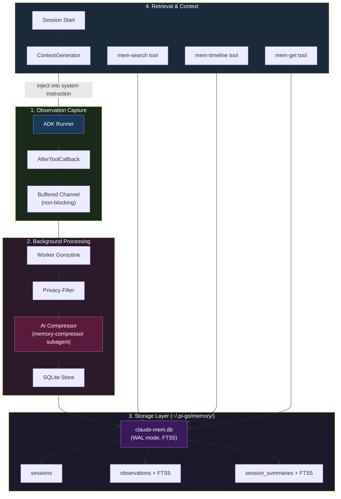

## Component Details

### 1. Observation Capture

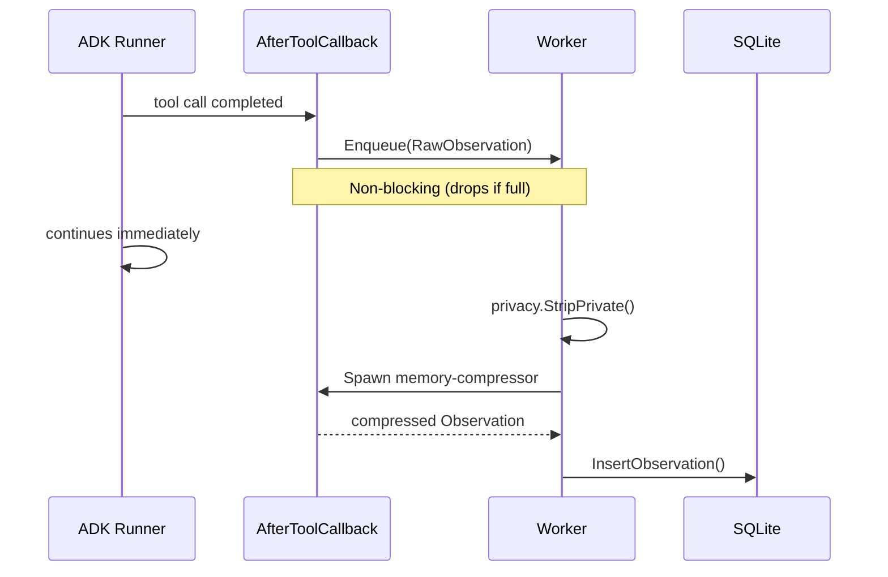

- **AfterToolCallback** (`internal/memory/worker.go:187-205`): ADK callback that fires after every tool call
- **Non-blocking enqueue**: Prevents memory pipeline from slowing down the agent
- **Configurable exclusion**: `screen`, `restart` and other noisy tools can be excluded

### 2. Background Processing

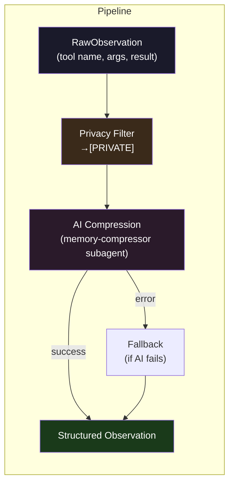

**Privacy Filtering** (`internal/memory/privacy.go`):
- Strips `<private>...</private>` tags from tool input/output
- Deep recursion into nested maps and arrays
- Prevents PII from entering long-term memory

**AI Compression** (`internal/memory/compress.go:36-72`):
- Spawns `memory-compressor` subagent (smol model)
- Receives: tool name, JSON args, JSON result (truncated to 4096 chars)
- Returns structured JSON: `{title, type, text, source_files}`

### 3. Storage Layer

**Database** (`internal/memory/db.go`):
- SQLite via `modernc.org/sqlite` (pure Go, no CGO)
- WAL mode for concurrent reads
- FTS5 full-text search virtual tables

**Schema** (`internal/memory/db.go:15-113`):

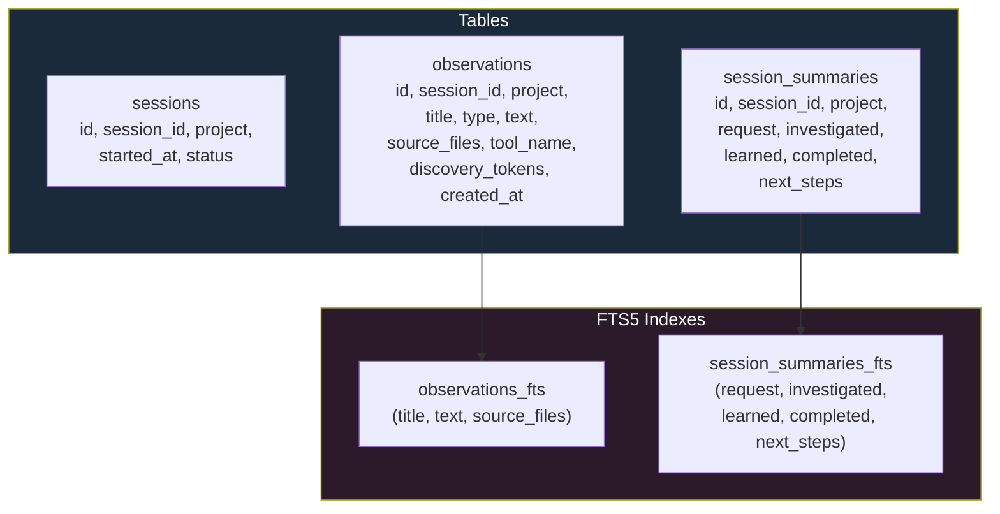

**Observation Types** (`internal/memory/types.go:6-14`):
| Type | Description |
|------|-------------|
| `decision` | Architectural decisions |
| `bugfix` | Bug fixes |
| `feature` | New features |
| `refactor` | Refactoring |
| `discovery` | Codebase insights |
| `change` | General changes |

### 4. Context Retrieval

**Session Start** (`internal/memory/context.go:32-116`):
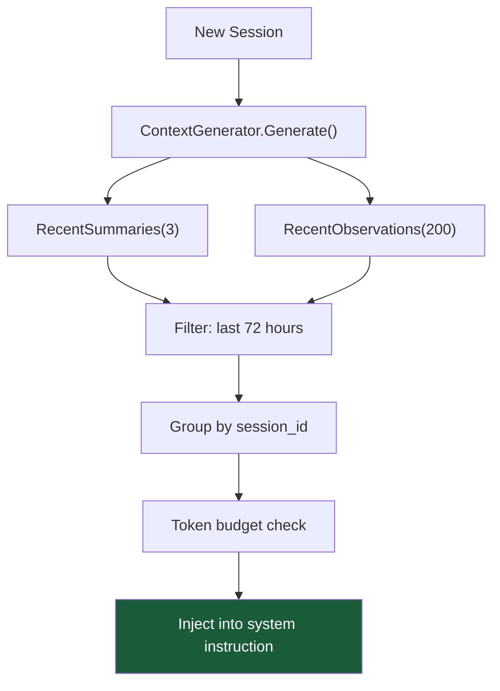

**Output Format**:
```markdown
# [project-name] recent context, 2024-01-15 3:04pm MST

**Legend:** session-request | bugfix | feature | refactor | change | discovery

**Column Key**:
- **Read**: Tokens to read this observation (cost to learn it now)
- **Work**: Tokens spent on work that produced this record

## Session: User asked to fix auth bug (Jan 15 at 2:30 PM)

**internal/auth/login.go**

| ID | Time | T | Title | Read | Work |
|----|------|---|-------|------|------|
| #42 | 2:31 PM | bugfix | Auth token validation | 45 | 120 |
| #43 | 2:35 PM | bugfix | Fixed token expiry check | 38 | 85 |

Access past observations with mem-search, mem-timeline, mem-get tools.
```

## Search Tools

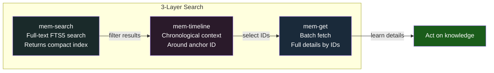

| Tool | Purpose | Output Size |
|------|---------|------------|
| `mem-search(query)` | FTS5 full-text search | ~50-100 tokens/result |
| `mem-timeline(anchor)` | Chronological context window | ~200-500 tokens |
| `mem-get(ids)` | Full observation details | ~500-1000 tokens/result |

## Data Flow Summary

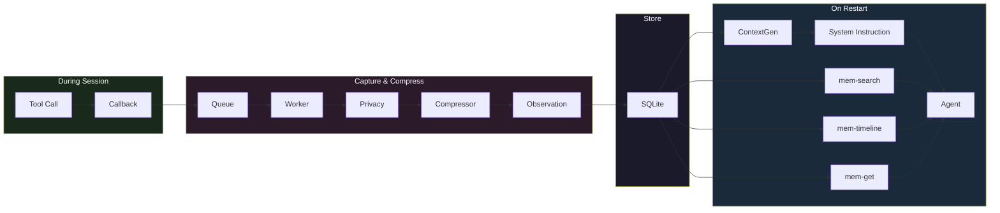

## Configuration

```json
{
  "memory": {
    "enabled": true,
    "db_path": "~/.pi-go/memory/claude-mem.db",
    "token_budget": 5000,
    "max_pending": 100,
    "lookback_hours": 168,
    "excluded_tools": ["screen", "restart"]
  }
}
```

| Option | Default | Description |
|--------|---------|-------------|
| `enabled` | `true` | Enable/disable memory system |
| `token_budget` | `5000` | Max tokens for injected context |
| `max_pending` | `100` | Observation queue buffer size |
| `lookback_hours` | `168` | (7 days) how far back to look |
| `excluded_tools` | `["screen", "restart"]` | Tools to skip |

## File Structure

```
internal/memory/
├── db.go           # SQLite open, migrations, schema
├── store.go        # Store interface + SQLiteStore implementation
├── worker.go       # Background worker + ADK callbacks
├── compress.go     # AI compression via subagent
├── context.go      # Context generation for session start
├── search.go       # FTS5 search + timeline queries
├── privacy.go      # <private> tag stripping
└── types.go        # Data structures (Observation, SessionSummary, etc.)

internal/tools/
└── mem_search.go   # mem-search, mem-timeline, mem-get tools
```

## Key Design Decisions

1. **Non-blocking capture**: Tool callbacks enqueue and return immediately — never slows down the agent
2. **Drop-on-full**: If the queue fills, oldest observations are dropped (preferring liveness)
3. **Fallback compression**: If AI compression fails, store raw JSON with reduced fidelity
4. **Pure Go SQLite**: Uses `modernc.org/sqlite` — no CGO, portable binary
5. **FTS5 for search**: SQLite's full-text search with BM25 ranking
6. **Token budgeting**: Context injection stops when token budget is exhausted
7. **Session grouping**: Observations grouped by session for coherent context

## Session Summary

At session end, the system can generate a `SessionSummary` with:

- **Request**: What the user was trying to do
- **Investigated**: What was explored
- **Learned**: Key discoveries
- **Completed**: What was accomplished
- **Next Steps**: Suggested follow-ups

This is stored in `session_summaries` and surfaced at future session starts.

---

# MemPalace System

Structured knowledge storage with semantic embeddings, temporal knowledge graph, diary, and multi-layer context injection. Built on top of the observation pipeline and designed for long-term agent memory.

## Full System Overview

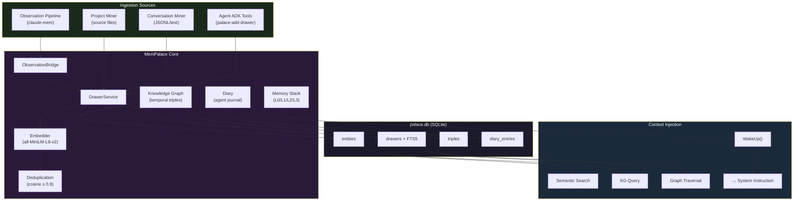

## Palace Metaphor

The MemPalace uses a spatial metaphor for organizing knowledge:

| Concept | Meaning | Example |
|---------|---------|---------|
| **Wing** | Project namespace | `pi-go`, `my-webapp` |
| **Room** | Topical area within a wing | `code`, `docs`, `tests`, `config` |
| **Hall** | Category of knowledge | `hall_decisions`, `hall_bugs`, `hall_features` |
| **Drawer** | A single unit of knowledge | A code chunk, an observation, a fact |
| **Triple** | A KG fact (subject-predicate-object) | `pi-go → uses → hugot` |

## Memory Layers

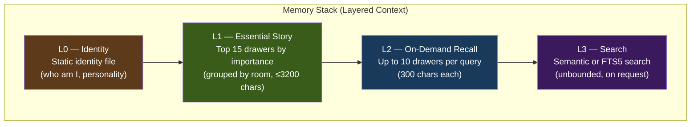

- **L0 + L1** are injected automatically at session start via `WakeUp()`
- **L2 + L3** are accessed on-demand via ADK tools during the session

## Semantic Embeddings

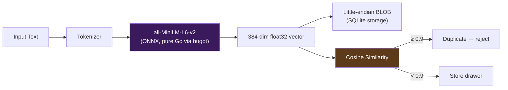

- **Model**: `sentence-transformers/all-MiniLM-L6-v2` — small, fast, 384-dim
- **Runtime**: `knights-analytics/hugot` — pure Go (GoMLX), no CGO
- **Platform**: arm64 uses `qint8_arm64.onnx`, amd64 uses `model.onnx`
- **Fallback**: If model not loaded, search degrades to FTS5 keyword matching

## Knowledge Graph

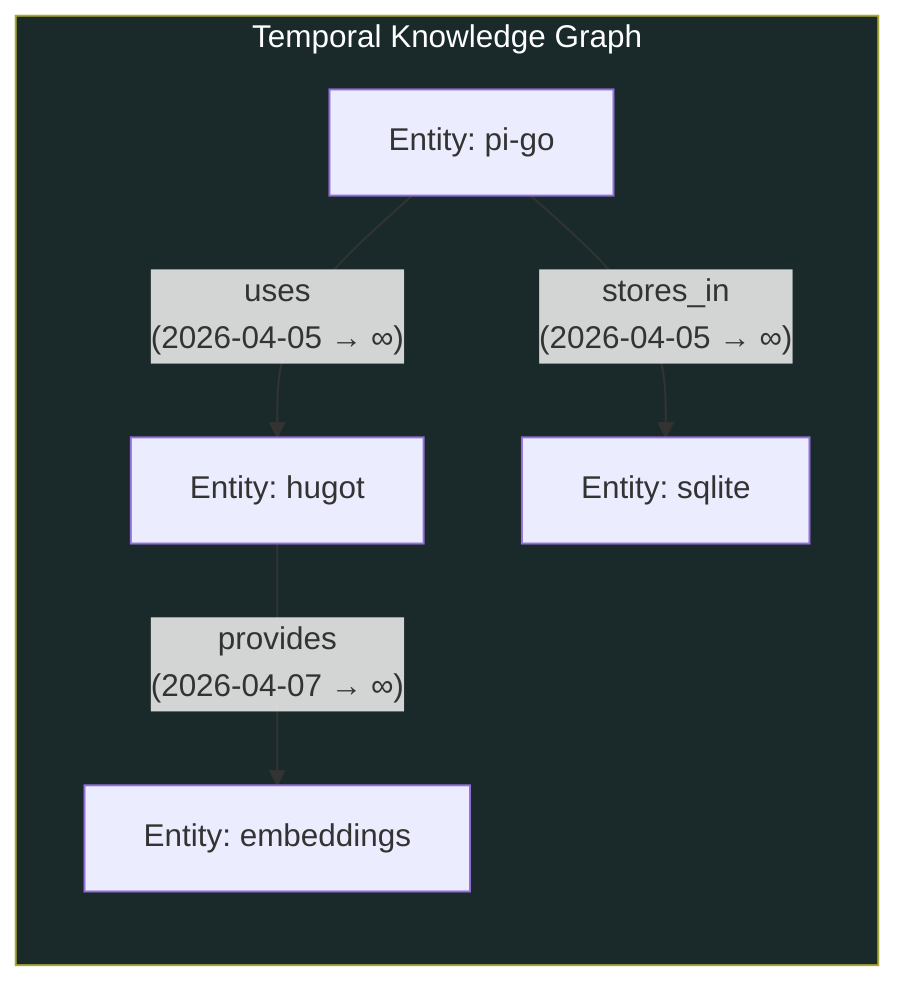

- **Temporal triples**: Each fact has `valid_from` / `valid_to` — facts can be invalidated without deletion
- **Idempotent**: Re-adding the same triple returns the existing one
- **Point-in-time queries**: `QueryEntity(entity, asOf: "2026-04-01")` returns only facts valid at that date
- **Timeline**: Full chronological history of all facts (including invalidated) for any entity
- **Auto-entities**: Referenced subjects/objects are created automatically on first use

## Observation Bridge

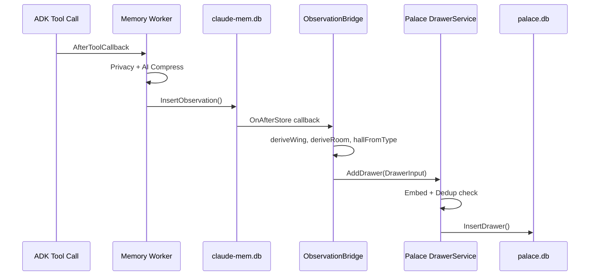

**Type → Hall mapping**:

| Observation Type | Palace Hall | Importance |
|-----------------|-------------|------------|
| `decision` | `hall_decisions` | 8 |
| `bugfix` | `hall_bugs` | 7 |
| `feature` | `hall_features` | 7 |
| `discovery` | `hall_discoveries` | 6 |
| `refactor` | `hall_refactors` | 5 |
| `change` | `hall_changes` | 4 |

## Mining Pipeline

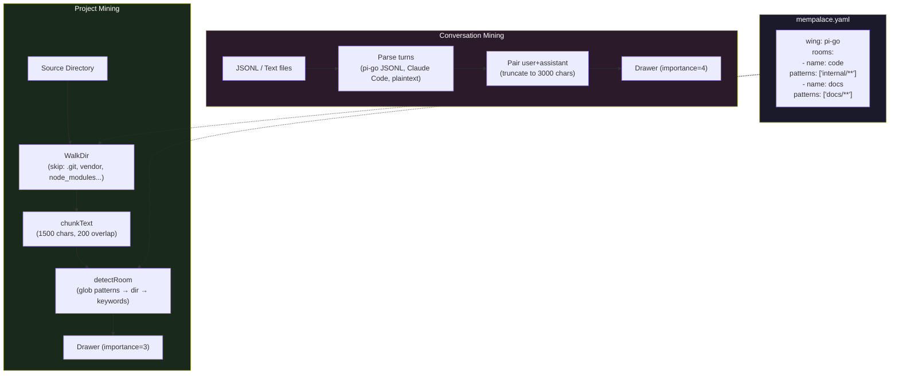

## ADK Agent Tools (10 tools)

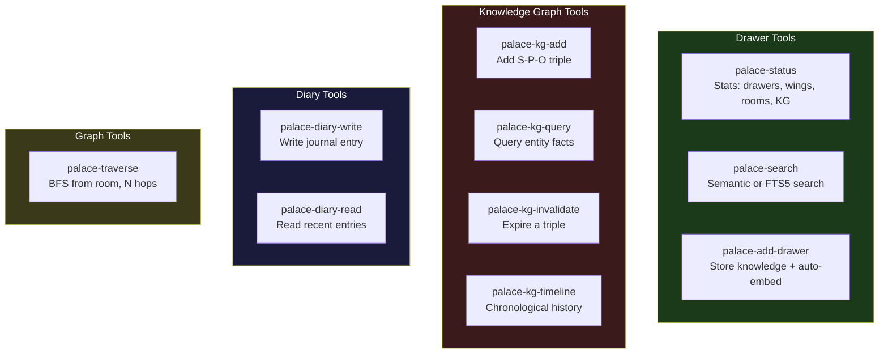

## CLI Commands

All under `pi memory`:

| Command | Description |
|---------|-------------|
| `pi memory init [dir]` | Create `palace.db`, generate `mempalace.yaml` template |
| `pi memory model download` | Download all-MiniLM-L6-v2 ONNX model |
| `pi memory model status` | Show model path, size, file count |
| `pi memory status` | Drawer/wing/room/KG stats, model status |
| `pi memory mine <dir>` | Index source files (add `--convos` for conversations) |
| `pi memory search <query>` | Semantic or FTS5 search (`--wing`, `--room`, `--limit`) |
| `pi memory kg query <entity>` | Query KG triples (`--as-of`, `--direction`) |
| `pi memory kg add <s> <p> <o>` | Add triple (`--valid-from`) |
| `pi memory kg timeline <entity>` | Show full triple history |
| `pi memory wake-up` | Print L0+L1 context (debug/pipe) |
| `pi memory recent [project]` | Show recent observations (`--type`, `--limit`, `--json`) |

## Configuration

### `mempalace.yaml` (project-level)

```yaml
wing: pi-go
rooms:
  - name: code
    patterns:
      - "internal/**"
  - name: docs
    patterns:
      - "docs/**"
    keywords:
      - "documentation"
```

### Application config (JSON)

```json
{
  "palace": {
    "enabled": true,
    "db_path": "~/.pi-go/palace.db",
    "model_path": "~/.pi-go/models/KnightsAnalytics_all-MiniLM-L6-v2"
  }
}
```

### Internal defaults (`PalaceConfig`)

| Setting | Default | Purpose |
|---------|---------|---------|
| `DeduplicationThreshold` | `0.9` | Cosine similarity cutoff for duplicates |
| `L1TopK` | `15` | Max drawers in essential story |
| `L1MaxChars` | `3200` | Hard cap on L1 context |
| `L2MaxDrawers` | `10` | Max drawers in on-demand recall |
| `L2MaxCharsPerDrawer` | `300` | Per-drawer truncation for L2 |

## Use Cases

### 1. Long-term project context

```
# Mine your codebase once
pi memory init .
pi memory model download
pi memory mine .

# Agent now has semantic search over your entire project
# L1 injects the most important knowledge at session start
```

The agent starts every session with key architectural decisions, known bugs, and important features — without re-reading the entire codebase.

### 2. Cross-session knowledge transfer

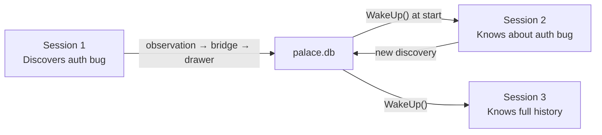

The bridge automatically funnels observations from each session into palace drawers with importance scoring. Future sessions see the most important discoveries in their L1 context.

### 3. Building a project knowledge graph

```
# Agent learns facts during work
palace-kg-add "auth_service" "depends_on" "redis"
palace-kg-add "auth_service" "owned_by" "backend_team"
palace-kg-add "redis" "version" "7.2"

# Later, query relationships
palace-kg-query "auth_service"
# → depends_on redis, owned_by backend_team

# When facts change, invalidate (history preserved)
palace-kg-invalidate <triple-id>
palace-kg-add "redis" "version" "7.4"

# Full timeline shows evolution
palace-kg-timeline "redis"
# → version 7.2 (2026-04-01 → 2026-04-08)
# → version 7.4 (2026-04-08 → ∞)
```

### 4. Conversation mining for onboarding

```
# Mine past conversations to bootstrap memory
pi memory mine ./conversations --convos

# New team members' agents get context from past discussions
# without reading thousands of chat messages
```

### 5. Agent diary for self-reflection

The agent can keep a journal of its reasoning, mistakes, and learnings:

```
palace-diary-write "Spent too long on FTS5 query optimization.
The real bottleneck was the embedding computation. Next time,
profile before optimizing."

palace-diary-read --agent pi-agent --limit 5
```

### 6. Graph traversal for discovery

```
palace-traverse --start "internal/palace" --hops 2

# Discovers: internal/palace → connects to → internal/cli (1 hop)
#            internal/cli → connects to → internal/tui (2 hops)
# Reveals architectural dependencies the agent wasn't aware of
```

## File Structure

```
internal/palace/
├── palace.go           # Palace facade (wires all components)
├── types.go            # Drawer, Triple, Entity, DiaryEntry, WingSummary
├── config.go           # PalaceConfig + functional options
├── db.go               # SQLite open + 3 schema migrations
├── store.go            # PalaceStore interface (19 methods)
├── sqlite_store.go     # SQLite implementation
├── drawer_service.go   # Add/Search with embedding + dedup
├── embedder.go         # hugot pipeline + cosine similarity
├── embedding.go        # Little-endian BLOB serialization
├── layers.go           # L0/L1/L2 memory stack
├── graph.go            # BFS traversal + tunnel discovery
├── kg.go               # Temporal knowledge graph
├── miner.go            # MineConfig + chunk/detect helpers
├── miner_project.go    # Source file mining
├── miner_convo.go      # Conversation mining
├── bridge.go           # Observation → Drawer bridge
├── tools.go            # PalaceTools() — 10 ADK tools
├── tool_add.go         # palace-add-drawer
├── tool_search.go      # palace-search
├── tool_status.go      # palace-status
├── tool_kg.go          # palace-kg-* (4 tools)
├── tool_diary.go       # palace-diary-* (2 tools)
└── tool_traverse.go    # palace-traverse

internal/cli/
├── memory.go           # `pi memory` root command
├── memory_init.go      # `pi memory init`
├── memory_model.go     # `pi memory model download/status`
├── memory_status.go    # `pi memory status`
├── memory_mine.go      # `pi memory mine`
├── memory_search.go    # `pi memory search`
├── memory_kg.go        # `pi memory kg query/add/timeline`
├── memory_wakeup.go    # `pi memory wake-up`
└── memory_recent.go    # `pi memory recent`

mempalace.yaml              # Project-level room/wing config
```

## Key Design Decisions

1. **Dual-database architecture**: `claude-mem.db` for raw observations, `palace.db` for structured knowledge — separation of concerns
2. **Observation bridge**: Automatic flow from observation pipeline into palace drawers with type→hall mapping and importance scoring
3. **Semantic + FTS5 fallback**: Embeddings enable similarity search; FTS5 provides keyword search when model isn't loaded
4. **Deduplication at ingestion**: Cosine similarity ≥ 0.9 prevents redundant knowledge storage
5. **Temporal KG**: Facts have validity windows — no destructive updates, full audit trail
6. **Layered context injection**: L0/L1 auto-injected, L2/L3 on-demand — balances richness vs. token cost
7. **Pure Go stack**: hugot (GoMLX) + modernc.org/sqlite — single binary, no CGO, cross-platform
8. **Spatial metaphor**: Wing/room/hall/drawer organization mirrors how humans navigate knowledge spatially
