# PI-ARCH: pi-go Internal Architecture

> **Purpose**: Detailed internal architecture reference for pi-go contributors and extending developers.
> **Audience**: Developers who want to understand, modify, or extend pi-go's internals.
> **Companion**: See [ARCHITECTURE.md](./ARCHITECTURE.md) for the high-level overview.

---

## Table of Contents

1. [System Context](#1-system-context)
2. [Package Dependency Graph](#2-package-dependency-graph)
3. [ADK Integration Layer](#3-adk-integration-layer)
4. [Agent Initialization Pipeline](#4-agent-initialization-pipeline)
5. [Tool Execution Flow](#5-tool-execution-flow)
6. [Session & Memory Architecture](#6-session--memory-architecture)
7. [Subagent Orchestration](#7-subagent-orchestration)
8. [TUI Rendering Pipeline](#8-tui-rendering-pipeline)
9. [Extension Points](#9-extension-points)
10. [Data Flow Diagrams](#10-data-flow-diagrams)

---

## 1. System Context

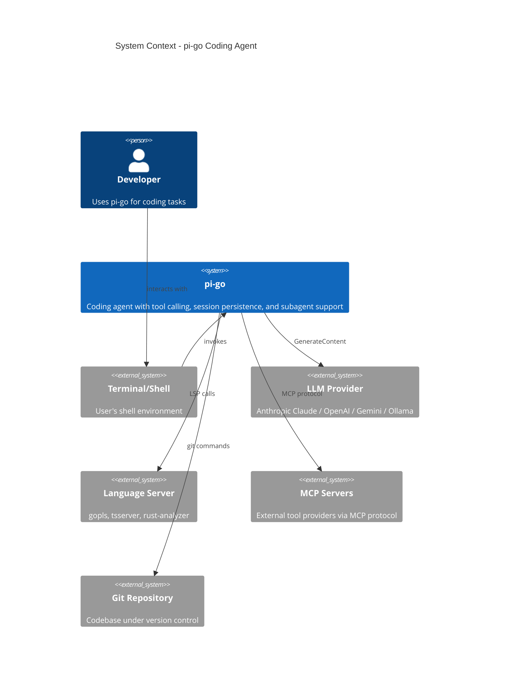

### External Boundaries

| Boundary          | Description                                                  |
|-------------------|--------------------------------------------------------------|
| **LLM Providers** | HTTP APIs (Anthropic, OpenAI, Gemini) or local (Ollama)      |
| **File System**   | Restricted to working directory via `os.Root` sandbox        |
| **Git**           | Read/write via subprocess, workspace isolation via worktrees |
| **LSP Servers**   | Stdio-based IPC per language                                 |
| **MCP Protocol**  | Subprocess transport, JSON-RPC 1.0                           |

---

## 2. Package Dependency Graph

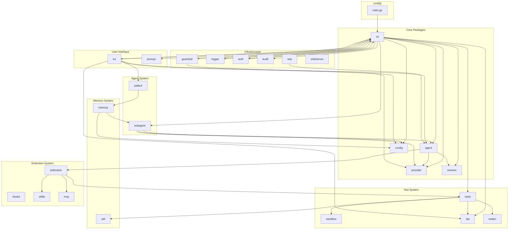

### Package Purposes

| Package     | Responsibility                                                 |
|-------------|----------------------------------------------------------------|
| `cmd/pi`    | Entry point, CLI flag parsing                                  |
| `cli`       | Mode routing (interactive/print/json/rpc), deferred init       |
| `agent`     | ADK LLM Agent + Runner setup, retry logic                      |
| `config`    | YAML/JSON config loading, role resolution                      |
| `provider`  | Multi-provider LLM factory (Anthropic, OpenAI, Gemini, Ollama) |
| `session`   | JSONL persistence, branching, compaction                       |
| `tools`     | Tool registration, sandboxing, LSP integration                 |
| `tui`       | Bubble Tea TUI, markdown rendering                             |
| `subagent`  | Pool, spawner, worktree management                             |
| `lsp`       | Language server protocol client                                |
| `extension` | Hooks, skills, MCP integration                                 |
| `guardrail` | Daily token usage tracking                                     |
| `memory`    | SQLite persistence, AI compression                             |
| `palace`    | Memory palace (drawers, knowledge graph, layers)               |
| `atif`      | Agent Trajectory Interchange Format                            |
| `logger`    | Session logging to JSON files                                  |
| `auth`      | OAuth PKCE/device-code login                                   |
| `audit`     | Hidden character scanner                                       |
| `sop`       | Standard Operating Procedures                                  |
| `webserver` | Web-based terminal sharing                                     |
| `jsonrpc`   | Unix socket JSON-RPC 2.0 server                                |

---

## 3. ADK Integration Layer

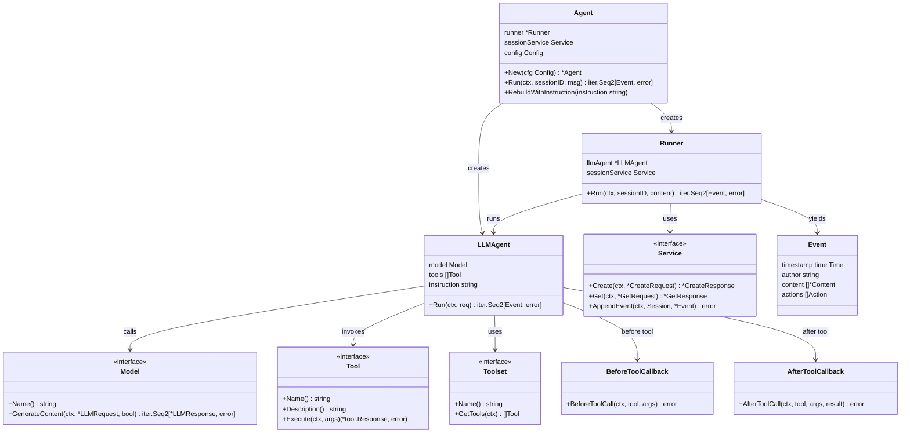

### Key ADK Interfaces

```go
// model.LLM — LLM provider interface
type LLM interface {
    Name() string
    GenerateContent(ctx context.Context, req *LLMRequest, stream bool) iter.Seq2[*LLMResponse, error]
}

// tool.Tool — tool interface
type Tool interface {
    Name() string
    Description() string
    Schema() *Schema
    Execute(ctx context.Context, args []byte) (*Response, error)
}

// tool.Toolset — grouped tools
type Toolset interface {
    Name() string
    GetTools(ctx context.Context) ([]Tool, error)
}

// session.Service — session persistence
type Service interface {
    Create(ctx context.Context, req *CreateRequest) (*CreateResponse, error)
    Get(ctx context.Context, req *GetRequest) (*GetResponse, error)
    List(ctx context.Context, req *ListRequest) (*ListResponse, error)
    Delete(ctx context.Context, req *DeleteRequest) error
    AppendEvent(ctx context.Context, curSession Session, event *Event) error
}
```

---

## 4. Agent Initialization Pipeline

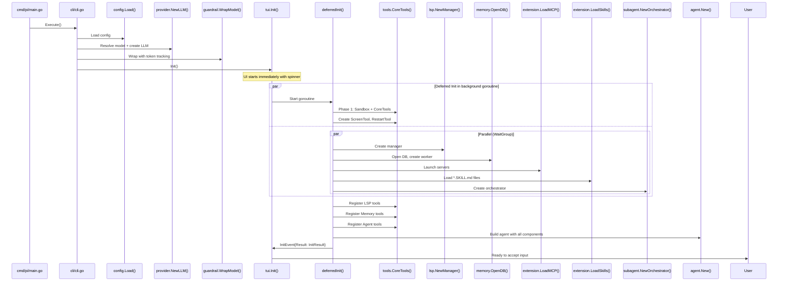

### Initialization Phases

| Phase       | Components                                  | Duration   |
|-------------|---------------------------------------------|------------|
| **Phase 1** | Sandbox, CoreTools, ScreenTool, RestartTool | Sequential |
| **Phase 2** | Git, LSP, Memory, MCP, Skills               | Parallel   |
| **Phase 3** | Orchestrator, Agent builder                 | Sequential |

---

## 5. Tool Execution Flow

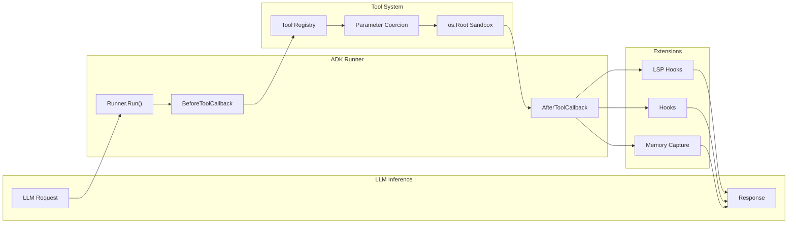

### Tool Lifecycle

```
1. LLM generates tool call request
       ↓
2. Runner invokes BeforeToolCallbacks
   - Extension hooks (before)
       ↓
3. Tool selected from registry
   - CoreTools (read, write, edit, bash, grep, find, ls, tree, git)
   - LSP tools (diagnostics, definition, references, hover, symbols)
   - Memory tools (search, timeline, get)
   - Agent tool (spawn subagent)
       ↓
4. Parameter coercion (string → int, bool, etc.)
       ↓
5. Sandbox enforcement (os.Root restriction)
       ↓
6. Tool execution with timeout
       ↓
7. AfterToolCallbacks
   - Extension hooks (after)
   - LSP format hook
   - Memory observation capture
   - Compactor check
       ↓
8. Result returned to LLM
```

### Sandbox Mechanism

```go
// internal/tools/sandbox.go
func NewSandbox(root string) *Sandbox {
    r, _ := os.Root(root)  // Go 1.24+ restricted filesystem
    return &Sandbox{root: r}
}

func (s *Sandbox) Open(name string) (*os.File, error) {
    return s.root.Open(name)
}
```

---

## 6. Session & Memory Architecture

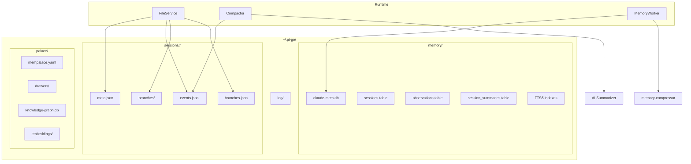

### Session Storage Format

```
~/.pi-go/sessions/<session-id>/
├── meta.json           # Session metadata
├── events.jsonl        # Append-only event log
└── branches/
    ├── main/
    │   └── events.jsonl
    └── <branch-name>/
        └── events.jsonl
```

### Memory Layer Hierarchy (Palace)

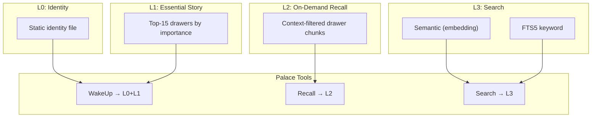

---

## 7. Subagent Orchestration

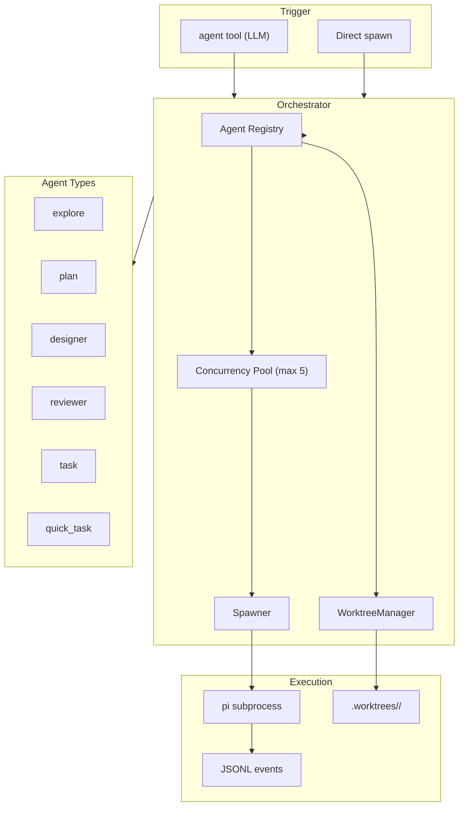

### Subagent Configuration

```go
// internal/subagent/types.go
type AgentConfig struct {
    Type      string            // "explore", "task", "plan", etc.
    Model     string            // "smol", "default", "slow", "plan"
    Worktree  bool              // Isolated git worktree
    Instruction string          // System instruction override
    Timeout   time.Duration     // Max runtime
    Tools     []string          // Allowed tool names
}
```

### Agent Type Matrix

| Type       | Model   | Worktree | Purpose                 | Timeout |
|------------|---------|----------|-------------------------|---------|
| explore    | smol    | No       | Fast read-only research | 5min    |
| quick_task | smol    | No       | Small focused tasks     | 10min   |
| task       | default | Yes      | Full coding tasks       | 30min   |
| designer   | slow    | Yes      | Code creation           | 30min   |
| reviewer   | slow    | No       | Code review             | 15min   |
| plan       | plan    | No       | Analysis & planning     | 20min   |

---

## 8. TUI Rendering Pipeline

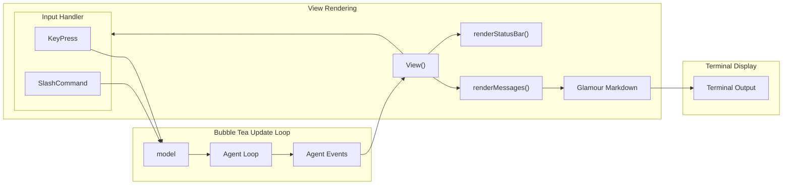

### TUI Component Hierarchy

```
model (Bubble Tea Model)
├── inputModel (InputModel)
│   ├── textinput
│   ├── completionEngine
│   └── history
├── chatModel (ChatModel)
│   ├── messages []Message
│   ├── markdownRenderer
│   └── scrollOffset
├── statusModel (StatusModel)
│   ├── modelName
│   ├── sessionID
│   └── tokenUsage
└── themeManager (ThemeManager)
    ├── themes map[string]Theme
    └── currentTheme
```

---

## 9. Extension Points

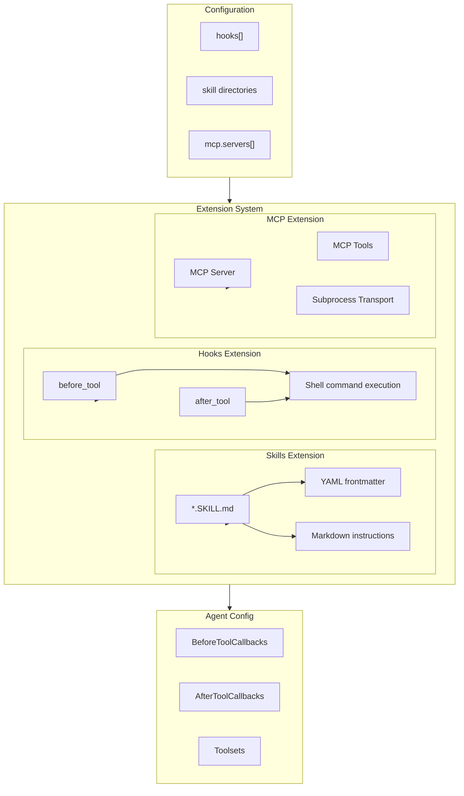

### Hook Configuration Schema

```yaml
# ~/.pi-go/config.json
{
  "hooks": [
    {
      "name": "my-hook",
      "trigger": "after_tool",
      "tool": "write",
      "command": ["echo", "wrote {path}"],
      "env": {"EXTRA": "value"}
    }
  ]
}
```

### Skill File Schema

```markdown
---
name: my-skill
description: What this skill does
trigger: manual  # or "auto" on match
---

# My Skill

Instructions for the agent when this skill is active...
```

### MCP Server Configuration

```yaml
# ~/.pi-go/config.json
{
  "mcp": {
    "servers": [
      {
        "name": "filesystem",
        "command": ["npx", "-y", "@modelcontextprotocol/server-filesystem", "/path"]
      }
    ]
  }
}
```

---

## 10. Data Flow Diagrams

### Complete Request Flow

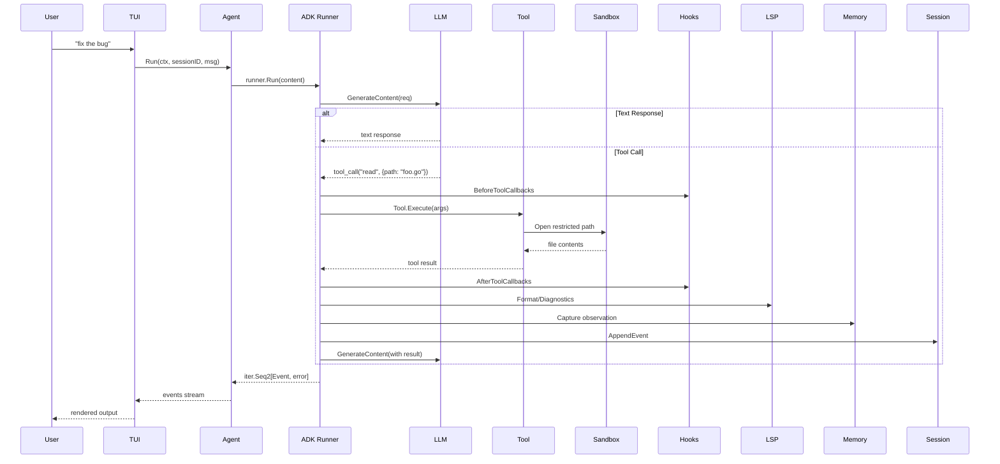

### Memory Observation Capture Flow

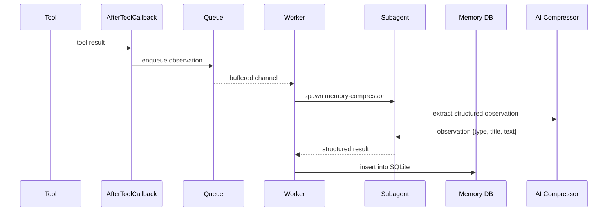

---

## Appendix: Key Files Reference

| File                                | Purpose                   |
|-------------------------------------|---------------------------|
| `cmd/pi/main.go`                    | Entry point               |
| `internal/cli/cli.go`               | CLI setup, mode routing   |
| `internal/cli/interactive.go`       | TUI initialization        |
| `internal/agent/agent.go`           | ADK agent creation        |
| `internal/agent/retry.go`           | Exponential backoff retry |
| `internal/agent/instruction.go`     | System prompt             |
| `internal/provider/provider.go`     | LLM factory               |
| `internal/tools/registry.go`        | Tool registration         |
| `internal/tools/sandbox.go`         | Filesystem sandbox        |
| `internal/session/store.go`         | JSONL persistence         |
| `internal/tui/tui.go`               | Bubble Tea model          |
| `internal/tui/chat.go`              | Message rendering         |
| `internal/subagent/orchestrator.go` | Subagent management       |
| `internal/lsp/manager.go`           | LSP client manager        |
| `internal/memory/store.go`          | SQLite memory storage     |
| `internal/palace/palace.go`         | Memory palace             |
| `internal/extension/hooks.go`       | Hook extension            |
| `internal/extension/skills.go`      | Skills extension          |
| `internal/extension/mcp.go`         | MCP integration           |

---

## Appendix: Environment Variables

| Variable             | Purpose                   |
|----------------------|---------------------------|
| `ANTHROPIC_API_KEY`  | Anthropic API key         |
| `ANTHROPIC_BASE_URL` | Custom Anthropic endpoint |
| `OPENAI_API_KEY`     | OpenAI API key            |
| `OPENAI_BASE_URL`    | Custom OpenAI endpoint    |
| `GEMINI_API_KEY`     | Google API key            |
| `GEMINI_BASE_URL`    | Custom Gemini endpoint    |
| `MISTRAL_API_KEY`    | Mistral API key           |
| `PI_GO_CONFIG`       | Config file path override |

---

*Generated from codebase analysis. Last updated: auto-generated.*
