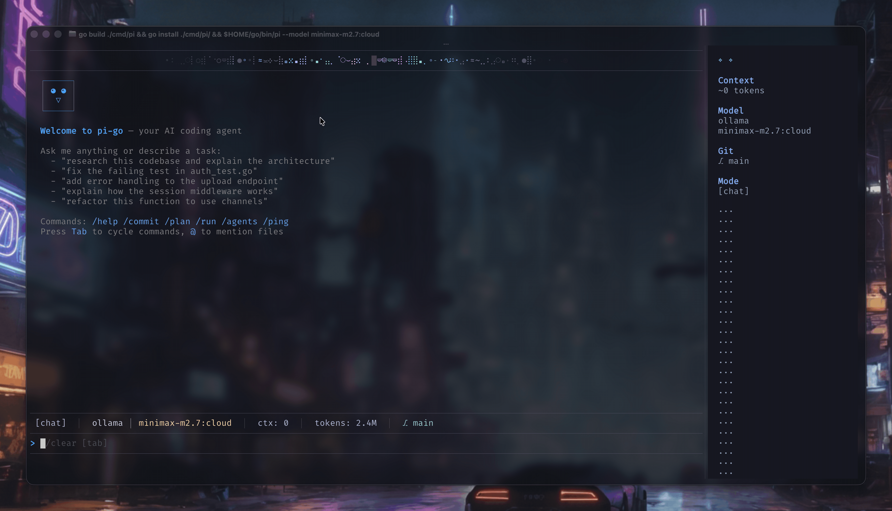

# pi-go

[](https://github.com/dimetron/pi-go/actions/workflows/ci.yml)
[](https://goreportcard.com/report/github.com/dimetron/pi-go)
[](go.mod)
[](LICENSE)
[](https://github.com/dimetron/pi-go/releases)
[](https://codecov.io/gh/dimetron/pi-go)

A terminal-based coding agent built on [Google ADK Go](https://adk.dev/) with multi-provider LLM support, sandboxed tool
execution, LSP integration, and a subagent system.



## Features

- **Multi-provider LLM** — Claude (Anthropic), GPT/O-series (OpenAI), Gemini (Google), and Ollama for local models
- **Sandboxed tools** — File read/write/edit, shell execution, grep, find, tree, and git operations, all restricted to the project directory via `os.Root`
- **Interactive TUI** — Bubble Tea v2 terminal UI with Markdown rendering (Glamour), slash commands, and theming
- **Session persistence** — JSONL append-only event logs with branching, compaction, and resume
- **Model roles** — Named configurations (default, smol, slow, plan, commit) selectable via CLI flags
- **Subagents** — Process-based multi-agent system with types: explore, plan, designer, reviewer, task, quick_task
- **LSP integration** — JSON-RPC client for Go, TypeScript/JS, Python, Rust with auto-format and diagnostics hooks
- **AI Git tools** — Repository overview, file diffs, hunk parsing, and LLM-generated conventional commits (`/commit`)
- **RPC server** — Unix socket JSON-RPC 2.0 for IDE/editor integration
- **Memory Palace** — 4-layer contextual memory with SQLite storage, semantic embeddings (all-MiniLM-L6-v2), temporal knowledge graph, and project/conversation miners
- **Extensions** — Hooks (shell callbacks), skills (`.SKILL.md` instructions), and MCP server support
- **Skills audit** — Security scanning for hidden Unicode characters, BiDi attacks, and supply-chain threats in skill files (`pi audit`)

## Architecture

```
cmd/pi/             Entry point — CLI parsing, output mode selection
internal/
├── agent/          ADK agent setup, retry logic, runner
├── cli/            Cobra CLI flags, output modes (interactive, print, json, rpc)
├── config/         Global and project config (roles, hooks, MCP, themes)
├── audit/          Security scanner for skills (hidden Unicode, supply-chain threats)
├── extension/      Hooks, skills, MCP server integration
├── lsp/            LSP JSON-RPC client, language registry, manager, hooks
├── palace/         Memory Palace — drawers, layers, KG, miners, embedder, search
├── provider/       LLM providers implementing genai model interface
├── rpc/            Unix socket JSON-RPC 2.0 server
├── session/        JSONL persistence, branching, compaction
├── subagent/       Process spawner, orchestrator, concurrency pool
├── tools/          Sandboxed tools (read, write, edit, bash, grep, find, git, lsp)
└── tui/            Bubble Tea v2 UI, slash commands, commit workflow
```

### Request flow

```
User input → CLI → Agent → LLM provider → Tool calls → Sandbox → Response → TUI
                     ↕           ↕            ↕
              Session store   Palace       LSP servers
              (JSONL events)  (memory,   (format, diagnostics)
                              KG, search)
```

See [ARCHITECTURE.md](ARCHITECTURE.md) for detailed documentation.

## Installation

### Quick install (recommended)

```bash
curl -fsSL https://raw.githubusercontent.com/dimetron/pi-go/main/scripts/install.sh | bash
```

This script detects your OS/arch, downloads the latest release binary, and installs it to `/usr/local/bin` (or `~/.local/bin` if needed).

### go install

```bash
go install github.com/dimetron/pi-go/cmd/pi@latest
```

Make sure your `GOPATH/bin` is in your `PATH`. The binary will be installed as `pi`.

### Build from source

```bash
git clone https://github.com/dimetron/pi-go.git
cd pi-go
go install ./cmd/pi
```

### Pre-built binaries

Download the latest release for your platform from the [Releases page](https://github.com/dimetron/pi-go/releases).

## Requirements

- Go 1.25+
- At least one LLM provider API key (`ANTHROPIC_API_KEY`, `OPENAI_API_KEY`, `GEMINI_API_KEY`) or a running Ollama instance

## Build

```bash
make build      # build the pi binary
make test       # run unit tests
make lint       # golangci-lint (vet, staticcheck, errcheck, …)
make e2e        # run E2E integration tests
make clean      # remove binary
```

## Usage

```bash
# Default interactive mode
pi

# Select a model by prefix
pi --model claude:sonnet
pi --model openai:gpt-4o
pi --model gemini:gemini-2.5-pro
pi --model ollama/gemma4:12b-mlx
pi --model minimax-m3:cloud # automatically detect ollama if :cloud

# Use model roles
pi --smol          # fast, cheap model
pi --slow          # most capable model
pi --plan          # planning-oriented model

# Additional options
pi --continue      # continue last session
pi --session <id>  # resume specific session
pi --system "..." # custom system instructions
pi --url "..."    # custom API endpoint URL

# Non-interactive modes
pi --mode print "explain this codebase"
pi --mode json "list all TODO comments"
pi --mode socket --socket /tmp/pi-go.sock  # JSON-RPC 2.0 over a Unix socket
pi --mode rpc                              # pi-compatible NDJSON over stdio (for pi-acp)
```

### Slash commands

| Command         | Description                                              |
|-----------------|----------------------------------------------------------|
| `/help`         | Show available commands                                  |
| `/model`        | Switch model mid-conversation                            |
| `/session`      | List and switch sessions                                 |
| `/branch`       | Create a conversation branch                             |
| `/commit`       | Generate and apply a git commit                          |
| `/compact`      | Compact session history                                  |
| `/agents`       | Show running subagents                                   |
| `/history`      | Show command history                                     |
| `/plan`         | Start PDD planning session (auto-resumes if spec exists) |
| `/run`          | Execute a spec with task agent                           |
| `/skill-create` | Create a new skill                                       |
| `/skill-list`   | List available skills                                    |
| `/skill-load`   | Reload skills from disk                                  |
| `/memory`       | Memory Palace commands (see below)                       |
| `/audit`        | Scan skills for hidden Unicode threats                   |
| `/restart`      | Restart pi-go                                            |
| `/clear`        | Clear conversation                                       |
| `/exit`         | Exit the agent                                           |

### Memory Palace

A 4-layer contextual memory system that gives the agent persistent awareness across sessions.

**Layers:**

| Layer | Name | Description |
|-------|------|-------------|
| L0 | Identity | Static identity file |
| L1 | Essential Story | Top-15 drawers by importance, injected into system prompt |
| L2 | On-Demand Recall | Context-filtered drawer chunks |
| L3 | Search | Semantic (embedding) or keyword (FTS5) search |

**CLI commands:**

```bash
# Setup
pi memory model download         # download all-MiniLM-L6-v2 embedding model
pi memory model status           # check model path and status
pi memory init [dir]             # create palace.db + generate mempalace.yaml

# Ingest
pi memory mine <dir>             # mine source files into drawers
pi memory mine --convos <dir>    # mine conversation files (JSONL/text)

# Query
pi memory status                 # palace overview (drawers, wings, rooms, KG)
pi memory search <query>         # semantic or keyword search
pi memory wake-up                # print L0+L1 context for system prompt
pi memory recent [project]       # recent memory observations

# Knowledge Graph
pi memory kg query <entity>      # query triples involving an entity
pi memory kg add <s> <p> <o>     # add a fact triple
pi memory kg timeline <entity>   # chronological timeline of facts
```

**Configuration** via `mempalace.yaml` in the project root:

```yaml
wing: my-project
rooms:
  - name: auth
    patterns: ["internal/auth/**"]
    keywords: [jwt, token, session]
  - name: api
    patterns: ["internal/api/**"]
    keywords: [handler, endpoint, route]
```

When the Palace is enabled, the agent also gains tool access: `palace-search`, `palace-add-drawer`, `palace-kg-query`, `palace-kg-add`, `palace-diary-write`, `palace-traverse`, and more.

### Security audit

```bash
# Scan all skill files for hidden Unicode characters
pi audit

# Scan with verbose output (include info-level findings)
pi audit -v

# Output as JSON for CI pipelines
pi audit --format json --output report.json

# Auto-remove dangerous characters (creates .bak backups)
pi audit --strip

# Preview what would be removed
pi audit --strip --dry-run

# Scan a specific file
pi audit --file path/to/SKILL.md
```

Skills are automatically scanned on load — skills with critical findings (Unicode tags, BiDi overrides, variation selector attacks) are blocked from loading.

## Configuration

Pi looks for configuration in `~/.pi-go/config.json` (global) and `.pi-go/config.json` (project-local):

- **Model roles** — Map role names to specific model strings
- **Hooks** — Shell commands triggered on tool events (e.g., post-write formatting)
- **MCP servers** — External tool servers via Model Context Protocol
- **Themes** — Terminal color schemes via `theme` config field
- **Base URLs** — Per-provider endpoints via the `baseURLs` field

### Provider base URLs

Self-hosted or LAN endpoints can be declared in config instead of exported in every shell:

```json
{
  "roles": {
    "default": { "model": "ollama/gemma-4-e4b:latest", "provider": "ollama" }
  },
  "baseURLs": {
    "ollama": "http://192.168.1.10:11434"
  }
}
```

Precedence is `--url` flag > environment variable > `baseURLs` config. The matching env vars are
`ANTHROPIC_BASE_URL`, `OPENAI_BASE_URL`, `GEMINI_BASE_URL`, `MISTRAL_BASE_URL`, and `OLLAMA_HOST`, so a
per-shell or CI override still takes effect. An empty env var does not mask a configured value.

### Custom OpenAI-compatible provider

For OpenAI-compatible APIs with model names that Pi cannot infer from a prefix, explicitly set the role provider to
`openai` and point `OPENAI_BASE_URL` at the custom endpoint:

```bash
export OPENAI_API_KEY="your-api-key"
export OPENAI_BASE_URL="https://api.example.com/v1"
```

```json
{
  "roles": {
    "default": {
      "model": "Qwen3.5-397B-A17B-FP8",
      "provider": "openai"
    }
  }
}
```

Then run Pi normally:

```bash
pi
```

You can also pass the endpoint per invocation:

```bash
OPENAI_API_KEY="your-api-key" pi --model Qwen3.5-397B-A17B-FP8 --url https://api.example.com/v1
```

When `--url` or `OPENAI_BASE_URL` is set, unknown model names are treated as custom OpenAI-compatible models. Setting
`provider: "openai"` in config avoids relying on model-prefix detection.

### MCP Server Integration

Pi supports the [Model Context Protocol](https://modelcontextprotocol.io/) for extending the agent with external tools.
Configure servers in `~/.pi-go/config.json`:

```json
{
  "mcp": {
    "servers": [
      {
        "name": "tavily-search",
        "url": "https://mcp.tavily.com/mcp/?tavilyApiKey=${TAVILY_API_KEY}"
      },
      {
        "name": "filesystem",
        "command": "npx",
        "args": [
          "-y",
          "@modelcontextprotocol/server-filesystem",
          "/tmp"
        ]
      }
    ]
  }
}
```

Or in standalone `~/.pi-go/mcp.json` (Claude Desktop compatible format):

```json
{
  "mcpServers": {
    "tavily-search": {
      "url": "https://mcp.tavily.com/mcp/?tavilyApiKey=${TAVILY_API_KEY}"
    },
    "filesystem": {
      "command": "npx",
      "args": [
        "-y",
        "@modelcontextprotocol/server-filesystem",
        "/tmp"
      ]
    }
  }
}
```

**Supported transports:**

- **HTTP/Streamable** — `url` field for cloud-based MCP servers
- **Stdio** — `command` + `args` for local subprocess servers

**Environment variable substitution:** Pi automatically expands `${ENV_VAR}` patterns in server URLs using `.pi-go/.env`

## Editor Integration

Pi can run as an ACP server, allowing it to be used from IDEs that support the Agent CP protocol.

### Zed

Add pi to Zed's `agent_servers` in your settings:

```json
{
  "agent_servers": {
    "pi": {
      "type": "custom",
      "command": "pi",
      "args": ["acp-server", "--model", "glm-5.2:cloud"],
      "env": {}
    }
  }
}
```

Then invoke via Zed's agent panel (`⌘⇧A` / `Ctrl+Shift+A`) and select "pi". The agent runs in the current Zed project
directory with full access to pi's tools and memory.

## License

See [LICENSE](LICENSE) for details.
tools and memory.

## License

See [LICENSE](LICENSE) for details.
