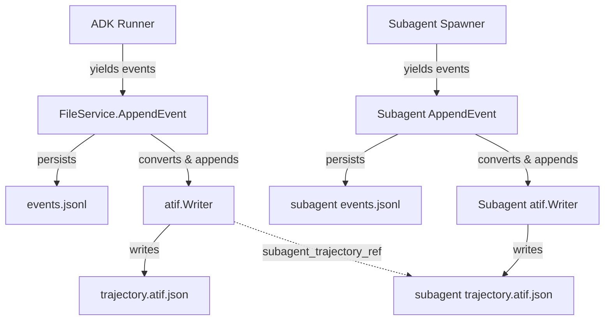
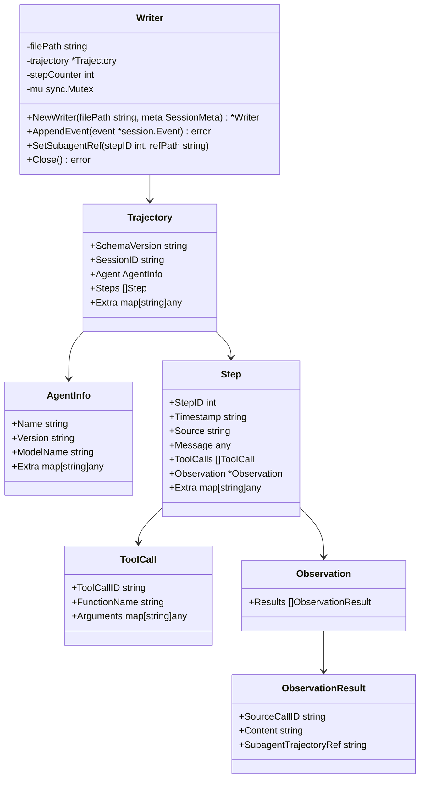
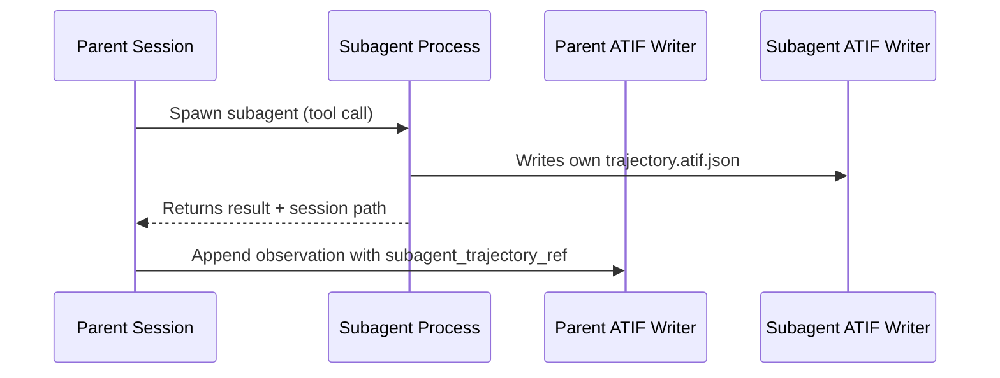

# Detailed Design: ATIF Export Support for pi-go

## Overview

This design describes how pi-go will automatically export session trajectories in the ATIF (Agent Trajectory Interchange Format) v1.6 specification. Every session will produce a `trajectory.atif.json` file alongside existing JSONL events, written incrementally as events are appended. Subagent sessions produce separate ATIF files linked via `subagent_trajectory_ref`.

The goal is general interoperability — any ATIF-compatible tool (Harbor, AgentLens, custom pipelines) can consume pi-go trajectories.

## Detailed Requirements

1. **Export only** — no import or replay of external ATIF files
2. **Automatic** — every session produces ATIF, always on, no configuration toggle
3. **Incremental writes** — ATIF file updated after each non-partial event, crash-safe
4. **Co-located output** — `~/.pi-go/sessions/<session-id>/trajectory.atif.json`
5. **ATIF v1.6** — full schema compliance including multimodal ContentPart arrays
6. **Core fields only** — `schema_version`, `session_id`, `agent`, `steps` (with `step_id`, `timestamp`, `source`, `message`, `tool_calls`, `observation`). No metrics, token IDs, or reasoning fields.
7. **Subagent support** — separate ATIF files per subagent, linked via `subagent_trajectory_ref`
8. **Main branch only** — only the active branch is exported; alternative branches ignored
9. **Standard compliance** — output must be consumable by any ATIF-compatible tooling

## Architecture Overview



### New Package: `internal/atif`

A new `internal/atif` package encapsulates all ATIF concerns:



## Components and Interfaces

### 1. ATIF Data Model (`internal/atif/types.go`)

Go structs mirroring the ATIF v1.6 schema with JSON tags:

```go
// Trajectory is the root ATIF document.
type Trajectory struct {
    SchemaVersion          string         `json:"schema_version"`
    SessionID              string         `json:"session_id"`
    Agent                  AgentInfo      `json:"agent"`
    Steps                  []Step         `json:"steps"`
    Notes                  string         `json:"notes,omitempty"`
    FinalMetrics           *Metrics       `json:"final_metrics,omitempty"`
    ContinuedTrajectoryRef string         `json:"continued_trajectory_ref,omitempty"`
    Extra                  map[string]any `json:"extra,omitempty"`
}

type AgentInfo struct {
    Name            string         `json:"name"`
    Version         string         `json:"version,omitempty"`
    ModelName       string         `json:"model_name,omitempty"`
    ToolDefinitions []any          `json:"tool_definitions,omitempty"`
    Extra           map[string]any `json:"extra,omitempty"`
}

type Step struct {
    StepID           int            `json:"step_id"`
    Timestamp        string         `json:"timestamp,omitempty"`
    Source           string         `json:"source"`
    Message          any            `json:"message"`
    ModelName        string         `json:"model_name,omitempty"`
    ReasoningEffort  any            `json:"reasoning_effort,omitempty"`
    ReasoningContent string         `json:"reasoning_content,omitempty"`
    ToolCalls        []ToolCall     `json:"tool_calls,omitempty"`
    Observation      *Observation   `json:"observation,omitempty"`
    IsCopiedContext  bool           `json:"is_copied_context,omitempty"`
    Metrics          *Metrics       `json:"metrics,omitempty"`
    Extra            map[string]any `json:"extra,omitempty"`
}

type ToolCall struct {
    ToolCallID   string         `json:"tool_call_id"`
    FunctionName string         `json:"function_name"`
    Arguments    map[string]any `json:"arguments"`
}

type Observation struct {
    Results []ObservationResult `json:"results"`
}

type ObservationResult struct {
    SourceCallID          string `json:"source_call_id"`
    Content               any    `json:"content"`
    SubagentTrajectoryRef string `json:"subagent_trajectory_ref,omitempty"`
}

type Metrics struct {
    PromptTokens     int            `json:"prompt_tokens,omitempty"`
    CompletionTokens int            `json:"completion_tokens,omitempty"`
    CachedTokens     int            `json:"cached_tokens,omitempty"`
    CostUSD          float64        `json:"cost_usd,omitempty"`
    Extra            map[string]any `json:"extra,omitempty"`
}

// ContentPart for v1.6 multimodal support.
type ContentPart struct {
    Type     string `json:"type"`               // "text" or "image_url"
    Text     string `json:"text,omitempty"`
    ImageURL string `json:"image_url,omitempty"`
}
```

### 2. Event-to-ATIF Converter (`internal/atif/convert.go`)

Converts `session.Event` objects to ATIF `Step` objects. The mapping logic:

| session.Event field | ATIF Step field | Mapping |
|---|---|---|
| `event.ID` | — | Not directly mapped (step_id is sequential) |
| `event.Timestamp` | `step.Timestamp` | `event.Timestamp.Format(time.RFC3339Nano)` |
| `event.Author` | `step.Source` | `"user"` → `"user"`, `"model"` → `"agent"`, `"system"` → `"system"` |
| `event.Content.Parts[].Text` | `step.Message` | Concatenate text parts; if single part, use string; if multiple, use ContentPart array |
| `event.Content.Parts[].FunctionCall` | `step.ToolCalls` | Map `Name` → `function_name`, `Args` → `arguments`, `ID` → `tool_call_id` |
| `event.Content.Parts[].FunctionResponse` | `step.Observation` | Map `Name` → `source_call_id` lookup, `Response` → `content` |

**Key conversion rules:**

1. **Single event → multiple steps**: An event with both text parts and function calls produces a single step with `message` + `tool_calls`. Function responses in a separate event become an observation step.

2. **Author mapping**: `"model"` maps to `"agent"` (ATIF terminology). `"user"` and `"system"` map directly.

3. **Tool call grouping**: Multiple `FunctionCall` parts in one event become multiple entries in `tool_calls[]`. Multiple `FunctionResponse` parts become multiple entries in `observation.results[]`.

4. **Message content**: 
   - Single text part → plain string `message`
   - Multiple text parts → array of `ContentPart` objects (v1.6 multimodal format)
   - No text parts (pure tool call) → empty string message

5. **Partial events**: Skipped (already filtered by `FileService.AppendEvent`).

### 3. ATIF Writer (`internal/atif/writer.go`)

Manages incremental writing of the ATIF trajectory file.

```go
type SessionMeta struct {
    SessionID string
    AgentName string
    Model     string
    WorkDir   string
}

type Writer struct {
    filePath    string
    trajectory  Trajectory
    stepCounter int
    mu          sync.Mutex
}

func NewWriter(filePath string, meta SessionMeta) (*Writer, error)
func (w *Writer) AppendEvent(event *session.Event) error
func (w *Writer) SetSubagentRef(toolCallID string, refPath string)
func (w *Writer) Close() error
```

**Incremental write strategy:**

On each `AppendEvent` call:
1. Convert the `session.Event` to one or more ATIF `Step` objects
2. Append steps to `trajectory.Steps`
3. Increment `stepCounter`
4. Rewrite the entire JSON file (atomic write via temp file + rename)

The full-file rewrite is acceptable because:
- Trajectory files are typically small (< 10MB for long sessions)
- It guarantees the file is always valid JSON
- Atomic rename prevents corruption on crash

**Alternative considered**: JSONL-style appending with a finalization step. Rejected because ATIF is defined as a single JSON document, and consumers expect valid JSON.

### 4. Integration Point (`internal/session/store.go`)

The `FileService.AppendEvent` method is the natural integration point. After persisting the event to JSONL, it calls the ATIF writer:

```go
// In FileService.AppendEvent, after JSONL persistence:
if fs.atifWriter != nil {
    if err := fs.atifWriter.AppendEvent(event); err != nil {
        // Log warning but don't fail the session
        slog.Warn("atif: failed to append event", "error", err)
    }
}
```

The ATIF writer is created when a session is created or loaded:

```go
// In FileService.CreateSession or loadSession:
atifPath := filepath.Join(sessionDir, "trajectory.atif.json")
fs.atifWriter, _ = atif.NewWriter(atifPath, atif.SessionMeta{
    SessionID: meta.ID,
    AgentName: meta.AppName,
    Model:     meta.Model,
    WorkDir:   meta.WorkDir,
})
```

### 5. Subagent ATIF Support

When a subagent is spawned, it runs as a separate pi-go process with its own session. Since ATIF export is always-on, the subagent automatically produces its own `trajectory.atif.json`.

The parent trajectory links to the subagent via `subagent_trajectory_ref` in the observation result:



The subagent tool result includes the subagent's session path. The ATIF converter detects subagent tool responses and populates `subagent_trajectory_ref` with the relative path to the subagent's ATIF file.

## Data Models

### File Layout

```
~/.pi-go/sessions/
  <session-id>/
    meta.json                    # existing
    events.jsonl                 # existing
    trajectory.atif.json         # NEW - ATIF v1.6 trajectory
    branches/                    # existing (ignored for ATIF)
```

### Example ATIF Output

```json
{
  "schema_version": "ATIF-v1.6",
  "session_id": "abc-123-def",
  "agent": {
    "name": "pi-go",
    "model_name": "claude-sonnet-4-20250514",
    "extra": {
      "work_dir": "/Users/dev/myproject"
    }
  },
  "steps": [
    {
      "step_id": 1,
      "timestamp": "2026-04-05T10:30:00.000Z",
      "source": "user",
      "message": "Fix the failing test in auth_test.go"
    },
    {
      "step_id": 2,
      "timestamp": "2026-04-05T10:30:02.500Z",
      "source": "agent",
      "message": "Let me read the test file first.",
      "tool_calls": [
        {
          "tool_call_id": "call_001",
          "function_name": "read",
          "arguments": {
            "path": "auth_test.go"
          }
        }
      ]
    },
    {
      "step_id": 3,
      "timestamp": "2026-04-05T10:30:03.100Z",
      "source": "system",
      "message": "",
      "observation": {
        "results": [
          {
            "source_call_id": "call_001",
            "content": "package auth\n\nimport \"testing\"\n\nfunc TestLogin(t *testing.T) {\n..."
          }
        ]
      }
    }
  ]
}
```

## Error Handling

| Scenario | Behavior |
|---|---|
| ATIF file write fails (disk full, permissions) | Log warning via `slog.Warn`, continue session normally. ATIF is non-critical. |
| Event conversion fails (unexpected content type) | Log warning, skip the step, continue. Use `extra` field to record skipped step info. |
| Atomic rename fails | Fall back to direct write. Log warning. |
| Session resumes from existing events | Rebuild ATIF from all existing events on session load, then continue incrementally. |
| Subagent path not available | Omit `subagent_trajectory_ref`, record tool result as plain observation content. |

**Principle**: ATIF export must never break or slow down the core session. All errors are logged but non-fatal.

## Testing Strategy

### Unit Tests (`internal/atif/`)

1. **Type serialization**: Verify all ATIF structs serialize to spec-compliant JSON
2. **Event conversion**: Test mapping of `session.Event` → ATIF `Step` for each event type:
   - User text message → user step
   - Model text response → agent step
   - Model with tool calls → agent step with tool_calls
   - Tool responses → system step with observation
   - Mixed content (text + tool calls) → single step
   - Empty/edge cases (no parts, nil content)
3. **Author mapping**: `"model"` → `"agent"`, `"user"` → `"user"`, `"system"` → `"system"`
4. **Writer incremental writes**: Verify file is valid JSON after each append
5. **Writer crash safety**: Verify atomic write behavior
6. **Subagent ref**: Verify `subagent_trajectory_ref` is populated correctly

### Integration Tests (`internal/session/`)

1. **End-to-end session**: Create session, append events, verify `trajectory.atif.json` is written alongside `events.jsonl`
2. **Session resume**: Load existing session, append more events, verify ATIF file contains all events
3. **Branching**: Verify only main branch events appear in ATIF output

### Validation

1. **Schema compliance**: Validate output against ATIF v1.6 JSON schema (if available from Harbor)
2. **Round-trip test**: Export ATIF, validate it can be parsed by the Rust `atif-rust` crate's test expectations

## Appendices

### A. Technology Choices

| Choice | Decision | Rationale |
|---|---|---|
| Serialization | `encoding/json` (stdlib) | No external dependency needed; ATIF is simple JSON |
| Atomic writes | temp file + `os.Rename` | Standard Go pattern for crash-safe file writes |
| Concurrency | `sync.Mutex` on Writer | Simple, sufficient for single-session-per-process model |
| Package location | `internal/atif/` | Clean separation, no circular dependencies |

### B. Research Findings Summary

- ATIF is actively maintained (v1.6, Harbor framework, ~1,310 GitHub stars)
- Existing implementations: Python (reference, Pydantic), Rust (leto-labs/atif-rust)
- No existing Go implementation — pi-go would be the first
- The spec is extensible via `extra` fields at every level
- Multi-agent support via `subagent_trajectory_ref` is first-class

### C. Alternative Approaches Considered

1. **ATIF as native format** (replacing JSONL): Rejected — too invasive, JSONL is tightly integrated with ADK session model
2. **On-demand export only**: Rejected — user preference for automatic, crash-safe incremental recording
3. **JSONL-style ATIF**: Rejected — ATIF spec requires single JSON document
4. **Streaming JSON (JSON array append)**: Considered but rejected — complex partial JSON management for minimal benefit over full rewrite
5. **Config toggle**: Rejected — user wants always-on simplicity

### D. Key Constraints

- ATIF export must be non-blocking and non-fatal to the session
- File size is bounded by session length (typically < 10MB)
- No external dependencies added (stdlib JSON only)
- Must work with all LLM providers (Anthropic, OpenAI, Gemini, Ollama)
