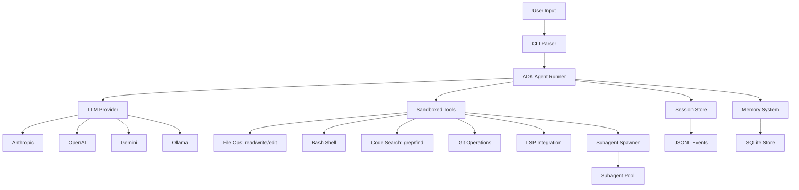

# Pi-Go Architecture Research

## What is pi-go?

A **terminal-based coding agent** built on Google ADK Go that helps developers with software engineering tasks through an interactive TUI. Combines multi-provider LLM support, sandboxed tool execution, session persistence, and subagent orchestration.

## Core Architecture

## Key Packages (~63,475 lines of Go)

| Package | Purpose |
|---|---|
| `internal/agent/` | ADK agent setup, retry logic, system instructions |
| `internal/cli/` | CLI parsing, output modes (interactive, print, json, rpc) |
| `internal/config/` | Global + project-local config |
| `internal/provider/` | LLM providers (Anthropic, OpenAI, Gemini, Ollama) |
| `internal/tools/` | Sandboxed tools (read, write, edit, bash, grep, find, ls, tree, git, lsp, agent, memory) |
| `internal/session/` | JSONL persistence (FileService, branching, compaction) |
| `internal/memory/` | Persistent memory (SQLite, compression, search) |
| `internal/subagent/` | Process-based subagent orchestrator |
| `internal/tui/` | Bubble Tea v2 interactive UI |
| `internal/extension/` | Hooks, skills, MCP integration |
| `internal/lsp/` | LSP client/manager |
| `internal/guardrail/` | Token usage tracking and limits |

## Existing Data Models

### Session Events (JSONL)
- `session.Event`: ID, Timestamp, Author (user/model), Content (genai.Content with tool calls), Actions (state deltas, tool results), Partial flag
- Stored in `~/.pi-go/sessions/<session-id>/events.jsonl`

### Memory Observations (SQLite)
- `Observation`: ID, SessionID, Project, Title, Type (decision|bugfix|feature|refactor|discovery|change), Text (compressed summary), SourceFiles, ToolName, PromptNumber, DiscoveryTokens
- `SessionSummary`: ID, SessionID, Project, Request, Investigated, Learned, Completed, NextSteps

### Subagent Events
- `Event`: Type (text_delta|tool_call|tool_result|message_end|error), Content, Error
- `AgentOutput`: AgentID, Type, Result, Error, Duration

## Strengths for ATIF Support

1. **JSONL event persistence** — natural foundation for ATIF export
2. **Tool call tracking** — every tool execution captured in session events
3. **Structured observation compression** — memory system distills tool usage
4. **Timestamp tracking** — all events have precise timestamps
5. **Tool input/output capture** — raw observations store tool metadata
6. **Subagent tracking** — spawn/completion with event streaming instrumented
7. **Model/provider agnostic** — works with any LLM provider
8. **Search/query API** — memory supports timeline retrieval and full-text search

## Gaps for ATIF

1. **No standard trajectory format** — JSONL is proprietary
2. **No thinking/reasoning capture** — raw model reasoning not explicitly logged
3. **Limited action metadata** — tool calls not standardized to ATIF action taxonomy
4. **No cost tracking per action** — token/cost per tool execution not granularly tracked
5. **No external import** — cannot import ATIF from other agents
6. **No trajectory validation** — no schema validation against ATIF spec
7. **Memory compression loses raw data** — observations are summarized
