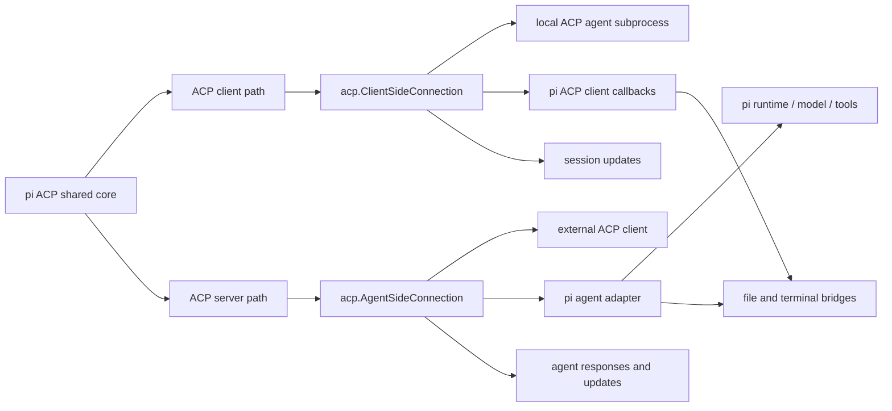

# ACP Subagent Design

## Overview

This document describes the design for adding ACP support to pi-go in both directions: pi as an ACP client for local
ACP-capable coding agents, and pi as an ACP server/agent that can itself be driven by ACP clients. The design is based
on the current subagent system, existing protocol adapter patterns in the repository, and public ACP documentation plus
`coder/acp-go-sdk` examples.

## Current State

### Existing subagent model

pi-go already has a regular subagent system implemented through:

- `internal/subagent` for lifecycle, registry, spawn, cancellation, status, worktrees, and provider forwarding
- `internal/tools/subagent.go` for the user-facing ADK tool named `subagent`
- `internal/atif` for trajectory linkage via `session_id`
- TUI command support for status display

The current subagent path is local-only and subprocess-based. The orchestrator validates a named subagent from a
registry, resolves its model from configuration, launches the current `pi` binary with `--mode json`, and consumes
streamed JSONL events.

The public tool interface already supports three orchestration modes:

- single
- parallel
- chain

The result model is stable and structured:

```go
type SubagentOutput struct {
    Mode    string        `json:"mode"`
    Results []AgentResult `json:"results"`
    Summary string        `json:"summary"`
}
```

Each agent result carries an optional `SessionID`, which is used by ATIF linkage.

### Existing adapter patterns in repo

The codebase already integrates external protocol surfaces in two ways:

- `internal/tools/a2a.go` wraps an external client behind a pi-native tool facade
- `internal/extension/mcp.go` wraps protocol transports and lazily exposes tools, with timeout/error isolation

Patterns already present in the repo:

- protocol-native clients hidden behind a local Go adapter
- lazy connection/client initialization
- structured output returned to callers
- isolation of one endpoint failure from the rest of the system
- conversion from streamed external events into pi-native text/results/status
- dynamic descriptions listing available configured agents/resources

### ACP facts from research

Public ACP materials and `coder/acp-go-sdk` show that:

- ACP is JSON-RPC 2.0
- stdio is a normal local transport
- a Go ACP client should implement `acp.Client`
- terminal support is optional through `acp.ClientTerminal`
- the typical client flow is `Initialize` -> `NewSession` -> `Prompt`
- session updates stream progress, messages, tool calls, and related state
- agent-initiated client requests may include file I/O, permission, terminal lifecycle, and update callbacks

## Desired End State

pi-go gains ACP support in both directions in Go.

The implementation should allow:

- pi to act as an ACP client to a locally launched ACP-capable coding agent subprocess
- pi to act as an ACP server/agent so external ACP clients can drive pi

The ACP implementation should be built around reusable shared components so the client and server paths do not duplicate
core translation, session, terminal, and filesystem logic unnecessarily.

User intent for v1 is that ACP-capable tools such as Claude Code or Codex can be reached through pi’s ACP client path,
while pi itself can also be exposed through an ACP server path.

## Design Goals

1. Add ACP support in both directions: client and server.
2. Build a shared ACP core so both directions reuse common logic where practical.
3. Keep the integration local-first and stdio-based in v1.
4. Provide pi-native wrappers around ACP sessions, updates, and callback handling.
5. Allow pi to drive ACP-capable agents such as Claude Code or Codex.
6. Allow external ACP clients to drive pi itself.
7. Follow repository patterns for resilience, lazy setup, and structured failures.

## Non-Goals for this design

- remote ACP transport as a required v1 feature
- auth flows for remote ACP endpoints
- redesign of the current `subagent` tool modes
- replacement of existing non-ACP subagent execution
- full unification of ACP with every existing pi execution path in the first iteration

## Architecture Overview



## Proposed Component Model

### 1. Shared ACP core package

The first version should be built around a shared ACP core package that supports both client-side and server-side ACP
roles.

Possible package layout:

- `internal/acp`
- `internal/acp/client`
- `internal/acp/server`

Shared concerns that should not be duplicated:

- common event/result model or conversion helpers
- filesystem bridge logic
- terminal bridge logic
- permission handling policy
- subprocess launch helpers for stdio transport
- session/update translation helpers

### 2. ACP client path

A dedicated client-side runtime should own the ACP client protocol implementation for running local ACP-capable
subprocess agents.

Responsibilities:

- launch the local ACP-capable subprocess
- create ACP client-side connection over stdio
- implement required ACP client callbacks
- initialize protocol and create/load a session
- send the prompt turn
- stream updates in a pi-native form
- accumulate final text result
- support cancellation and terminal cleanup

### 3. ACP server path

A dedicated server-side runtime should expose pi itself as an ACP agent.

Responsibilities:

- implement the `acp.Agent` interface
- create ACP agent-side connection over stdio
- respond to initialize/session/prompt flows from ACP clients
- translate ACP prompt turns into pi runtime/model/tool execution
- stream agent messages and tool/progress updates back to the ACP client
- support cancellation, session lifecycle, and session loading
- support the full ACP surface in v1 as far as practical, including modes and extension handling where supported by the
  SDK and pi runtime

### 4. ACP client callback implementation

The ACP client implementation must service agent-to-client requests required by targeted ACP agents.

Based on research, the callback surface may include:

- session updates
- read text file
- write text file
- permission request
- terminal create/output/wait/kill/release
- possibly extension handling if a target agent requires it

The callback implementation should use pi-local facilities and repository conventions.

### 5. Pi agent adapter for ACP server mode

The ACP server mode requires an adapter from ACP requests into pi’s own runtime.

This adapter should:

- accept ACP prompt/session requests
- invoke pi conversation/tool execution through existing pi entrypoints or reusable internal APIs
- translate pi output into ACP content/update structures
- preserve streaming behavior where current pi internals already emit incremental output

### 6. Pi-native ACP event/result model

Because both ACP client and ACP server are in scope, the shared ACP core should define a local model for internal
bookkeeping and streaming.

Recommended shape:

```go
type Event struct {
    Type      string `json:"type"`
    Content   string `json:"content,omitempty"`
    Error     string `json:"error,omitempty"`
    SessionID string `json:"session_id,omitempty"`
}

type RunResult struct {
    Status    string `json:"status"`
    Result    string `json:"result,omitempty"`
    Error     string `json:"error,omitempty"`
    SessionID string `json:"session_id,omitempty"`
}
```

This local model may be used directly by the client path and as an intermediate translation layer for the server path.

### 7. Terminal bridge

ACP allows agents to request terminal creation and interaction from the client side. The shared ACP core should provide
a terminal manager reused by ACP client mode and any server-mode logic that needs terminal abstractions.

The v1 ACP path should provide a terminal manager that:

- creates local subprocess terminals
- captures output
- supports wait/kill/release
- ties process lifetime to session and adapter lifecycle
- enforces cleanup on cancellation and shutdown

### 8. File system bridge

ACP client callbacks may request file reads/writes, and ACP server mode may need access to filesystem-related logic as
it translates pi tool/runtime behavior.

The shared bridge should:

- support local absolute-path reads and writes
- align behavior with ACP examples and repo safety expectations
- preserve line/limit behavior if ACP request types support partial reads
- respect the current working directory or explicit path policy used by the ACP entrypoint

### 9. Future compatibility with subagent integration

Although v1 includes both ACP client and server, the implementation should still be shaped so a later subagent adapter
can reuse the ACP client runtime rather than reimplementing it.

## Interfaces and Type Boundaries

The ACP integration should have a shared reusable runtime boundary plus role-specific client/server adapters.

Recommended shared boundary:

```go
type RunRequest struct {
    Command string
    Args    []string
    Env     []string
    Prompt  string
}

type Event struct {
    Type      string `json:"type"`
    Content   string `json:"content,omitempty"`
    Error     string `json:"error,omitempty"`
    SessionID string `json:"session_id,omitempty"`
}

type RunResult struct {
    Status    string `json:"status"`
    Result    string `json:"result,omitempty"`
    Error     string `json:"error,omitempty"`
    SessionID string `json:"session_id,omitempty"`
}

type RunningSession interface {
    Events() <-chan Event
    Wait() (RunResult, error)
    Cancel()
}
```

Client-side runtime boundary:

```go
type ClientRunner interface {
    Start(ctx context.Context, req RunRequest) (RunningSession, error)
}
```

Server-side runtime boundary:

```go
type PiAgent interface {
    RunPrompt(ctx context.Context, prompt string, onEvent func(Event)) (RunResult, error)
}
```

The ACP server implementation then adapts ACP agent requests onto `PiAgent`, while the ACP client implementation adapts
local ACP subprocesses onto `RunningSession`.

## Configuration Model

The first version needs runtime launch configuration for ACP client mode and a dedicated entrypoint for ACP server mode.

### Client mode

Minimum request/config data likely needed:

```go
type RunRequest struct {
    Command string
    Args    []string
    Env     []string
    Prompt  string
}
```

Validation rules:

- command is required
- prompt is required
- args/env are optional
- local stdio subprocess launch is the only required v1 client transport

### Server mode

Server mode should be exposed through a dedicated pi entrypoint that runs pi as an ACP agent over stdio.

The first version should target full ACP server coverage in v1 as far as the SDK and pi runtime can support it, rather
than a minimal prompt-only subset.

## Error Handling Strategy

The design should follow existing repository behavior.

### Validation errors

Examples:

- unknown agent name
- ACP adapter selected but no command configured
- malformed ACP config

These should be returned as structured failures at the subagent tool layer when invoked by the model.

### Startup errors

Examples:

- subprocess launch failure
- ACP initialize failure
- session creation failure

These should mark the subagent result as failed and include a readable error message.

### Runtime errors

Examples:

- file callback failure
- terminal callback failure
- protocol disconnect
- prompt-turn failure

These should emit `error` events and produce a failed final result when appropriate.

### Isolation expectations

As with current A2A/MCP patterns:

- one failed ACP-backed subagent should not poison unrelated agents or toolsets
- parallel mode should continue collecting sibling results according to current subagent behavior
- chain mode should stop at the first failed step, matching current behavior

## Data Flow

### ACP client flow

1. A dedicated pi ACP client entrypoint receives a local command, arguments, and prompt.
2. The ACP client runner launches the local ACP-capable subprocess.
3. The runner creates `acp.ClientSideConnection` over subprocess stdio.
4. The runner calls `Initialize`, creates a session, and sends `Prompt`.
5. ACP updates are translated into local ACP `Event` values.
6. The caller consumes streamed events and waits for `RunResult`.
7. If an ACP session ID is available, it is included in events and final result.

### ACP server flow

1. A dedicated pi ACP server entrypoint starts pi in ACP agent mode over stdio.
2. The server creates `acp.AgentSideConnection` bound to a pi ACP agent implementation.
3. An external ACP client sends initialize, session, prompt, cancel, load, mode, and extension-related requests
   supported by ACP.
4. The pi ACP agent adapter invokes pi runtime/model/tool execution.
5. pi output is translated into ACP agent updates, tool/progress updates, and final responses.
6. Session lifecycle, cancellation, loading, mode changes, and supported extensions are translated back into pi
   execution control.

### Shared-core reuse flow

Both client and server paths reuse shared filesystem, terminal, permission, subprocess, and translation helpers where
practical.

## Patterns to Follow from Existing Codebase

1. Keep ACP protocol translation behind dedicated Go facades.
2. Favor local structured result objects over leaking ACP-native response types upward.
3. Use lazy setup and fail only the affected ACP session or connection.
4. Isolate terminal and file callback logic in dedicated helpers/components.
5. Use context cancellation and explicit cleanup for subprocesses and terminals.
6. Reuse existing pi runtime/tool execution paths where possible when exposing pi as an ACP agent.
7. Shape the ACP runtime so later subagent integration can wrap the ACP client path without major refactoring.

## Testing Strategy

### Unit tests

1. Run-request validation for ACP client launches.
2. ACP client runner startup failure paths.
3. ACP server startup and request-handling failure paths.
4. Event translation from ACP session updates to local ACP `Event` values.
5. Translation from pi runtime output into ACP server-side updates.
6. File callback behavior for read/write requests.
7. Terminal manager behavior for create/output/wait/kill/release.
8. Cancellation behavior and final status mapping.

### Integration tests

1. Local ACP example agent subprocess can be launched and prompted through the ACP client runner.
2. ACP session ID propagation reaches `RunResult.SessionID` if provided by the ACP flow.
3. A streamed ACP client response is surfaced incrementally and accumulated into the final result.
4. File and terminal client callbacks work against a deterministic local ACP test target.
5. pi can start in ACP server mode and respond to initialize/session/prompt requests over stdio.
6. pi ACP server mode can stream updates to an ACP client during a prompt turn.
7. pi ACP server mode supports session load/cancel and mode-related flows covered by the selected SDK/protocol surface.
8. pi ACP server mode supports extension-method handling where implemented.

### External-reference integration tests

If practical and stable in CI/manual test environments:

- use `coder/acp-go-sdk` example agent as a deterministic ACP client-mode test target
- use `coder/acp-go-sdk` example client or a small local ACP test client for server-mode tests
- optionally add opt-in/manual tests for Claude Code or Codex adapters if they are environment-dependent

The implementation plan should keep external-tool-dependent tests optional unless the repository already supports those
tools reliably in CI.

## Acceptance Criteria

### ACP client local run

- Given a local ACP-capable agent command and a prompt, when the pi ACP client entrypoint runs it, then pi launches the
  local ACP subprocess, initializes an ACP session, sends the prompt, and returns a structured result.

### ACP client streaming translation

- Given an ACP-backed agent that streams message updates, when pi consumes the ACP session, then the ACP client path
  emits compatible local events and accumulates a final textual result.

### ACP client cancellation

- Given an ACP client session is running, when the execution context is canceled, then the ACP-backed process is stopped
  and the final status is reported as canceled or failed according to the observed termination path.

### ACP client local capabilities

- Given an ACP-backed agent requests supported client-side capabilities such as file access or terminal operations, when
  pi services those requests locally, then the ACP turn can continue successfully through the ACP client path.

### ACP server mode

- Given pi is started in ACP server mode, when an ACP client connects over stdio and sends initialize, session, prompt,
  load, cancel, mode, and supported extension requests, then pi responds as an ACP agent with streamed updates and final
  responses across the supported ACP surface.

### User goal alignment

- Given a local ACP-capable coding agent such as a Claude Code or Codex ACP path, when it is invoked through pi’s ACP
  client integration, then pi can act as the ACP client for that local agent path.

### Bidirectional ACP support

- Given pi ACP support is implemented, when users need either to drive external ACP agents or to drive pi through ACP,
  then both client and server paths are available in the first version.

## Open Design Decisions To Confirm During Implementation

These are implementation-level details, not unresolved product requirements:

1. Exact package and CLI entrypoint names for ACP client mode and ACP server mode.
2. Which ACP client capabilities are mandatory in the first testable slice versus optional follow-ups.
3. Exact ACP server features to implement first when sequencing full-surface delivery across slices.
4. How session IDs are best captured and surfaced in both directions.
5. Whether permission requests should default to allow, deny, or policy-based allowlist behavior in v1.
6. Which existing pi internal API is the cleanest bridge for ACP server prompt execution.

## Gates

The project commands discovered during research are:

- build: `make build`
- test: `make test`
- vet: `make vet`
- lint: `make lint`
