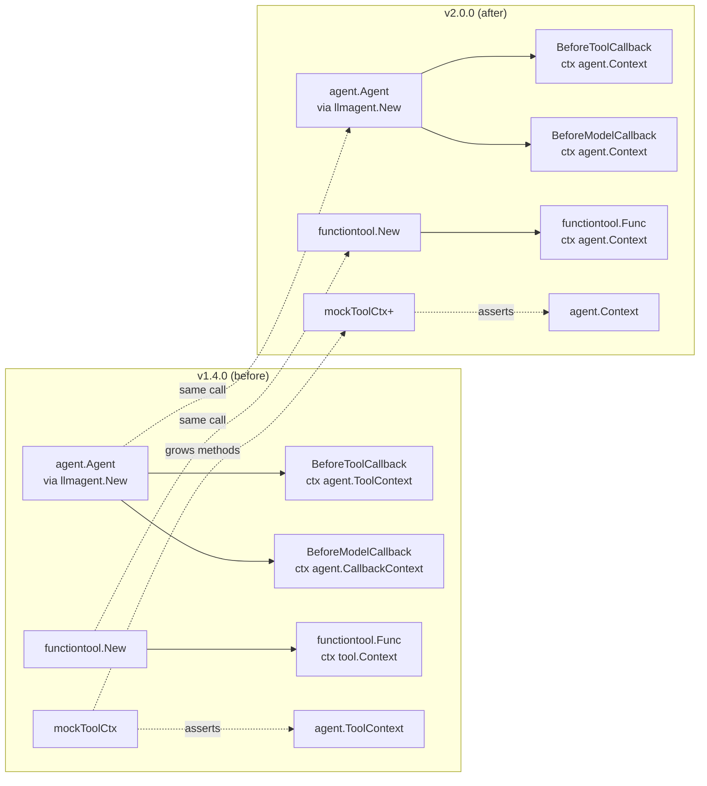

# Design — `google.golang.org/adk` v1.4.0 → v2.0.0 Migration

> **Spec status:** design for review. Companion documents:
> `rough-idea.md`, `requirements.md`, `research/{v1-usage-surface,v2-api-delta,call-sites,adk-docs-addendum}.md`.

## 1. Goal and non-goals

### Goal

Pure, mechanical migration of pi-go from `google.golang.org/adk v1.4.0`
to `google.golang.org/adk/v2 v2.0.0`. Build must be clean, all tests
must pass, the documented `TestCommitCommand_ConfirmCommits` baseline
failure must be fixed or reliably isolated, and the resulting source must
be forward-compatible with future ADK 2.0.x patch releases.

### Non-goals

- **No new v2 features adopted** — we do not switch to the graph workflow engine, do
  not enable collaboration-agent modes (`chat`/`task`/`single_turn`), do not use
  the new `platform`/`plugin` packages, do not adopt `StrictContextMock`.
- **No public API changes in pi-go** — the migration is internal-only.
- **No transitive-dep minimization** — `go mod tidy` will do its thing; we accept
  whatever it produces (A6-α).
- **No reverification of v1 features** — every behavior we had in v1 must continue
  to work in v2 unchanged.
- **No unrelated test fixes bundled in** — the migration should not use the
  ADK bump as a vehicle for unrelated cleanup. The one exception is the
  documented `TestCommitCommand_ConfirmCommits` environmental failure,
  which A8(a)=iii requires this migration PR to fix or reliably isolate so
  the post-migration `go test ./...` gate is honestly green.

## 2. Current state (from research)

- pi-go pins `google.golang.org/adk v1.4.0` in `go.mod` (`go 1.26.4`).
- **50 production files + 35 test files** import `google.golang.org/adk/...`.
- **60+ function literals** declare `ctx agent.ToolContext` or
  `ctx agent.CallbackContext` (or `adkagent.ToolContext` aliased).
- **3 hand-rolled mocks** assert `var _ agent.ToolContext = (*Y)(nil)`:
  - `internal/extension/hooks_test.go:262` (struct `mockToolCtx`)
  - `internal/tools/tool_invoke_test.go:43` (struct `mockToolCtx`)
  - `internal/palace/tool_invoke_test.go:40` (struct `mockToolCtx`)
- **1 hand-rolled mock** asserts `var _ agent.CallbackContext = (*Y)(nil)`:
  - `internal/extension/hooks_test.go:565` (struct `mockReadonlyContext`)
- **0 call sites** of `session.NewEvent(...)` (no v2 ctx parameter needed).
- **0 call sites** of `tool.Context` as a type name (v1.4 alias already gone).
- **0 custom `agent.Agent` impls** in pi-go (workflow-graph no-op).
- **3 `recover()` callsites** all at outer boundaries (tool-body rule satisfied).
- **0 manual `session.events.append` calls** in production code.
- **Known baseline failure (in scope per A8a=iii):**
  `internal/tui.TestCommitCommand_ConfirmCommits` fails on the v1.4.0 parent
  commit due to environmental issues in the dev container (the failure is
  unrelated to ADK and is not introduced by this migration). The migration
  PR must make this test reliable before the final gate, most likely by
  removing the ambient 1Password signing dependency from the test fixture
  or by adding a targeted environment-aware skip.

## 3. Desired end state

- `go.mod` pins `google.golang.org/adk/v2 v2.0.0` exactly (no `replace`, no
  floating).
- `go.sum` regenerated by `go mod tidy`; new indirect deps (`gorm.io/gorm`,
  `glebarez/sqlite`, `mitchellh/mapstructure`) absorbed cleanly.
- Every import of `google.golang.org/adk/...` becomes `google.golang.org/adk/v2/...`.
- Every callback/functiontool first-arg type is `agent.Context` (not
  `agent.ToolContext` / `agent.CallbackContext`).
- The 3 hand-rolled `mockToolCtx` mocks + 1 `mockReadonlyContext` mock grow the
  new v2 method set, and their compile-time assertion is upgraded to
  `var _ agent.Context = ...`.
- All A4 gates pass: `go build ./...`, `go vet ./...`, `go test ./...`,
  `go test -race ./...`, `golangci-lint run ./...`, coverage
  non-regression, `go mod tidy` no-op; A7 `pi audit` is run and triaged.
- Each committed migration slice stays green (commit-on-green, work on
  `feature/adk-20-migration` per A2).

## 4. Architecture overview

No architectural change. The migration is a **path + type widening** exercise.
The runtime shape — `runner.New` → `llmagent.New` → `functiontool.New` → agent
loop — is byte-for-byte identical to v1.4.0.



The diagram is intentionally sparse — the migration is 99% mechanical. The
"intelligence" lives in (a) keeping the per-slice gate green, and (b) choosing
mock forward-compat strategy (A5 = full v2 method set).

## 5. Components and interfaces (delta only)

### 5.1 `go.mod` / `go.sum`

```diff
-    google.golang.org/adk v1.4.0
+    google.golang.org/adk/v2 v2.0.0
```

Indirect block will grow to include the v2 ADK's new transitive deps
(`gorm.io/gorm`, `glebarez/sqlite`, `mitchellh/mapstructure`) and may shed the
old `google.golang.org/adk` indirect (replaced by the v2 path). `go mod tidy`
is the single source of truth for this — do not hand-edit beyond the `require`
swap.

### 5.2 Imports

Every `google.golang.org/adk/...` prefix becomes `google.golang.org/adk/v2/...`.
Same files, same sub-packages, same aliases. No new imports are introduced.

### 5.3 Callback literals (type widening)

v1.4 → v2, every callback type's first arg is widened to `agent.Context`:

| v1.4.0 declaration                                                            | v2.0.0 declaration                                                              | Files affected                                                                                                                  |
|-------------------------------------------------------------------------------|---------------------------------------------------------------------------------|---------------------------------------------------------------------------------------------------------------------------------|
| `BeforeModelCallback` (`ctx agent.CallbackContext, …`)                          | `BeforeModelCallback` (`ctx agent.Context, …`)                                   | `internal/extension/hooks.go`                                                                                                   |
| `AfterModelCallback` (`ctx agent.CallbackContext, …`)                           | `AfterModelCallback` (`ctx agent.Context, …`)                                    | `internal/extension/hooks.go`                                                                                                   |
| `BeforeToolCallback` (`ctx tool.Context, …`)                                    | `BeforeToolCallback` (`ctx agent.Context, …`)                                    | `internal/extension/hooks.go`, `internal/lsp/hooks.go`, `internal/tools/compactor.go`, `internal/memory/worker.go`, `internal/cli/{cli,interactive}.go` |
| `AfterToolCallback` (`ctx tool.Context, …`)                                     | `AfterToolCallback` (`ctx agent.Context, …`)                                     | same as above                                                                                                                   |
| `functiontool.Func[TArgs, TResults]` (`ctx tool.Context, …`)                    | `functiontool.Func[TArgs, TResults]` (`ctx agent.Context, …`)                    | every `internal/tools/*.go` handler, every `internal/palace/tool_*.go` handler, `internal/tools/registry.go`                   |
| `functiontool.New(…)` handlers declared as `func(ctx agent.ToolContext, …)`    | declared as `func(ctx agent.Context, …)`                                         | same set as above                                                                                                               |

**Method bodies are not touched.** The v2 `agent.Context` is a superset of
v1.4's `agent.ToolContext` / `agent.CallbackContext`; every method call we
already make (`ctx.Artifacts()`, `ctx.FuncCallID()`, `ctx.Actions()`, etc.) is
still valid on the new type.

### 5.4 Hand-rolled mocks — new method set

Per A5 (best practice) and A8(b) (full forward-compat), the four mocks below
grow to satisfy `var _ agent.Context = (*Y)(nil)`. The new methods (vs. the
v1.4 `agent.ToolContext` surface) are listed verbatim from
`research/v2-api-delta.md §5.1`:

```go
// already in v1.4 — present on the mocks today
context.Context  // via embedded ctx field
UserContent() *genai.Content
InvocationID() string
AgentName() string
ReadonlyState() session.ReadonlyState
UserID() string
AppName() string
SessionID() string
Branch() string
Artifacts() agent.Artifacts
State() session.State
FunctionCallID() string
Actions() *session.EventActions
SearchMemory(ctx context.Context, query string) (*memory.SearchResponse, error)
ToolConfirmation() *toolconfirmation.ToolConfirmation
RequestConfirmation(hint string, payload any) error

// NEW for v2 forward-compat — must be added to each mock
IsolationScope() string
ResumedInput(interruptID string) (any, bool)
WithICDelta(d *agent.InvocationContextDelta) agent.InvocationContext
Path() string
RunID() string
SubScheduler() agent.DynamicSubScheduler
WithAgentContext(ctx context.Context) agent.Context
WithAgentTimeout(d time.Duration) (agent.Context, context.CancelFunc)
WithAgentCancel() (agent.Context, context.CancelFunc)
OutputForAncestors() []string
WithDelta(d *agent.CommonContextDelta) agent.Context
```

Plus, for the `InvocationContext` mocks (A8b=full), the new
`agent.InvocationContext` methods:

```go
IsolationScope() string
ResumedInput(interruptID string) (any, bool)
WithICDelta(d *agent.InvocationContextDelta) agent.InvocationContext
```

The 3 `mockToolCtx` files listed in §2 each grow the full v2 set.
The `mockReadonlyContext` (in `internal/extension/hooks_test.go`) also grows
the full v2 set. Other `InvocationContext` mocks in the repo (per A8b) grow
the 3 new `InvocationContext` methods.

**Implementation convention for new methods on the mock structs:**

```go
// All new v2 methods default to safe no-op behavior; tests that need
// a non-default value can set the corresponding field on the struct.
func (m *mockToolCtx) IsolationScope() string { return m.IsolationScopeVal }
func (m *mockToolCtx) ResumedInput(string) (any, bool) { return nil, false }
func (m *mockToolCtx) WithICDelta(d *agent.InvocationContextDelta) agent.InvocationContext { return m }
func (m *mockToolCtx) Path() string { return "" }
func (m *mockToolCtx) RunID() string { return "" }
func (m *mockToolCtx) SubScheduler() agent.DynamicSubScheduler { return nil }
func (m *mockToolCtx) WithAgentContext(ctx context.Context) agent.Context { m.Ctx = ctx; return m }
func (m *mockToolCtx) WithAgentTimeout(d time.Duration) (agent.Context, context.CancelFunc) {
    return m, func() {}
}
func (m *mockToolCtx) WithAgentCancel() (agent.Context, context.CancelFunc) {
    return m, func() {}
}
func (m *mockToolCtx) OutputForAncestors() []string { return nil }
func (m *mockToolCtx) WithDelta(d *agent.CommonContextDelta) agent.Context { return m }
```

If a test in the same file requires a specific return value, the struct
gains a field (e.g. `IsolationScopeVal string`) and the method reads it.

### 5.5 The `var _ agent.X = (*Y)(nil)` compile-time assertions

The 4 affected assertion lines:

| File                                          | Line (current) | Current                                | New                                         |
|-----------------------------------------------|---------------:|----------------------------------------|---------------------------------------------|
| `internal/extension/hooks_test.go`            | 262            | `var _ agent.ToolContext = (*mockToolCtx)(nil)` | `var _ agent.Context = (*mockToolCtx)(nil)` |
| `internal/extension/hooks_test.go`            | 565            | `var _ agent.CallbackContext = (*mockReadonlyContext)(nil)` | `var _ agent.Context = (*mockReadonlyContext)(nil)` |
| `internal/tools/tool_invoke_test.go`          |  43            | `var _ agent.ToolContext = mockToolCtx{}`       | `var _ agent.Context = mockToolCtx{}`       |
| `internal/palace/tool_invoke_test.go`         |  40            | `var _ agent.ToolContext = mockToolCtx{}`       | `var _ agent.Context = mockToolCtx{}`       |

Other `var _ agent.InvocationContext = ...` lines (in test files) keep their
assertion target but grow the 3 new methods.

## 6. Patterns to follow

- **One buildable sweep at a time.** Each slice is narrow and gate-checkable,
  but the v2 module bump, full import sweep, and production
  callback/functiontool type widening are one compile-safe slice because
  `go mod tidy` sees test imports too, and v2 callback/functiontool types are
  not assignable from funcs that still take `agent.ToolContext` or
  `agent.CallbackContext`.
- **Verify after each slice.** Every committed slice has an executable gate
  that can pass on that slice. Do not commit an intentionally broken
  dependency-only state.
- **Reuse the existing 4-assertion pattern.** Every other type assertion in
  the codebase stays put; we only retarget the 4 lines that need it.
- **No new test fakes.** We modify the existing 4 mocks in place; we do not
  introduce `StrictContextMock` (per A1) and we do not introduce new mock
  types.

## 7. Edge cases and decisions

### 7.1 Empty `go.sum` transient failure

After the `go.mod` swap and before `go mod tidy`, `go build` will fail with
"missing go.sum entry". **Decision:** run `go mod tidy` immediately after
the `go.mod` edit, in the same slice, on the same commit. No transient
red-trunk.

### 7.2 Coverage floor (A4-G)

A4 says coverage must not regress below the current level. The current
number is to be measured on the parent commit before the migration begins
and recorded in `summary.md` as the floor. The migration is responsible
for "no regression", not "no new code".

### 7.3 `pi audit` scope (A8(c)=i)

Run `pi audit` with default flags. The output (text + summary) is attached
to the squash-merge PR description. If a new finding is introduced by the
v2 ADK bump, triage before merge.

## 8. Acceptance criteria (Given/When/Then)

### 8.1 Build

- **Given** the v1.4.0 → v2.0.0 changes are applied, **when**
  `go build ./...` is run on the migration branch, **then** the build
  succeeds with exit 0 and no warnings.

### 8.2 Vet

- **Given** the migration branch, **when** `go vet ./...` is run, **then**
  no diagnostic messages are produced.

### 8.3 Unit tests

- **Given** the migration branch, **when** `go test ./...` is run, **then**
  all tests pass. The known parent-commit `TestCommitCommand_ConfirmCommits`
  failure is fixed or reliably isolated before this gate is accepted.

### 8.4 Race detector

- **Given** the migration branch, **when** `go test -race ./...` is run,
  **then** all tests pass with no race conditions reported.

### 8.5 Lint

- **Given** the migration branch, **when** `golangci-lint run ./...` is run,
  **then** no diagnostic messages are produced.

### 8.6 End-to-end

- **Given** the migration branch, **when** `go test -tags e2e ./...` is run,
  **then** all e2e tests pass.

### 8.7 Coverage

- **Given** the parent-commit coverage number `F` (measured before
  migration), **when** `make test-coverage` is run on the migration branch,
  **then** the coverage number is `≥ F`.

### 8.8 Module hygiene

- **Given** the migration branch, **when** `go mod tidy` is run, **then**
  no diff is produced in `go.mod` or `go.sum`.

### 8.9 Security audit

- **Given** the migration branch, **when** `pi audit` is run with default
  flags, **then** no new critical findings are introduced (exit code 0
  is clean; exit code 2 is acceptable only when warning findings are
  documented and triaged; exit code 1 blocks merge).

### 8.10 Forward-compat of mocks

- **Given** any of the 4 hand-rolled mocks
  (`internal/extension/hooks_test.go:262`,
  `internal/extension/hooks_test.go:565`,
  `internal/tools/tool_invoke_test.go:43`,
  `internal/palace/tool_invoke_test.go:40`), **when** the file is compiled,
  **then** the type assertion `var _ agent.Context = ...` succeeds.

## 9. Testing strategy

- **No new ADK behavior tests** — the migration must not introduce new ADK
  feature tests. A narrowly scoped TUI test-fixture fix is allowed and
  required by A8(a)=iii.
- The compile-time assertions in §5.5 are themselves the type-system test
  for the mock changes.
- The existing `make test`, `make test-e2e`, `make test-coverage`, `make lint`,
  `make vet` commands exercise every behavior we care about.
- `pi audit` is the only non-Go test step.

## 10. Out of scope (explicitly)

- Adopting the v2 graph workflow engine.
- Adopting v2 collaboration-agent modes.
- Adopting `StrictContextMock`.
- Bumping ADK to v2.0.x or v2.1.0 (separate spec, separate PR).
- Replacing v1 ADK with v2 ADK in v1's transitive dep graph (irrelevant — v1
  is being removed).
- Adding the `platform`, `plugin`, `workflow` packages to our imports.
- Any refactoring of test fakes beyond the 4 listed in §5.5.
- Fixing unrelated pre-existing test failures beyond the known
  `TestCommitCommand_ConfirmCommits` fixture issue.

## 11. Risks and mitigations

| Risk                                                                  | Likelihood | Impact   | Mitigation                                                                  |
|-----------------------------------------------------------------------|------------|----------|------------------------------------------------------------------------------|
| New v2.0.0 `Event` fields break `internal/session/store.go` JSON deser | Very low   | High     | Pre-verified: JSONL storage is forward-compat (adk-docs-addendum §A1.1 #4). |
| `go mod tidy` pulls in a transitive dep that conflicts with an existing pin | Low        | Medium   | Pre-verified (v2-api-delta §7): all new indirects are additive.            |
| `golangci-lint` flags the new mock methods                             | Low        | Low      | New methods follow the existing mock's style. Lint gate caught pre-merge.  |
| Coverage drops because v2 imports more surface                        | Very low   | Low      | Coverage is on `internal/...`; v2 import paths don't change that surface.   |
| `pi audit` finds new critical content in v2 ADK's docs               | Very low   | Medium   | v2 ADK is third-party; finding triaged as "follow-up issue" if it materializes. |
| `TestCommitCommand_ConfirmCommits` fix masks a real commit regression | Low        | Medium   | Prefer mocking/removing the ambient signing dependency over a broad skip; keep the test's commit-behavior assertions intact. |

## 12. Definition of done

A PR opened against trunk that:

1. Bumps `google.golang.org/adk` → `google.golang.org/adk/v2 v2.0.0` in
   `go.mod`.
2. Updates every import and callback type per §5.
3. Grows every `mockToolCtx` / `mockReadonlyContext` per §5.4 and re-asserts
   `var _ agent.Context = ...`.
4. Has `go build ./...`, `go vet ./...`, `go test ./...`,
   `go test -race ./...`, `make test-e2e`, `make lint`, `make test-coverage`
  all green on the branch.
5. Has `go mod tidy` produce a no-op diff.
6. Has `pi audit` run, output attached, and any new findings triaged.
7. Has the coverage floor from §7.2 measured on the parent commit and
   recorded in `specs/features/TOO/007-adk-2-0-adoption/summary.md`.
8. Is squash-merged into trunk as a single commit (per A2).
