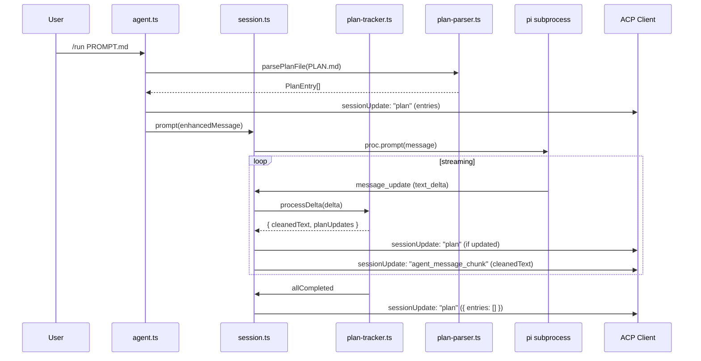

# Design: Generic Task List UI via ACP Plan Protocol

## Current State

pi-acp bridges `pi --mode rpc` with ACP clients (e.g. Zed). It handles built-in slash commands adapter-side (`/compact`,
`/export`, `/steering`, etc.), streams assistant text via `agent_message_chunk`, and manages a turn queue. The ACP SDK (
v0.26.0) defines a **stable `Plan`** type with `entries: PlanEntry[]` (each entry has `content`, `priority`, `status`)
sent via `sessionUpdate: "plan"`. The client replaces the entire plan on each update. pi-acp does not currently use
plans at all.

## Desired End State

- `/run <path-to-PROMPT.md>` built-in slash command loads a sibling `PLAN.md`, emits an ACP `plan` with entries parsed
  from markdown checkboxes, and sends the prompt to pi with injected marker instructions.
- As the LLM streams text, pi-acp parses `<!-- plan:INDEX:STATUS -->` HTML comment markers from `agent_message_chunk`
  deltas, updates plan entry statuses, and re-emits the full `plan` with updated entries.
- Markers are stripped from the visible text before forwarding to the ACP client.
- When all entries reach `completed`, pi-acp emits an empty plan (`{ entries: [] }`) to clear the UI.
- The plan parsing, marker extraction, and emission logic lives in a reusable module usable beyond `/run`.

## Architecture Overview

```
User types: /run specs/features/TOO/008-run-task-list-generic-ui/PROMPT.md

1. agent.ts prompt() intercepts /run
2. plan-parser.ts reads PLAN.md → PlanEntry[]
3. agent.ts emits sessionUpdate: "plan" with entries
4. agent.ts injects marker instructions into prompt text
5. agent.ts calls session.prompt(enhancedMessage)
6. session.ts handlePiEvent() → text_delta
   → plan-tracker.ts processes delta (accumulate, extract markers, strip)
   → emit plan update if marker found
   → emit cleaned agent_message_chunk
7. On all-completed → emit empty plan
```



## Components and Interfaces

### 1. `src/acp/plan-parser.ts` — PLAN.md parsing (new file)

```typescript
import type { PlanEntry } from '@agentclientprotocol/sdk'

/**
 * Parse a markdown checklist file into ACP PlanEntry array.
 * Supports:
 *   - [ ] Task        → status: "pending"
 *   - [x] Task        → status: "completed"
 *   - [ ] !! Task     → priority: "high"
 *   - [ ] ~ Task      → priority: "low"
 *   - [ ] Task        → priority: "medium" (default)
 */
export function parsePlanFile(content: string): PlanEntry[]

/**
 * Resolve PLAN.md path from a PROMPT.md path.
 * Replaces the filename with "PLAN.md" in the same directory.
 */
export function resolvePlanPath(promptPath: string): string
```

### 2. `src/acp/plan-tracker.ts` — Marker parsing and state tracking (new file)

```typescript
import type { PlanEntry } from '@agentclientprotocol/sdk'

export type PlanMarker = {
  index: number
  status: 'in_progress' | 'completed'
}

export type ProcessDeltaResult = {
  /** Text with markers removed, for forwarding to agent_message_chunk */
  cleanedText: string
  /** Markers found in this delta (may be empty) */
  markers: PlanMarker[]
  /** True if all plan entries are now completed */
  allCompleted: boolean
}

export class PlanTracker {
  private entries: PlanEntry[]
  private buffer: string  // accumulates text to detect markers spanning chunks

  constructor(entries: PlanEntry[])

  /**
   * Process a text delta. Accumulates into buffer, extracts complete markers,
   * strips them from the output text, and updates internal entry statuses.
   */
  processDelta(delta: string): ProcessDeltaResult

  /** Flush any remaining buffer (partial markers that never completed). Called at turn end. */
  flush(): string

  /** Get a snapshot of current entries (for emitting full plan updates). */
  getEntries(): PlanEntry[]

  /** True if all entries have status "completed". */
  isAllCompleted(): boolean
}

/**
 * Extract markers from a text string.
 * Marker format: <!-- plan:INDEX:STATUS -->
 * Returns the text with markers removed and the parsed markers.
 */
export function extractMarkers(text: string): { cleanedText: string; markers: PlanMarker[] }

/**
 * Build the marker instruction text to inject into prompts.
 * Tells the LLM to emit markers as it works through tasks.
 */
export function buildMarkerInstructions(entries: PlanEntry[]): string
```

### 3. `src/acp/agent.ts` — Modified

- Add `/run` to `builtinAvailableCommands()`
- Add `/run` handling in `prompt()` method:
    1. Read PROMPT.md from the given path
    2. Read PLAN.md from the sibling path
    3. Parse PLAN.md via `parsePlanFile()`
    4. Emit `sessionUpdate: "plan"` with entries
    5. Inject marker instructions via `buildMarkerInstructions()`
    6. Create a `PlanTracker` and attach it to the session
    7. Call `session.prompt(enhancedMessage, images)` — this DOES invoke the model (unlike other built-in commands)
    8. Return the result with appropriate `stopReason`

### 4. `src/acp/session.ts` — Modified

- Add optional `planTracker: PlanTracker | null` field to `PiAcpSession`
- In `handlePiEvent()` → `message_update` → `text_delta` branch:
    - If `planTracker` is active, call `planTracker.processDelta(delta)`
    - If markers found, emit `sessionUpdate: "plan"` with updated entries
    - If `allCompleted`, emit `sessionUpdate: "plan"` with `{ entries: [] }` and clear tracker
    - Emit `agent_message_chunk` with `cleanedText` (markers stripped)
- Add `setPlanTracker(tracker: PlanTracker | null): void` method
- Clear plan tracker on new turn / cancel

## Data Models

### PLAN.md Format

```markdown
# Plan

- [ ] !! Fix critical security bug
- [ ] Add unit tests for auth module
- [ ] ~ Update documentation
- [x] Set up project structure
```

### PlanEntry Mapping

| PLAN.md line                           | content                          | priority | status      |
|----------------------------------------|----------------------------------|----------|-------------|
| `- [ ] !! Fix critical security bug`   | "Fix critical security bug"      | "high"   | "pending"   |
| `- [ ] Add unit tests for auth module` | "Add unit tests for auth module" | "medium" | "pending"   |
| `- [ ] ~ Update documentation`         | "Update documentation"           | "low"    | "pending"   |
| `- [x] Set up project structure`       | "Set up project structure"       | "medium" | "completed" |

### Marker Format

```
<!-- plan:0:in_progress -->
<!-- plan:0:completed -->
```

- `INDEX` — 0-based entry index (matches order in PLAN.md)
- `STATUS` — `in_progress` or `completed`

### Prompt Injection

The marker instructions appended to the prompt:

```
<plan-marker-instructions>
You are working on a plan with the following tasks:
[0] Fix critical security bug (high priority)
[1] Add unit tests for auth module
[2] Update documentation (low priority)

As you work through these tasks, emit status markers as HTML comments in your output:
- When you start a task: <!-- plan:INDEX:in_progress -->
- When you complete a task: <!-- plan:INDEX:completed -->

Replace INDEX with the 0-based task number. Emit these markers inline in your text output.
</plan-marker-instructions>
```

## Patterns to Follow

1. **Built-in command pattern** — `/run` follows the same parse-and-handle pattern as `/compact`, `/export`, etc. in
   `agent.ts`. Key difference: `/run` DOES invoke the model (calls `session.prompt()`), unlike other built-in commands.

2. **Emit serialization** — All session updates go through `this.emit()` which serializes via a promise chain (
   `lastEmit`). Plan updates use the same mechanism.

3. **Stable Plan type** — Use `sessionUpdate: "plan"` with full `PlanEntry[]` on every update. The client replaces the
   entire plan. No `PlanId` needed. "Removal" = empty entries array.

4. **Module separation** — Parsing logic in `plan-parser.ts`, marker tracking in `plan-tracker.ts`, command handling in
   `agent.ts`, event integration in `session.ts`. Keeps each file focused.

5. **Testing pattern** — Use `FakeAgentSideConnection` / `FakePiRpcProcess` / `FakeSessions` pattern from existing
   tests. Unit test parser and tracker independently.

## Error Handling Strategy

- **PLAN.md not found** — Emit `agent_message_chunk` with error message, return `end_turn`. Do not send prompt to model.
- **PROMPT.md not found** — Same as above.
- **PLAN.md has no checklist items** — Emit warning, still send prompt to model without plan.
- **Invalid marker (bad index/status)** — Silently ignore. Do not crash.
- **Marker index out of bounds** — Silently ignore.
- **Client doesn't support plans** — Still emit `plan` updates (stable type, no capability check needed). Client should
  ignore unknown update types gracefully.

## Acceptance Criteria

### /run command

- Given a valid PROMPT.md path with a sibling PLAN.md, when user sends `/run <path>`, then pi-acp emits a `plan` session
  update with all entries from PLAN.md
- Given a PLAN.md with `!!` prefix, when parsed, then the corresponding PlanEntry has `priority: "high"`
- Given a PLAN.md with `~` prefix, when parsed, then the corresponding PlanEntry has `priority: "low"`
- Given a PLAN.md with `[x]` checkbox, when parsed, then the corresponding PlanEntry has `status: "completed"`
- Given a PLAN.md path that doesn't exist, when `/run` is called, then an error message is emitted and the model is not
  invoked

### Marker parsing

- Given the LLM emits `<!-- plan:0:in_progress -->`, when pi-acp processes the delta, then entry 0's status becomes
  `in_progress` and a `plan` update is emitted
- Given the LLM emits `<!-- plan:0:completed -->`, when pi-acp processes the delta, then entry 0's status becomes
  `completed` and a `plan` update is emitted
- Given a marker in the streamed text, when pi-acp forwards the text to the ACP client, then the marker is stripped from
  the visible text
- Given a marker that spans two text deltas (split across chunks), when pi-acp processes the second delta, then the
  complete marker is detected and processed

### Plan lifecycle

- Given all plan entries have status `completed`, when pi-acp detects this, then an empty plan `{ entries: [] }` is
  emitted
- Given a new prompt is sent (not `/run`), when the turn starts, then any existing plan tracker is cleared

### Prompt injection

- Given `/run` is called with a valid PLAN.md, when the prompt is sent to pi, then marker instructions are appended
  telling the LLM to emit `<!-- plan:INDEX:STATUS -->` markers

## Testing Strategy

### Unit Tests (new files)

1. `test/unit/plan-parser.test.ts` — Test `parsePlanFile()` with various PLAN.md formats (checklists, priorities,
   completed items, empty file, no checkboxes)
2. `test/unit/plan-tracker.test.ts` — Test `PlanTracker` class: single delta marker, multi-delta marker (spanning
   chunks), marker stripping, all-completed detection, out-of-bounds index, invalid status
3. `test/unit/run-command.test.ts` — Test `/run` slash command end-to-end with fakes: valid paths, missing PLAN.md,
   missing PROMPT.md, empty plan, plan emission, prompt injection

### Test approach

- Parser and tracker tests are pure unit tests (no fakes needed)
- `/run` command test uses the `FakeAgentSideConnection` / `FakePiRpcProcess` / `FakeSessions` pattern
- For event-driven marker tests, use `FakePiRpcProcess.emit()` to simulate `message_update` events with `text_delta`
  containing markers