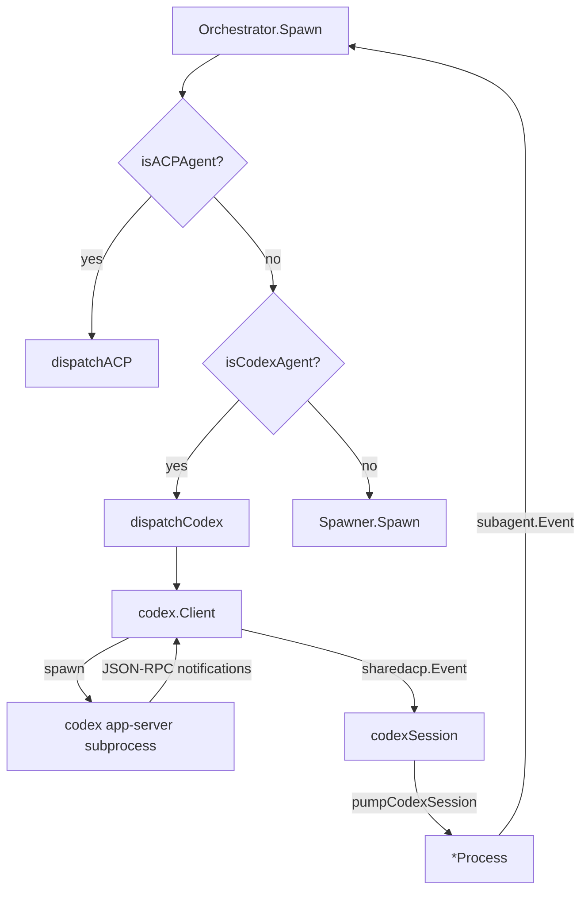

# Design: Codex Direct-Mode App-Server Subagent

## Current State

pi-go's subagent system has two dispatch paths in `Orchestrator.Spawn()`:

1. **ACP path** (`isACPAgent` → `dispatchACP`) — for claude/gemini/cursor/copilot, uses `coder/acp-go-sdk` with
   `Initialize → NewSession → Prompt` lifecycle
2. **Native pi path** (`Spawner.Spawn`) — for explore/plan/task/etc, spawns `pi --mode json` subprocess

Both produce a `*Process` with an events channel and a `Wait()` method. The orchestrator is agnostic to how events
arrive.

Codex uses its own JSON-RPC 2.0 protocol over stdio — completely incompatible with the ACP SDK. It cannot reuse
`acpSession`, `RunningSession`, or `pumpACPSession`.

## Desired End State

- `"codex"` and `"codex-review"` are bundled agent definitions, spawnable via the existing subagent tool
- A new `dispatchCodex()` function in `spawner_codex.go` spawns `codex app-server` and speaks JSON-RPC
- The orchestrator gets a third dispatch branch: `isACPAgent` → `isCodexAgent` → else `Spawner.Spawn`
- Codex notifications are translated into the existing `subagent.Event` format and fed into a `*Process`
- No new slash commands, no ACP SDK dependency

## Architecture Overview



## Components and Interfaces

### 1. `internal/codex/` — New package for Codex JSON-RPC client

#### `internal/codex/protocol.go` — JSON-RPC types

```go
// JSONRPCRequest is a JSON-RPC 2.0 request.
type JSONRPCRequest struct {
    JSONRPC string      `json:"jsonrpc"`
    ID      int         `json:"id"`
    Method  string      `json:"method"`
    Params  interface{} `json:"params"`
}

// JSONRPCNotification is a JSON-RPC 2.0 notification (no ID).
type JSONRPCNotification struct {
    JSONRPC string      `json:"jsonrpc"`
    Method  string      `json:"method"`
    Params  json.RawMessage `json:"params"`
}

// JSONRPCResponse is a JSON-RPC 2.0 response.
type JSONRPCResponse struct {
    JSONRPC string          `json:"jsonrpc"`
    ID      int             `json:"id"`
    Result  json.RawMessage `json:"result,omitempty"`
    Error   *RPCError       `json:"error,omitempty"`
}

type RPCError struct {
    Code    int    `json:"code"`
    Message string `json:"message"`
}
```

#### Protocol message types

```go
// InitializeParams/Response
type InitializeParams struct {
    ClientInfo    ClientInfo         `json:"clientInfo"`
    Capabilities InitializeCaps     `json:"capabilities"`
}
type ClientInfo struct {
    Title   string `json:"title"`
    Name    string `json:"name"`
    Version string `json:"version"`
}
type InitializeCaps struct {
    ExperimentalApi          bool     `json:"experimentalApi"`
    RequestAttestation       bool     `json:"requestAttestation"`
    OptOutNotificationMethods []string `json:"optOutNotificationMethods"`
}
type InitializeResponse struct {
    UserAgent string `json:"userAgent"`
}

// ThreadStartParams/Response
type ThreadStartParams struct {
    CWD            string  `json:"cwd"`
    Model          *string `json:"model"`
    ApprovalPolicy string  `json:"approvalPolicy"`  // "never"
    Sandbox        string  `json:"sandbox"`         // "workspace-write" or "read-only"
    ServiceName    string  `json:"serviceName"`
    Ephemeral      bool    `json:"ephemeral"`
}
type ThreadStartResponse struct {
    Thread struct {
        ID string `json:"id"`
    } `json:"thread"`
}

// TurnStartParams/Response
type TurnStartParams struct {
    ThreadID string     `json:"threadId"`
    Input    []UserInput `json:"input"`
    Model    *string     `json:"model"`
    Effort   *string     `json:"effort"`
    // OutputSchema *json.RawMessage `json:"outputSchema"` // TODO: future
}
type UserInput struct {
    Type        string `json:"type"`          // "text"
    Text        string `json:"text"`
    TextElements []any  `json:"text_elements"`
}
type TurnStartResponse struct {
    Turn Turn `json:"turn"`
}
type Turn struct {
    ID     string `json:"id"`
    Status string `json:"status"`  // "inProgress", "completed", "interrupted", "failed"
    Error  string `json:"error"`
}

// ReviewStartParams/Response
type ReviewStartParams struct {
    ThreadID string       `json:"threadId"`
    Delivery string       `json:"delivery"`  // "inline"
    Target   ReviewTarget `json:"target"`
}
type ReviewTarget struct {
    Type string `json:"type"`  // "uncommittedChanges" or "baseBranch"
    // Branch string `json:"branch,omitempty"` // TODO: future for baseBranch
}
type ReviewStartResponse struct {
    Turn Turn `json:"turn"`
}

// TurnInterruptParams
type TurnInterruptParams struct {
    ThreadID string `json:"threadId"`
    TurnID   string `json:"turnId"`
}

// Notification params
type TurnStartedParams struct {
    ThreadID string `json:"threadId"`
    Turn     Turn   `json:"turn"`
}
type ItemParams struct {
    ThreadID string          `json:"threadId"`
    TurnID   string          `json:"turnId"`
    Item     json.RawMessage `json:"item"`  // raw — we extract type + relevant fields
}
type TurnCompletedParams struct {
    ThreadID string `json:"threadId"`
    Turn     Turn   `json:"turn"`
}
type ErrorParams struct {
    Error RPCError `json:"error"`
}

// Item is a partially-typed ThreadItem (discriminated by Type).
type Item struct {
    Type   string `json:"type"`
    ID     string `json:"id"`
    Text   string `json:"text,omitempty"`         // agentMessage
    Phase  string `json:"phase,omitempty"`        // agentMessage: "final_answer"
    Command string `json:"command,omitempty"`      // commandExecution
    Status  string `json:"status,omitempty"`       // commandExecution, fileChange, mcpToolCall
    ExitCode *int  `json:"exitCode,omitempty"`     // commandExecution
    Tool    string `json:"tool,omitempty"`          // mcpToolCall, dynamicToolCall
    Server  string `json:"server,omitempty"`         // mcpToolCall
    Review  string `json:"review,omitempty"`        // exitedReviewMode
    Summary []string `json:"summary,omitempty"`     // reasoning: summary sections
    Changes []struct {
        Path string `json:"path"`
    } `json:"changes,omitempty"`  // fileChange
}
```

#### `internal/codex/client.go` — JSON-RPC client

```go
// Client wraps a `codex app-server` subprocess speaking JSON-RPC over stdio.
type Client struct {
    cmd     *exec.Cmd
    stdin   io.WriteCloser
    stdout  io.Reader
    stderr  *stderrBuffer
    nextID  int
    pending map[int]chan JSONRPCResponse
    notifCh chan JSONRPCNotification
    mu      sync.Mutex
    closed  bool
}

// NewClient spawns `codex app-server` and performs the initialize handshake.
func NewClient(ctx context.Context, cwd string, env []string) (*Client, error)

// request sends a JSON-RPC request and waits for the response.
func (c *Client) request(method string, params interface{}) (json.RawMessage, error)

// notify sends a JSON-RPC notification (no response expected).
func (c *Client) notify(method string, params interface{}) error

// notifications returns the channel for server-side notifications.
func (c *Client) notifications() <-chan JSONRPCNotification

// close shuts down the subprocess.
func (c *Client) close() error
```

The `Client` spawns `codex app-server` as a subprocess, pipes stdin/stdout,
starts a reader goroutine that splits JSONL and routes responses (by ID) to
pending channels and notifications to the notification channel.

#### `internal/codex/session.go` — Turn execution and event translation

```go
// Event is a translated codex event (mirrors sharedacp.Event shape).
type Event struct {
    Type      string // "message", "progress", "tool", "stderr", "error"
    Content   string
    Error     string
    SessionID string
}

// RunResult is the final result of a codex turn.
type RunResult struct {
    Status     string // "success" or "error"
    Result     string // accumulated agent message text
    Error      string
    SessionID  string // thread ID
    Stderr     string
    StopReason string // turn status: "completed", "interrupted", "failed"
}

// Session wraps a codex app-server Client and runs a single turn or review.
type Session struct {
    client    *Client
    threadID  string
    events    chan Event  // buffer 256
    done      chan struct{}
    result    RunResult
    mu        sync.Mutex
    closed    bool
    cmd       *exec.Cmd  // for crash detection
}

// NewSession creates a Session: spawns codex, initializes, starts a thread.
// The notification handler goroutine starts BEFORE turn/start is sent to avoid
// missing early notifications (turn/started can arrive immediately).
func NewSession(ctx context.Context, opts SessionOpts) (*Session, error)

type SessionOpts struct {
    CWD     string
    Prompt  string
    Sandbox string  // "workspace-write" or "read-only"
    Env     []string
    Review  bool    // true = use review/start, false = use turn/start
}

// Events returns the streaming event channel.
func (s *Session) Events() <-chan Event

// Done is closed when the turn completes.
func (s *Session) Done() <-chan struct{}

// Wait blocks until done and returns the result.
func (s *Session) Wait() RunResult

// Cancel sends turn/interrupt and kills the subprocess.
func (s *Session) Cancel() error
```

**Notification handler** — runs in a goroutine started before `turn/start`:

- Buffers notifications until `turnID` is set (from `turn/start` response)
- **Thread-ID filtering**: `turn/completed` is only terminal if `params.ThreadID == s.threadID`.
  Codex can spin up collab/subagent threads — their `turn/completed` must NOT
  terminate the outer session.
- **Subprocess crash detection**: a separate goroutine calls `cmd.Wait()`. If the
  process exits before `turn/completed` arrives, feeds an error result and closes `done`.
- **Non-blocking event sends**: uses `select`/`default` drop pattern (mirrors ACP `emit()`)
- **Stderr streaming**: a goroutine drains `codex app-server` stderr line-by-line,
  emits `Event{Type: "stderr"}` for each line, and accumulates into `RunResult.Stderr`

### 2. `internal/subagent/spawner_codex.go` — Dispatch integration

```go
// codexAgentNames is the set of bundled agent names that use the Codex
// app-server JSON-RPC protocol (direct mode, no ACP).
var codexAgentNames = map[string]struct{}{
    "codex":        {},
    "codex-review": {},
}

func isCodexAgent(name string) bool {
    _, ok := codexAgentNames[name]
    return ok
}

// startCodexSessionFn is overridable in tests (mirrors startACPSessionFn).
var startCodexSessionFn = startCodexSession

// codexSession interface — mirrors acpSession but with codex types.
type codexSession interface {
    Events() <-chan codex.Event
    Done()   <-chan struct{}
    Cancel() error
    Wait()   codex.RunResult
}

// dispatchCodex spawns a codex app-server subagent.
func dispatchCodex(ctx context.Context, opts SpawnOpts, agentName string) (*Process, error)

// startCodexSession creates a codex.Session for the given agent.
func startCodexSession(ctx context.Context, agentName string, prompt string, opts SpawnOpts) (codexSession, error)

// pumpCodexSession translates codex.Event → subagent.Event (mirrors pumpACPSession).
func pumpCodexSession(sess codexSession, proc *Process, agentName string)
```

### 3. Orchestrator changes (`orchestrator.go`)

Add `isCodexAgent` check in `Spawn()`:

```go
var proc *Process
switch {
case isACPAgent(agent.Name):
    proc, err = dispatchACP(ctx, spawnOpts, agent.Name)
case isCodexAgent(agent.Name):
    proc, err = dispatchCodex(ctx, spawnOpts, agent.Name)
default:
    proc, err = o.spawner.Spawn(ctx, spawnOpts)
}
```

Also add codex agents to the ACP event logging check. Use
`logACP := isACPAgent(agent.Name) || isCodexAgent(agent.Name)` at the logging
site only. **Never add "codex"/"codex-review" to `acpAgentNames`** — that would
route codex through `dispatchACP` instead of `dispatchCodex`.

### 4. Bundled agent definitions

#### `internal/subagent/bundled/codex.md`

```markdown
---
name: codex
description: Codex CLI app-server agent — spawn OpenAI Codex via direct JSON-RPC protocol
role: default
worktree: false
tools: read, grep, find, tree, ls, bash, edit, write
---

You are Codex, running as a subagent of pi-go via the Codex app-server
JSON-RPC protocol (direct mode). You have access to tools for filesystem
operations and code exploration. Results are streamed back incrementally
to the parent pi-go process.
```

#### `internal/subagent/bundled/codex-review.md`

```markdown
---
name: codex-review
description: Codex CLI review agent — run a read-only code review via Codex app-server
role: default
worktree: false
tools: read, grep, find, tree, ls
---

You are a Codex review agent, running as a subagent of pi-go via the
Codex app-server JSON-RPC protocol (direct mode). You perform a
read-only code review of the current changes and report findings.
```

## Event Translation (pumpCodexSession)

Codex notifications → `codex.Event` (in `session.go`) → `subagent.Event` (in `pumpCodexSession`):

| Codex Notification                                     | codex.Event Type | subagent.Event Type | Content                                              |
|--------------------------------------------------------|------------------|---------------------|------------------------------------------------------|
| `turn/started`                                         | (internal)       | `message_start`     | session=threadID                                     |
| `item/started` (agentMessage)                          | `message`        | `text_delta`        | item.text                                            |
| `item/completed` (agentMessage, phase=final_answer)    | `message`        | `text_delta`        | item.text                                            |
| `item/started/completed` (commandExecution)            | `tool`           | `tool_call`         | "Running: {command}" / "Command completed (exit N)"  |
| `item/started/completed` (fileChange)                  | `tool`           | `tool_call`         | "Applying N file changes" / "File changes completed" |
| `item/started/completed` (mcpToolCall/dynamicToolCall) | `tool`           | `tool_call`         | "Calling {server}/{tool}"                            |
| `item/completed` (reasoning)                           | `progress`       | `tool_call`         | reasoning text                                       |
| `item/completed` (exitedReviewMode)                    | `message`        | `text_delta`        | item.review                                          |
| `error`                                                | `error`          | `error`             | error.message                                        |
| `turn/completed`                                       | (terminal)       | `message_end`       | stopReason=turn.status                               |

Key difference from ACP: **no sentinel detection needed**. Codex has explicit
`turn/completed` notification — the session knows when the turn is done.

## Error Handling

- **Binary not found**: `findBinary` returns error with install instructions
- **Initialize timeout**: 60s timeout (matching existing `rpcTimeout` pattern)
- **Turn timeout**: resolved by orchestrator's `ResolveTimeout(opts.Timeout)`
- **Process crash**: `cmd.Wait()` error captured, session returns error result
- **Server error notification**: `error` params → `codex.Event{Type: "error"}`
- **Turn failed/interrupted**: `turn.status` → mapped to RunResult.StopReason

## Turn Completion Detection

Unlike ACP (which needs the `<Task Completed>!` sentinel hack), codex has
explicit completion:

1. **Normal**: `turn/completed` notification with `turn.status = "completed"`
2. **Interrupted**: `turn/completed` with `turn.status = "interrupted"` (from Cancel)
3. **Failed**: `turn/completed` with `turn.status = "failed"`

No inferred completion timer needed for the minimal implementation.

## Acceptance Criteria

### Codex Task Subagent

- Given codex CLI is installed and authenticated, when the orchestrator spawns a `codex` agent with a prompt, then
  `codex app-server` is launched as a subprocess, the prompt is sent via `turn/start` with `workspace-write` sandbox,
  and events stream back as `subagent.Event` until `turn/completed`.

### Codex Review Subagent

- Given codex CLI is installed, when the orchestrator spawns a `codex-review` agent, then `review/start` is used with
  `read-only` sandbox targeting uncommitted changes, and the review output streams back.

### Binary Not Found

- Given codex CLI is not installed, when a `codex` agent is spawned, then a clear error is returned: "codex not found in
  PATH or default locations".

### PI_CODEX_CMD Override

- Given `PI_CODEX_CMD` is set to a custom path, when a `codex` agent is spawned, then that binary is used instead of the
  default.

### Cancel

- When `Cancel()` is called on a running codex subagent, then `turn/interrupt` is sent and the subprocess is terminated.

### Test Mocking

- Tests can override `startCodexSessionFn` with a fake `codexSession` to exercise `dispatchCodex` and `pumpCodexSession`
  without a real codex binary.

## Testing Strategy

1. **Protocol tests** (`internal/codex/client_test.go`): Test JSON-RPC message marshaling/unmarshaling, response
   routing, notification parsing. Use a fake subprocess (pipe-based mock).

2. **Session tests** (`internal/codex/session_test.go`): Test turn lifecycle with a mock client — verify events are
   emitted for each notification type, verify completion on `turn/completed`, verify Cancel sends `turn/interrupt`.

3. **Dispatch tests** (`internal/subagent/spawner_codex_test.go`): Override `startCodexSessionFn` with
   `fakeCodexSession`, verify `dispatchCodex` constructs `*Process` correctly, `pumpCodexSession` translates events,
   sentinel is NOT used, error results produce error events.

4. **Binary resolution tests** (`internal/codex/client_test.go`): Test `findBinary` with PATH lookup, env override (
   `PI_CODEX_CMD`), and not-found error.

5. **Orchestrator integration**: Existing orchestrator tests should pass unchanged. Add test verifying
   `isCodexAgent("codex") == true`, `isCodexAgent("codex-review") == true`, `isCodexAgent("claude") == false`.

## Patterns to Follow

- **Runner pattern**: Mirror claudecode/copilot — `Runner` struct, `RunRequest`, `resolveCommand`, `findBinary`,
  `PI_*_CMD` env var, `rpcTimeout = 60s`
- **Process reuse**: Construct `*Process` the same way `dispatchACP` does (buffer 256, cancel closure)
- **Test injection**: Package-level `var startCodexSessionFn = startCodexSession` (mirrors `startACPSessionFn`)
- **Bundled agents**: `internal/subagent/bundled/*.md` with frontmatter (name, description, role, worktree, tools)
- **Env handling**: Use `FilterEnv(nil)` + `opts.Env` (like the non-ACP path) since codex needs `OPENAI_API_KEY`,
  `CODEX_HOME` which must be added to `DefaultEnvAllowlist` in `internal/subagent/environ.go`