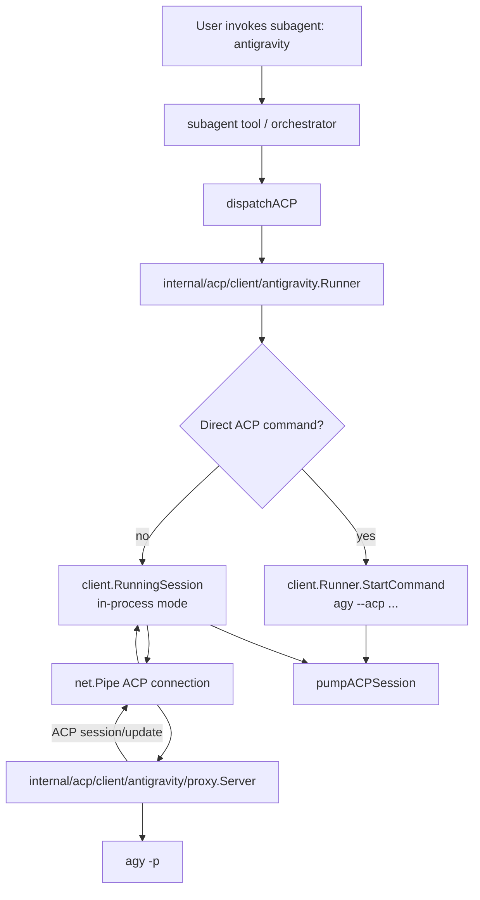

# Design: Antigravity (`agy`) Subagent via In-Process ACP Proxy

## Summary

Add Google Antigravity support as a bundled pi-go subagent named `antigravity`.
Because the current `agy` CLI does not expose an ACP stdio mode, pi-go will not use
`agy` as a direct ACP subprocess. Instead, pi-go will add an in-process ACP server
proxy that speaks ACP to pi-go's existing ACP client runner and internally launches
non-ACP `agy` prompt-mode subprocesses.

The adapter should also be future-proofed for upstream ACP support: if a user provides
an ACP-capable `agy` command through an environment override, the runner can bypass the
proxy and use the normal direct ACP client path.

## Current State

pi-go already has ACP-backed subagents for:

- `claude`
- `gemini`
- `cursor`
- `copilot`

ACP-backed names are registered in `internal/subagent/orchestrator.go` via
`acpAgentNames`. ACP subagents route through `dispatchACP` in
`internal/subagent/spawner_acp.go`.

Existing ACP client adapters are thin launchers around commands that already speak ACP:

- Claude: `bunx -y @agentclientprotocol/claude-agent-acp@latest`
- Gemini: `gemini --acp`
- Cursor: `agent acp`
- Copilot: `copilot --acp --stdio`

The shared ACP client runner in `internal/acp/client` wires an ACP client-side
connection to stdin/stdout and drives:

1. `initialize`
2. `newSession`
3. `prompt`
4. session updates / final response

`internal/acp/client/session.go` already contains exported pieces useful for in-process
proxying, including `RunACPFlow`, `RunningSession.RunFlow`, and `RunningSession.HandleUpdate`.
However, the public constructor/helper surface for creating an in-process session may need to
be completed or adjusted because research found comments for `NewInProcessSession` but no
call sites.

## Desired End State

Users can spawn the new subagent by name:

```json
{"agent":"antigravity","task":"inspect this package and summarize risks"}
```

or through any pi-go UI/tool path that lists bundled subagents.

The subagent should:

- resolve as a bundled agent named `antigravity`;
- be treated as an ACP-backed subagent by the orchestrator;
- default to proxy mode because upstream `agy` lacks ACP mode;
- internally execute `agy` in non-interactive prompt mode;
- stream stdout/stderr back through pi-go's existing ACP/subagent event pipeline;
- cancel the child `agy` subprocess when the parent cancels the ACP session;
- support an env override for future direct ACP mode.

## Non-Goals

- Do not implement upstream ACP support inside `agy` itself.
- Do not implement Antigravity OAuth/provider support in `internal/provider`.
- Do not add an `agy-review` subagent until a read-only/review mode is defined.
- Do not claim full ACP fidelity for features not exposed by non-ACP `agy`, such as real
  ACP permission callbacks or true ACP session resumption.

## Architecture Overview



## Components

### 1. Antigravity ACP client adapter package

Add package:

```text
internal/acp/client/antigravity/
```

The package follows existing adapter package conventions (`gemini`, `cursor`, `copilot`).

Core constants:

```go
const BinaryName = "agy"
const envACPAntigravityCmd = "PI_ACP_ANTIGRAVITY_CMD"

var DefaultBinaryPaths = []string{
    "agy",
    ".local/bin/agy",
    "/usr/local/bin/agy",
    "/opt/homebrew/bin/agy",
    "/usr/bin/agy",
}

var DefaultProxyArgs = []string{"-p"}
```

Use `PI_ACP_ANTIGRAVITY_CMD` rather than `PI_ACP_AGY_CMD` because the public subagent name
is `antigravity`. The implementation may accept `PI_ACP_AGY_CMD` as a backward-compatible
alias only if desired, but the primary documented env var should match the subagent name.

Public types:

```go
type Runner struct {
    ClientInfo   acp.Implementation
    Binary       string
    Logger       *slog.Logger
    ExtraEnv     []string
    DisableProxy bool // force direct ACP mode for tests/future upstream support
}

type RunRequest struct {
    Prompt    string
    SessionID string
    CWD       string
    Env       []string
    Command   []string // test override or full command override
}

func (r Runner) Start(ctx context.Context, req RunRequest) (*client.RunningSession, error)
```

Behavior:

- validate non-empty prompt;
- resolve a command from explicit `Binary`, `req.Command`, env override, or defaults;
- choose direct mode only when:
  - `Runner.DisableProxy` is true; or
  - the resolved argv contains an ACP-looking option such as `--acp`; or
  - tests supply a direct command path intentionally;
- otherwise choose proxy mode and launch non-ACP `agy` internally.

Direct mode should use the existing `client.Runner.StartCommand` path and requires the child
process to speak ACP over stdin/stdout.

Proxy mode should create an in-process ACP connection and return a normal `*client.RunningSession`
that satisfies the existing `acpSession` interface.

### 2. In-process ACP session support

Complete the in-process session API in `internal/acp/client` if it is incomplete.

Target helper shape:

```go
type InProcessOption func(*RunningSession)

func NewInProcessSession(conn *acp.ClientSideConnection, opts ...InProcessOption) *RunningSession
func WithClientInfo(info acp.Implementation) InProcessOption
func WithCancelFunc(cancel func() error) InProcessOption
```

Responsibilities:

- construct a `RunningSession` with no `*exec.Cmd`;
- initialize `events`, `done`, `stderrDone`, and tool filtering like subprocess sessions;
- mark `inProcess = true`;
- allow `Cancel()` to call the supplied cancel hook;
- let callers run `session.RunFlow(shared.RunRequest{...})` in a goroutine;
- close `events` before `done`, matching subprocess-mode ordering.

If this API already exists by implementation time, reuse it and do not duplicate it.

### 3. Antigravity proxy package

Add package:

```text
internal/acp/client/antigravity/proxy/
```

The proxy acts as a minimal ACP server sufficient for pi-go's current client flow.

Representative API:

```go
type CommandSpec struct {
    Binary string
    Args   []string // defaults to ["-p"] before appending prompt
    Env    []string
    CWD    string
}

type Server struct {
    Command CommandSpec
    Logger  *slog.Logger
}

func (s *Server) Serve(ctx context.Context, rwc io.ReadWriteCloser) error
func (s *Server) Cancel() error
```

ACP server behavior:

- `initialize` returns server implementation metadata, e.g. name `antigravity-proxy`;
- `newSession` returns a generated session ID;
- `prompt` extracts text content from the ACP prompt request;
- `prompt` runs `agy -p <prompt>` or env/configured equivalent;
- stdout lines/chunks become ACP `session/update` notifications with `agent_message_chunk`;
- stderr lines/chunks become progress or diagnostics where ACP permits, and should also be
  surfaced in final errors where possible;
- process exit code determines success vs error;
- `cancel` kills the child subprocess if running.

The proxy should not invent tool-call events. If `agy -p` emits plain text only, proxy it as
assistant message chunks.

### 4. Subagent registration

Add bundled agent file:

```text
internal/subagent/bundled/antigravity.md
```

Frontmatter should mirror other ACP agent definitions:

```yaml
---
name: antigravity
description: Google Antigravity CLI agent — spawn `agy` through pi-go's in-process ACP proxy
role: default
worktree: false
tools: read, grep, find, tree, ls, bash, edit, write
---
```

Instructions should state that the agent is Google Antigravity running under pi-go as a subagent.

Wire runtime registration:

- add `"antigravity"` to `acpAgentNames` in `internal/subagent/orchestrator.go`;
- import the new adapter in `internal/subagent/spawner_acp.go`;
- add `case "antigravity":` in `startACPSession` and call `antigravity.Runner.Start`.

### 5. Command override and direct-mode future proofing

Primary env var:

```text
PI_ACP_ANTIGRAVITY_CMD
```

Expected parsing pattern should match existing adapters:

- unset: find `agy` in default paths and run proxy mode with `-p`;
- set to a bare binary: use that binary in proxy mode with default `-p`;
- set to a full command without `--acp`: use that argv in proxy mode, appending prompt according
  to the proxy contract;
- set to a full command containing `--acp`: bypass proxy and run direct ACP mode.

Examples:

```bash
PI_ACP_ANTIGRAVITY_CMD="/Users/me/bin/agy"              # proxy mode
PI_ACP_ANTIGRAVITY_CMD="/Users/me/bin/agy -p"           # proxy mode
PI_ACP_ANTIGRAVITY_CMD="/Users/me/bin/agy --acp"        # direct ACP mode if upstream adds it
```

## Data and Event Model

The external subagent event model should remain unchanged. `dispatchACP` still receives an
`acpSession` and `pumpACPSession` still emits `subagent.Event` values.

Proxy-mode event mapping:

- `agy` stdout -> ACP `agent_message_chunk` -> shared `EventTypeMessage` -> subagent `text_delta`
- `agy` stderr -> diagnostic/progress event if available; final stderr included in errors
- child process failure -> shared `StatusError` -> subagent `error`
- child process success -> shared `StatusSuccess`

Session IDs can be generated UUIDs in proxy mode. Session resumption is not meaningful unless
`agy` exposes a stable resume mechanism.

## Error Handling Strategy

- Empty prompt returns `prompt is required`, matching existing adapter behavior.
- Missing `agy` binary returns an error like `finding agy: agy not found in PATH or default locations`.
- Proxy startup failures should include the command and underlying error.
- Non-zero `agy` exit should return `StatusError` with stderr and exit status.
- Direct mode ACP initialization/prompt failures should flow through existing `client.Runner` errors.
- Cancellation should kill the child `agy` process and return a cancellation-style error unless the
  parent already detected graceful completion through the `<Task Completed>` sentinel.

## Acceptance Criteria

### Bundled subagent registration

- Given pi-go loads bundled agents, when agent discovery runs, then `antigravity` appears with source `bundled`.
- Given the orchestrator checks ACP agents, when `isACPAgent("antigravity")` is called, then it returns true.

### Proxy-mode execution

- Given `agy` lacks ACP mode, when the `antigravity` subagent starts with default settings, then pi-go uses the in-process ACP proxy rather than direct ACP subprocess mode.
- Given proxy mode receives a prompt, when fake `agy -p` writes stdout, then the parent subagent receives streamed text deltas.
- Given fake `agy -p` exits non-zero and writes stderr, when the session ends, then the subagent returns an error containing useful diagnostics.

### Direct-mode future path

- Given `PI_ACP_ANTIGRAVITY_CMD` contains `--acp`, when the runner starts, then it bypasses the proxy and uses direct ACP command wiring.
- Given direct mode is selected, when the command does not speak ACP, then existing ACP initialization errors surface clearly.

### Cancellation

- Given an `antigravity` proxy-mode session is running, when the parent cancels the process, then the child `agy` subprocess is killed and the session terminates.

## Testing Strategy

Unit tests:

- `internal/acp/client/antigravity/antigravity_test.go`
  - prompt validation;
  - binary resolution;
  - env override parsing;
  - proxy vs direct mode heuristic;
  - fake command stdout maps to session result/events;
  - fake command stderr/non-zero maps to error.

- `internal/acp/client/antigravity/proxy/proxy_test.go`
  - initialize/newSession/prompt flow;
  - prompt extraction from text blocks;
  - stdout streaming;
  - stderr/error handling;
  - cancellation kills child process.

- `internal/acp/client/session_unit_test.go`
  - in-process constructor initializes channels/tool filtering;
  - `Cancel()` invokes in-process cancel hook;
  - event/done close order remains safe.

- `internal/subagent/*_test.go`
  - bundled count increases from 17 to 18;
  - expected names include `antigravity`;
  - `TestIsACPAgent` includes `antigravity`;
  - `startACPSession` routes `antigravity` to the new runner path using fake/session override where possible.

Targeted commands:

```bash
go test ./internal/acp/client/... ./internal/subagent/...
go test ./internal/tools/... # if tool agent listing snapshots change
```

Full gates from Makefile:

```bash
make build
make test
make vet
```

Optional lint if available:

```bash
make lint
```

## Open Constraints

- Exact `agy` non-interactive argv is assumed to be prompt mode with `-p`; implementation should verify against the installed CLI during coding if possible.
- Because upstream `agy` has no ACP option, proxy mode is a compatibility shim, not a full ACP implementation.
- Session resumption and mid-turn permission callbacks should be explicitly unsupported in proxy mode unless future `agy` capabilities provide equivalent semantics.
