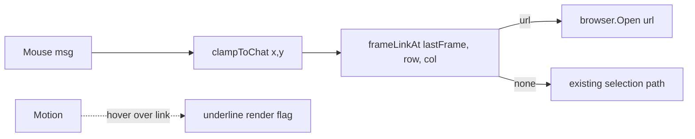

# Design: Click-to-open URL in TUI chat

## Current State

- Chat output is rendered to a single frame string with embedded ANSI + OSC 8 hyperlink escapes (`internal/tui/chat.go`: `hyperlinkRenderedURLs` / `hyperlinkRenderedLine`). Column ranges are computed at render time and discarded; no position→URL map exists.
- `model.View()` (tui.go:1451) renders, clips via `clipMessagesToViewport`, saves `lastFrame` (composed full frame) and `frameRows`; sets `msgTop/msgBottom` selectable rows.
- Mouse: `handleMouse` dispatches Click/Motion/Release/Wheel with terminal cell coords. `clampToChat` maps absolute Y → frame row (`y - m.frameTop()`), X → chat columns. Drag-selection state lives in `selection` (selection.go); `empty()` distinguishes click-without-drag.
- `internal/browser.Open(url)` opens a URL in the system browser; errors include `ErrNoHandler`.

## Desired End State

Hovering an http(s) URL in the chat message viewport underlines it; clicking it without dragging opens it in the browser. All other mouse behavior unchanged. Failures silently ignored.

## Architecture Overview

Single source of truth remains the frame string. At click/motion time we resolve the cell under the pointer by parsing OSC 8 spans out of the relevant line of `lastFrame`.



New file `internal/tui/framelinks.go` owns all position→URL logic; tui.go handlers call into it.

## Components & Interfaces

```go
// framelinks.go

// LinkSpan is a clickable URL within one frame line.
type LinkSpan struct {
    URL   string
    Start int // display column, inclusive
    End   int // display column, exclusive
}

// frameLinks extracts clickable link spans from a single frame line.
// Parses OSC 8 sequences (both BEL and ST terminated); returns nil if none.
func frameLinks(line string) []LinkSpan

// frameLinkAt resolves the link under (row, col) in frame coordinates,
// or nil. row indexes lines of frame; col is a 0-based display column
// clamped to the line's visible width.
func frameLinkAt(frame string, row, col int) *LinkSpan
```

Model additions (tui.go):

```go
type model struct {
    // ...existing...
    hoverLink string // URL currently hovered ("" = none)
}
```

Rendering of hover underline: when `hoverLink != ""`, View post-processes only the message-viewport rows of the frame, adding SGR underline around the hovered span's cells for its row(s). Implemented as `applyHoverUnderline(frame string, hover hoverInfo) string` in framelinks.go, where `hoverInfo{row, startCol, endCol int}` is recomputed each View from `hoverLink` + pointer position stored in model (`hoverX, hoverY int`). If the link no longer exists at that position (scroll/render change), skip.

## Data Models

No persistent structures beyond two ints (`hoverX/hoverY`) and `hoverLink`. Everything else derived from `lastFrame` on demand — no invalidation problem across scroll/re-render.

## Patterns Followed

- Frame-string post-processing like existing selection highlight (`selectedText(m.lastFrame, ...)`) — derive from saved frame, don't cache.
- Small focused files in internal/tui with table-driven tests (see `terminal_hyperlink_test.go`).
- Browser opening via injected var for testability: mirror login.go's `openBrowser` pattern — `var openChatLink = browser.Open` in tui.go.

## Error Handling Strategy

Per requirements: `browser.Open` error is silently ignored (`_ = openChatLink(url)`). Malformed/unparseable frame content simply yields no link → normal behavior. No user-visible failures.

## Behavior Specification

1. **Motion**: update `hoverX/hoverY`; resolve `frameLinkAt(lastFrame, row, col)` after clampToChat mapping; set/clear `hoverLink`. Trigger re-render (View already runs per event).
2. **Click (left)**: record anchor as today but also remember press-point link (`pressLink`); proceed with existing selection-start logic unchanged so drag still works.
3. **Release**: after existing logic, if selection ended empty (click-without-drag, `m.sel.empty()` path) AND the release cell resolves to the same URL as press (`frameLinkAt` equality), open it. This gives drag suppression for free: drags produce non-empty selection → no open.
4. **Non-left buttons**: untouched.
5. **Scope**: only cells within `[msgTop, msgBottom)` message viewport rows resolve links (clampToChat already restricts there).

Edge cases:
- Link spanning wrapped lines (glamour soft-wraps long URLs): OSC 8 wraps each visual line separately already (hyperlinkRenderedLine is per-line), so per-line lookup handles this naturally; clicking any visual segment opens the same href.
- Hover while scrolled/typing: recompute each View; stale hover auto-clears since resolution fails.
- Click inside an existing text-selection highlight that is also a link: preserve current copy-on-click behavior (check sel.contains first, as today).

## Acceptance Criteria

Given/When/Then:
- Given chat contains `https://example.com`, when mouse moves onto it, then the span renders underlined next frame.
- When mouse leaves, underline clears.
- Given left press then release on the same link cell with no motion between, then `openChatLink` is called once with the link's URL.
- Given left press on a link followed by motion (drag), then no open occurs and selection works as today.
- Given a click on non-link text, then `openChatLink` is never called.
- Given `openChatLink` returns an error, then nothing is displayed and state is unaffected.

## Testing Strategy

Unit tests in `internal/tui/framelinks_test.go`:
- `frameLinks`: parses OSC 8 (BEL + ST forms), ignores non-link text, handles styled inner text, multiple links per line.
- `frameLinkAt`: hits inside/outside spans, out-of-range row/col, multi-line frame.
- Handler tests (extend existing tui tests): simulate MouseClickMsg→MouseReleaseMsg on a crafted frame containing a link; assert stubbed `openChatLink` called with expected URL; drag variant asserts not called; error variant asserts silent.
- Underline: assert `applyHoverUnderline` output contains SGR underline exactly over the span columns, preserves other bytes.

Existing suites must stay green: `go test ./...`.
