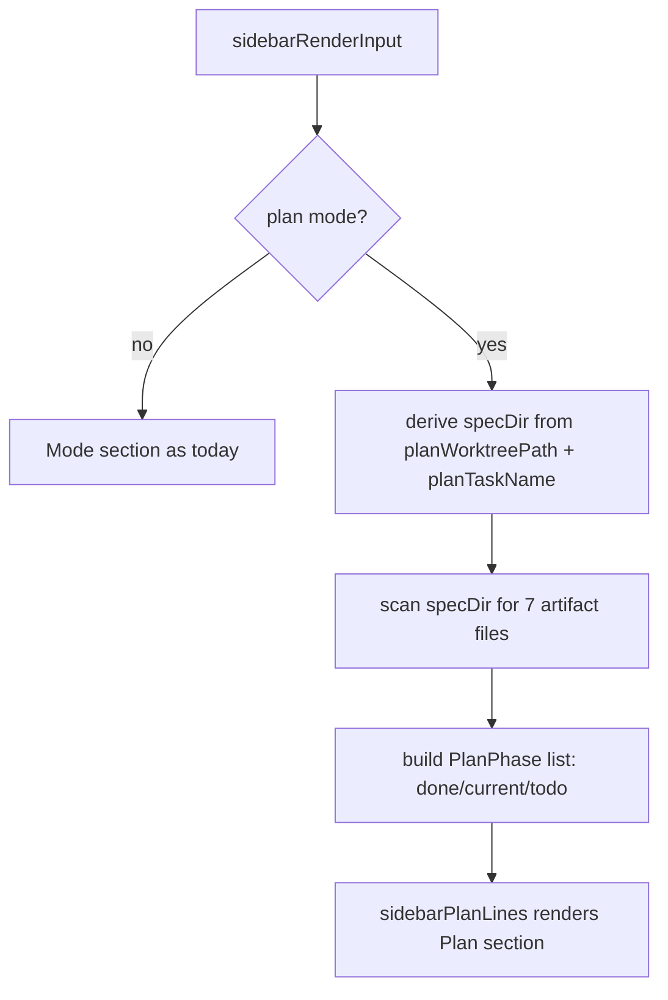

# Design: Plan Mode Phase Checklist

## Current State

The right sidebar (`internal/tui/sidebar.go`) renders a sequence of independent
sections. `sidebarModeLines` (`sidebar.go:208`) currently shows either:
- the `/run` checklist (`sidebarRunLines`) when a run is active, or
- a plain `Mode` heading with `[plan]` in peach when `m.mode == "plan"`.

The `/run` checklist pattern already exists: `ChecklistStep{Title, Done}` rendered
as `[x]` (green) / `[ ]` (overlay) in `sidebarRunLines` (`sidebar.go:226-250`).

In plan mode, the model has `m.planWorktreePath` and `m.planTaskName` set
(`plan.go:212-216`), so the spec directory is derivable as
`filepath.Join(m.planWorktreePath, "specs", m.planTaskName)` — the same pattern
`finishPlanWorktree` uses (`plan.go:246`).

## Desired End State

When in plan mode, the sidebar shows a **"Plan" section** listing the 7 PDD phases
as a checklist: the current phase marked `▶`, completed phases `[x]`, future
phases `[ ]`. The current phase is detected by scanning the spec directory for
which artifact files exist. The existing `Mode` section continues to show `[plan]`.

## Architecture

No new packages, no new files beyond tests. All changes live in
`internal/tui/sidebar.go`, `internal/tui/tui.go`, and new tests in
`internal/tui/sidebar_sections_test.go` (and/or `sidebar_test.go`).



## Components & Interfaces

### New type: `PlanPhase`

```go
// PlanPhase is one PDD phase in the plan-mode sidebar checklist.
type PlanPhase struct {
    Name string // short label, e.g. "Requirements"
    Done bool   // artifact file exists
}
```

### New function: `detectPlanPhases(specDir string) []PlanPhase`

Returns the 7 phases in order, each with `Done` set if its artifact exists. The
current phase is the first with `Done == false`; if all are done, the plan is
complete (all checked).

```go
// phaseArtifacts maps each PDD phase to the spec artifact that marks it complete.
var phaseArtifacts = []struct {
    Name     string
    Artifact string // file or dir name under specDir
}{
    {"Idea", "rough-idea.md"},
    {"Requirements", "requirements.md"},
    {"Research", "research"}, // directory
    {"Design", "design.md"},
    {"Outline", "outline.md"},
    {"Plan", "plan.md"},
    {"Prompt", "PROMPT.md"},
}

func detectPlanPhases(specDir string) []PlanPhase {
    phases := make([]PlanPhase, 0, len(phaseArtifacts))
    for _, pa := range phaseArtifacts {
        _, err := os.Stat(filepath.Join(specDir, pa.Artifact))
        phases = append(phases, PlanPhase{Name: pa.Name, Done: err == nil})
    }
    return phases
}
```

### New section renderer: `sidebarPlanLines`

```go
func sidebarPlanLines(in SidebarRenderInput, innerW int, st sidebarStyles) []string
```

Renders the "Plan" heading and the 7 phases. Returns `nil` when not in plan mode
or when no spec dir is available (so the section is hidden).

### `SidebarRenderInput` — add one field

```go
// PlanPhases is the PDD phase checklist shown in plan mode; nil/empty = hidden.
PlanPhases []PlanPhase
```

### `sidebarRenderInput` — populate the new field

In `internal/tui/tui.go`, inside `sidebarRenderInput`, when `m.mode == "plan"` and
`m.planWorktreePath != ""` and `m.planTaskName != ""`, derive the spec dir and call
`detectPlanPhases`:

```go
if m.mode == "plan" && m.planWorktreePath != "" && m.planTaskName != "" {
    specDir := filepath.Join(m.planWorktreePath, "specs", m.planTaskName)
    in.PlanPhases = detectPlanPhases(specDir)
}
```

### `sidebarModeLines` — render the Plan section

When `in.PlanPhases` is non-empty (plan mode), render the Plan section in addition
to (or instead of) the plain Mode indicator. The Plan section shows the phase
checklist; the `[plan]` mode indicator can remain or be folded into the Plan
heading.

## Data Models

No new persistent data models. `PlanPhase` is a transient render-time value.

## Patterns to Follow

- **Section renderer contract** — each section returns `nil` when hidden; `RenderSidebar`
  appends non-nil sections. The Plan section returns `nil` when not in plan mode.
- **`[x]`/`[ ]` checklist style** — reuse the exact style from `sidebarRunLines`
  (green for done, overlay for todo), plus a `▶` marker for the current phase.
- **Inline `os.Stat` existence checks** — matches the existing pattern in
  `plan.go` and `run.go`; no new helper needed.
- **Re-scan on every render** — `detectPlanPhases` is called each frame from
  `sidebarRenderInput`; cheap `os.Stat` calls, mirrors `/run` checklist behavior.

## Error Handling

- If the spec directory cannot be read (missing, permission error), `os.Stat`
  returns an error and the phase is marked `Done: false` — the checklist degrades
  gracefully to "all incomplete", no crash.
- If not in plan mode or plan fields are empty, `PlanPhases` stays nil and the
  section is hidden.

## Acceptance Criteria

- Given the user is in plan mode, when the sidebar renders, then a "Plan" section
  shows all 7 phases with the current phase marked `▶` and completed phases `[x]`.
- Given a phase's artifact file exists, when the sidebar renders, then that phase
  is shown as completed (`[x]`).
- Given the current phase's artifact is missing, when the sidebar renders, then
  that phase is shown as current (`▶`) and later phases as `[ ]`.
- Given all 7 artifacts exist, when the sidebar renders, then all phases are shown
  as completed.
- Given the user is NOT in plan mode, when the sidebar renders, then no "Plan"
  section is shown.
- Given the spec directory cannot be read, when the sidebar renders, then the
  checklist degrades gracefully (no crash; phases shown as incomplete).

## Testing Strategy

- **`TestDetectPlanPhases`** — create a temp spec dir, write a subset of artifact
  files, assert `detectPlanPhases` returns the correct `Done` flags and order.
- **`TestDetectPlanPhases_AllDone`** — write all 7 artifacts, assert all `Done`.
- **`TestDetectPlanPhases_None`** — empty dir, assert all `Done == false`.
- **`TestSidebarPlanLines`** (in `sidebar_sections_test.go`) — call
  `sidebarPlanLines` directly with a `SidebarRenderInput` containing `PlanPhases`,
  assert the rendered lines contain the phase labels, `[x]`/`[ ]` markers, and `▶`
  on the current phase.
- **`TestSidebarPlanLines_Hidden`** — with empty `PlanPhases`, assert the section
  returns 0 lines (hidden).
- **`TestRenderSidebar_PlanChecklist`** (in `sidebar_test.go`) — render the full
  sidebar with `Mode: "plan"` and `PlanPhases` set, assert the "Plan" section and
  phase markers appear; assert `[chat]` is absent.
- **`TestRenderSidebar_NoPlanSection`** — render with `Mode: "chat"` and no
  `PlanPhases`, assert no "Plan" section appears.
