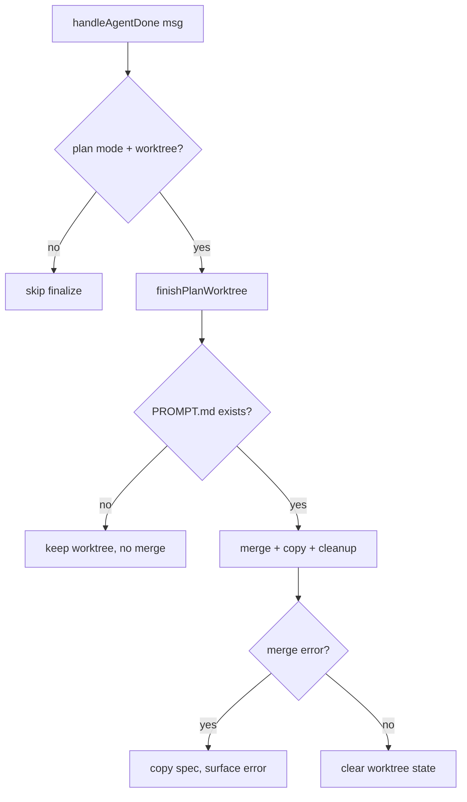

# Design: Plan Always Merge Worktree

## Current State

`handleAgentDone` (`internal/tui/agent_loop.go:1620`) is the single production
call site of `finishPlanWorktree`. It gates the call on three conditions
(`agent_loop.go:1626`):

```go
if msg.err == nil && m.mode == "plan" && m.planWorktree != nil {
    if err := m.finishPlanWorktree(); err != nil {
        msg.err = fmt.Errorf("finalize PDD worktree: %w", err)
    }
}
```

The `msg.err == nil` guard means: if the planning agent errors on the final turn
after producing `PROMPT.md`, `finishPlanWorktree` is never called, so the completed
spec is never merged into the current CWD branch. It survives only on the backup
branch (`specs/<task>`), not in the user's working tree.

`finishPlanWorktree` (`plan.go:228`) already gates the merge on `PROMPT.md`
existing: it returns early at line 248 if `os.Stat(promptPath)` fails, keeping the
worktree alive for the next turn. So a partial/abandoned plan already won't merge.

## Desired End State

`finishPlanWorktree` runs whenever in plan mode with an active worktree, regardless
of whether the agent turn errored. The `PROMPT.md` gate inside `finishPlanWorktree`
still decides whether the merge happens. The agent's error is still surfaced to the
user even when the merge succeeds.

## Architecture

A one-line change to the guard in `handleAgentDone`, plus tests. All changes are
confined to `internal/tui/` (per the requirement that all error handling stays in
the TUI layer).



## Components & Interfaces

### `handleAgentDone` — remove the `msg.err == nil` guard

```go
// Before:
if msg.err == nil && m.mode == "plan" && m.planWorktree != nil {
// After:
if m.mode == "plan" && m.planWorktree != nil {
```

The `finishPlanWorktree` error handling stays as-is: a finalize error is wrapped
and written into the local `msg.err`, which then drives the error UI path.

### `finishPlanWorktree` — unchanged

No changes to `plan.go`. The `PROMPT.md` gate (line 248) already ensures a partial
plan doesn't merge, and the merge-failure fallback (copy spec, return error) already
handles merge conflicts.

## Data Models

No new data models.

## Patterns to Follow

- **TUI-only changes** — no changes to `internal/subagent/` or other packages.
- **`finishPlanWorktree` as the single gate** — the merge decision stays in
  `finishPlanWorktree` (PROMPT.md existence), not in `handleAgentDone`.
- **Error surfacing** — reuse the existing `msg.err` → `MoodSad`/`AppendError`/
  `TraceLog` path; a finalize error is wrapped as `"finalize PDD worktree: %w"`.

## Error Handling

- **Agent error + completed plan:** `finishPlanWorktree` runs, merges, and the
  original `msg.err` is preserved (not overwritten) so the agent error is still
  surfaced. The finalize call must not clobber the existing `msg.err` on success.
- **Agent error + incomplete plan:** `finishPlanWorktree` returns early (PROMPT.md
  missing), worktree kept, `msg.err` preserved and surfaced.
- **Finalize error:** wrapped as `"finalize PDD worktree: %w"` and surfaced (as
  today). If `msg.err` was already set (agent error), the finalize error should
  take precedence or be combined — see note below.

**Note on error precedence:** currently, if `finishPlanWorktree` errors, it
overwrites `msg.err`. With the guard removed, `msg.err` may already hold an agent
error when `finishPlanWorktree` runs. The design keeps the existing behavior: a
finalize error overwrites `msg.err` (the finalize error is the more actionable one
— the merge failed). This matches the current code and is acceptable.

## Acceptance Criteria

- Given a completed plan (`PROMPT.md` exists) and a successful agent turn, when
  the turn ends, then the worktree is merged into the current branch (as today).
- Given a completed plan (`PROMPT.md` exists) and an agent turn that errored, when
  the turn ends, then the worktree is STILL merged into the current branch, AND the
  agent error is surfaced to the user.
- Given an incomplete plan (`PROMPT.md` missing) and an agent turn that errored,
  when the turn ends, then the worktree is NOT merged (kept for the next turn), AND
  the agent error is surfaced.
- Given `finishPlanWorktree` errors during the merge, when the turn ends, then the
  merge error is surfaced to the user.

## Testing Strategy

- **`TestHandleAgentDone_PlanWorktree_MergesOnError`** — set up a real worktree
  with `PROMPT.md` present, `m.mode = "plan"`, call `m.handleAgentDone(agentDoneMsg{err: ...})`,
  assert the spec is merged into the invoking checkout AND the error is surfaced
  (message `isError` true).
- **`TestHandleAgentDone_PlanWorktree_KeepsOnIncomplete`** — set up a real worktree
  with `PROMPT.md` absent, `m.mode = "plan"`, call `m.handleAgentDone(agentDoneMsg{err: ...})`,
  assert the worktree is retained (not merged) AND the error is surfaced.
- **`TestHandleAgentDone_PlanWorktree_NoErrorStillMerges`** — set up a real worktree
  with `PROMPT.md` present, `m.mode = "plan"`, call `m.handleAgentDone(agentDoneMsg{})`,
  assert the spec is merged (regression guard for the existing behavior).
- **`TestHandleAgentDone_NotPlanMode_NoFinalize`** — `m.mode = "chat"` with a
  worktree, call `m.handleAgentDone(agentDoneMsg{err: ...})`, assert `finishPlanWorktree`
  is not invoked (worktree retained, error surfaced).

These tests reuse the `initRunTestRepo(t)` + `subagent.NewOrchestrator` +
`orch.Worktree().Create(...)` pattern from `plan_test.go`.
