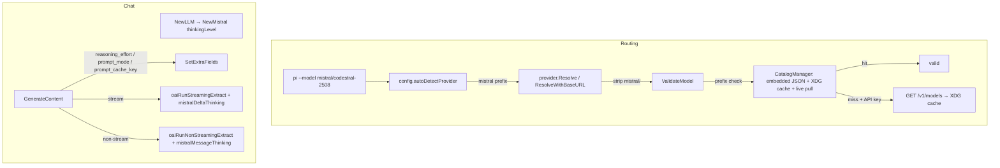

# Design: Mistral Provider (features/TOO/024-mistral-provider)

## 1. Current State

The Mistral provider already exists (`internal/provider/mistral.go`): it implements
`model.LLM` by routing through the openai-go SDK (`openai.ChatCompletionNewParams`)
against `https://api.mistral.ai/v1`. It is wired end-to-end (Resolve prefixes,
NewLLM switch, model catalog, env config, CLI help, `pi model list mistral`).

Four defects / gaps were identified during research:

1. **Routing/validation bug** — `mistral/codestral-2508` fails with
   `unknown openai model "mistral/codestral-2508"`. Root chain (confirmed):
   - `internal/config` `autoDetectProvider` lacks `mistral`/`magistral` prefixes,
     so a Mistral role model falls back to `DefaultProvider: "openai"`.
   - Callers force that wrong provider over the auto-detected one
     (`resolveSwitchedModel` interactive.go:1034-1037, cli.go:316-319).
   - `provider.Resolve` routes `mistral/` to the mistral provider but **does not
     strip** the prefix (unlike `azure/`, `ollama/`, `opencode/`, `openrouter/`,
     `openai/`), so `info.Model` keeps `mistral/codestral-2508` and
     `ValidateModel` rejects it.
   - No test covers any of these three divergences.

2. **No thinking-level plumbing** — `NewMistral` lacks the `thinkingLevel`
   parameter that 5 of 9 providers receive via `NewLLM`. Mistral-specific
   request fields (`reasoning_effort`, `prompt_mode`, `prompt_cache_key`) cannot
   be sent; openai-go has no SDK field for them.

3. **Thinking output is dropped** — Mistral reasoning models emit thinking in
   `delta.content` as a JSON array (`[{type:"thinking",thinking:[{type:"text",text}]}]`),
   but `ChatCompletionChunkChoiceDelta.Content` is a plain `string`, so the
   existing `oaiRunStreaming` silently discards it. The `oaiRunStreamingExtract`
   hook exists (used by OpenRouter) and can recover it from `chunk.RawJSON()`.

4. **Model list is thin** — `pi model list mistral` parses only the OpenAI
   envelope `{"data":[{"id","owned_by"}]}` via `listBearerModels`. The documented
   Mistral card has `capabilities`, `max_context_length`, `aliases`, `root`.

5. **Static catalog** — `KnownModels` is a compile-time snapshot
   (`mustLoadKnownModels`, `//go:embed modeldata/*.json`), refreshed manually.
   Dated models (e.g. `codestral-2508`) are not in the embedded list (though
   prefix-matching on `codestral` accepts them once the prefix bug is fixed).

## 2. Desired End State

- `mistral/codestral-2508` (and bare `codestral-2508`, `mistral-*`,
  `magistral-*`) resolves to the Mistral provider with the prefix stripped, and
  validates.
- Config roles can auto-detect Mistral models without falling back to "openai".
- Mistral chat sends `reasoning_effort`/`prompt_mode` from the thinking level,
  and `prompt_cache_key` for caching, injected as extra JSON fields.
- Mistral thinking blocks stream as `thinking`-role partials (💭 in TUI) and
  are preserved on the non-streaming path.
- `pi model list mistral` shows richer card fields (context window, capabilities).
- The per-provider model catalog is refreshable: embedded JSON is the offline
  fallback, a Makefile task fetches fresh catalogs into the repo before a PR,
  and at runtime a validation miss pulls fresh into the XDG cache.

## 2. Architecture Overview



## 3. Components & Interfaces

### 3.1 Provider routing fixes (`internal/provider/provider.go`, `internal/config/config.go`)

```go
// provider.go — Resolve()
// Add a mistral/ prefix strip BEFORE the modelPrefixes loop, mirroring azure/:
if strings.HasPrefix(lower, "mistral/") {
    return Info{Provider: "mistral", Model: modelName[len("mistral/"):]}, nil
}

// config.go — modelPrefixes map gains mistral/magistral
var modelPrefixes = map[string]string{
    "claude": "anthropic", "gpt": "openai", "gpt-5": "openai",
    "gemini": "gemini", "mistral": "mistral", "magistral": "mistral", "grok": "xai",
}
```

Notes:
- Add the strip in `Resolve` only (it is the function the prefix map lives in).
  `ResolveWithBaseURL` delegates to `Resolve` for non-openai names, so the
  `mistral/` strip flows through both paths automatically.
- Do NOT touch the caller override logic (`resolveSwitchedModel`,
  `resolveRuntimeModelForRole`): with config auto-detecting `mistral` correctly,
  the role's `providerName` will be "mistral", making the override a no-op.
  Keep the override semantics (explicit role provider wins) intact.

### 3.2 Mistral chat provider (`internal/provider/mistral.go`)

```go
// NewMistral gains a thinkingLevel parameter (mirroring NewOpenRouter/NewXAI).
func NewMistral(_ context.Context, modelName, apiKey, baseURL, thinkingLevel string, llmOpts *LLMOptions) (model.LLM, error)

type mistralModel struct {
    modelName     string
    client        openai.Client
    thinkingLevel string      // stored verbatim, like openrouterModel
    promptCacheKey string     // per-instance uuid.NewString(), like xai
}

// provider.go NewLLM switch: pass cfg.ThinkingLevel
case "mistral":
    return NewMistral(ctx, info.Model, apiKey, baseURL, thinkingLevel, opts)
```

In `GenerateContent`, before the stream/non-stream split:

```go
params.SetExtraFields(map[string]any{
    "prompt_cache_key": m.promptCacheKey,
})
if effort := mistralReasoningEffort(m.thinkingLevel); effort != "" {
    params.SetExtraFields(map[string]any{"reasoning_effort": effort})
} else if m.usesPromptModeReasoning(modelName) {
    params.SetExtraFields(map[string]any{"prompt_mode": "reasoning"})
}
```

New helpers in `mistral.go` (all unit-tested):

```go
// mistralReasoningEffort maps pi's thinking level to Mistral's reasoning_effort.
// Mistral accepts "none"|"minimal"|"low"|"medium"|"high"|"xhigh".
// Only models that support reasoning_effort get it (mistral-small-2603,
// mistral-small-latest, mistral-medium-3.5); others get prompt_mode:"reasoning".
func mistralReasoningEffort(modelName, level string) string

// mistralUsesReasoningEffort reports whether a model id takes reasoning_effort
// instead of prompt_mode. (Reference TS: mistral-small-2603,
// mistral-small-latest, mistral-medium-3.5.)
func mistralUsesReasoningEffort(modelName string) bool

// mistralDeltaThinking extracts thinking text from a streaming chunk's raw JSON:
// choices[].delta.content may be a string (answer) or an array of chunks whose
// type == "thinking" carry thinking[].text.
func mistralDeltaThinking(rawChunk string) string

// mistralMessageThinking extracts thinking from a non-streaming completion's
// raw JSON: choices[0].message.content array, same chunk shape.
func mistralMessageThinking(rawResponse string) string
```

Streaming wiring — switch to the Extract variants:

```go
if stream {
    retryStream(ctx, streamRetryConfig(), yield, func(y func(*model.LLMResponse, error) bool) {
        oaiRunStreamingExtract(ctx, &m.client, params, y, mistralDeltaThinking)
    })
} else {
    oaiRunNonStreamingExtract(ctx, &m.client, params, yield, mistralMessageThinking)
}
```

**prompt_cache_key source:** follow the xAI precedent — a per-instance
`uuid.NewString()` generated in `NewMistral`. Comment documents that one model
instance ≈ one pi session, which is exactly the scope Mistral's cache is keyed
on. Optionally the header `x-affinity` with the same value (reference TS sets
both body `prompt_cache_key` and `x-affinity` header) — design decision: keep
scope minimal, body key only, matching what the Chat Completions docs name.

### 3.3 Mistral model list enrichment (`internal/provider/list_models.go`, `internal/cli/model.go`)

```go
// ModelInfo gains optional card fields used only by Mistral's printer.
type ModelInfo struct {
    ID            string   `json:"id"`
    OwnedBy       string   `json:"owned_by,omitempty"`
    ContextWindow int64    `json:"-"` // max_context_length, when known
    Capabilities  []string `json:"-"`  // chat/vision/etc, when known
}

// New dedicated Mistral parser replacing listBearerModels for mistral.
func listMistralModels(ctx context.Context, opts ListModelsOptions) ([]ModelInfo, error)
// GET <base>/v1/models (same endpoint logic as listBearerModels), but parses:
// {"data":[{"id","owned_by","max_context_length","capabilities":{
//   "completion_chat":bool,"vision":bool,...}}]}
// Filters to completion_chat-capable models (like the TS generator's
// tool_call filter); context length and capabilities copied through.
```

CLI (`internal/cli/model.go`): in `printProviderModels`, when the provider is
`mistral` and a model has `ContextWindow > 0`, print an extra column:
`  %-45s  %-10s  %s\n` (ID, humanTokens(ContextWindow), capabilities summary).
Other providers' output is byte-identical (fields empty → old layout).

### 3.4 Refreshable catalog (`internal/provider/model_catalog.go`, new `catalog.go`)

Design decisions (from requirements Q8b/Q9/Q9b/Q10):

- **Embedded baseline stays** (`//go:embed modeldata/*.json`) — now including a
  new `modeldata/models-<provider>.json` per provider, produced by the Makefile
  fetch task and committed to the repo before the PR.
- **Runtime refresh:** when `ValidateModel` misses AND the provider has an API
  key, call `GET /v1/models` and persist to the XDG cache. On later startups
  the XDG cache is loaded in preference to the embedded snapshot.
- **Cache location:** `os.UserCacheDir()/pi-go/models/<provider>.json` — new
  pattern for this project (research confirmed no os.UserCacheDir usage
  anywhere); documented in the design and README.
- **Makefile task:** `make fetch-models` calls the same ListModels/fetch logic
  (via a small internal helper or script) for every provider and writes the
  per-provider JSON under `internal/provider/modeldata/`. It does NOT require
  keys for every provider — missing keys skip that provider with a note.

New files/interfaces:

```go
// internal/provider/catalog.go
// Catalog returns the current known-model prefixes for a provider: XDG cache
// first (if present), else embedded snapshot.
func CatalogFor(provider string) []string

// RefreshCatalog pulls fresh models for a provider into the XDG cache,
// falling back to the embedded snapshot on error.
func RefreshCatalog(ctx context.Context, providerName string, opts ListModelsOptions) error

// FetchCatalogToRepo fetches provider catalogs and writes them into
// internal/provider/modeldata/ as <provider>.json — used by `make fetch-models`.
func FetchCatalogToRepo(ctx context.Context, providers []string) error
```

`ValidateModel` (provider.go:301-317) becomes:

```go
known, ok := KnownModels[info.Provider]
if !ok { return nil }
// consult runtime catalog (XDG cache or embedded) instead of the static list
known = CatalogFor(info.Provider)
// on prefix miss and API key present: refresh once, re-check
```

Catalog merge order: runtime catalog (XDG cache) supersedes embedded snapshot;
the embedded snapshot always remains the fallback (offline). Prefix-based
matching stays; model_catalog.go keeps its hard-coded lists as the embedded
baseline for gemini/mistral/xai (the Makefile task regenerates them).

## 4. Data Models

```go
// modeldata/mistral.json (checked in, generated by `make fetch-models`)
{
  "provider": "mistral",
  "fetched_at": "2026-08-27T00:00:00Z",
  "models": [
    {"id": "mistral-large-latest", "owned_by": "mistral",
     "max_context_length": 128000, "capabilities": ["completion_chat","vision"]},
    ...
  ]
}
```

The XDG cache file has the same shape. Context windows keep flowing through
`context-windows.json` (unchanged); the new per-model context length from the
live card is used for display only (no compaction changes in this spec).

## 5. Error Handling

- `NewMistral` keeps `mistral API key is required (set MISTRAL_API_KEY)`.
- `mistralReasoningEffort` returns `""` for unknown levels (field omitted) — the
  openrouter/xai convention.
- Thinking-extraction hooks are best-effort: malformed raw JSON yields `""` and
  the chunk text/answer still renders.
- Catalog refresh: network failures are non-fatal — validation falls back to the
  cached/embedded list; `pi model list` already reports per-provider errors to
  stderr and continues.
- `RefreshCatalog` writes atomically (temp file + rename) to avoid corrupting
  the cache on interruption.

## 6. Acceptance Criteria (Given/When/Then)

### Routing & validation
- Given a pi invocation `--model mistral/codestral-2508`, when the model resolves,
  then no `unknown openai model` error is raised and `info.Model == "codestral-2508"`.
- Given a config role with `model: mistral-large-latest` and no explicit provider,
  when `ResolveRole` runs, then provider == "mistral" (not the default "openai").
- Given `Resolve("mistral/mistral-small-latest")`, when it returns,
  then `Provider == "mistral"` and `Model == "mistral-small-latest"`.

### Mistral chat fields
- Given a Mistral model + thinkingLevel "high", when GenerateContent builds params,
  then the JSON body contains `reasoning_effort: "high"` (for
  mistral-small-2603/latest, mistral-medium-3.5) or `prompt_mode: "reasoning"`
  (for magistral-*) — asserted via httptest request-body capture.
- Given thinkingLevel "none", when params are built, then no
  reasoning_effort/prompt_mode fields are present.
- Given a session (one model instance), when any request is sent,
  then every request carries the same non-empty `prompt_cache_key`.
- Given a streaming response whose chunks contain thinking blocks
  (`delta.content` array with type:thinking), when consumed,
  then thinking text is yielded as `Content{Role: "thinking"}` partials and the
  final answer text is intact.

### Mistral model list
- Given `pi model list mistral` with a server returning the documented card,
  when run, then output shows id plus context window and chat/vision flags for
  models that have them, and omits the extra column when empty.
- Given `pi model list openai`, when run, then output is unchanged.

### Refreshable catalog
- Given an XDG cache containing a provider catalog, when ValidateModel runs
  against an ID from that catalog, then it passes even if the ID is not in the
  embedded snapshot.
- Given no API key, when ValidateModel misses, then it does NOT call the network
  and returns the embedded-list error.
- Given a Makefile run of `make fetch-models`, then
  `internal/provider/modeldata/*.json` files are (re)generated from live
  provider APIs, and `go build ./...` still succeeds (embedded files valid).

## 7. Testing Strategy

- **Unit (httptest):** `mistral_test.go` additions — request-body assertions for
  reasoning_effort/prompt_mode/prompt_cache_key; thinking extraction from
  synthetic chunks (stream + non-stream); prefix-strip resolution tests;
  config autoDetectProvider mistral cases; catalog cache load/refresh tests
  with temp XDG dir.
- **E2E (`//go:build e2e`, skip without `MISTRAL_API_KEY`):** extend
  `mistral_e2e_test.go` with a reasoning-model test asserting thinking content
  appears and a multi-turn test asserting cache-key stability. Mirror
  openrouter/xai e2e style.
- **CLI:** `model_test.go` update for the richer Mistral output; keep other
  providers' existing assertions.
- **Regression:** existing `TestNewMistral*`, `TestResolveMistralModels`,
  `TestResolveMistralViaOllamaPrefix`, `TestMistralNonStreaming/Streaming/WithToolCalls`
  must all still pass (signature change to `NewMistral` means updating call
  sites in tests to pass a thinkingLevel).

## 8. Non-Goals (explicitly out of scope)

- No direct HTTP client for Mistral chat (openai-go SDK stays).
- No third-party Mistral Go SDK.
- Other documented chat fields (response_format, parallel_tool_calls,
  random_seed, safe_prompt, service_tier, guardrails) not wired.
- No changes to the OpenRouter/xAI/OpenAI/anthropic providers' request paths.
- Other providers' `pi model list` output unchanged.
- No x-affinity header (body prompt_cache_key only, matching Chat Completions docs).
