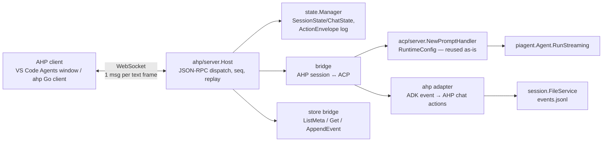

# Design — pi-go Agent Host (AHP) Server

## Goal

pi-go gains a standalone **Agent Host Protocol (AHP) server** (`pi agent-host`) that exposes
pi-go agent sessions to any AHP client over WebSocket, bridging internally to the **existing
ACP server composition** (`internal/acp/server`). Sessions are persistent, re-attachable, and
listed from pi-go's on-disk session store. Extension-side work is out of scope.

## Current state (facts from research/)

- `internal/acp/server` implements `acp.Agent` (coder/acp-go-sdk v0.13.5) over stdio; the agent
  composition (`RuntimeConfig` → `NewPromptHandler`, sandbox/tools/LLM/subagents/LSP/MCP,
  auto-compact) lives in `runtime.go` and is transport-independent: `PromptHandler
  func(ctx, PromptTurn) (PromptResult, error)` with streaming via `SessionUpdater.Update`.
- `internal/session.FileService` persists ADK `session.Event`s as JSONL per session dir
  (meta.json/events.jsonl/branches); `ListMeta`, `Get`, `AppendEvent`; replay precedents:
  `acp/server/replay.go`, `tui/session_restore.go`. No event-kind enum — shape-classified.
- Existing RPC servers (`jsonrpc` unix-socket, `pirpc` stdio) are transport-coupled; nothing
  reusable for WebSocket except patterns (`webserver` has gorilla/websocket + token auth).
- AHP (spec v0.9.0): JSON-RPC 2.0; `channel: URI` on every params; channels `ahp-root://`,
  `ahp-session:/<uri>`, `ahp-chat:/<uri>`; state-first — snapshot + ordered `ActionEnvelope
  {serverSeq, origin?, rejectionReason?}`; `reconnect` replays or re-snapshots. Official Go
  lib (`github.com/microsoft/agent-host-protocol/clients/go` v0.6.0) is **client-only**;
  `ahptypes` subpackage has the generated wire types. VS Code's Agents window has no
  documented path to attach an arbitrary third-party host (microsoft/vscode#325827) —
  generic AHP clients are the guaranteed consumers.

## Desired end state

`pi agent-host` serves AHP over WebSocket at `--addr` (default `127.0.0.1:8931`), gated by a
connection token. Any AHP client can: list pi-go sessions (past + live), create a session
(bridged to a pi-go agent runtime), run turns with streaming parts and tool-call cards,
confirm tools, cancel, disconnect/reconnect without losing state, and re-attach to old
sessions with full transcript replay (`fetchTurns`).

## Architecture



## Components & interfaces (new package `internal/ahp/server`)

```go
// host.go — composition root per connection; owns registry + state manager.
type Host struct {
    Provider   string                       // "pi-go"
    Version    string
    Bridge     Bridge                       // session creation + prompt turns
    Store      SessionStore                 // past sessions (nil-safe)
    State      *StateManager                // snapshots + envelopes + replay
    Auth       *AuthManager                 // token gate + protected resources
    Protected  []ahptypes.ProtectedResourceMetadata
    Logger     *slog.Logger
}
func NewHost(cfg Config) *Host
// Config{Addr, Token string, Model, BaseURL string; Headers []string; Insecure bool;
//  System string; SessionService adksession.Service; LoadConfig func() (config.Config, error);
//  SandboxRootFunc func(string) string; Logger *slog.Logger}
func (h *Host) ListenAndServe(ctx context.Context) error // WS upgrade + per-conn loop

// connection.go — one per WebSocket conn. Dispatch by (method, params.channel).
type connection struct{ /* ws conn, clientId, subscriptions map[URI]*subscription */ }
// handles: initialize, ping, reconnect, subscribe, unsubscribe, listSessions,
//          createSession, disposeSession, fetchTurns, resolveSessionConfig, authenticate;
// notifications out: action, root/*, auth/required; in: dispatchAction, unsubscribe.

// bridge.go — wraps acp/server composition. Reuses RuntimeConfig + NewPromptHandler verbatim.
type Bridge interface {
    CreateSession(ctx context.Context, uri URI, cfg CreateParams) (*sessionHandle, error)
    RestoreSession(ctx context.Context, uri URI, storeID string) (*sessionHandle, error)
    Dispose(uri URI) error
}
type sessionHandle struct {
    ACPID     string          // StoreSessionID-mapped
    DefaultChat URI
    Chats     map[URI]*chatHandle
}
type chatHandle struct {
    Cancel(context.Context) bool           // routes to in-flight turn (precedent cancel.go)
    // turn execution = acp PromptHandler; streaming via adapter.SessionUpdater impl
}

// adapter/stream.go — ADK event → AHP chat actions (mirrors acp/server/adapter).
type SessionUpdater struct{ /* emit(ctx, chatURI, StateAction) */ }
func (s *SessionUpdater) OnEvent(ctx context.Context, ev *adksession.Event) error
func (s *SessionUpdater) OnToolStart(ctx, name, args string) (callID string, err error)
func (s *SessionUpdater) OnToolEnd(ctx, callID, args, result string, runErr error) error
func (s *SessionUpdater) OnBashOutput(ctx, output string) error

// state.go — authoritative state, reducers, sequencing, replay.
type StateManager struct{ /* per-channel seq, ring buffers */ }
func (m *StateManager) Snapshot(uri URI) (ahptypes.Snapshot, bool)
func (m *StateManager) Dispatch(ctx context.Context, sub URIs, action ahptypes.StateAction) // stamps serverSeq, applies reducer, buffers, broadcasts
func (m *StateManager) Replay(since map[URI]int64) ([]ahptypes.ActionEnvelope, []URI)      // or fresh snapshots on overflow

// store.go — mirror of acp/server/store.go over pisession.FileService.
type SessionStore interface {
    List(ctx context.Context) ([]pisession.Meta, error)
    Load(ctx context.Context, storeID string) (iter.Seq[*adksession.Event], func() (int64, error), error)
}
type SessionSummary struct { StoreID, Cwd, Title string; Provider, Model string; UpdatedAt time.Time; Live bool }

// auth.go
type AuthManager struct{ /* connection token (WS handshake), provider tokens */ }
func (a *AuthManager) Handshake(r *http.Request) error            // ?tkn= or Authorization: Bearer
func (a *AuthManager) OnAuthenticate(ctx context.Context, params AuthenticateParams) error
func (a *AuthManager) RequireAuth(agentInfo piagent.Info) bool
```

CLI: `internal/cli/agent_host.go` — `newAgentHostCmd()` (`Use: "agent-host"`, flags `--addr`,
`--token`, `--model`, `--url`, `--header`, `--insecure` mirroring acp_server.go) registered in
`cli.go:265-275` block. Mirrors `runACPServer` (signal.NotifyContext, err-log file, store open).

## Data models & mappings

| pi-go concept | AHP representation |
|---|---|
| `pisession.Meta` | `SessionSummary` in `listSessions` + `root/sessionAdded/SummaryChanged` |
| store session id | session URI `ahp-session://pi-go/<id>`; hostile ids via `StoreSessionID` hash |
| ACP session (live bridge) | `SessionState{lifecycle, chats:[default chat], defaultChat, workingDirectories, provider:"pi-go"}` |
| ADK turn (one `session/prompt`) | `Turn` on chat channel: `chat/turnStarted` → parts → `chat/turnComplete|Cancelled|Error` |
| ADK text part (streaming) | `chat/responsePart{kind:markdown,id}` + `chat/delta{partId,content}` |
| ADK thought part | `chat/responsePart{kind:reasoning}` + `chat/delta` |
| tool call (via `extension.BuildToolCallCallbacks`) | `chat/toolCallStart` → `toolCallDelta` → `toolCallReady{confirmed:'setting'}` → `toolCallComplete{result}` |
| pi-go auto-approve (no permission flow) | `toolCallReady.confirmed = 'setting'` ⇒ straight to `running` |
| MCP server auth required | `chat/toolCallAuthRequired` + `inputNeeded{kind:toolAuthentication}` → client `authenticate` → `chat/toolCallAuthResolved` |
| provider OAuth (protected resource) | `auth/required` notification / `-32007` with `data.resources`; client resolves via `authenticate` |
| JSONL event history | `ChatState.turns` initial snapshot (part-walk as in `acp/server/replay.go`) + `fetchTurns` pagination |
| in-flight turn cancellation | `chat/turnCancelled` (routes to `sessionState.cancel` precedent) |

State authority: `StateManager` holds live `SessionState`/`ChatState`; past sessions are
materialized from the store on subscribe. Envelope `serverSeq` is one global monotonic counter
per host process (spec requires per-channel ordering only; global counter satisfies it).
Replay buffer: per-channel ring of 1024 envelopes; `reconnect` with larger gap ⇒ fresh snapshots.
Optimistic reconciliation: v1 echoes client actions with `origin{clientId, clientSeq}` (or
`rejectionReason`); concurrent multi-client turn arbitration is out of scope (single driving
client), but a second client may subscribe read-only (`interactivity` respected at consumers).

## Patterns to follow (from this codebase)

- Mirror `internal/acp/server` file/package layout and naming (agent/session/store/replay/adapter).
- Reuse `acp/server.RuntimeConfig` + `NewPromptHandler` unchanged (no duplicate composition —
  avoids TODO-8/14/37 double composition root; a follow-up refactor may share `internal/appinit`).
- CLI: one file per command, `newXCmd()` + registration line (acp_server.go pattern).
- stdio-less servers: follow `webserver` for gorilla/websocket upgrade, same-origin/token check,
  graceful shutdown (`Shutdown` closes listener + sessions).
- stdlib-only tests, hand-rolled mocks, table-driven where shape varies; `t.TempDir()` stores.
- Wire types imported from `ahptypes` (generated; CI-enforced parity with the TS spec) —
  never hand-copy shapes.

## Error handling strategy

- JSON-RPC errors per spec codes (from `ahptypes/errors.generated.go`): `-32001` SessionNotFound,
  `-32003` SessionAlreadyExists, `-32004` TurnInProgress, `-32005` UnsupportedProtocolVersion
  (with `data.supportedVersions`), `-32007` AuthRequired (with `data.resources`), `-32601/-32602`.
- Client actions validated before apply; invalid ⇒ echo with `rejectionReason` (never silently
  dropped except unknown-channel, which is silently ignored per spec).
- `initialize` version negotiation: accept from `ahptypes.SupportedProtocolVersions()`.
- Bridge turn errors → `chat/error` action (resumable=false for provider failures; maps
  `piagent.EventError` precedent) then `chat/turnComplete`-equivalent `TurnState.Error`.
- Provider disconnect: keep sessions alive (host owns them); connections just drop.
  Host shutdown: cancel ctx, `cleanup()` per live piSessionState (bash kill-all, LSP/orchestrator
  shutdown, sandbox close) — fixing the "no disposal hook" gap noted in ACP server research.
- WS auth failures: HTTP 401 before upgrade; AHP-level auth failures: `auth/required` or `-32007`.
- LLM diagnostics to slog only — never to the WebSocket.

## Acceptance Criteria

### Connection & negotiation
- Given a running `pi agent-host --token T`, when a client opens WS to `/` with the wrong token,
  then the HTTP upgrade is rejected before any JSON-RPC traffic.
- Given a client sends `initialize` offering `["0.9.0","0.8.0"]`, then it receives
  `protocolVersion:"0.9.0"`, `serverInfo.name:"pi-go"`, and snapshots for each requested channel.
- Given `initialize` with only unsupported versions, then the server replies `-32005` with
  `data.supportedVersions`.

### Session catalog & persistence
- Given pi-go's store has ≥1 past session, when a client calls `listSessions`, then summaries
  include it (id, title, cwd, provider, updatedAt).
- Given a client `subscribe`s to a past session's URI, then it receives a `SessionState` snapshot
  replayed from JSONL events, and `fetchTurns` pages older turns.
- Given `createSession` on an in-use URI, then `-32003 SessionAlreadyExists`.

### Chat turns
- Given a ready session's default chat, when the client dispatches `chat/turnStarted` (user
  message) then sends `prompt` via the bridge, then the client receives sequenced
  `chat/responsePart`+`chat/delta` for text and thought, `turnComplete` at end.
- Given a tool call during a turn, then the client sees `toolCallStart→Delta→Ready(confirmed:
  'setting')→Complete` with result content, in order.
- Given an in-flight turn, when the client dispatches `chat/turnCancelled`, then the turn ends
  `cancelled` and pi-go's ctx-cancel path runs (`StopReasonCancelled`).

### Confirmation & auth
- Given an MCP tool needing auth, when it runs, then `chat/toolCallAuthRequired` + a
  `session.inputNeeded{kind:toolAuthentication}` entry appear, and after the client's
  `authenticate` the host dispatches `chat/toolCallAuthResolved` and clears the entry.

### Sync & reconnection
- Given every `action` notification, then its `serverSeq` is strictly increasing and a client
  echo of its own dispatched action carries matching `origin{clientId, clientSeq}`.
- Given a dropped connection, when the client sends `reconnect{lastSeenServerSeq}`, then it
  receives missed envelopes in order, or fresh snapshots when the gap exceeds the buffer.
- Given the host is restarted, when a client re-subscribes to a previous session URI, then it
  gets a valid snapshot from the store and can continue prompting (re-attach).

### Protocol hygiene
- Given any client-dispatched invalid action, then it is echoed with `rejectionReason` set, and
  unknown-channel actions produce no echo.
- Given `pi agent-host` runs with no store directory, then it still serves (in-memory sessions)
  and `listSessions` returns only live sessions.

## Testing strategy

- **Unit (stdlib `testing`)**: state manager reducers + seq/replay ring (table-driven);
  adapter event→action mapping (table-driven over synthetic ADK events, mirroring
  `acp/server/adapter` tests); store bridge (`t.TempDir()` FileService + seeded JSONL);
  auth manager token/protected-resource logic; connection dispatch (in-memory transport).
- **Protocol conformance with the official client**: integration tests (build tag `integration`)
  using `ahp`+`ahpws` (github.com/microsoft/agent-host-protocol/clients/go) against a spinning
  in-process host: initialize negotiation, subscribe→snapshot, createSession→prompt→parts→
  toolCall sequence, cancel, reconnect replay, authenticate flow. This is the primary gate that
  our server speaks real AHP.
- **Bridge tests**: `EchoPromptHandler` + fake `SessionUpdater`-like emitter asserting the exact
  ordered action sequence for scripted ADK event streams (same approach as acp/server tests);
  cancellation mapping; error mapping to `chat/error`.
- **Concurrency**: turn serialization per chat (`ps.mu`-equivalent), `go test -race` on the new
  package (unlike `acp/server`, keep it race-clean so CI's grep-exclusion is not needed).
- **Manual gate**: `pi agent-host` + `clients/go/examples/connect_ws` against a real session.