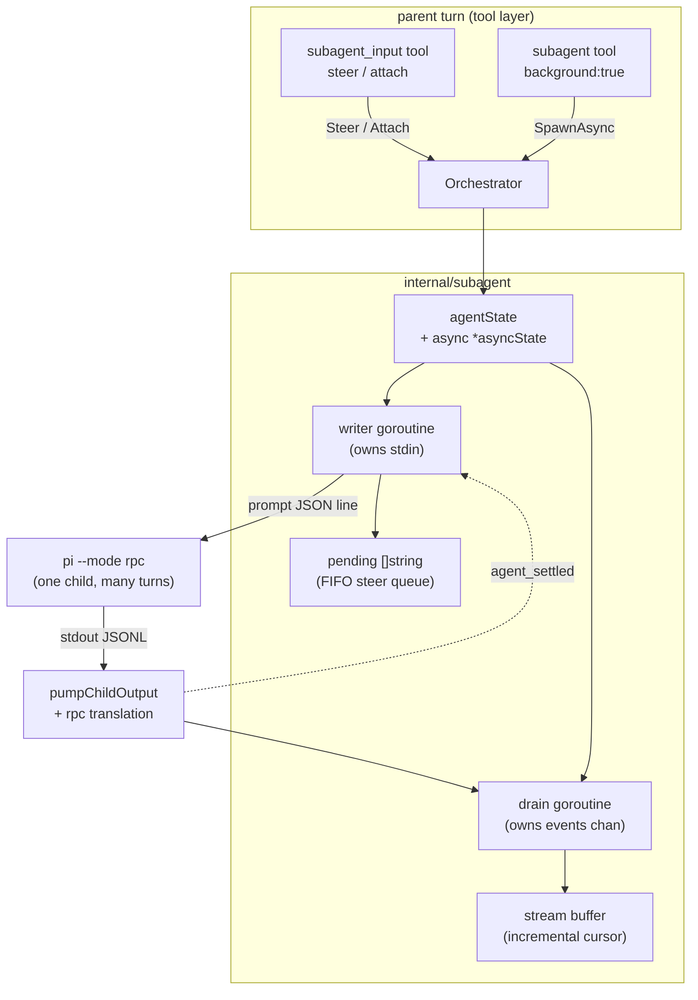

# Design: Async Subagent Spawn + Steer

Status: design (Phase 4). Requirements: `requirements.md` (12 Q&As, R1–R12).
Research: `research/01..05`.

## 1. Current state

The `subagent` tool (`internal/tools/subagent.go`) has three modes — single,
parallel, chain — and **all of them block** until the child's event channel
closes (`subagent.go:252`, `:411`).

The spawn path is strictly one-shot:

- `Spawner.Spawn` (`internal/subagent/spawner.go:237`) → `buildCommand` (`:136`)
  → `spawnArgs` (`:110`) emits `--mode json` plus the **prompt as a positional
  argument**, and `cmd.Stdin` is **never set** anywhere in the package.
- `pumpChildOutput` (`:272`) reads stdout JSONL, accumulates `text_delta` into
  `Process.result`, and closes `Process.events` on exit.
- `Orchestrator.Spawn` (`orchestrator.go:419`) acquires a pool slot, tracks an
  `agentState`, and starts `forwardAgentEvents` (`:609`), which republishes
  events on a `<-chan Event` and — critically — does a **blocking**
  `out <- ev` (`:617`) and releases the pool slot only when the stream closes
  (`:611`).

Three facts constrain the design:

| Fact | Anchor | Consequence |
|---|---|---|
| `SpawnInput.Background` is **dead** — declared, never read | `types.go:17` | The field becomes live here. |
| `pi --mode rpc` is already a steerable stdin server: newline-JSON commands, keeps serving after each turn, `abort` cancels the in-flight turn | `internal/pirpc/rpc.go:121-135,161-196` | The child side already exists; nothing in `pirpc` needs changing. |
| `agentState` retains **no** session id, cancel func, or consumer channel | `orchestrator.go:92-103` | There is no way to reach back into a running child today. |

rpc event schema (`rpc.go:273-274,344-363,385-393`) differs from the `--mode json`
schema the pump parses (`spawner.go:383-393`): text is nested under
`assistantMessageEvent`, tools use `toolName`/`args`, and **there is no `error`
event type** — failures arrive as assistant text (`rpc.go:395-402`). Feeding rpc
lines to the current pump silently drops all text and tool information, so a
**translation layer is required**, not optional.

## 2. Desired end state

With `PI_SUBAGENT_ASYNC=1`:

- `subagent{agent, task, background: true}` spawns a pi-binary child on
  `--mode rpc`, returns immediately with `running: true` + an `agent_id`, and the
  child keeps running after the tool returns, after the spawning turn ends, and
  after the user interrupts the parent turn.
- `subagent_input{agent_id, message}` delivers `message` as the child's **next**
  turn (queued, never injected mid-turn) and returns output accumulated since the
  caller's last read.
- `subagent_input{agent_id}` (no message) is a read-only attach with the same
  incremental semantics.
- A finished agent returns its final result **idempotently** until evicted.

With the flag unset: **nothing changes.** No rpc child, no `subagent_input` in the
tool list, and `background: true` returns a "disabled" result.

## 3. Architecture overview



The child is **one process with many turns**. The parent owns two goroutines per
async agent: a **writer** that turns the queue into `prompt` writes, and a
**drainer** that consumes the event channel into a bounded buffer.

## 4. Components and interfaces

### 4.1 Protocol selection

```go
// internal/subagent/spawner.go
type SpawnOpts struct {
    // ...existing fields...
    // Mode selects the child's output protocol: "" or "json" is the one-shot
    // --mode json path (blocking, prompt in argv); "rpc" is the steerable
    // --mode rpc path (stdin-driven, many turns, no positional prompt).
    Mode string
}
```

`spawnArgs` emits `--mode rpc` and **no positional prompt** when `Mode == "rpc"`.
This is safe: `dispatchMode`'s rpc branch (`internal/cli/cli.go:1150-1174`)
returns *before* the `prompt == ""` check at `:1176`, so `pi --mode rpc` with no
arguments is legal.

**The initial task therefore travels over stdin, not argv (codex finding B.1).**
This has one hard consequence the design must state: `Spawner.Spawn` currently
**rejects an empty prompt** before spawning (`spawner.go:236-245`), so for rpc
mode the guard must move — the prompt is required but is delivered by
`SendPrompt` after the process is up, not validated as argv content. Concretely:

- `Spawn` keeps rejecting an empty prompt for `Mode == ""`/`"json"` (unchanged).
- For `Mode == "rpc"`, `Spawn` requires a prompt too (it is turn 1), but stores it
  for the writer instead of appending it to argv. It is written via `SendPrompt`
  immediately after the process starts, so **there is exactly one code path that
  writes turns** — no special-case first turn.


### 4.2 Turn signalling and rpc translation

`Process` gains rpc-aware fields:

```go
type Process struct {
    // ...existing fields...
    rpc     bool
    settled chan struct{} // buffered(1); signalled on each agent_settled
    acks    chan ack      // per-turn command acknowledgements (§4.4c)
    done    chan struct{} // closed when the child exits
}

// SendPrompt writes one turn to the child's stdin. The caller MUST have
// observed a settle (or be the first turn) before calling.
func (p *Process) SendPrompt(prompt string) error
// Settled returns the channel signalled when the child finishes a turn.
func (p *Process) Settled() <-chan struct{}
// Acks returns per-turn command acknowledgements, so a rejected prompt can
// fail the turn instead of leaving the writer waiting forever.
func (p *Process) Acks() <-chan ack
// Done returns a channel closed when the child process exits. The writer must
// select on it, or a mid-turn crash deadlocks the wait for agent_settled.
func (p *Process) Done() <-chan struct{}
```

`emitChildLine` (`spawner.go:330`) branches on `p.rpc` and decodes an `rpcEvent`
instead of `jsonEvent`. Translation table:

| rpc line | emitted `Event` |
|---|---|
| `response` (command envelope) | *not an event* — routed to the per-turn ack (§4.4c) |
| `agent_start` | *ignored* |
| `message_update` + `assistantMessageEvent.type == "text_delta"` | `{Type:"text_delta", Content: delta}` |
| `message_update` + `"thinking_delta"` | `{Type:"thinking_delta", Content: delta}` |
| `tool_execution_start` | `{Type:"tool_call", Content: toolName, ToolArgs: args}` |
| `tool_execution_end` | `{Type:"tool_result", Content: <see below>}` |
| `agent_end` | *ignored* |
| `agent_settled` | signals the turn ack; emits `{Type:"message_end"}` |

**`tool_execution_end.result` needs an explicit serialization rule (codex finding
#2).** The rpc value is `fr.Response` — an **object**
(`internal/pirpc/rpc.go:357-363`) — while `Event.Content` is a **`string`**
(`internal/subagent/types.go:100-108`). Assigning it directly does not type-check.
Rule: `json.Marshal(fr.Response)` into `Content`, matching what `--mode json`
already does for the same field (`cli.go` encodes `fr.Response` as a JSON string
into `content`). If marshalling fails, fall back to `fmt.Sprint`, never drop the
event.

Because rpc has no error event, a failing turn surfaces as `text_delta` text
(the child's own `emitError`, `rpc.go:395-402`). The translation deliberately does
**not** invent an `error` event: the text is already model-visible, and
`terminalStatus` still reports a process-level crash.

**EOF during an in-flight turn does not cancel that turn (codex finding #4, and
this was WRONG in the first draft).** `Server.Run` returns as soon as the scanner
hits EOF (`rpc.go:161-183`), but the running turn's context derives only from the
server context (`rpc.go:260-275`) — EOF is **not** a cancellation protocol. The
CLI then runs its deferred `runtime.close()` (`internal/cli/cli.go:758-772` →
`:741-756`), which shuts the orchestrator down; the process exits and the in-flight
turn dies with it, uncleanly.

Consequence for this design: **closing stdin is a shutdown hint, not a guarantee.**
The parent must not rely on EOF to end a turn. Every terminal path therefore also
has an explicit kill available — `Process.Cancel()` — and the lifetime path does
both (close stdin, then set the status explicitly per §4.3). A clean turn end is
only ever `agent_settled`.


### 4.3 Per-agent async state

`agentState` (`orchestrator.go:92-103`) is a status record read by
`List()`/`Get()` under `o.mu`; the async machinery has different locking needs, so
it lives behind a pointer that is nil for synchronous agents:

```go
// internal/subagent/orchestrator.go
type agentState struct {
    // ...existing fields...
    async *asyncState
}

// A fresh *stream is copied into this package — see §4.3b.
type asyncState struct {
    mu      sync.Mutex
    stdin   io.WriteCloser   // child stdin; closing it ends the child
    pending []string         // FIFO steer queue, not yet written
    wake    chan struct{}    // buffered(1) signal: "queue non-empty or stop"
    stop    chan struct{}    // closed once, on shutdown/lifetime/terminal
    out     *stream          // accumulated output (bounded, drops oldest)
    cursor  int64            // agent-owned read cursor into out
    inTurn  bool             // a turn is in flight
    turn    int              // completed turns
    last    string           // final result, replayed idempotently (R5)
    done    chan struct{}    // closed when the writer goroutine exits
    stopOnce sync.Once
    termOnce sync.Once
}
```

**Lock order (mandatory; codex finding #11, a blocker otherwise):**

```
o.mu  ->  asyncState.mu  ->  (never hold a mutex across I/O)
```

Rules that make this safe:

1. **Never call into `asyncState` while holding `o.mu`, and never take `o.mu`
   while holding `asyncState.mu`.** This is required because
   `Cancel` and `ShutdownWithTimeout` **hold `o.mu` across
   `Process.Cancel()`** today (`orchestrator.go:806-819`, `:860-872`). If the
   kill path also took `asyncState.mu`, a drainer holding `asyncState.mu` and
   needing `o.mu` would deadlock.
2. Therefore shutdown does **not** close stdin under `o.mu`. `ShutdownWithTimeout`
   collects the running async states under `o.mu`, releases it, and only then
   signals each one (`stopOnce.Do(close(stop))`) — outside the lock.
3. `asyncState.mu` guards only fields, never I/O. Writes to stdin happen with no
   lock held, using a locally read handle.
4. `o.mu` remains the sole owner of `Status`/`FinishedAt`; `asyncState` never
   writes them.

**Wake-up (codex findings B.5, C.1).** The writer must block on *both* an arriving
steer and shutdown/lifetime. `wake` is buffered(1) so a signal is never lost:
`Steer` appends to `pending` under `asyncState.mu`, then does a non-blocking send
to `wake`. The writer selects on `wake`, `stop`, `Proc.done()`, and the lifetime
timer — never on `Settled()` alone, which would deadlock if the child crashed
mid-turn without emitting `agent_settled`.

**Terminal state machine (codex finding B.6).** Exactly one terminal transition
per agent, guarded by `termOnce`:

| Trigger | Status | Writer stops because |
|---|---|---|
| async lifetime cap fires | `canceled` | writer closes stdin, then `stop` |
| `Cancel`/`ShutdownWithTimeout` | `canceled` | `stop` closed |
| child exits non-zero | `failed` (`terminalStatus`) | `Proc.done()` closed |
| per-turn inactivity fires | `timeout` | process killed → `Proc.done()` |
| whole-process absolute deadline fires | `timeout` | process killed → `Proc.done()` |
| rpc ack reports failure | `failed` | turn fails → `stop` |

**An async agent has no natural `completed` state.** The rpc child keeps serving
after every turn, so a detached agent waits for further input until the lifetime cap
or shutdown ends it; `completed` stays reserved for synchronous agents. There is also
no per-turn absolute timeout in v1 — only the whole-process absolute (§5.1).

**Lifetime expiry is `canceled`, not `completed` (codex finding B.9):** simply
closing stdin makes the child exit cleanly, which `terminalStatus` would report as
`completed` — hiding the fact that the agent was stopped early. The lifetime path
must therefore close stdin **and** set the status explicitly, exactly as `Cancel`
does today (`orchestrator.go:816-818`).

**Stale-settle guard (codex finding C.5):** `Settled()` is buffered(1) and drained
by the writer before each write, so a late or duplicate `agent_settled` from a
previous turn cannot satisfy the next turn's wait. The writer tracks `turn` and
only accepts a settle while `inTurn` is true.

**Final result replay (R5).** On the terminal transition the drainer copies the
accumulated text into `last` under `asyncState.mu`. `Attach` on a terminal agent
returns `last` without touching `cursor`, which is what makes repeated polls
idempotent instead of "spent handle" (contrast `readOutput`,
`bash_supervisor.go:633`).

### 4.3b Output buffer

`stream` lives in `internal/tools/bash_stream.go` and provides exactly the
incremental contract needed — `since(off) (data string, next int64, dropped int64)`
(`:64-75`), which is also the dropped-byte accounting R10 requires.

**It must be copied into `internal/subagent`, not imported.** Verified dependency
direction: `internal/tools` already imports `internal/subagent`
(`internal/tools/agent.go:6`, `internal/tools/subagent.go:13`), so
`internal/subagent` importing `internal/tools` would be an import **cycle**.
Copy the ~50-line `stream` (with its tests) and note the duplication in a
comment, or promote it to a leaf package if a later spec wants one definition.

**`sendEvent` drops events under pressure.** `Process.sendEvent` is a
non-blocking send on a 64-slot channel and **silently drops** when full
(`spawner.go:374-380`). So the drainer's requirement is *not* "forward every
event" — it is **"never block the pump"**. The drainer must be attached before the
first turn is written and must stay non-blocking towards the callback; events lost
to the 64-slot buffer are lost exactly as they are today for synchronous agents.


### 4.4 Orchestrator surface

```go
// SpawnAsync starts a detached agent. The pool is probed with an atomic
// non-blocking acquire; ErrNoCapacity is returned rather than waiting (R6),
// and the caller maps it to the model-facing status "no_capacity".
func (o *Orchestrator) SpawnAsync(ctx context.Context, input SpawnInput) (string, error)

// Steer queues one message as the agent's next turn. Returns the output
// produced since the agent's last read, plus a status.
func (o *Orchestrator) Steer(agentID, message string) (AsyncStatus, error)

// Attach reads output produced since the agent's last read.
func (o *Orchestrator) Attach(agentID string) (AsyncStatus, error)

var ErrNoCapacity = errors.New("subagent pool has no free slot")
var ErrNotSteerable = errors.New("agent does not accept input in this build")

// AsyncStatus is the model-facing result. It is a value, never an error, for
// agent-level conditions (R7, R9). Callers convert ErrNoCapacity /
// ErrNotSteerable / unknown-id into Status, not into a Go error.
type AsyncStatus struct {
    AgentID string `json:"agent_id"`
    Status  string `json:"status"`  // running|completed|failed|canceled|killed|timeout|unknown|no_capacity|disabled|not_steerable
    Running bool   `json:"running"`
    Output  string `json:"output,omitempty"`   // since the agent's last read
    Dropped int64  `json:"dropped,omitempty"`  // bytes aged out of the buffer
    Queued  int    `json:"queued,omitempty"`   // steer messages still pending
    Turn    int    `json:"turn,omitempty"`     // completed turns
    Note    string `json:"note,omitempty"`
}
```

**Cursor ownership is per *agent*, not per caller.** A tool call carries no
caller identity, so "the caller's last read" cannot be tracked per tool
invocation. The single cursor is owned by the orchestrator and advanced on every
`Steer`/`Attach`; two overlapping tool calls therefore share it, and the second
sees only what arrived after the first. This mirrors bash, where the cursor
(`bashProc.outCur`/`errCur`, `bash_supervisor.go:154-158`) belongs to the single
reader of a handle. The consequence must be stated in the tool description: an
agent's output is read **once**, not replayed per call — except a finished
agent's final result, which is returned idempotently (R5) and lives outside the
cursor.

### 4.4b Pool: an atomic non-blocking acquire

`Pool` has no non-blocking acquire today — `Acquire` selects on the semaphore or
`ctx.Done()` (`pool.go:24-33`), and `Available()` is only
`size - len(sem)` (`:46-48`), which **races** with concurrent acquisition and
must not be used as a probe.

```go
// internal/subagent/pool.go
// TryAcquire takes a slot without blocking. It reports false when every slot is
// taken. Unlike Available(), it is atomic with the acquisition, so two racing
// callers cannot both observe a free slot.
func (p *Pool) TryAcquire() bool {
    select {
    case p.sem <- struct{}{}:
        return true
    default:
        return false
    }
}
```

`SpawnAsync` uses `TryAcquire`; synchronous `Spawn` keeps blocking `Acquire`
unchanged. Because `SpawnAsync` does not block, it does **not** need the caller's
context for acquisition — but it still checks the orchestrator's `closed` flag
and honours `ctx` for the worktree/validation steps, returning `ErrNoCapacity` or
a shutdown error before any process starts.

### 4.4c rpc command acknowledgements

Every rpc command gets exactly one `response` envelope
(`internal/pirpc/rpc.go:137-145`), which may report failure:
`response.success=false` / `response.error` (e.g. `"message is required"`,
`rpc.go:191-193`, or a malformed-command reply, `:171-177`).

The parent must therefore **correlate acknowledgements**, not ignore them:

- The writer sends `{"type":"prompt","id":"<uuid>","message":<msg>}` using the
  same id it records as the current turn.
- The translation layer routes `response` lines to a per-turn ack (not to the
  event stream). A `response` whose `success` is false, or whose `error` is
  non-empty, **fails the turn immediately** — otherwise the writer waits forever
  for an `agent_settled` that will never come.
- Uncorrelated acks (unknown or stale id) are logged and discarded, never
  treated as a settle.

This closes codex finding B.2 / C.9: a rejected prompt can no longer hang the
writer.


### 4.5 Tool surface

```go
// internal/tools/subagent.go
type SubagentInput struct {
    // ...existing fields...
    // Background detaches the agent: the call returns immediately with an
    // agent_id, and the child keeps running after this turn ends. Single mode
    // only. Requires PI_SUBAGENT_ASYNC.
    Background bool `json:"background,omitempty"`
}

// internal/tools/subagent_input.go (new)
type SubagentInputToolInput struct {
    AgentID string `json:"agent_id"`          // required; missing is an error
    Message string `json:"message,omitempty"` // omit for a read-only attach
    WaitSec int    `json:"wait_sec,omitempty"`// park up to 60s for new output
}

// AsyncSubagentTools returns the async control tool. It returns (nil, nil) when
// PI_SUBAGENT_ASYNC is off, so every assembly site can append unconditionally —
// the MemoryTools/PalaceTools precedent (mem_search.go:209-212,
// palace/tools.go:9-12). CoreOption cannot gate tools (registry.go:18-40).
func AsyncSubagentTools(orch *subagent.Orchestrator, onEvent SubagentEventCallback) ([]tool.Tool, error)
```

`detectMode` (`subagent.go:186`) is **unchanged**: `Background` is not a mode
discriminator, so chain > parallel > single resolution is unaffected.

### 4.6 Feature flag

```go
// internal/subagent/async.go
const AsyncEnvVar = "PI_SUBAGENT_ASYNC"

// AsyncEnabled reports whether detached spawns are available. Unset,
// unparseable or falsey means off: the flag changes the child's protocol and
// process-survival semantics, so it is opt-in. Follows ConcurrencyFromEnv's
// defensive style (concurrency.go:26): never an error, never a panic.
func AsyncEnabled() bool
```

Read in `internal/subagent` next to `ConcurrencyFromEnv` (`concurrency.go:26`).
`PI_` is a forwarded prefix (`environ.go:44`) and `ChildEnv` rewrites only
`PI_SUBAGENT_CONCURRENCY` (`:105-113`), so the flag is **inherited by children** —
a nested spawn can also go async. Acceped truthy tokens: `1`, `true`, `yes`, `on`
(case-insensitive).

## 5. Lifecycle: the part that is easy to get wrong

### 5.1 Survival

The process context must **not** descend from the spawning turn:

```go
procCtx := context.WithoutCancel(ctx) // + explicit deadlines below
```

This is the bash-supervisor precedent for detached work
(`bash_supervisor.go:246`). Without it, `exec.CommandContext` kills the process
group when the parent turn ends or the user presses Esc/Ctrl+C
(`tui.go:1213-1240` → `agent_loop.go:823-858`).

Death is then explicit and bounded by two timers:

| Timer | Scope | Default | Purpose |
|---|---|---|---|
| Inactivity | **per turn** — armed on write, disarmed on settle | `5m` (`DefaultInactivityTimeout`) | a turn that produces nothing is wedged |
| Absolute | whole process, applied once at `Spawn` | `20m` (`DefaultAbsoluteTimeout`) | backstop for one pathological agent |
| Async lifetime | whole agent | `DefaultAsyncLifetime = 60m` (new) | a forgotten agent must release its pool slot |

All three are overridable in tests via package-level durations, in the
`ConcurrencyEnvVar` style, so no test sleeps for an hour.

**The inactivity timer must be disarmed between turns.** This is the single most
important detail in the design: today `pumpChildOutput` arms `idle` at spawn and
kills on silence (`spawner.go:280-281,319-323`). An async agent *waiting for its
next steer* is silent by definition and would be killed as wedged. So for rpc
mode the timer is armed when a `prompt` is written and stopped on `agent_settled`.

**Timer ownership (codex finding #5).** `InactivityTimer` exposes only
`Reset`/`Stop`/`C` and owns a single `*time.Timer` (`timeout.go:79-113`), with no
notion of "armed" vs "disarmed" and no safe concurrent use. To keep it sound:

- The timer is created in `pumpChildOutput` (**not** in the writer) and owned
  solely by that goroutine — one owner, no locking, no concurrent
  `Reset`/`Stop`.
- Arm/disarm is therefore a **signal from the writer to the pump**, not a direct
  timer call: the writer signals "turn started" when it writes a prompt and the
  pump resets the timer on that signal and on each stdout line; it stops the timer
  while no turn is in flight.
- Concretely, `readChildLines` (`spawner.go:304-326`) selects on stdout lines,
  the idle channel, **and** a turn-state channel. Silence only counts as wedged
  while a turn is in flight.
- **The per-turn absolute timeout is separate.** Today the absolute cap is applied
  once, at `Spawn`, via `context.WithTimeout(ctx, timeoutCfg.Absolute)`
  (`spawner.go:243-244`). That is a whole-process deadline. A per-turn absolute
  would need a fresh timer per turn; v1 keeps the **whole-process** absolute at
  `20m` and adds the lifetime cap, so there are two absolute-style limits
  (20m process, 60m lifetime) plus the per-turn inactivity. That is intentional:
  a per-turn absolute is a follow-up, not a v1 requirement — R1–R12 need only
  "a wedged turn is caught", which the inactivity timer provides.


### 5.2 Turn loop (writer goroutine)

```
turn 1: write prompt (from the spawn call)     -> inTurn = true, arm timers
loop:
  select {
  case <-settled:      inTurn = false; disarm inactivity; turn++
  case <-acks:         if !ok or error -> fail the turn, terminal
  case <-proc.Done():  terminal (failed/crashed) -> exit
  case <-lifetime.C:   close stdin; terminal canceled -> exit
  case <-stop:         close stdin -> exit
  case <-wake:         if a pending message exists, write it -> inTurn = true,
                       arm timers, drain one from pending
  }
```

Invariant (R12): **no second `prompt` is written before the previous turn's
`agent_settled` is observed.** Required for correctness because the child keeps a
single `s.cancel` slot (`rpc.go:99-103,260-275`) — concurrent prompts clobber it
and `abort` then reaches only the newer turn. Codex confirmed this is mandatory
(finding #3): `runTurn` sets `s.cancel` unconditionally, and a second prompt's
deferred cleanup sets `s.cancel = nil`, erasing the first turn's handle.

**The first turn is written the same way as every other turn** (§4.1), so there is
no first-turn special case in the loop.


### 5.3 Drain goroutine

`forwardAgentEvents` does a blocking `out <- ev` (`orchestrator.go:617`), so an
async agent **must** have a detached drainer or the pump blocks, the pool slot is
pinned forever, and the child's stdout backs up. The drainer:

1. writes each event's text into `asyncState.out` (bounded, drops oldest);
2. forwards every event it receives to the `SubagentEventCallback` (so existing
   TUI cards keep working — Q5/i, model-only);
3. on `message_end` (turn boundary) marks the turn complete.

It must **never block**, for two reasons: a blocking drainer pins the pool slot
(`orchestrator.go:611`), and `Process.sendEvent` already drops events when the
64-slot channel fills (`spawner.go:374-380`), so "forward every event" is not
achievable and must not be promised. It forwards what it receives. The callback is
already non-blocking at every producer (`interactive.go:219-225`,
`cli.go:713-719`).

**The drainer must be attached before the first turn is written**, or turn 1's
early output can fill the 64-slot buffer and be dropped.


### 5.4 Shutdown

- Session end: `ShutdownWithTimeout` (`orchestrator.go:848-883`) already cancels
  every `"running"` agent and marks it `canceled` — **unchanged**. Async agents
  additionally have their stdin closed and queued steer messages **dropped**
  (never flushed into a dying child).
- **The signal must be raised outside `o.mu`.** `ShutdownWithTimeout` iterates
  `o.agents` while holding `o.mu` and calls `Process.Cancel()` inside that loop
  (`:860-872`). The async `stop` signal is therefore collected under the lock and
  raised after it is released, honouring the lock order in §4.3. `stopOnce` makes
  it idempotent.
- Lifetime cap: the writer closes stdin, **and** the status is set explicitly to
  `canceled` (§4.3) — not left to `terminalStatus`, which would report the clean
  exit as `completed`.
- **Do not rely on EOF to end an in-flight turn** (codex finding #4): EOF only ends
  the child's scanner loop. `Process.Cancel()` is the reliable stop.


## 6. Error handling strategy

| Condition | Result | Why |
|---|---|---|
| `PI_SUBAGENT_ASYNC` off + `background: true` | `status: "disabled"` value, no error | the model can act on it (Q10) |
| Pool full | `status: "no_capacity"` value, **non-blocking** | a stalling async spawn contradicts its name (Q11) |
| Unknown/evicted `agent_id` | `status: "unknown"` value | idempotent handles; contrast bash's error (`bash_supervisor.go:589-592`) |
| `agent_id` omitted | **Go error** naming the live ids | malformed call, mirrors `bash_wait` (`bash.go:251-258`) |
| Unsupported backend (codex/ACP) | `status: "not_steerable"` + reason | R8 |
| Steer to a finished agent | terminal status, message not delivered | R5 |
| Child crashes mid-turn | `status` from `terminalStatus`, writer exits on `proc.Done()` | reuses `orchestrator.go:648-659` |
| Turn produces no output | child killed by the per-turn inactivity timer ⇒ `timeout` | distinguishes wedged from slow |
| rpc ack reports failure | `status: "failed"` with the ack's error text | otherwise the writer waits forever (§4.4c) |

The rule: **agent-level conditions are values; caller mistakes are errors.** This
follows the codebase's own reasoning that spawn failures come back as
`AgentResult{Status:"failed"}`, "never as an error: the model can act on the
former" (`subagent.go:381-383`).

**Mapping `ErrNoCapacity` / `ErrNotSteerable` to a value (codex finding #7).** The
existing single-mode spawn-error path collapses **every** `Spawn` error into a
generic `AgentResult{Status:"failed"}` (`internal/tools/subagent.go:227-238`), so
without an explicit branch a full pool would surface as `"failed"` and the model
would lose the ability to distinguish "retry later" from "broken". The async spawn
handler must therefore check for the two sentinels with `errors.Is` **before** the
generic path and produce `"no_capacity"` / `"not_steerable"` respectively.


## 7. Patterns to follow

- **Handle + in-band "still running"** as a *successful* result — `BashOutput`
  (`bash.go:58-63`, `bash_supervisor.go:381-407`).
- **Reader-owned cursor** for incremental reads — `bashProc.outCur`/`errCur`
  (`bash_supervisor.go:154-158`), `stream.since` (`bash_stream.go:64-75`).
- **Dropped-byte reporting** — `droppedNote` (`bash_supervisor.go:451-460`).
- **Non-blocking acquire for background work** — `register` evicts rather than
  blocks at capacity (`bash_supervisor.go:464-484`).
- **Defensive env parsing** — `ConcurrencyFromEnv` (`concurrency.go:26-49`).
- **Detached context** — `context.WithoutCancel` (`bash_supervisor.go:246`).
- **Constructor returns `(nil, nil)` when unusable** — `MemoryTools`
  (`mem_search.go:209-212`), `PalaceTools` (`palace/tools.go:9-12`).
- **Descriptions stay honest, enforced by test** — `bash_control_test.go:20-43`;
  the dynamic description pattern in `buildSubagentDescription`
  (`subagent.go:117-160`) is where async/`background` must be documented.

## 7b. Why ADK's long-running-tool support is deliberately not used

ADK v2 (vendored `v2.4.0`) does provide deferred/long-running function calls:
`tool.Tool.IsLongRunning()`, `functiontool.Config.IsLongRunning`,
`session.Event.LongRunningToolIDs`, and the internal `ResponseDeferrer`. The
runner treats a call whose ID appears in `LongRunningToolIDs` as an
**interruption** and parks the node (`runner/agent_node.go`).

It is the wrong mechanism here, and the design records why so it is not
re-litigated:

- It models a function call whose *response* is supplied later by the caller —
  HITL approval, or an externally completed operation. It has no concept of a
  child-process handle.
- It provides **no** incremental output cursor, no queued follow-up input, no
  concurrency accounting, and no shutdown ownership — all four of which this
  feature needs.
- Marking the tool long-running would **park the parent runner**, even though the
  tool already returns an immediate `{running, agent_id}` result. That would turn
  "spawn and keep working" into "spawn and stop", the opposite of the intent.

The in-band `running` + handle shape (the `bash` precedent) is therefore correct.


## 8. Acceptance Criteria

### Async spawn
- Given `PI_SUBAGENT_ASYNC=1`, when `subagent{agent:"worker",task:"…",background:true}`
  is called, then it returns promptly with `running:true`, a non-empty `agent_id`,
  and a note naming `subagent_input`, and the child outlives the call.
- Given `PI_SUBAGENT_ASYNC` unset, when `background:true` is requested, then the
  result is `status:"disabled"` and no process is spawned.
- Given `PI_SUBAGENT_ASYNC=1` and a `codex` or ACP-backed agent name with
  `background:true`, then the result is `status:"not_steerable"` with a reason and
  no process is detached.
- Given `PI_SUBAGENT_CONCURRENCY=1` and one detached agent running, when a second
  `background:true` spawn is requested, then it returns `status:"no_capacity"`
  **without blocking** (via `TryAcquire`, `pool.go`).
- Given a synchronous `subagent` call with a full pool, then it still blocks on
  `Acquire` exactly as today.

### Steer
- Given a running async agent, when `subagent_input{agent_id,message:"…"}` is
  called, then the message is queued and written as the child's next turn only
  after the current turn settles, and the result reports `queued`.
- Given a steer arrives mid-turn, then no `prompt` is written before that turn's
  `agent_settled`.
- Given a completed agent, when steered, then nothing is written and the result
  reports the terminal status.

### Attach / poll
- Given a running agent, when `subagent_input{agent_id}` is called repeatedly,
  then each result contains only output produced since the previous call.
- Given output exceeding the buffer cap, then the result reports `dropped` bytes.
- Given a completed agent, when attached repeatedly, then each call returns the
  final result — no "spent handle" error.
- Given an unknown/evicted `agent_id`, then the result is `status:"unknown"` with
  no error.
- Given a missing `agent_id`, then it **is** an error naming the live ids.

### Lifetime
- Given a running async agent, when the spawning turn ends, then the agent keeps
  running and its events still reach the callback.
- Given a running async agent, when the user cancels the parent turn (Esc/Ctrl+C),
  then the agent keeps running.
- Given a running async agent **idle between turns for longer than the inactivity
  timeout**, then it is **not** killed.
- Given a turn in flight producing no output for the inactivity timeout, then the
  child is killed and the status reflects a timeout.
- Given session shutdown, then the agent is cancelled, marked `canceled`, its
  stdin closed, queued steer messages dropped, and **no deadlock** (the `stop`
  signal is raised outside `o.mu`).
- Given an agent idle past `DefaultAsyncLifetime`, then it is stopped, marked
  `canceled` (not `completed`), and its pool slot released.
- Given a steer arrives concurrently with shutdown, then exactly one terminal
  transition happens, the message is dropped, and `go test -race` is clean.
- Given the child crashes mid-turn without emitting `agent_settled`, then the
  writer exits via `proc.Done()` — no deadlock — and the status is a failure.
- Given an rpc `prompt` is rejected (`success:false`), then the turn fails with
  that error rather than the writer waiting forever.

### Feature flag / non-regression
- Given `PI_SUBAGENT_ASYNC` unset or unparseable, then async is off with no error.
- Given the flag off, then the assembled tool list contains no `subagent_input`.
- Given `PI_SUBAGENT_ASYNC=1` and a synchronous call, then the child still uses
  `--mode json` (protocol is per-spawn).
- Given a `subagent` call without `background`, then behaviour in single,
  parallel, and chain mode is unchanged, and `detectMode` resolves identically.
- Given `PI_SUBAGENT_ASYNC=1` and a nested spawn, then the child inherits the flag.

## 9. Testing Strategy

Hermetic, untagged (`go test ./...`), no network, no real pi binary — matching the
existing suite's conventions (`research/04`).

**Fake child:** a temp `#!/bin/bash` script as `Spawner.PiBinary`
(`mockPiScript`, `spawner_test.go:14`; `t.Skip` on Windows). New: a **scripted rpc
responder** that reads stdin lines, prints the `{"type":"response",…}` envelope,
then `agent_start` → `message_update`(text) → `agent_settled`, and records the
prompts it received (for the serialization invariant). Existing seams
(`startACPSessionFn`, `startCodexSessionFn`) do **not** cover this path — it needs
`PiBinary`, which is the established approach.

**Slices and their focused tests:**

| Area | Test file (new unless noted) | Assertions |
|---|---|---|
| rpc arg construction | `spawner_test.go` (extend) | `spawnArgs{Mode:"rpc"}` emits `--mode rpc` and no positional prompt |
| rpc translation | `spawner_rpc_test.go` | each table row maps to the right `Event`; `agent_settled` signals `settled`; `response`/`agent_start` produce nothing |
| Flag parsing | `async_test.go` | unset/`""`/`garbage`/`0` ⇒ off; `1`/`true`/`YES`/`on` ⇒ on |
| Per-turn timers | `spawner_rpc_test.go` | idle-between-turns is **not** killed; silence inside a turn **is** |
| Serialization invariant | `async_turn_test.go` | script records prompts; assert prompt #2 arrives only after `agent_settled` for #1 |
| Steer queue | `async_turn_test.go` | FIFO order; many steers queue rather than interleave |
| Incremental reads | `async_turn_test.go` | two attaches return disjoint, ordered output; `dropped` reported past the cap |
| Idempotent results | `async_turn_test.go` | repeated attach on a finished agent returns the final result each time |
| Capacity | `async_test.go` | `Concurrency=1` ⇒ second spawn returns `ErrNoCapacity` promptly (bounded by a short deadline, not a hang) |
| Survival | `async_lifetime_test.go` | cancelling the parent ctx does not kill the child; shutdown **does** and marks `canceled` |
| Lifetime cap | `async_lifetime_test.go` | an idle agent is stopped at the cap via an injected short duration |
| Tool surface | `subagent_input_test.go` | `nil, nil` when the flag is off; `agent_id` missing ⇒ error naming live ids; unknown id ⇒ `status:"unknown"`; `background` without the flag ⇒ `disabled` |
| Description honesty | `subagent_description_test.go` (extend) | description mentions `background` only when async is enabled (mirrors `bash_control_test.go:20-43`) |
| **Ack failure** | `spawner_rpc_test.go` | a `success:false` response fails the turn; the writer does not hang |
| **Crash mid-turn** | `async_turn_test.go` | child dies without `agent_settled` ⇒ writer exits via `proc.Done()`, no deadlock; status is `failed` |
| **EOF during a turn** | `spawner_rpc_test.go` | closing stdin mid-turn does not produce a clean settle |
| **Shutdown races steer** | `async_lifetime_test.go` | steer + shutdown concurrently ⇒ agent `canceled`, message dropped, no deadlock, `-race` clean |
| **Cursor semantics** | `async_turn_test.go` | two attaches return disjoint ordered output; a finished agent replays `last` each time |
| **ADK non-interference** | `subagent_test.go` | the tool is an ordinary immediate-result tool: it does **not** set `IsLongRunning` and does not park the runner |
| **Race detector** | whole package | `go test -race ./internal/subagent/...` over Steer/Attach/Cancel/Shutdown/drainer termination |
| Non-regression | `spawner_test.go`, `subagent_test.go` | existing tests must pass unmodified with the flag unset |

**Design for injection:** the async lifetime and per-turn inactivity values must be
overridable in tests (package-level variables in the `ConcurrencyEnvVar` style, or
`ResolveTimeout` extended) so no test sleeps 60 minutes.

**Gates:** `go build ./...`, `go vet ./...`, `go test ./...`, and
`go test -race ./internal/subagent/...`; the repo's `make test-unit` / `make lint`
before merge.

## 10. Resolved open items (from requirements §"Open items")

1. **Async timeout defaults.** Inactivity `5m` **per turn**; absolute `20m` **for
   the whole process** (applied once at `Spawn`, `spawner.go:243-244` — unchanged);
   new `DefaultAsyncLifetime = 60m` for the agent, because a detached agent holds a
   pool slot for its life and a forgotten one must not pin it forever. A *per-turn*
   absolute timeout is explicitly **not** a v1 requirement (§5.1 explains why two
   whole-process limits plus a per-turn inactivity are enough to satisfy R1–R12);
   it is a follow-up.
2. **Where the queue and buffers live.** A new `asyncState` behind
   `agentState.async` (nil for synchronous agents), holding the stdin writer, the
   FIFO queue, wake/stop channels, the output buffer, the agent-owned cursor, and
   the replayed final result. `stream` is **copied** from
   `internal/tools/bash_stream.go`, never imported — `internal/tools` already
   imports `internal/subagent`, so importing back would be a cycle.
3. **How the spawn path switches protocols.** A `SpawnOpts.Mode` field; `spawnArgs`
   emits `--mode rpc` with no positional prompt, and the first turn is delivered
   via `SendPrompt` on the one shared write path. Chosen **per spawn** from
   `background: true`, never globally.
4. **The rpc→`subagent.Event` translation table.** §4.2, including the explicit
   `json.Marshal` rule for `tool_execution_end.result` (an object into a `string`
   field) and the `response`-envelope ack path (§4.4c).
5. **Lock order and state machine.** §4.3 — `o.mu → asyncState.mu`, never holding a
   mutex across I/O, and the signal is raised outside `o.mu` in shutdown.

**Worktree ownership (codex finding B.12; requirements D7).** A detached agent
using a worktree keeps it until `CleanupAll`/shutdown, because
`forwardAgentEvents` deliberately does **not** clean up (`orchestrator.go:636-641`).
v1 assigns no new cleanup owner: the async lifetime cap (60m) bounds the hold, and
`ShutdownWithTimeout` → `worktree.CleanupAll()` (`:880-882`) is the final sweep.
Background spawns are therefore recommended for **non-worktree** agents in the tool
description; the design does not forbid a worktree agent, it just does not add GC
for one. Repeated background worktree spawns remain a known limitation (D7).


## 11. Constraints

- **Do not modify `internal/pirpc`.** The steerable server already exists; the work
  is parent-side. Its ack semantics are consumed, not changed (§4.4c).
- **Do not import `internal/tools` from `internal/subagent`.** It is an import
  cycle (`internal/tools/agent.go:6`, `internal/tools/subagent.go:13`). Copy
  `stream` instead.
- **Never hold a mutex across I/O, and honour the lock order `o.mu →
  asyncState.mu`.** Required because `Cancel`/`ShutdownWithTimeout` already hold
  `o.mu` across `Process.Cancel()` (`orchestrator.go:806-819`, `:860-872`).
- **Do not change synchronous behaviour.** No `background` ⇒ byte-for-byte
  unchanged. `detectMode`, `parallelModeHandler`, `chainModeHandler`, and
  `forwardAgentEvents`' slot-release semantics stay as they are. Synchronous
  `Spawn` keeps the blocking `Acquire`; only async uses `TryAcquire`.
- **Do not use ADK long-running-tool support** (§7b) — it would park the parent
  runner, the opposite of the intent.
- **Do not touch the ADK runner, session, or compaction layers.** R5/D5 explicitly
  reject the `PreTurnHook` injection seam (`agent.go:386`).
- **No new TUI affordances** (Q5/i). Events keep flowing through the existing
  `SubagentEventCallback`; the known repaint gap (D8) is accepted.
- **No new external dependencies.**
- **Follow-up specs owed** (record in the plan, do not implement): codex steering
  (`turn/steer` / `turn/start{threadId, input[]}`), ACP steering (repeat
  `session/prompt` on a retained connection), mid-turn injection inside `pirpc`,
  and a per-turn absolute timeout. See D1–D3.
- Pre-existing defects deliberately **not** fixed: the sidebar `"done"` status
  mismatch (`sidebar.go:590-603`, D9) and the `pi-acp-mock` `LoadSession`
  nil-deref (`cmd/pi-acp-mock/main.go:137`, only reachable if a later spec adds
  ACP session loading).
