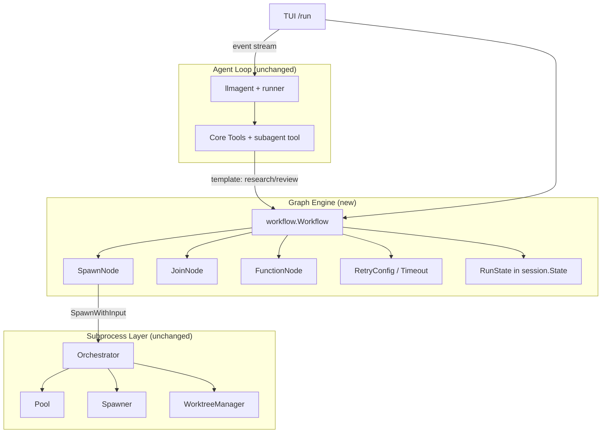

# Design: Graph-Based Agents for pi-go

## Overview

pi-go already runs on Google ADK Go (`google.golang.org/adk/v2 v2.1.0`) but uses only the
**agent loop** (`llmagent` + `runner.Runner` in `internal/agent/agent.go:368-385`). The
ADK **workflow graph engine** (`adk/v2/workflow`) ships in the same module and is never
imported. Meanwhile pi-go hand-rolls all orchestration as process spawning and
prompt-driven JSON pipelines.

This design adopts ADK's graph engine as the orchestration layer — **on top of** the
existing subprocess spawner, not replacing it. Deterministic pipelines (the `/run` spec
workflow, parallel research fan-out, review loops) become declared graphs with retries,
joins, routing, and cross-turn persistence. LLM-initiated single spawns stay as-is.

The reference checkout is `tmp/adk/adk-go` at v2.2.0-4-g817fdc0 — the same module pi-go
pins, four commits past v2.2.0.

## Current State (pi-go)

### What pi-go uses from ADK today

- `llmagent.New` — single agent loop (`internal/agent/agent.go:369`)
- `runner.Runner` — drives the run loop (`internal/agent/agent.go:385`)
- `session` — conversation state + events (`internal/session/store.go`)
- `tool` / `functiontool` / `mcptoolset` — tool surface
- `model` — provider abstraction

### What pi-go hand-rolls instead of using the graph engine

| ADK workflow primitive | pi-go's current equivalent | Where pi-go hand-rolls it |
|---|---|---|
| `RetryConfig` (backoff, jitter, `ShouldRetry`) | `maxRetries: 10` retry loop | `internal/tui/run.go:880-920` (`retryRun`) |
| `NodeConfig.Timeout` | per-agent timeout plumbing | `internal/subagent/orchestrator.go:438-441` |
| `JoinNode` fan-in barrier | manual parallel split + fan-in | `internal/tui/run.go:462-520` (`handleRunParallel`) |
| `Route`/`StringRoute` LLM-as-router | LLM manually picks subagent mode via JSON | `internal/tools/subagent.go:164-200` |
| `RequestInput`/`Resume` (HITL) | no orchestration-level pause | — |
| `ParallelWorker` + per-item sub-branches | `sync.WaitGroup` + pool semaphore | `internal/tools/subagent.go:317-456` |
| `WithMaxConcurrency` | `Pool` semaphore | `internal/subagent/pool.go` |
| `RunState` persisted in `session.State` | no cross-turn orchestration resume | — |
| `AgentNode` wrapping any `agent.Agent` | spawn `pi --mode json` subprocess | `internal/subagent/spawner.go:102-130` |

The engine also has validation pi-go lacks: cycle detection, unreachable nodes, duplicate
names, chat-mode wiring rules (`workflow/validation.go:197-240`).

### The architectural insight

pi-go's orchestration is **process-based and prompt-driven**: the LLM decides pipeline
shape at runtime by calling the `subagent` tool with `{tasks:[...]}` or `{chain:[...]}`
JSON, and each subagent is a fresh `pi` subprocess. ADK's workflow engine is
**graph-based and code-driven**: the pipeline is declared as nodes+edges, and the engine
executes it deterministically with retries, routing, joins, branch isolation, and
persistence.

They are complementary, not competing:

- **Keep** the `subagent` tool for LLM-initiated *single* spawns — that is the right
  primitive for "spawn an explore agent".
- **Move the deterministic pipelines into graphs**: parallel research (fan-out explore →
  JoinNode → synthesize), the `/run` spec workflow (task → gate → retry/merge), and
  plan→run→review.

## Detailed Requirements

### R1: Upgrade ADK to v2.2.0+

Bump `google.golang.org/adk/v2` from v2.1.0 to v2.2.0+ in `go.mod`. The tmp checkout is
v2.2.0-4-g817fdc0 and includes workflow fixes pi-go wants for graph adoption:

- `8bfc9ca` fix(workflow): propagate external context cancellation (#1258)
- `79b22d9` fix(runner): preserve nested workflow HITL resume responses (#1129)

The `workflow` package exists in v2.1.0, so this is a hardening step, not a prerequisite
for the API surface.

### R2: `SpawnNode` — wrap the subprocess spawner as a workflow node

New package `internal/graph/` (or `internal/workflow/`) with a custom `workflow.Node`:

```go
// SpawnNode wraps the subprocess spawner as a workflow node.
// Run calls Orchestrator.SpawnWithInput, forwards events via emit,
// and returns the aggregated result as Event.Output.
type SpawnNode struct {
    workflow.BaseNode
    orch  *subagent.Orchestrator
    agent subagent.AgentConfig   // name, role, worktree, timeout
    opts  SpawnNodeOptions       // worktree name, env, skip cleanup, ...
}

func NewSpawnNode(name string, orch *subagent.Orchestrator,
    agent subagent.AgentConfig, opts SpawnNodeOptions) *SpawnNode
```

Key behaviors:

- `Run(ctx agent.Context, input any)` — input is the task prompt (string) or a
  structured `{prompt, worktree_name, env}` payload.
- Calls `orch.SpawnWithInput(ctx, subagent.AgentInput{...})`, streams events through
  `emit` (so the TUI keeps its live pipeline view), and returns the final result text as
  `Event.Output`.
- **Retries move from `SpawnWithRetry` into the graph**: `NodeConfig.RetryConfig`
  (backoff, jitter, `ShouldRetry`) replaces the orchestrator's `maxRetries` loop.
- **Timeout moves into `NodeConfig.Timeout`** — the engine bounds a single activation;
  the orchestrator's absolute timeout stays as a backstop.
- Branch isolation: the engine's `WithUseSubBranch` / `WithOverrideBranch` give each
  spawned agent its own event-history scope, replacing the manual `branch` plumbing.

### R3: `/run` spec workflow as a graph (first slice)

Rebuild `internal/tui/run.go` orchestration as a declared graph. Today it is ~1100 lines
of bespoke logic: spawn task agent, retry up to 10×, parallel split into 2 agents, gate
checks, merge, backup branches.

**Graph shape (single-agent mode):**

```
START → taskAgent(SpawnNode, worktree) → gateCheck(FunctionNode) → merge(FunctionNode)
              ↑                                    │ fail
              └────────── retry (RetryConfig) ─────┘
```

**Graph shape (parallel mode):**

```
START → split(FunctionNode) ─┬→ taskAgentPart1(SpawnNode) ─┐
                             └→ taskAgentPart2(SpawnNode) ─┴→ JoinNode → gateCheck → merge
```

What the engine provides for free:

- `RetryConfig` — replaces `runState.maxRetries`/`retries` and `retryRun`
  (`internal/tui/run.go:880-920`). `ShouldRetry` predicate decides which failures retry.
- `JoinNode` — replaces `handleRunParallel`'s manual fan-in and `collapseParallel`
  (`internal/tui/run.go:96-99, 462-520`).
- `NodeConfig.Timeout` — replaces the 60-minute hard-coded spawn timeout.
- `RunState` persisted in `session.State` — cross-turn resume for interrupted runs.
  pi-go's `internal/session/store.go:780-830` already implements `session.State`, so the
  workflow's `RunState` persists with no new storage work.

What stays in the TUI:

- Event streaming to the chat view (the `waitForRunAgent` glue).
- Gate parsing from `PROMPT.md` (`## Gates` section) and gate execution — the gate
  commands run in the worktree via `exec.Command` as today.
- Merge/backup-branch bookkeeping (`createRunBackupBranch`, merge).
- The `runState` struct shrinks to: spec name, prompt, gates, agent events, phase.

**Acceptance bar:** behaviorally equivalent to today's `/run` — same gates, same retry
semantics (max 10 cycles), same parallel split (2 agents), same merge behavior — but
implemented as a declared graph, with cross-turn resume working. Existing
`internal/tui/run_*_test.go` tests must pass (adapted to the new structure).

### R4: Graph templates on the `subagent` tool

Expose a small set of named graph templates so the LLM picks a pipeline by name instead
of hand-rolling JSON:

```json
{ "template": "research",
  "topic": "how does auth work?",
  "agents": ["explore", "explore", "explore"] }
```

Templates (v1):

- **`research`** — fan-out N explore agents (one per sub-topic) → `JoinNode` → a
  synthesize agent. Replaces the LLM hand-rolling `{tasks:[...]}` and the
  `maxParallelTasks`/`maxChainSteps` caps (`internal/tools/subagent.go:31-33`).
- **`review`** — task agent → code-reviewer → fix loop (`loopagent` or a graph cycle
  with a route on "needs_fix" / "approved").
- **`sequential`** — the existing chain mode, now backed by `sequentialagent` or a
  `Chain` of `SpawnNode`s.

The engine's `WithMaxConcurrency` becomes the real concurrency limiter (replacing the
per-call `maxParallelTasks` cap); the orchestrator `Pool` stays as the process-level
budget.

### R5: Use `workflowagents` for simple compositions

`agent/workflowagents/` in the checkout has ready-made `sequentialagent`, `parallelagent`,
`loopagent`. The llm-auditor sample (`adk-samples/go/agents/llm-auditor/auditor/auditor.go`)
shows the critic→reviser pattern. Use these where the composition is a plain sequence,
fan-out, or loop; use the `workflow` package directly for routing, joins, and HITL.

### R6: HITL via `RequestInput`/`Resume`

The engine's `RequestInput` + `Resume` gives orchestration-level pause/resume. Today
pi-go has no orchestration-level pause — a subagent either runs to completion or is
killed. A `gateCheck` node that needs human approval (e.g. "merge this worktree?") can
emit a `RequestInput` and park the graph until the user answers. This is a natural fit
for the `/run` merge step and for kagent-style approval flows.

### R7: Borrow kagent patterns (reference only)

kagent (`tmp/adk/kagent`) shows production ADK wiring worth referencing:

- **A2A subagents with HITL propagation and live activity viewing**
  (`docs/architecture/a2a-subagents.md`) — pi-go already has A2A tools
  (`internal/tools/a2a.go`); the doc shows how to expose remote agents as first-class
  graph nodes with session continuity.
- **ACP shim** (`go/core/pkg/acpshim/`) — pi-go already spawns ACP subagents
  (claude/gemini/cursor/copilot); the shim pattern is a reference for wrapping them as
  graph nodes.
- **Memory tools** (`go/adk/pkg/memory/`) — reference for agent-controlled memory
  operations; pi-go already has `internal/memory/` and `internal/palace/`.

## Architecture Overview



### Key Architectural Decisions

1. **Graph on top of subprocesses, not in-process agents.** The `pi --mode json`
   subprocess model gives real isolation (sandbox, worktrees, crash containment) that
   in-process `AgentNode`s don't. `SpawnNode` wraps the existing spawner as a node body.
2. **Deterministic pipelines become graphs; LLM-initiated single spawns stay tools.**
   The `subagent` tool keeps single mode; templates route the deterministic shapes
   through the engine.
3. **Retries, timeouts, and concurrency move into the engine.** `RetryConfig`,
   `NodeConfig.Timeout`, and `WithMaxConcurrency` replace the hand-rolled
   `SpawnWithRetry` loop, per-agent timeout plumbing, and per-call caps.
4. **Cross-turn resume comes from `RunState` persistence.** pi-go's session store
   already implements `session.State`; the workflow's `RunState` persists with no new
   storage work. This subsumes the `/plan resume` mechanism for the run half.
5. **TUI stays thin.** Event streaming, gate parsing/execution, and merge bookkeeping
   remain in the TUI; orchestration state machines move to the graph.

## Components and Interfaces

### 1. `internal/graph/` (new package)

- `spawn_node.go` — `SpawnNode` (see R2).
- `templates.go` — graph template registry: `research`, `review`, `sequential`.
  Each template is a function `func(cfg TemplateConfig) ([]workflow.Edge, []workflow.Node, error)`.
- `run_spec.go` — the `/run` graph builder (see R3): takes spec name, prompt, gates,
  checklist; returns a `workflowagent`-backed agent or a `workflow.Workflow` the TUI
  drives directly.

### 2. `internal/tools/subagent.go` (modified)

- Add `Template string` to `SubagentInput`.
- Add `templateModeHandler` that resolves the template, builds the graph, and runs it
  through the engine, streaming events to the TUI via the existing `SubagentEventCallback`.
- Keep single/parallel/chain modes; parallel/chain may be re-expressed as templates
  later (R4).

### 3. `internal/tui/run.go` (modified)

- Replace the orchestration state machine with a graph run.
- Keep: gate parsing, gate execution, merge, backup branches, event streaming.
- Remove: `retryRun`, `handleRunParallel`'s manual fan-in, `collapseParallel`,
  `maxRetries`/`retries` fields.

### 4. `internal/agent/agent.go` (modified)

- `buildRunner` stays; optionally the root agent can be a `workflowagent` when a graph
  is active, but the default single-LLM-agent path is unchanged.

### 5. `go.mod` (modified)

- `google.golang.org/adk/v2` v2.1.0 → v2.2.0+.

## Acceptance Criteria

### ADK Upgrade
- Given `go.mod` pins v2.2.0+, when `make build` runs, then the binary builds.
- Given the workflow package is imported, when `go vet` runs, then no new findings.

### SpawnNode
- Given a `SpawnNode` wrapping the orchestrator, when the node runs, then it spawns a
  subagent, streams events, and returns the result as `Event.Output`.
- Given a failing subagent, when `RetryConfig` is set, then the node retries per the
  policy (backoff, jitter, `ShouldRetry`).
- Given a timeout in `NodeConfig.Timeout`, when the subagent exceeds it, then the node
  fails with a timeout error.

### /run Graph
- Given a valid spec with PROMPT.md, when `/run spec-name` executes, then the task
  agent spawns in an isolated worktree and events stream to the TUI in real-time.
- Given the agent completes and gates pass, then the worktree branch auto-merges.
- Given a gate fails with retries remaining, then the graph retries per `RetryConfig`
  in the same worktree.
- Given a gate fails past the retry budget, then the worktree is left intact and the
  failure is reported with the path.
- Given an interrupted run, when the user resumes the session, then the graph resumes
  from the paused node (RunState persistence).
- Given no `## Gates` section, then merge proceeds without validation.
- Given `specs/{spec-name}/PROMPT.md` does not exist, then an error shows with the list
  of available specs.
- Existing `internal/tui/run_*_test.go` tests pass (adapted to the new structure).

### Templates
- Given `{template: "research", topic: ..., agents: [...]}`, when the subagent tool
  runs, then N explore agents fan out, a JoinNode gathers results, and a synthesize
  agent merges them.
- Given `{template: "review", ...}`, when the tool runs, then task → code-reviewer →
  fix loop executes until approved or the loop budget is exhausted.
- Given a template with more agents than `WithMaxConcurrency`, when it runs, then
  concurrency is capped by the engine, not by a per-call constant.

### HITL
- Given a `gateCheck` node that emits a `RequestInput`, when the graph reaches it, then
  the graph parks and the TUI renders the prompt.
- Given the user answers, when the turn resumes, then the graph continues from the
  paused node.

## Out of Scope

- Replacing the subprocess spawner with in-process agents.
- Adopting `adk-utils-go` (Redis sessions, Postgres memory) — pi-go has its own
  memory/session layers.
- Adopting kagent's Kubernetes CRD model.
- Migrating pi-go's own agents to ACP servers (kagent's EP-XXXX-acp-integration is a
  reference, not a requirement).
- Graph-based memory (kagent EP-1256 explicitly lists it as a non-goal too).

## Reference

- `tmp/adk/adk-go/workflow/` — graph engine: `workflow.go` (Node/Edge/Route),
  `scheduler.go` (concurrency model), `state.go` (RunState/NodeState),
  `persistence.go` (resume), `retry.go`, `validation.go`, `edgebuilder.go`,
  `dynamic_node.go`, `join_node.go`, `parallel_worker.go`, `run_node.go`
- `tmp/adk/adk-go/agent/workflowagent/` — `workflowagent.New` (agent wrapper)
- `tmp/adk/adk-go/agent/workflowagents/` — `sequentialagent`, `parallelagent`, `loopagent`
- `tmp/adk/adk-go/examples/workflow/` — basic, routing/llm, dynamic/llm, complex
  (fan-out/fan-in research pipeline), hitl_simple, hitl_rerun
- `tmp/adk/adk-samples/go/agents/llm-auditor/` — sequential critic→reviser
- `tmp/adk/kagent/docs/architecture/a2a-subagents.md` — A2A subagent HITL + live activity
- `tmp/adk/kagent/go/core/pkg/acpshim/` — ACP shim pattern
- `internal/tui/run.go` — current hand-rolled /run orchestration
- `internal/tools/subagent.go` — current subagent tool with single/parallel/chain modes
- `internal/subagent/orchestrator.go` — spawner, pool, worktree, retry
- `specs/features/SOP/plan-command-sop/` — existing /plan + /run PDD pipeline
