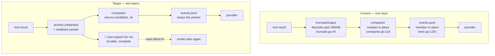

# Design

## The core idea

Separate **what happened** (durable, complete, local) from **what the model sees**
(a projection, bounded, reconstructible). pi-go currently conflates them, then
destroys the record to shrink the view.



Three invariants this buys:

1. **Nothing is lost.** Oversized output is on disk before anything discards it.
2. **Reduction is rejectable.** The compactor *proposes*; the callback applies
   only on success, and the pointer survives regardless.
3. **Recovery is cheap.** The model re-reads a byte range from a file instead of
   re-running a command.

Invariant 3 is the one pi-go currently gets wrong at both ends: the shed stub
says "call again if you need this content"
(`internal/session/compaction_shed.go:300-303`), which means **re-execute a
command** to recover bytes we already had.

---

## Decisions requiring review

These are the choices I could not settle from the code alone. Each has my
recommendation; please confirm or redirect before `PROMPT.md` is written.

### D1 — Where do artifacts live?

| Option | Path | Trade-off |
|---|---|---|
| **A (recommended)** | `<sessionsDir>/<sessionId>/tool-output/<id>.txt` | Session-scoped, dies with the session dir, matches pi-go's existing per-session layout (`internal/cli/cli.go:1027-1042` `sessionsDir()`, `PI_SESSIONS_DIR` override respected). |
| B | `<cwd>/.pi-go/tool-output/` | Survives session deletion, but pollutes the workspace and needs gitignore work. |
| C | `os.TempDir()` | Consistent with SoL-Pi's EPR tmpfile handling, but the OS may reap it mid-session. |

**Recommendation: A.** It is the only option that inherits `PI_SESSIONS_DIR`
handling for free and has no workspace side effects.

### D2 — Archive before or after redaction? **[must be resolved]**

`internal/tools/bash_supervisor.go:440-443` applies `redactSecrets` *after*
`truncateOutput`. Archiving upstream of truncation would therefore persist
**unredacted** bytes — including any secret the eight `secretPatterns`
(`internal/tools/redact.go:8-23`) would have caught.

| Option | Order | Trade-off |
|---|---|---|
| **A (recommended)** | `archive(redact(s))`, then truncate the same redacted string | Archive and prompt agree byte-for-byte; no secret reaches disk that would not have reached the model. |
| B | `archive(s)`, redact only the prompt path | Byte-exact recovery, but writes secrets to disk in cleartext. |

**Recommendation: A.** B is a security regression for a fidelity gain that
`redactSecrets` does not meaningfully cost — the patterns target credential
shapes, not diagnostic content.

### D3 — How does the model read an artifact back?

The sandbox blocks paths outside its root (`internal/tools/sandbox.go:59-72`),
and `read` addresses by **line**, not byte (`internal/tools/read.go:141`).

| Option | Mechanism | Trade-off |
|---|---|---|
| **A (recommended)** | Register the artifact dir via `AddExtraDir` (`sandbox.go:101-119`); pointer says `read(path, offset=N, limit=M)` | Uses the existing `read` tool; no shell round trip; redaction preserved; line-based offsets match `read`. |
| B | Pointer names a `bash` command (`sed -n`) | No sandbox change, but escapes redaction on the recovery path and costs a shell turn. |
| C | New `artifact_read` tool | Cleanest semantics, but adds a tool to every prompt — a cost paid on every request to save tokens. |

**Recommendation: A**, with one caveat to accept: `AddExtraDir` calls
`os.MkdirAll` (`sandbox.go:106`) and opens a second `os.Root`, so the artifact
root must exist before the sandbox is used. Registration site needs choosing —
either at sandbox construction or lazily on first archive (see plan §3).

### D4 — Which tools archive?

`truncateOutput` has eight call sites (`bash_supervisor.go:441-442`,
`read.go:253`, `subagent.go:318,466,591`, `tree.go:87`, `git_diff.go:87`).

| Option | Scope | Trade-off |
|---|---|---|
| A | Only `bash` + `read` | Covers the dominant debt (`token-cost/04-bugs.md`: `read` is 45.7% of resend debt; bash logs are the second). |
| **B (recommended)** | All `truncateOutput` call sites | One code path, no per-tool decisions, uniform behaviour. |
| C | Per-tool opt-in | More control, more surface, and a decision we have no data to make yet. |

**Recommendation: B.** It is *less* code than A, and the archive cost is a
single file write behind an existing size gate.

### D5 — Archive lifecycle

| Option | Behaviour |
|---|---|
| **A (recommended)** | Write once, never delete. Inherit session-dir GC. |
| B | Cap total archive bytes per session, evict oldest |
| C | Delete when the pointer leaves the projection |

**Recommendation: A.** B adds eviction policy with no evidence for a threshold;
C breaks recovery exactly when it is most needed. `token-cost/TOKENS.md` says the
corpus is 1,404 sessions, so a size audit is cheap and should precede any policy.

### D6 — Rejectable reduction API

| Option | Shape |
|---|---|
| **A (recommended)** | `compactToolResult` keeps its signature; `applyCompaction` gains a precondition check and returns `(applied bool)`; the callback records metrics only when applied. |
| B | Refactor to `(candidate *CompactResult, ok bool)` end-to-end |

**Recommendation: A.** It achieves "reduction can be rejected" — the actual
lesson — without churning every compaction pipeline's signature. B is the
cleaner abstraction but touches six files for no behavioural difference.

---

## Ticket designs

### T1 — Artifact archive (items 1 + D1–D5)

New module `internal/tools/artifact.go`:

```go
// ArtifactRoot returns (and creates 0700) the per-session artifact directory.
func ArtifactRoot(sessionDir string) string

// Archive writes redacted bytes to <root>/tool-output/<id>.txt at 0600 and
// returns a readback pointer, or "" when the payload is under the size gate.
func Archive(root, toolName, redacted string) (pointer string, err error)
```

- `id`: `sha256(toolName \0 content)[:16]`, content-addressed so a re-archive of
  identical bytes is idempotent (`O_EXCL`, then byte-compare on `EEXIST` —
  mirroring `src/sol-pi/extensions/observation-pack/observation.ts:123-156`).
- Pointer text (line-based, per D3):

```text
… (output truncated at 262144 bytes; 18422 lines / 913204 bytes total)
full output: read("<abs path>", offset=1, limit=2000) — continue with offset=N
```

- **Fail open:** any error → return the plain truncated output, log via the
  session logger. An archive failure must never cost the model its observation.
- Wired into `truncateOutput`'s callers, not into `truncateOutput` itself —
  `truncateOutput` is a pure string function with 8 call sites and unit tests
  (`tools_test.go:658-665`, `truncate_utf8_test.go`), and giving it filesystem
  side effects would be the wrong seam.

**Sequencing constraint:** D2 must be applied at the *call site*, because
redaction happens in `budgetStreams`, not in `truncateOutput`.

### T2 — Compactor dispatch (item 2, R2)

Three fixes, one test:

1. `compactor.go:108-113` — hyphens: `git-file-diff`, `git-overview`, `git-hunk`.
2. `compactor.go:102` — accept both `grep` and `ripgrep`.
3. `compactor_search.go:10` — read `matches` (a `[]GrepMatch`) with `output` as
   fallback; re-render compacted matches into a string, keeping
   `total_matches`/`truncated` semantics.

Plus the guard test this class of bug needs: **assert the compactor routes on
every name the tool registry actually registers**. A table test importing the
registry's names, so a rename cannot silently orphan a pipeline again.

### T3 — Rejectable reduction (item 3, R3, D6)

`applyCompaction` returns `applied bool`; `BuildCompactorCallback` records
metrics only when applied. This is the small version of SoL-Pi's "the caller
keeps the original if the reduction is not accepted" — the original is now
recoverable via T1's pointer in all cases.

### T4 — Measurement wiring (item 4, R4)

Two surfaces, both already implemented and merely unreachable:

1. Call `CompactMetrics.Save(sessionDir)` at session end. Needs the
   `*CompactMetrics` currently discarded at `internal/cli/cli.go:806` to be
   retained in scope — same shape as the existing `var memSessionID string`
   capture pattern at `cli.go:808-812`.
2. Expose the deduper's `Stats()`/`FormatStats()` in the TUI by adding a field
   to `internal/tui/types.go`.

Explicitly **not** in scope: `pi tokens`, OTEL metrics, cost computation —
owned by `token-cost/07-measurement.md`.

### T5 — Ollama cache reporting (item 5, R5)

- `internal/provider/ollama.go:691-706` — populate `CachedContentTokenCount`
  when the Ollama response reports a cached-prompt count. **Requires checking
  what the Ollama wire response actually carries** — the field name must be
  confirmed against a live or recorded response before implementation, not
  assumed.
- Add a once-per-route log when a provider returns usage with no cache field, so
  the "73% report zero" condition is observable rather than inferred.
- Separate, smaller: surface Anthropic's `cacheCreationTokens` as its own field
  rather than folding it into `PromptTokenCount` (`anthropic.go:552-559`).

Item 5 is listed first in `token-cost/08-sequencing.md` because it unblocks the
shed gating; it is last here because it is the only item with an unresolved
external dependency.

---

## Risks

| Risk | Mitigation |
|---|---|
| Archive leaks secrets to disk | D2 option A: archive redacted bytes only. Test with a seeded `sk-…`/JWT payload. |
| Archive writes on every large result → I/O on the hot path | Write only past the existing 256 KiB gate; content-addressed so repeats are a stat + compare. |
| Recovery path escapes the sandbox | D3 option A keeps `read`'s `os.Root` validation; no new escape hatch. |
| `AddExtraDir` on a sessions path widens what `read` can reach | Scope the extra root to the single `<sessionId>/tool-output/` dir, never `sessionsDir` itself. |
| Compactor now fires on grep → changes existing behaviour | Expected and desired; the guard test pins routing, and savings show up once T4 lands. |
| D2 makes recovery byte-lossy vs the original command output | Accept and document: redaction runs before truncation in the current code, so the model never saw the unredacted bytes either. |

## Success criteria

1. A >256 KiB tool result leaves a complete artifact on disk, and a
   `read(offset=…)` on the pointer's path returns content past the truncation
   point. Verified by an integration test, not by inspection.
2. All nine compaction pipelines compact on a realistically-shaped payload, and
   the test that proves it builds results from the **real output structs** rather
   than synthetic maps — the synthetic maps are why seven of nine shipped dead.
   Plus a routing assertion that fails if any registered tool name has no
   matching pipeline.
3. `compactor-metrics.json` exists in a session dir after a session that
   compacted — the current `Save()` has no caller, so this is a real assertion.
4. No reduction in `token-cost/TOKENS.md`'s 201:1 measurement is *claimed* until
   T4 makes the number observable.
