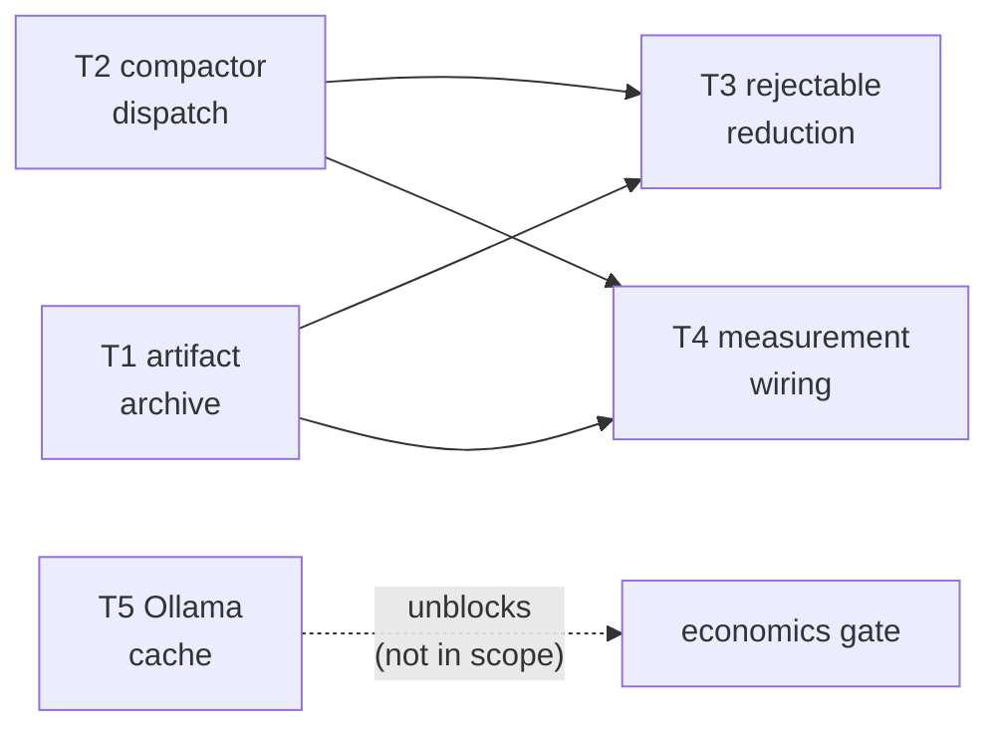

# Plan — Implementation Tickets

**Scope:** tickets for `design.md`. Blocked and rejected items are listed in
`README.md` §"Out of scope" — do not add them here.

## Prerequisites

- `go test ./...` green on the current tree before starting.
- Read `research.md` first. Two entries there (R1.3 redaction ordering, R2.2
  grep field mismatch) **correct** an earlier analysis and change what the fix
  is. Implementing from the summary rather than `research.md` will produce the
  wrong change.
- Working knowledge: `internal/tools/truncate.go`, `internal/tools/compactor.go`,
  `internal/tools/compactor_search.go`, `internal/tools/sandbox.go`,
  `internal/tools/dedup.go`, `internal/session/autocompact.go`.
- D1–D6 in `design.md` must be settled. Tickets assume the recommended option
  for each; if a decision changes, the affected ticket changes with it.

## Dependency order



T1 and T2 are independent and can run in parallel. T3 needs both. T4 needs T1+T2
so it has something real to measure. T5 is independent of all of them.

---

## T1 — Artifact archive + readback pointer

**Decision prerequisites:** D1 (path), D2 (redaction order), D3 (readback
mechanism), D4 (scope), D5 (lifecycle).

**New file:** `internal/tools/artifact.go`

```go
package tools

// ArtifactRoot returns the per-session artifact directory, creating it 0700.
func ArtifactRoot(sessionDir string) string

// Archive writes redacted tool output to disk and returns a readback pointer.
// Returns "" (no error) when content is below the size gate.
func Archive(root, toolName, content string) (string, error)
```

- Path: `<root>/tool-output/<id>.txt`, `id = sha256(toolName \0 content)[:16]`.
- Write with `O_CREATE|O_EXCL|O_WRONLY` at `0600`. On `EEXIST`, read and
  byte-compare; a mismatch is an integrity error, not a cache hit. This mirrors
  `observation.ts:123-156` and is the same discipline `internal/tools/cache.go`
  and `archive.ts` use.
- `MkdirAll(…, 0o700)`; `lstat` the dir and refuse a symlink.

### T1.1 — Call-site wiring

Do **not** add filesystem side effects to `truncateOutput` — it is a pure string
function with 8 call sites, unit tests at `internal/tools/tools_test.go:658-665`
and `internal/tools/truncate_utf8_test.go`. Wire at the callers.

**`internal/tools/bash_supervisor.go:440-443`** (the D2-critical one):

```go
// today — redact applied AFTER truncate, so truncate's input is unredacted
func budgetStreams(stdout, stderr string) (string, string) {
	return redactSecrets(truncateOutput(stdout)),
		redactSecrets(truncateOutput(stripRuntimeNoise(stderr)))
}
```

becomes: redact first, archive the redacted string, then truncate the redacted
string, using the pointer in place of the bare `"… (output truncated)"` marker.

- Note the existing bounded-buffer reality: streams are already capped at one
  `maxOutputBytes` and `droppedNote` (`bash_supervisor.go:445-450`) reports bytes
  that aged out of the ring. So the artifact holds at most one buffer's worth —
  document this in the pointer text rather than implying completeness.

**`internal/tools/read.go:253`** — archive `rendered` before `truncateOutput`,
same ordering.

**Remaining call sites** (`subagent.go:318,466,591`, `tree.go:87`,
`git_diff.go:87`) — per D4-B, wire uniformly. If D4-A is chosen instead, stop
after bash + read.

### T1.2 — Pointer text

Line-based, because `read` addresses by line (`read.go:141`, and the
"Valid offsets are 1-%d" note at `read.go:130-133`):

```text
… (output truncated at 262144 bytes; file is 18422 lines / 913204 bytes)
full output: read("<abs path>", offset=1, limit=2000) — continue with offset=N
```

Must include total lines/bytes so the model can navigate without a probe call.

### T1.3 — Sandbox access (D3)

Register the artifact dir in the sandbox so `read` resolves it. Scope the extra
root to the **single** `<sessionId>/tool-output/` directory — never
`sessionsDir()` itself, which would expose every session's artifacts.

- API: `AddExtraDir` (`internal/tools/sandbox.go:101-119`). Note it calls
  `os.MkdirAll(abs, 0o700)` then `os.OpenRoot`, so the dir must exist first —
  `ArtifactRoot` creates it, so call `ArtifactRoot` before `AddExtraDir`.
- Registration site: needs resolving. `Sandbox` is constructed per session; the
  session id may not exist at construction time. The existing pattern for
  late-bound session identity is the `var memSessionID string` capture at
  `internal/cli/cli.go:808-812` — reuse that shape rather than inventing one.
- Fall back to the plain truncated output (no pointer) if registration fails.
  Fail open, consistent with T1.1.

**Tests:**
- Table test: payload under the 256 KiB gate → no artifact, output unchanged.
- Payload over the gate → artifact exists, mode `0600`, dir `0700`, and the
  pointer's path resolves under the sandbox.
- Round trip: `read(pointerPath, offset=N)` returns content past the truncation
  point. This is success criterion 1 and must be an integration test.
- Idempotency: archiving identical bytes twice yields one file, byte-identical.
- Integrity: pre-create the target with different bytes → `Archive` errors
  rather than overwriting.
- **Security:** seed a payload containing `sk-…`, a JWT and an `AKIA…` key;
  assert the artifact on disk contains `***` and not the secret. This is the D2
  regression guard and the most important test in this ticket.
- Fail open: make the artifact dir unwritable → output is still the plain
  truncated result and no error propagates.

---

## T2 — Compactor dispatch fixes

Independent of T1. **Scope was revised upward after empirical verification: seven
of nine registered pipelines are no-ops in production (R2).** Read R2 in
`research.md` before starting — the first draft of this spec understated this as
"grep reads the wrong field", and a second pass corrected the *evidence* (the
probe listed `grep` and `ripgrep` separately and omitted `ls`; the fraction was
right, the reasoning was not).

**Sequence `git-file-diff` first.** It needs only the name fixed and works end to
end today once routed (R2.4); landing it first proves the test harness on the
cheapest case before the six that need name + field + `applyCompaction`.

### T2.0 — Establish the real result shapes first

Do this before any fix, and keep it as the basis of T2.4.

ADK marshals each tool's typed output struct to JSON and unmarshals into
`map[string]any` (`adk/v2@v2.4.0/tool/functiontool/function.go:231`). So the keys
are the structs' `json` tags. Verified key sets:

```go
bash          → stdout, stderr, exit_code
read          → content, total_lines
grep/ripgrep  → matches, total_matches
find          → files, total_files
tree          → tree, dirs, files
git-file-diff → file, diff, lines_added, lines_removed
git-overview  → branch, recent_commits, staged_files, ...
git-hunk      → file, hunks, total_hunks
```

### T2.1 — Align each pipeline to its real field

- `compactor_search.go:9-13` `compactGrep` — read `matches` (`[]GrepMatch`,
  `grep.go:122-126`), compact, re-render to a string; preserve `total_matches`
  and `truncated`. Today it reads `result["output"]`, which no tool emits.
- `compactor_search.go:43-44` `compactFind` — read `files` (`[]string`,
  `find.go:25-32`) rather than `output`. Note `compactTree`
  (`compactor_search.go:74-76`) delegates to `compactFind`, so `tree` breaks
  with it — `tree` actually carries `tree` (a string), `dirs`, `files`.
- `compactor_git.go:45` `compactGitOverview` — read `branch` / `recent_commits` /
  `staged_files` / `unstaged_files` / `untracked_files`
  (`git_overview.go:32-42`) rather than `output`.
- `compactor_git.go:11,79` `compactGitFileDiff` / `compactGitHunk` — read `diff`,
  which is correct for `git-file-diff`; `git-hunk` has **no `diff` field** at
  all (`git_hunk.go:32-39` has `file`/`hunks`/`total_hunks`), so `compactGitHunk`
  must be rewritten against `hunks`.

### T2.2 — Fix name routing

- `compactor.go:108-113` — hyphens: `git-file-diff`, `git-overview`, `git-hunk`,
  matching `git_diff.go:36`, `git_overview.go:52`, `git_hunk.go:42`.
- `compactor.go:102` — accept both `grep` and `ripgrep`
  (`grep.go:129-132` registers `ripgrep` when `rg` is present).

### T2.3 — Make `applyCompaction` write what was read

`compactor.go:119-156` probes `stdout` → `content` → `output` → `diff` →
`result` → `data` in first-match order. Even a correct pipeline can therefore
write to the wrong key, or none (it logs
`"compactor: no known output field in result for replacement"` and the
compaction is silently discarded).

- Route the write by the same key the pipeline read, rather than re-probing.
  Simplest correct shape: carry the target key on `CompactResult`.

### T2.4 — The guard test (this is the point)

The existing tests are *why this shipped*: `compactor_test.go` feeds pipelines
synthetic maps with an `output` key (`:702,709,784,999,1019,1028,1061,1076`) — a
shape no tool produces.

- New table test builds results by `json.Marshal`/`json.Unmarshal` of the **real
  output structs**, then asserts each pipeline compacts on a payload large enough
  to trigger it.
- Assert routing exists for **every registered tool name**, sourced from the
  registry so a future rename fails the test.
- Assert round trip: after the callback, the field the pipeline read holds the
  compacted value.

**Tests:**
- Per-pipeline: every name **enumerated from the registry** produces a non-nil
  `*CompactResult` on representative input (7 fail today, `bash`/`read` pass,
  `ls` gains a pipeline).
- Routing table test from T2.4.
- `applyCompaction` writes the field the pipeline read.
- Existing behaviour unchanged for `bash` and `read`, which do work today
  (verified: `before=24837 after=128` and `before=24830 after=121` on a
  400-line payload at `MaxChars=64`; the spec's original `11202→92` figures are
  from a smaller payload and are not a contradiction).

---

## T3 — Rejectable reduction

**Decision prerequisite:** D6 (option A assumed).

`internal/tools/compactor.go`:

- `applyCompaction` (line 119) → return `bool`; `false` when no known field
  matched (the `default` fallthrough at line ~150).
- `BuildCompactorCallback` (line 79) → call `metrics.Record` only when applied;
  today metrics are recorded before the mutation is confirmed to have landed.

Rationale: the lesson taken is that a reduction should be *rejectable*, and the
original retained. T1's artifact supplies retention; this ticket supplies the
rejection point for the case where compaction cannot be applied at all.

**Tests:**
- `applyCompaction` returns `false` on a result map with no known field.
- Metrics are not recorded for a non-applied compaction (assert via
  `CompactMetrics`).
- Existing compaction behaviour unchanged for all known fields.

---

## T4 — Wire the dead measurement surfaces

Depends on T1 + T2 so there is something to measure.

### T4.1 — Persist compactor metrics

`internal/tools/compactor_metrics.go:112-150` `Save()` writes
`<sessionDir>/compactor-metrics.json` and **has no caller**.

- `internal/cli/cli.go:806` constructs `tools.NewCompactMetrics()` inline and
  discards it. Retain the reference (same capture shape as `memSessionID` at
  `cli.go:808-812`) and call `Save(sessionDir)` at session end.
- `internal/cli/interactive.go:566-569` has the same shape and needs the same
  treatment.

### T4.2 — Surface deduper stats in the TUI

`internal/tools/dedup.go:71` `Stats()` / `:81-88` `FormatStats()` are wired into
the callback (`cli.go` / `interactive.go`) but `internal/tui/types.go` has no
deduper field, so they are unreachable.

- Add the field and render alongside the existing compactor stats path
  (`internal/tui/commands.go:1101-1125`, the `/rtk` handler).

**Tests:**
- After a session that compacted, `compactor-metrics.json` exists and parses
  (success criterion 3).
- The TUI stats renderer includes dedup counts given a populated deduper.

**Explicitly not here:** `pi tokens`, OTEL metrics, `CostUSD` computation — owned
by `specs/issues/token-cost/07-measurement.md`.

---

## T5 — Ollama cache reporting

**Unresolved external dependency — verify before implementing.**

`internal/provider/ollama.go:691-706` `finalResponse` sets only
`PromptTokenCount` and `CandidatesTokenCount`. `CachedContentTokenCount` is never
populated, which `token-cost/TOKENS.md` measures as 73% of prompt tokens on
routes reporting zero cache.

- **First step is investigation, not code:** determine what the Ollama wire
  response actually carries for cached prompt tokens. Do not assume a field name
  — confirm against a recorded response or live call, and record the evidence in
  `SUMMARY.md`. If Ollama reports nothing, this ticket's outcome is the log line
  below plus a documented negative result, which is a legitimate and useful
  outcome.
- Populate `CachedContentTokenCount` accordingly.
- Add a once-per-provider-route log when usage arrives with no cache field, so
  "reporting zero" becomes observable rather than inferred. Rate-limit it — this
  is one line per route per session, not per request.
- Separate and smaller: `internal/provider/anthropic.go:552-559` folds
  `cacheCreationTokens` into `PromptTokenCount`; surface it as its own field.
  This is a prerequisite for any future cache-write cost model.

**Note:** the compaction *threshold* does not depend on this —
`cachePrefixTokens` is set from the first request's `inputTokens`
(`guardrail.go:140-144`), independent of `cachedTokens`. Only a future
profitability gate does.

**Tests:**
- Ollama usage fixture with a cached count → `CachedContentTokenCount` populated.
- Anthropic fixture → cache-creation tokens surfaced separately, and
  `PromptTokenCount` unchanged in total.
- `TestTrackerAndMeterAgreeOnBodyTokens` (`internal/guardrail/contextmeter_test.go:17`)
  still passes — the two meters must not diverge.

---

## Verification per ticket

Each ticket's PR must state, with pasted output:

1. `go build ./...`
2. `go test ./internal/tools/... ./internal/session/...` (plus
   `./internal/provider/... ./internal/cli/...` for T5)
3. `make lint` and `make vet`
4. For T1 only: the round-trip test proving content past the truncation point is
   recoverable, and the secret-redaction test output.

Per `AGENTS.md`: commits signed (`git commit -s -S`), work in a worktree, and no
claim of token savings until T4 makes the number observable.
